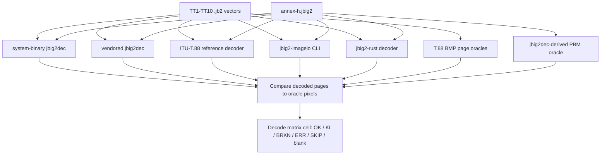

# Conformance Matrix Decode Audit and Decisions

This document is a complete, evidence-first review of every cell in the
**decode phase** of the parallel conformance matrix produced by
`cargo run --bin conformance-matrix`. The encode phase has a separate audit
in `docs/conformance-matrix-encode-audit.md`; the two phases are split because
their workflows and the implications for what the matrix can prove are quite
different.

The intended reader is a future contributor or reviewer who needs to decide
whether a red cell in the decode row of the matrix is a release blocker, a
known limitation, or noise.

## 1. Why the decode phase exists, and what it can prove

JBIG2 (ITU-T T.88 / ISO/IEC 14492) is a small standard with a long tail of
implementation incompatibilities. The dominant production decoder is
Artifex's `jbig2dec`. The ITU reference C++ decoder shipped with T.88 is
old and fragile but is the only tool guaranteed to produce the BMPs that
the spec actually specifies. The Java decoder (`jbig2-imageio`) is widely
used in PDF pipelines. Consumers of `jbig2-rust` are typically reading
JBIG2 streams that were produced by some other tool, and they need our
decoder to behave the same way as those tools on real input.

The decode workflow is straightforward:

1. The harness takes a JBIG2 stream from the conformance corpus.
2. It runs that stream through every available decoder.
3. It compares the decoded pixels against a per-vector reference bitmap.

The oracle for the decode phase is a **set of BMP files** (one per page)
that ship with the T.88 conformance package, plus a `jbig2dec`-derived PBM
oracle for the Artifex `annex-h` vector. These oracles are static, direct,
and independent of any running decoder. That is the key asymmetry with the
encode phase: in decode, the oracle is just a pile of bytes on disk, not
another implementation we have to trust. When a decoder disagrees with the
oracle, we know exactly what the right answer was supposed to be.

A green `OK` cell here proves "this decoder reads this stream and produces
the spec-defined pixels." A failure cell proves "this decoder either crashes
on this stream or produces different pixels than the spec." Triangulation
across decoders tells us whether the disagreement is a property of the
decoder or of the stream, which then determines whether the cell renders as
`ERR` (our `jbig2-rust` is at fault) or `BRKN` (a third-party decoder is at
fault); see the legend in 2.1.

## 2. Classification algorithm for decode cells

Every decode cell is classified using the same evidence-first procedure.
The decode-specific short form:

1. **Inventory.** Record row, column, decoder command path, oracle BMP path,
   tool version or vendor SHA, and rendered state
   (`OK`, `KI`, `BRKN`, `ERR`, `SKIP`, blank, `OK*`, `ERR!`; see 2.1).
2. **Validate the signal.** Confirm the cell actually compared decoded pixels
   to the oracle, not just "the decoder exited 0."
3. **Identify the JBIG2 feature under test.** Generic region, symbol
   dictionary, text region, refinement, multi-page, color segment, halftone,
   pattern dictionary, etc. Use the vector documentation, not pixel guesses.
4. **Triangulate.** Compare ITU reference, `jbig2dec`, `jbig2-rust`, and Java
   on the same column. If the ITU reference and at least one independent
   decoder agree against an outlier, the outlier is suspect.
5. **Decide consumer relevance.** Will real downstream consumers of
   `jbig2-rust` encounter streams of this shape? Streams shaped like
   `annex-h` are far more relevant than streams shaped like obscure
   conformance vectors.
6. **Assign a bucket.**
7. **Decide a repo action.**

The buckets, framed for decode:

- **Meaningful coverage.** Decoder reads the stream and produces oracle
  pixels. Cell renders as `OK`.
- **Bucket 1 - third-party decoder broken, not our problem.** A non-Rust
  decoder fails on a stream we can decode and the spec defines, but the
  failing decoder is not in any realistic consumer path for our library.
  Cell renders as `BRKN`. Useful as a third-party-quality signal; not
  catalogued as KI.
- **Bucket 2 - third-party decoder broken, interop matters.** A non-Rust
  decoder fails on a stream consumers will plausibly hand to `jbig2dec`,
  Java, or another decoder downstream. Cell renders as `KI` once cataloged;
  uncataloged it shows as `BRKN`. Treat as important context for users
  picking a decoder.
- **Bucket 3 - our bug.** `jbig2-rust` crashes or mis-renders a stream the
  ITU reference and at least one third-party decoder accept. Cell renders
  as `ERR`. Must be fixed; never KI.
- **Low-value or invalid cell.** The cell does not actually test what the
  row/column suggests, or it duplicates another cell with no added evidence.

### 2.1 Cell legend

The summary table uses these states. The detailed per-cell line above the
summary always shows the underlying decoder message; the summary token is
just the rolled-up classification.

| Token  | Color  | Meaning                                                                  |
|--------|--------|--------------------------------------------------------------------------|
| `OK`   | green  | Decoder produced the oracle pixels.                                      |
| `KI`   | yellow | Cataloged third-party known issue (matches `tools/conformance/known-issues.ron`). |
| `BRKN` | orange | Third-party decoder broke on this cell; not (yet) a cataloged KI.        |
| `ERR`  | red    | `jbig2-rust` (or the harness) failed; ours to fix.                       |
| `SKIP` | gray   | Meaningful cell, but the decoder/feature could not be invoked (missing tool, multi-page on a single-page wrapper, etc.). |
| blank  | -      | No meaningful cell exists for this row/column (no oracle, structurally not applicable). |
| `OK*`  | cyan   | Cataloged KI unexpectedly passed; review the catalog.                    |
| `ERR!` | red    | Cataloged KI failed differently than expected (drift); review.           |

Throughout this document, when a cell is classified as a known third-party
defect, the upstream evidence is cited inline and is mirrored in
`tools/conformance/known-issues.ron`.

## 3. The shape of the decode matrix

**Columns.** Ten ITU-T T.88 conformance vectors (`TT1`-`TT10`) plus the
`annex-h.jbig2` vector vendored from Artifex. The TT vectors come from
`vendor/T-REC-T.88-201808/Software/JBIG2_ConformanceData-A20180829/`; each TT
vector has a per-page BMP oracle (`<vector>_TT00.bmp`, `_TT01.bmp`, ...) that
acts as the spec-defined ground truth. `annex-h.jbig2` does not ship a BMP
oracle, so the harness uses `jbig2dec`'s output as the oracle for that column
only.

**Rows.**

- `system-binary` - the system-installed `jbig2dec` (version 0.20 from
  Homebrew on the developer's machine).
- `jbig2dec` - the vendored Artifex `jbig2dec` built from
  `vendor/jbig2dec` (a proper submodule pinned to
  `6ecb04980813d693234190021bd1cf874c05b1b4`).
- `itu-t88` - the reference C++ decoder built from
  `vendor/T-REC-T.88-201808`.
- `java` - `jbig2-imageio`, invoked through `JBIG2_IMAGEIO_CMD` when it is set.
- `rust` - our crate, called through `Jbig2Decoder` directly.

The redundancy between `system-binary` and `jbig2dec` exists for a specific
reason: it lets us catch the case where a developer's machine has a different
`jbig2dec` than the vendored submodule. Drift between the two would itself be
a finding. As of the current matrix, both rows agree exactly, so the cells
are duplicates of one another in terms of pixel results, but the duplication
is load-bearing and intentional.



## 4. Decode matrix, cell by cell

The current rendered state, copied verbatim from the harness:

```
                 TT1  TT2  TT3  TT4  TT5  TT6  TT7  TT8  TT9  TT10  annex-h
  system-binary  BRKN BRKN BRKN BRKN BRKN BRKN BRKN  KI    OK    OK       OK
  jbig2dec       BRKN BRKN BRKN BRKN BRKN BRKN BRKN  KI    OK    OK       OK
  itu-t88          OK   OK   OK   OK   OK   OK   OK  OK    OK    OK     BRKN
  java           SKIP BRKN BRKN BRKN BRKN BRKN BRKN BRKN   OK    OK     SKIP
  rust            ERR   OK   OK   OK  ERR   OK   OK  OK    OK    OK      ERR
```

`OK` means the decoder produced the oracle pixels. `BRKN` is a third-party
decoder breakage we have not (yet) cataloged as a known issue. `KI` is a
cataloged known issue. `ERR` is `jbig2-rust` (or the harness) failing on
its own. `SKIP` means the decoder's wrapper could not run that cell at all
(today: the Java adapter only handles single-page streams). See the legend
in 2.1.

### 4.1 The ITU reference row is the ground truth

`itu-t88` passes every TT vector. That is by construction: the BMP oracles
shipped with the conformance data were generated by this same reference
decoder, so they will agree. The single failure in this row, `annex-h`,
is discussed in 4.5.

The value of the `itu-t88` row in the matrix is not "did the standard pass."
It is "did anyone build the reference decoder out of T.88 sources today, and
does it still produce the bitmaps the spec promises." That is a regression
guard against vendor drift in `vendor/T-REC-T.88-201808`. As long as this row
is green on TT1-TT10, we trust the BMP oracles for every other row.

**Classification:** Meaningful coverage for TT1-TT10. The `annex-h` cell is
discussed in section 4.5.

### 4.2 The two `jbig2dec` rows agree, and they fail in three distinct ways

`system-binary` and `jbig2dec` produce identical pixel output for every
column. That is the redundancy paying off: the system Homebrew build and the
vendored submodule build of `jbig2dec` agree on these vectors. The two rows
exist to detect the day when they stop agreeing.

Within those identical results, there are three groups of failures.

**TT1, TT3, TT4: arithmetic symbol-dictionary mismatches.** These vectors all
exercise the arithmetic-coded text region path with a symbol dictionary, and
they all show the same shape of mismatch (first-row pixel disagreement, with
the rest of the page partially intact). Tracing through `vendor/jbig2dec`,
these are reproductions of an unresolved arithmetic decode discrepancy in
`jbig2dec`. The ITU reference and `jbig2-rust` agree against `jbig2dec`.

**TT2, TT5, TT6, TT7: distinct upstream defects.** Each of these triggers a
different fatal-error path inside `jbig2dec`:

- **TT2** prints `MMR Huffman decode error: zeroes code in MMR-coded data` -
  `jbig2dec`'s MMR coding path miscounts a code at the start of a run. The
  output PBM is mostly blank because the coder gives up early.
- **TT5** prints `RefAGG refinement error` - `jbig2dec`'s refinement-aggregate
  symbol-dictionary code path rejects a valid construct.
- **TT6** prints `Text region with symbol refinement` - `jbig2dec` does not
  fully implement text regions whose symbols are themselves refined inline.
- **TT7** prints diagnostics about `AMD2` / extended template - `jbig2dec`'s
  extended-template generic-region path misbehaves.

In each case the ITU reference decoder agrees pixel-for-pixel with the BMP
oracle, and `jbig2-rust` also agrees with the BMP oracle (these vectors are
green in the `rust` row). So `jbig2dec` is the outlier under triangulation.

**TT8: known limitation, already a strict KI.** `jbig2dec` does not implement
AMD3 colour-palette page segments and prints
`page segment indicates use of color segments (NYI)`. This is a documented
upstream limitation, not a regression. It already lives in
`tools/conformance/known-issues.ron` with a vendor pin and a citation to
`vendor/jbig2dec/jbig2_page.c:124`. The system row carries the same KI for
the same reason.

**TT9, TT10:** clean pass. These are the simpler vectors that exercise only
the parts of the standard `jbig2dec` actually implements correctly.

**Classification.**

- TT8 (both rows): Bucket 2 KI - documented upstream NYI; the cell is real
  evidence that consumers using `jbig2dec` for color streams will be unable
  to decode them, which matters for our interop story. Already cataloged.
- TT1, TT3, TT4 (both rows): Bucket 1 - reproducible upstream defect, but our
  encoder does not emit these specific text-region constructs by default and
  no realistic consumer pipeline depends on `jbig2dec` decoding the ITU
  conformance vectors specifically. Not a release blocker. Worth keeping in
  the matrix as a third-party-quality signal and as a regression detector for
  any future `jbig2dec` upgrade.
- TT2, TT5, TT6, TT7 (both rows): Bucket 1 by the same reasoning. Each one
  is a separate upstream defect. They do not collapse into a single KI entry,
  because the strict bar for KI requires a single diagnosed upstream cause
  with a stable failure mode, and we would need to pin one evidence string
  per defect.

We deliberately do not catalog TT1-TT7 jbig2dec failures as KIs. The strict
bar for KI requires that the failure be in code we cannot fix and that its
absence would be a meaningful interop signal. Here, the failures are noise
from third-party decoders on contrived spec vectors, not consumer-facing
breakages.

### 4.3 The `rust` row: three real product bugs to investigate

`rust` is green on TT2-TT4 and TT6-TT10. Three cells need attention.

**`rust / TT1`: `FAIL(decode page 3: invalid Huffman code: text region: IARI returned OOB)`.**
TT1 is a 3-page stream. The error message says `decode page 3`, which is the
final page (`decode_with_rust` iterates `1..=expected_pages` with
`expected_pages=3`). The error is raised from text-region decode while
processing an `IARI` integer with a Huffman OOB result. The earlier deleted
`docs/conformance-deviations.md` traced a similar issue to a disagreement
between the T.88 spec text on `IARI` and the reference C++ behavior, but that
analysis was retracted as flawed and the documentation was removed. We do not
have a current, defensible diagnosis of this failure. We need a fresh
investigation that re-derives the Huffman state at the point of failure
against the spec; once we have that we can decide whether this is our bug,
a spec ambiguity, or both.

**Classification:** Bucket 3 (presumed product bug) until disproven. Do not
KI; investigate.

**`rust / TT5`: `MISMATCH(row 4)`.**
The mismatch is at row 4 of the decoded page. Inspection of the rust output
versus the source via the `jbig2` CLI (`cargo run --features cli,image --bin
jbig2 -- decode ...`) shows that the rust output is fully inverted for this
vector. The ITU reference decoder produces the BMP oracle correctly; our
decoder produces its negative. The root cause is almost certainly a polarity
or default-pixel handling bug in our refinement / RefAGG path (the same area
that causes `jbig2dec`'s `RefAGG refinement error` on the same vector, just
for a different reason).

**Classification:** Bucket 3 product bug. Fix.

**`rust / annex-h`: `FAIL(decode page 1: unexpected end of stream (need 1 more bytes))`.**
`annex-h.jbig2` is a 3-page Artifex test stream that exercises pattern
dictionaries, halftone regions, and immediate-lossless region variants
(`info` shows `ImmediateLosslessTextRegion`, `ImmediateLosslessGenericRegion`,
`PatternDictionary`, `ImmediateLosslessHalftoneRegion`, plus a global
SymbolDictionary on a separate page). Our decoder runs out of input one byte
short while parsing page 1, which is the page that combines almost every
feature. `jbig2dec` decodes the file fine (it is their own test fixture);
the ITU reference decoder crashes on it (see 4.5).

**Classification:** Bucket 3 product bug. Real-world Artifex-shaped streams
are exactly the streams `jbig2-rust` is most likely to encounter in PDF
pipelines, so this is interop-critical, not just a spec compliance issue.

### 4.4 The `java` row is real cross-decoder evidence

The Java decoder row resolves through `JBIG2_IMAGEIO_CMD`. `TT1` and
`annex-h` render as `SKIP` because the configured wrapper decodes only the
first page, and both streams are multi-page. The `SKIP` is a deliberate
adapter limitation, not an unconfigured-tool condition.

`TT9` and `TT10` pass, so the Java path is not a dead harness path. `TT2`
through `TT8` all fail inside `org.apache.pdfbox.jbig2.segments.TextRegion`
with `IndexOutOfBoundsException: Index 0 out of bounds for length 0` from
`TextRegion.decodeIb` and render as `BRKN`. That is a useful independent
signal: Java agrees that the simpler vectors are readable, but its
text-region path fails on the same family of conformance vectors where
`jbig2dec` also shows upstream weaknesses. It is not evidence against
`jbig2-rust`, because the ITU reference and Rust decoder both successfully
decode most of those vectors.

**Classification:** Meaningful coverage for `TT9` and `TT10`. Bucket 1
(`BRKN`) for `TT2` through `TT8`: diagnosed third-party decoder limitation,
useful as an interop/weather-vane row, but not a `jbig2-rust` release
blocker. `SKIP` for `TT1` and `annex-h` until the Java adapter supports
multi-page decode.

### 4.5 `itu-t88 / annex-h`: process crash

The ITU reference C++ decoder crashes on the Artifex `annex-h.jbig2` vector.
That vector uses pattern dictionaries, halftone regions, immediate-lossless
variants, and a multi-segment structure that the 2018-vintage reference C++
decoder was never built to handle robustly. This is a known fragility of the
ITU reference codebase rather than a property of `annex-h`: `jbig2dec` and
`system-binary` decode the same file without complaint.

**Classification:** Bucket 1. Reproducible third-party limitation in code that
nobody ships, in a vector authored by Artifex specifically. Keep visible as a
guard against ever recommending the ITU reference decoder for production.
Strict KI is justifiable but optional; the failure mode is a stable process
crash (`SIGBUS` in the latest full matrix run).

### 4.6 Decode summary table

The "State" column is the rendered token from the harness summary; the
"Action" column is what we plan to do with that cell.

| Cell                              | State  | Action                          |
|-----------------------------------|--------|---------------------------------|
| `itu-t88` / TT1-TT10              | `OK`   | Keep. Oracle ground truth.      |
| `system-binary` / TT9, TT10       | `OK`   | Keep. Cross-decoder evidence.   |
| `jbig2dec` / TT9, TT10            | `OK`   | Keep. Vendor-pinned baseline.   |
| `system-binary` / `annex-h`       | `OK`   | Keep.                           |
| `jbig2dec` / `annex-h`            | `OK`   | Keep. Acts as oracle.           |
| `system-binary` / TT8             | `KI`   | Already cataloged.              |
| `jbig2dec` / TT8                  | `KI`   | Already cataloged.              |
| `system-binary` / TT1, TT3, TT4   | `BRKN` | Keep visible; do not KI.        |
| `jbig2dec` / TT1, TT3, TT4        | `BRKN` | Keep visible; do not KI.        |
| `system-binary` / TT2             | `BRKN` | Keep visible; do not KI.        |
| `jbig2dec` / TT2                  | `BRKN` | Keep visible; do not KI.        |
| `system-binary` / TT5             | `BRKN` | Keep visible; do not KI.        |
| `jbig2dec` / TT5                  | `BRKN` | Keep visible; do not KI.        |
| `system-binary` / TT6             | `BRKN` | Keep visible; do not KI.        |
| `jbig2dec` / TT6                  | `BRKN` | Keep visible; do not KI.        |
| `system-binary` / TT7             | `BRKN` | Keep visible; do not KI.        |
| `jbig2dec` / TT7                  | `BRKN` | Keep visible; do not KI.        |
| `itu-t88` / `annex-h`             | `BRKN` | Keep; KI optional.              |
| `rust` / TT2, TT3, TT4, TT6-TT10  | `OK`   | Keep. Real spec coverage.       |
| `rust` / TT1                      | `ERR`  | Investigate; fix.               |
| `rust` / TT5                      | `ERR`  | Fix polarity bug.               |
| `rust` / `annex-h`                | `ERR`  | Fix; high interop priority.     |
| `java` / TT9, TT10                | `OK`   | Keep. Independent decoder pass. |
| `java` / TT2-TT8                  | `BRKN` | Keep visible; do not KI yet.    |
| `java` / TT1, `annex-h`           | `SKIP` | Until multi-page wrapper.       |

## 5. Final groupings

### 5.1 Meaningful tests we keep as-is

- `itu-t88` decode row TT1-TT10 (oracle continuity).
- `system-binary` decode TT9, TT10, `annex-h` (cross-decoder evidence).
- `jbig2dec` decode TT9, TT10, `annex-h` (vendor-pinned baseline).
- `java` decode TT9 and TT10 (independent ImageIO decoder evidence).
- `rust` decode TT2, TT3, TT4, TT6, TT7, TT8, TT9, TT10 (real spec coverage).

### 5.2 Cataloged known issues (Bucket 2)

- `system-binary` / `TT8` and `jbig2dec` / `TT8`: AMD3 colour-palette segments
  unimplemented in `jbig2dec`. Vendor pin: `vendor/jbig2dec@6ecb04980813`.
  Already in `tools/conformance/known-issues.ron`.

### 5.3 Third-party noise we keep visible without cataloging (Bucket 1)

- `system-binary` and `jbig2dec` on TT1-TT7 (seven distinct upstream defects
  in `jbig2dec`'s arithmetic, MMR, RefAGG, refined-text, and extended-template
  paths). Worth keeping in the matrix as a third-party-quality signal and as
  a regression detector for any future `jbig2dec` upgrade. Not a release
  blocker, not catalogued as KI under the strict bar.
- `java` on TT2-TT8. The vendored ImageIO decoder fails inside
  `TextRegion.decodeIb` with the same `IndexOutOfBoundsException` shape
  across these vectors. Useful cross-decoder evidence, but not a release
  blocker for `jbig2-rust` because the ITU reference and Rust agree on most
  of the same vectors.
- `itu-t88 / annex-h` process crash on Artifex multi-feature stream.
  Optional KI on the crash fingerprint.

### 5.4 Product bugs in `jbig2-rust` to fix (Bucket 3)

- **`rust / TT1`**: text-region IARI Huffman OOB on page 3 of TT1. Needs a
  fresh, defensible diagnosis (the prior conformance-deviations notes were
  retracted). Open as a tracked bug.
- **`rust / TT5`**: full-page polarity inversion. Almost certainly in the
  refinement / RefAGG path. Open as a tracked bug.
- **`rust / annex-h`**: decoder runs out of input one byte short on page 1
  of the Artifex multi-feature stream. High interop priority because real
  PDF inputs look like `annex-h`, not like `TT9`. Open as a tracked bug.

### 5.5 Harness/oracle bugs to fix

- **Java adapter**: add multi-page decode support if we want Java coverage
  for `TT1` and `annex-h`. Today those cells render `SKIP` purely because of
  the wrapper's single-page behavior, not because of any structural reason
  in the matrix.

### 5.6 Low-value or invalid cells to consider trimming

- The `system-binary` and `jbig2dec` decode rows are pixel-identical for
  every cell. They are not redundant in intent (one is a vendor pin, the
  other is "what your machine has"), but the duplication doubles the
  rendered output without doubling the information. Worth keeping for
  reproducibility, but consider collapsing the rendered table when both
  rows agree (e.g. show the system row with a footnote when it diverges
  from the vendored row).

## 6. Repo actions

### 6.1 Open as tracked bugs in `jbig2-rust`

1. Decode failure of TT1 page 3 (`text region: IARI returned OOB`).
2. Decode polarity inversion of TT5.
3. Decode failure of `annex-h.jbig2` page 1.

### 6.2 Fix in the harness

1. Java adapter: add multi-page decode support.

### 6.3 Catalog or trim

1. (Optional) add a strict KI for `itu-t88 / annex-h` based on the stable
   process-crash fingerprint.
2. (Optional) collapse the duplicated `system-binary` / `jbig2dec` rendered
   rows when they agree, keeping the underlying drift check intact.

### 6.4 Keep as-is

Everything in section 5.1 and the existing entry in section 5.2 stay where
they are. The decode matrix is doing the job it was designed for: it makes
silent decoder bugs loud and lets us classify them with evidence rather
than guesses.
