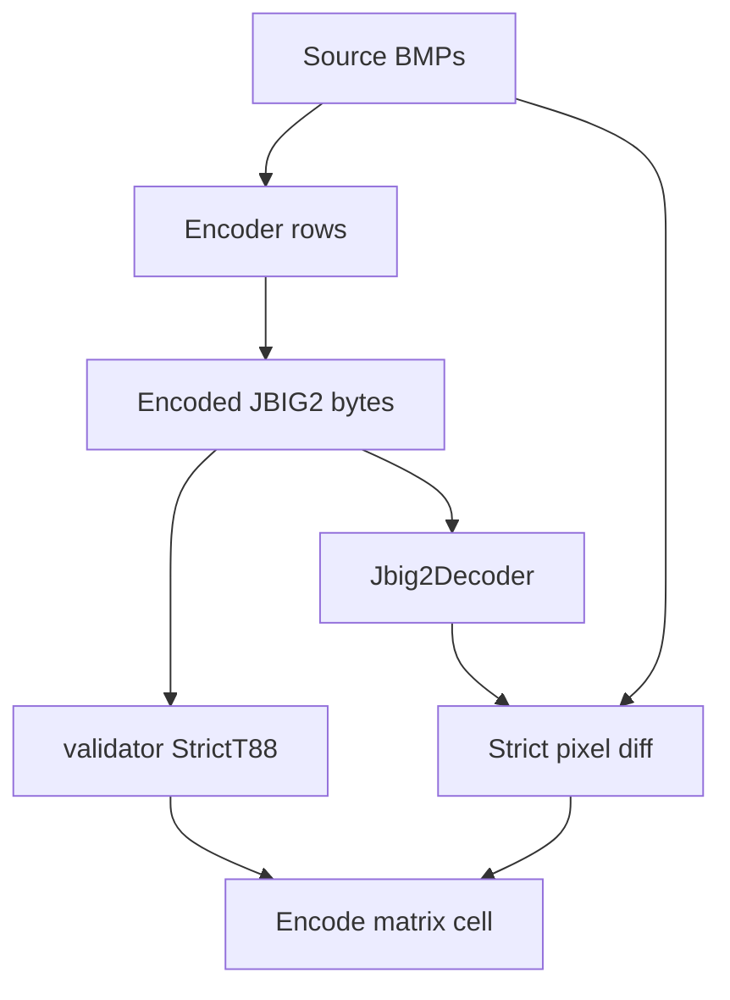

# Conformance Matrix Encode Audit and Decisions

This document is an evidence-first review of the **encode phase** of the
parallel conformance matrix produced by `cargo run --bin conformance-matrix`.
The decode phase has a separate audit in
`docs/conformance-matrix-decode-audit.md`; the two phases are split because
their oracles answer different questions.

The intended reader is a future contributor or reviewer who needs to decide
whether a red or orange encode cell is a release blocker, a known limitation,
or useful third-party signal.

> **Status: point-in-time evidence.** The matrix snapshot, summary count,
> and per-cell narrative below describe the conformance matrix output at
> the time the encode-oracle remediation landed. Nothing in CI re-checks
> that this prose still matches runtime output, so when validator
> behavior, known issues, or matrix rows change, regenerate it with:
>
> ```sh
> CARGO_HOME=./.cargo cargo run --release --bin conformance-matrix \
>     --features "image conformance-tools" -- --target all
> ```
>
> Treat any drift between this document and that command's output as a
> request to refresh the audit, not as a regression in the matrix
> itself. A cheap automated drift guard was considered (a snapshot test
> that compares the encode summary line) and explicitly deferred under
> Decision 7 of `conformance-arch-remediation` to keep this remediation
> scoped; future work can add one without rewriting the audit.

## 1. Why the encode phase exists, and what it can prove

JBIG2 encoding is many-to-one: several different byte streams can represent
the same bitmap. That means the encode matrix cannot use a static "golden
stream" as its oracle. Instead, each cell asks two questions about the stream
an encoder just produced:

1. **`v88` structural validity.** Run `jbig2::validator::validate(bytes,
   Lens::StrictT88)`. The token is `v88=OK`, `v88=WARN(N)`, or
   `v88=BAD(N):CHECK-ID`.
2. **`rt` bitmap roundtrip.** Decode the bytes with `jbig2::Jbig2Decoder` and
   compare the reconstructed page to the source BMP. Lossless rows expect
   `rt=0/N`; lossy rows report `rt=diff/N(pct)` and currently fail only above
   a broad sanity ceiling.

Together, those checks prove "this encoder produced a structurally valid T.88
stream that our decoder can reconstruct back to the source image." They do
**not** prove every downstream decoder can consume the stream. Cross-decoder
compatibility is a separate quality property; see
`docs/encoder-decoder-interop.md` for the future interop matrix design.

Color is intentionally narrow today. `codeStreamTest3` is the official color
source, but our encoder and `jbig2enc` rows are mono-only, so their color cells
are blank. `itu-t88:default / codeStreamTest3` is also blank because the
default ITU encoder emits mono from a color source. The one meaningful color
encode cell today is `itu-t88:Param8.ini / codeStreamTest3`, which encodes
AMD3 color text-region data and roundtrips RGB-to-RGB through our decoder. The
roadmap for adding color encoding to our own encoder is in
`docs/color-encoder-roadmap.md`.

## 2. Classification algorithm for encode cells

Every encode cell is classified using the same evidence-first procedure:

1. **Inventory.** Record row, column, encoder command/configuration, source
   BMP, and rendered detail (`v88=... rt=...` or `FAIL(enc: ...)`).
2. **Validate the signal.** Confirm that the encoder produced bytes, the
   validator verdict is from those bytes, and the roundtrip verdict is from
   our decoder rather than an external oracle.
3. **Identify the encoder feature exercised.** Generic-only, generic+TPGD,
   symbol mode lossless, symbol mode lossy, refinement, ITU `Param*.ini`,
   color text regions, etc.
4. **Read validator findings first.** `v88=BAD` is structural evidence. It may
   be our encoder bug, a third-party encoder bug, or a validator/catalog issue,
   but it is no longer hidden behind an oracle decoder crash.
5. **Read roundtrip findings second.** For lossless rows, any non-zero diff is
   a failure. For lossy rows, record the pixel count and percentage.
6. **Assign a bucket and repo action.**

### 2.1 Cell legend

- `OK`: Structural validator accepted the stream and the roundtrip met the
  row's contract. Lossy rows below the sanity ceiling also classify as `OK`
  in the summary, with the exact diff in details.
- `KI`: A cataloged known issue from `tools/conformance/known-issues.ron`.
- `BRKN`: A third-party encoder produced an invalid stream or failed in a way
  not cataloged as a known issue.
- `ERR`: `jbig2-rust` or its harness failed.
- `SKIP`: Meaningful cell, but the encoder/feature could not be invoked.
- Blank: No meaningful cell exists (color source vs mono encoder, profile vs
  wrong source, etc.).
- `OK*` / `ERR!`: Known-issue drift markers.

## 3. The shape of the encode matrix

**Columns.** Three monochrome conformance sources (`codeStreamTest1`,
`codeStreamTest2`, `F01_200`) plus the 24-bpp color source `codeStreamTest3`.

**Rows.** Encoder targets, one per encoder configuration:

- `rust:fast`, `rust:balanced`, `rust:max_compression` - the public
  `EncoderConfig` presets.
- `rust:generic_t0_no_tpgd`, `rust:generic_t0_tpgd` - isolated generic-region
  template-0 rows with TPGD off/on.
- `rust:symbol_lossy_t85` - lossy symbol mode at threshold 0.85.
- `system-binary:*` and `jbig2enc:*` - system and vendored `jbig2enc` in
  default, `-d`, `-s -r -d -t 0.85`, and `-s -d -t 0.85` configurations.
- `itu-t88:default`, `itu-t88:Param2.ini` ... `itu-t88:Param9.ini` - the ITU
  reference encoder in default mode and shipped profile files.



## 4. Encode matrix, cell by cell

The current rendered state after replacing the ITU+`imgcomp` oracle with
`v88` + Rust roundtrip:

```
                                  codeStreamTest1  codeStreamTest2  codeStreamTest3  F01_200
  rust:fast                                    OK               OK                        OK
  rust:balanced                                OK               OK                        OK
  rust:max_compression                         OK               OK                        OK
  rust:generic_t0_no_tpgd                      OK               OK                        OK
  rust:generic_t0_tpgd                         OK               OK                        OK
  rust:symbol_lossy_t85                        OK               OK                        OK
  system-binary:default                        OK               OK                        OK
  system-binary:-d                             OK               OK                        OK
  system-binary:-s -r -d -t 0.85               KI               KI                        KI
  system-binary:-s -d -t 0.85                  OK               OK                        OK
  jbig2enc:default                             OK               OK                        OK
  jbig2enc:-d                                  OK               OK                        OK
  jbig2enc:-s -r -d -t 0.85                    KI               KI                        KI
  jbig2enc:-s -d -t 0.85                       OK               OK                        OK
  itu-t88:default                              OK               OK                        OK
  itu-t88:Param2.ini                         BRKN
  itu-t88:Param3.ini                         BRKN
  itu-t88:Param4.ini                         BRKN
  itu-t88:Param5.ini                         BRKN
  itu-t88:Param6.ini                                          BRKN
  itu-t88:Param7.ini                         BRKN
  itu-t88:Param8.ini                                                          BRKN
  itu-t88:Param9.ini                                                                      OK
```

Summary from the same run:

```
SUMMARY: encode 40 ok, 6 ki, 0 wtf, 0 err, 7 brkn, 0 skip, 39 blank, 0 resolved, 0 drifted
```

### 4.1 `rust:*` rows

All lossless Rust rows are `v88=OK rt=0/N` on every monochrome source. That
means the generic path, TPGD variants, presets, and max-compression preset all
produce strict T.88 streams that our decoder reconstructs exactly.

`rust:symbol_lossy_t85` is also structurally valid. It is exact on
`codeStreamTest1` and `codeStreamTest2`, and lossy on `F01_200`:
`v88=OK rt=5081/4041792(0.126%)`. Because this row is explicitly lossy and
well under the sanity ceiling, it classifies as `OK` while preserving the
pixel-diff detail in the detail output.

The previous ITU-oracle SIGSEGV on `rust:symbol_lossy_t85` no longer appears
in the encode matrix because the encode matrix no longer uses ITU as its
oracle. That does not prove the stream is compatible with ITU or `jbig2dec`;
it proves this row is spec-valid under the current validator and self-roundtrip
works. Cross-decoder compatibility belongs in the future interop matrix.

### 4.2 `jbig2enc` generic and lossy symbol rows

`system-binary:default`, `system-binary:-d`, `jbig2enc:default`, and
`jbig2enc:-d` are all `v88=OK rt=0/N` on monochrome sources.

`system-binary:-s -d -t 0.85` and `jbig2enc:-s -d -t 0.85` are structurally
valid and expectedly lossy:

- `codeStreamTest1`: `rt=62/3584(1.730%)`
- `codeStreamTest2`: `rt=16/296(5.405%)`
- `F01_200`: `rt=3864/4041792(0.096%)`

This is a materially better signal than the old ITU oracle: the same streams
used to look like antique decoder breakage; now they are visible as valid
lossy encodes with measured pixel diffs.

### 4.3 `jbig2enc` refinement rows

`system-binary:-s -r -d -t 0.85` and
`jbig2enc:-s -r -d -t 0.85` still fail before producing bytes:

```
FAIL(enc: jbig2enc encode: exited exit status: 1: Refinement broke in recent releases since it's rarely used. If you need it you should bug agl@imperialviolet.org to fix it)
```

These are cataloged known issues. The upstream `jbig2enc` code deliberately
marks the refinement path broken; `tools/conformance/known-issues.ron` already
matches the stable "Refinement broke in recent releases" token.

### 4.4 `itu-t88:default`

The default ITU encoder is `v88=OK rt=0/N` on the monochrome sources.
`itu-t88:default / codeStreamTest3` is intentionally blank: the default
profile emits mono from a color source, which is not a meaningful lossless
roundtrip against the RGB source BMP.

### 4.5 `itu-t88:Param*.ini`

The `Param*.ini` rows now encode bytes because the harness copies `Sym*.bmp`
helpers into the work directory before invoking the ITU encoder. The old
SIGSEGV was a harness cwd bug, and that bug is fixed.

The validator now exposes a separate structural issue on `Param2.ini` through
`Param8.ini`:

```
v88=BAD(1):T88-7.3.2-002 rt=0/N
```

The roundtrip is exact for every affected cell, including the color profile:

```
itu-t88:Param8.ini codeStreamTest3 v88=BAD(1):T88-7.3.2-002 rt=0/304
```

That makes `Param8 / codeStreamTest3` a meaningful color regression: freshly
encoded AMD3 color text-region output decodes through our `Jbig2Decoder` and
compares RGB-to-RGB exactly. It is still `BRKN` in the summary because the ITU
encoder's stream violates the strict validator check. The follow-up is to
inspect `T88-7.3.2-002` against the ITU sample output and decide whether this
is an upstream sample-software defect or an over-strict validator check.

`itu-t88:Param9.ini / F01_200` is `v88=OK rt=0/N`; it does not depend on the
same external symbol helpers and remains clean.

### 4.6 Blank cells

Blank cells are intentional:

- `rust:*`, `system-binary:*`, and `jbig2enc:*` are blank on
  `codeStreamTest3` because those encoders are mono-only in this matrix.
- `itu-t88:default / codeStreamTest3` is blank because it emits mono from a
  color source.
- `itu-t88:Param*.ini` rows are blank for sources other than the one each
  profile targets.

## 5. Final groupings

### 5.1 Meaningful tests we keep

- All Rust encode rows on applicable sources.
- Generic `jbig2enc` rows (`default`, `-d`) on monochrome sources.
- Lossy symbol `jbig2enc` rows without refinement (`-s -d -t 0.85`) on
  monochrome sources, with reported pixel diffs.
- `itu-t88:default` on monochrome sources.
- `itu-t88:Param9.ini / F01_200`.
- `itu-t88:Param8.ini / codeStreamTest3` as the current color encode
  regression for our AMD3 color decoder, despite the strict-validator finding.

### 5.2 Cataloged known issues

- `system-binary:-s -r -d -t 0.85` and
  `jbig2enc:-s -r -d -t 0.85` on every applicable source: upstream `jbig2enc`
  refinement is deliberately disabled. Already cataloged in
  `tools/conformance/known-issues.ron`.

### 5.3 Third-party or validator questions to investigate

- `itu-t88:Param2.ini` through `itu-t88:Param8.ini` produce byte streams that
  roundtrip exactly but fail strict validation with `T88-7.3.2-002`. Treat
  this as a real investigation item, not a harness crash.

### 5.4 Product bugs in `jbig2-rust`

No `jbig2-rust` encoder row currently renders as `ERR` under the v88+rt encode
oracle. Interop-only concerns are deferred to `docs/encoder-decoder-interop.md`.

## 6. Repo actions

1. **Investigate `T88-7.3.2-002` on ITU `Param2..Param8` output.** Decide
   whether the strict validator is correctly flagging non-conformant sample
   software output or whether the validator check needs a lens adjustment.
2. **Keep the `jbig2enc` refinement KI entries unchanged.** The failure token
   still matches `known-issues.ron`.
3. **Build the future interop matrix separately.** The encode matrix now says
   "valid + self-readable"; it intentionally does not answer "readable by
   ITU, Artifex, Java, Adobe, or Apple."
4. **Plan color encoding separately.** Our own encoder remains mono-only; see
   `docs/color-encoder-roadmap.md` for the future work needed to add a
   `rust:symbol_color / codeStreamTest3` row.
