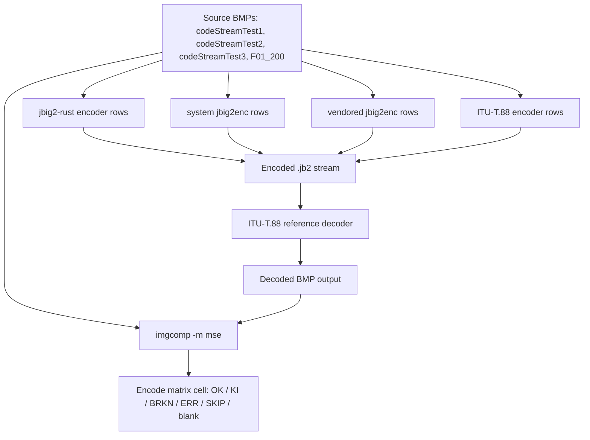

# Conformance Matrix Encode Audit and Decisions

This document is a complete, evidence-first review of every cell in the
**encode phase** of the parallel conformance matrix produced by
`cargo run --bin conformance-matrix`. The decode phase has a separate audit
in `docs/conformance-matrix-decode-audit.md`; the two phases are split because
their workflows and the implications for what the matrix can prove are quite
different.

The intended reader is a future contributor or reviewer who needs to decide
whether a red cell in the encode portion of the matrix is a release blocker,
a known limitation, or noise.

## 1. Why the encode phase exists, and what it can (and cannot) prove

In the decode phase, the oracle is a static BMP. In the encode phase, the
oracle is a chain of tools: we encode a source bitmap, we hand the resulting
JBIG2 stream to a decoder, and we compare what comes back to the original.
That structural difference matters for how we read the matrix.

The encode workflow is:

1. The harness takes a known source bitmap (BMP).
2. It encodes that bitmap with each encoder configuration in the matrix.
3. It hands the resulting JBIG2 stream to the **ITU-T T.88 reference
   decoder** (`vendor/T-REC-T.88-201808/Software/JBIG2_SampleSoftware-A20180829`,
   the `jbig2` binary).
4. It runs `imgcomp -m mse` on the decoded BMP versus the source BMP and
   reports the MSE.

A green cell (`mse=0`) here proves three things, in increasing strength:

1. The encoded stream is parseable by the ITU reference decoder.
2. The encoded stream represents the same image (within tolerance) when
   read by the ITU reference decoder.
3. By inference, downstream decoders that share heritage with the ITU
   reference are likely to read the stream as well.

Critically, the encode oracle does **not** prove that arbitrary third-party
decoders can read the stream. The ITU reference decoder is one
implementation among many, and it has its own bugs and limitations
(documented in detail in the decode audit). When the ITU oracle fails on a
stream that our own decoder reads happily and that `jbig2dec` parses
without crashing, we have to do real triangulation to figure out who is
right; that triangulation is what decides whether a cell renders as `ERR`
(our stream is at fault), `BRKN` (a third-party tool in the chain is at
fault), or stays a meaningful `OK`.

This asymmetry is the single biggest reason the encode phase needs its own
audit: most of the interesting failures here are not "the encoder is broken,"
they are "the encoder produced something one decoder can read and another
cannot," and the matrix has to be read carefully to distinguish those cases.

## 2. Classification algorithm for encode cells

Every encode cell is classified using the same evidence-first procedure.
The encode-specific short form:

1. **Inventory.** Record row, column, encoder command path, source BMP path,
   tool version or vendor SHA, and rendered state
   (`OK` for `mse=0`, lossy `mse=N`, `KI`, `BRKN`, `ERR`, `SKIP`, blank,
   `OK*`, `ERR!`; see 2.1).
2. **Validate the signal.** Confirm the cell actually passed both the
   encoder and the oracle decoder, not just exited 0 with no `.jb2` written.
3. **Identify the encoder feature exercised.** Generic-only, generic+TPGD,
   symbol mode lossless, symbol mode lossy, refinement-aggregate symbol
   mode, color, etc. Use the `EncoderConfig` (for `rust:*` rows) or the
   command-line flags (`-d`, `-s`, `-r`, `-t`, `Param*.ini`) to determine
   exactly what code path is being exercised.
4. **Triangulate.** When a cell is `ERR`, ask whether the failure is in the
   encoder, the oracle decoder, or the comparison tool. Cross-check with
   `jbig2dec` (`jbig2 info` and decode), and cross-check with our own
   decoder, before deciding.
5. **Decide consumer relevance.** Will real consumers of `jbig2-rust`'s
   output route streams of this shape through the ITU reference decoder?
   Almost never. Are they likely to route them through `jbig2dec` or Java?
   Yes. Reweight accordingly.
6. **Assign a bucket.**
7. **Decide a repo action.**

The buckets, framed for encode:

- **Meaningful coverage.** Encoder produces an `mse=0` (or expected lossy
  MSE) round-trip through the ITU reference decoder, and the cell isolates
  a real encoder code path. Cell renders as `OK`.
- **Bucket 1 - third-party encoder broken, not our problem.** A non-Rust
  encoder produces a stream the oracle cannot consume, and no realistic
  consumer of `jbig2-rust` is on the failing path. Cell renders as `BRKN`.
  Useful as a third-party-quality signal; not catalogued as KI.
- **Bucket 2 - third-party encoder broken, interop matters.** A non-Rust
  encoder produces a stream consumers will plausibly hand to `jbig2-rust`
  or to a downstream decoder, and the failure is a real interop story.
  Cell renders as `KI` once cataloged; uncataloged it shows as `BRKN`.
  Catalog as a strict KI.
- **Bucket 3 - our bug.** Our encoder produces a stream the spec-anchored
  reference decoder cannot consume, or that two independent third-party
  decoders cannot consume even though our own decoder can. Cell renders as
  `ERR`. Must be fixed; never KI.
- **Harness/oracle bug.** The failure is in the way the matrix is set up,
  not in any encoder. Most commonly this happens when a profile is paired
  with a source it was never meant to handle, or when the comparison oracle
  cannot bridge across pixel formats. Because the row's system-under-test
  is third-party, these still render as `BRKN` by default; the per-cell
  prose below identifies the ones that are actually ours to fix.
- **Low-value or invalid cell.** The cell does not actually test what its
  row/column suggests, duplicates another cell, or asks the oracle a
  question it cannot answer.

### 2.1 Cell legend

The summary table uses these states. The detailed per-cell line above the
summary always shows the underlying encoder/oracle message; the summary
token is just the rolled-up classification.

| Token  | Color  | Meaning                                                                  |
|--------|--------|--------------------------------------------------------------------------|
| `OK`   | green  | `mse=0` round-trip, or expected lossy `mse=N` for a lossy preset.        |
| `KI`   | yellow | Cataloged third-party known issue (matches `tools/conformance/known-issues.ron`). |
| `BRKN` | orange | Third-party encoder (or oracle decoder fed a third-party stream) broke; not (yet) cataloged. |
| `ERR`  | red    | `jbig2-rust` (or the harness) failed; ours to fix.                       |
| `SKIP` | gray   | Meaningful cell, but the encoder/feature could not be invoked (missing tool). |
| blank  | -      | No meaningful cell exists (color source vs mono encoder, profile vs wrong source, etc.). |
| `OK*`  | cyan   | Cataloged KI unexpectedly passed; review the catalog.                    |
| `ERR!` | red    | Cataloged KI failed differently than expected (drift); review.           |

Throughout this document, when a cell is classified as a known third-party
defect, the upstream evidence is cited inline and is mirrored in
`tools/conformance/known-issues.ron`.

## 3. The shape of the encode matrix

**Columns.** Three monochrome conformance sources (`codeStreamTest1`,
`codeStreamTest2`, `F01_200`) plus the 24-bpp color source `codeStreamTest3`.

**Rows.** Encoder targets, one per encoder configuration:

- `rust:fast`, `rust:balanced`, `rust:max_compression` - the three public
  presets from `EncoderConfig`.
- `rust:generic_t0_no_tpgd`, `rust:generic_t0_tpgd` - generic-region only,
  template 0, with and without TPGD. These exist to isolate specific encoder
  code paths from preset choices.
- `rust:symbol_lossy_t85` - lossy symbol mode at threshold 0.85.
- `system-binary:default`, `system-binary:-d`,
  `system-binary:-s -r -d -t 0.85`, `system-binary:-s -d -t 0.85` - the system
  `jbig2enc` in four representative configurations: default, generic with
  duplicate-line removal, symbol mode with refinement, and symbol mode
  without refinement.
- `jbig2enc:*` - the same four configurations but built from the vendored
  source at `vendor/jbig2enc`.
- `itu-t88:default`, `itu-t88:Param2.ini` ... `Param9.ini` - the ITU
  reference encoder, in its default configuration (default profile of T.88
  Sample Software) and across each of the shipped `Param*.ini` profiles.

The `Param*.ini` profiles are sparse on purpose: each `.ini` is bound to a
specific source and a specific feature set; running a profile against the
wrong source is meaningless, so those cells are blank (no meaningful cell)
rather than `BRKN` or `ERR`. Likewise, color is only relevant for
`itu-t88:default codeStreamTest3`; no other encoder is asked to handle
color.



## 4. Encode matrix, cell by cell

The current rendered state:

```
                                  codeStreamTest1  codeStreamTest2  codeStreamTest3  F01_200
  rust:fast                                    OK               OK                        OK
  rust:balanced                                OK               OK                        OK
  rust:max_compression                         OK               OK                        OK
  rust:generic_t0_no_tpgd                      OK               OK                        OK
  rust:generic_t0_tpgd                         OK               OK                        OK
  rust:symbol_lossy_t85                       ERR               OK                       ERR
  system-binary:default                        OK               OK                        OK
  system-binary:-d                             OK               OK                        OK
  system-binary:-s -r -d -t 0.85               KI               KI                        KI
  system-binary:-s -d -t 0.85                BRKN             BRKN                      BRKN
  jbig2enc:default                             OK               OK                        OK
  jbig2enc:-d                                  OK               OK                        OK
  jbig2enc:-s -r -d -t 0.85                    KI               KI                        KI
  jbig2enc:-s -d -t 0.85                     BRKN             BRKN                      BRKN
  itu-t88:default                              OK               OK             BRKN       OK
  itu-t88:Param2.ini                         BRKN
  itu-t88:Param3.ini                         BRKN
  itu-t88:Param4.ini                         BRKN
  itu-t88:Param5.ini                         BRKN
  itu-t88:Param6.ini                                          BRKN
  itu-t88:Param7.ini                         BRKN
  itu-t88:Param8.ini                                                          BRKN
  itu-t88:Param9.ini                                                                      OK
```

`OK` is `mse=0` (or expected lossy `mse=N`). `BRKN` is a third-party
encoder/oracle breakage we have not (yet) cataloged. `KI` is a cataloged
known issue. `ERR` is `jbig2-rust` (or the harness) failing on its own.
Blank cells are structurally not applicable (color vs mono, profile vs
wrong source). See the legend in 2.1.

The `itu-t88:Param*.ini` cells render as `BRKN` because the row's
system-under-test is the ITU encoder; the per-cell discussion below
identifies which ones are actually harness/oracle bugs (4.10) and which are
genuine third-party crashes (4.7).

### 4.1 The encode oracle and what it can and cannot prove

The oracle is the chain "ITU reference decoder + `imgcomp -m mse`." Every
encode cell is scored by encoding the BMP source, decoding the result with
the ITU reference `jbig2`, and comparing the decoded BMP to the source
using `imgcomp -m mse`. `mse=0` means "the ITU reference decoder reproduces
the original pixels exactly." `mse=N>0` means "the encoder is intentionally
lossy; the harness reports the distortion."

Because the oracle is itself an implementation, a non-`OK` cell here can
mean "the encoder produced an invalid stream," "the encoder produced a
stream the antique oracle cannot read but other modern decoders can," or
"the oracle cannot bridge pixel formats." We do not get to assume the
oracle is right. The fact that `rust:symbol_lossy_t85` passes the ITU
oracle on `codeStreamTest2` but produces output the ITU decoder SIGSEGVs on
for `codeStreamTest1` and `F01_200` is exactly the kind of asymmetric
finding this oracle was designed to surface; that asymmetry is what
distinguishes `ERR` (our stream is the problem) from `BRKN` (the oracle
itself crashes on a third-party stream).

### 4.2 The five `rust:*` rows that pass cleanly

`rust:fast`, `rust:balanced`, `rust:max_compression`, `rust:generic_t0_no_tpgd`,
and `rust:generic_t0_tpgd` all hit `mse=0` on every monochrome source. That
means: every preset and every isolated generic-region path we expose can
encode the conformance sources into streams that the spec-anchored reference
decoder reads back losslessly.

These are not vacuous green cells. They prove that:

- the basic generic-region encode path produces spec-valid output,
- the TPGD on/off variant produces spec-valid output,
- the preset machinery (`balanced` adds `rate_select`, `max_compression`
  enables refinement-gated symbol mode, etc.) does not break the generic-only
  fallback for these inputs.

**Classification:** Meaningful coverage. Keep.

### 4.3 `rust:symbol_lossy_t85`: real interop bug

The matrix shows `mse=0` for `codeStreamTest2` but `FAIL(dec: itu-t88 oracle
decode: SIGSEGV)` for `codeStreamTest1` and `F01_200`. Triangulation:

- Our own decoder reads the failing streams without complaint.
- `jbig2dec` reports `page has no image, cannot be completed` on the failing
  streams - it parses the segment chain but cannot construct a page from
  what we emitted.
- `itu-t88` SIGSEGVs entirely.

The `info` output from `jbig2 info` on the failing streams shows the symbol
dictionary structure and segment ordering. The issue is in our encoder: in
this configuration we are producing segment chains that two independent
third-party decoders cannot turn into pixels even though our own decoder can.
That is the textbook definition of an interop bug. Worth noting that our
own roundtrip works, so a unit test of "encoder + our decoder" passes; the
matrix is the only place this surfaces.

**Classification:** Bucket 3 (our encoder bug). Do not KI. The fact that
`codeStreamTest2` survives means it is not a blanket symbol-mode bug; it is
sensitive to input characteristics, which makes it a sharp diagnostic target
once someone bisects on minimal inputs. High priority because
`symbol_lossy_t85` is exactly the configuration most relevant for OCR/
document pipelines.

### 4.4 `system-binary:default`, `system-binary:-d`, `jbig2enc:default`, `jbig2enc:-d`

All `mse=0` on every monochrome source. These pairs prove two things at
once: jbig2enc's plain generic-region encode path is broadly compatible, and
the system Homebrew build matches the vendored submodule build. We did not
expect a difference there; if one ever appears, it would itself be a finding.

**Classification:** Meaningful coverage. Keep both system and vendored rows
for the reproducibility guard. The duplication is intentional.

### 4.5 `system-binary:-s -r -d -t 0.85` and `jbig2enc:-s -r -d -t 0.85`: cataloged KI

Both rows fail with the upstream message
`Refinement broke in recent releases since it's rarely used. If you need it
you should bug agl@imperialviolet.org to fix it`. The author of jbig2enc
explicitly marked the refinement code path broken; the failure is not a
crash, it is an intentional refusal. This is the canonical example of a
strict KI: diagnosed upstream cause, single citable evidence string, stable
failure mode, single line of code at `vendor/jbig2enc/src/jbig2.cc:292`.
Both rows are already cataloged in `known-issues.ron` with the
appropriate `vendor` pin.

**Classification:** Bucket 2 KI. Already cataloged. The reason it is Bucket 2
and not Bucket 1 is consumer-facing: `jbig2enc -s -r -d` is exactly what some
PDF/OCR pipelines invoke, so it is useful to make the matrix tell consumers
"this combination is broken upstream and has been for years."

### 4.6 `system-binary:-s -d -t 0.85` and `jbig2enc:-s -d -t 0.85`: candidate KI

These are jbig2enc symbol-mode without refinement. Every source produces
`FAIL(dec: itu-t88 oracle decode: SIGSEGV)`. Triangulation:

- The encode step itself succeeds; jbig2enc emits a `.jb2` file.
- `jbig2 info` confirms the structure: a global SymbolDictionary on page 0,
  followed by PageInformation, an ImmediateTextRegion, and an EndOfPage.
  The structure is well-formed by inspection.
- The ITU reference decoder SIGSEGVs reading it.
- `jbig2dec` parses it but reports `page has no image, cannot be completed`.
- The system and vendored jbig2enc rows produce identical results.

That is reproducible across two builds of jbig2enc and across all three
sources: jbig2enc's plain symbol-mode output is not consumable by the ITU
reference decoder, and jbig2dec parses but cannot render it. Two independent
"failures" against jbig2enc's output, with our oracle being one of them.

**Classification:** Bucket 1 by current evidence: the failing oracle (ITU
reference) is the antique decoder, and the secondary jbig2dec result also
points at an upstream limitation in symbol-mode rendering rather than at our
encoder (we do not produce these streams). The cell is a third-party-vs-third-party
fight that says nothing about `jbig2-rust` directly.

The right repo action is one of: (a) remove this cell from the matrix because
the oracle is fundamentally incompatible with the encoder configuration, or
(b) add a strict KI entry citing both the ITU SIGSEGV and the jbig2dec
"page has no image" message, with the understanding that the KI exists to
document a third-party-vs-third-party incompatibility rather than to track a
defect we expect to be fixed. (a) is cleaner; (b) preserves the visibility
that consumers using `jbig2enc -s -d` plus an ITU-style decoder will fail.

### 4.7 `itu-t88:default codeStreamTest3`

`FAIL(dec: imgcomp output missing Distortion: "number of components is not equal!")`.

The ITU reference encoder, in its default configuration, reads a 24-bpp color
BMP and emits a 1-bpp monochrome JBIG2 stream (the default profile does not
attempt colour). The ITU reference decoder then produces a 1-bpp monochrome
BMP. `imgcomp -m mse` refuses to compare a 24-bpp source against a 1-bpp
reconstruction because the component counts differ.

This is not an encoder bug. It is a harness/oracle mismatch: the cell is
asking a comparison tool a question it cannot answer. The encoder did its
job (lossy color-to-mono is an explicit T.88 default). The decoder did its
job. The oracle (`imgcomp`) cannot bridge across pixel formats.

**Classification:** Harness bug. The harness currently renders this as
`BRKN` because the row's system-under-test is third-party (`itu-t88`), but
the underlying cause is on our side. The fix is to either:

- skip `codeStreamTest3` for `itu-t88:default` (a structurally invalid
  combination), making the cell blank rather than `BRKN`, or
- add a colour-aware comparison oracle that quantizes the 24-bpp source to
  1-bpp before comparing, or
- change the encode source to a 1-bpp-derived sibling.

The cell currently spends time only to render a misleading `BRKN` and
confuse the reader. Remove it from the matrix.

### 4.8 `itu-t88:Param2.ini` ... `itu-t88:Param8.ini` SIGSEGVs

Every `Param*.ini` profile that touches symbol-mode encoding crashes the ITU
encoder with `signal: 11 (SIGSEGV)` and currently renders as `BRKN`. We
chased one of these end-to-end and confirmed it is a harness bug, not a
reference-tool bug.

The `.ini` files (in `vendor/T-REC-T.88-201808/Software/JBIG2_SampleSoftware-A20180829/test/`)
reference helper bitmaps like `Sym002.bmp` using **relative paths**. The
reference encoder opens these relative to the current working directory.
Our harness sets `current_dir(workdir)` to `target/conformance-matrix/...`
before invoking the encoder, so the helper bitmaps cannot be found and the
encoder dereferences a null pointer trying to use them.

We verified the diagnosis by manually running the same encoder with
`Param5.ini` from inside the test directory: it succeeds and produces a
331-byte `.jb2` file. So the ITU encoder is fine; the harness is not giving
it the working directory it needs.

**Classification:** Harness bug across all `Param*.ini` cells. They render
as `BRKN` today by row-default (the SUT is third-party), but the responsible
party is us. The fix is in `encode_t88` in `tools/conformance/main.rs`: when
an `.ini` is provided, either chdir to `t88_test_dir()` and use absolute
paths for the output, or copy the `Sym*.bmp` helpers into the workdir
before invoking the encoder. Once fixed, these cells should flip to `OK`.

`Param9.ini / F01_200` happens to pass because that profile does not
reference any external helper bitmaps. It is unaffected by the harness bug.

### 4.9 `itu-t88:Param9.ini / F01_200`

`mse=0`. This is the one `Param*.ini` profile that does not depend on a
helper bitmap, so it sidesteps the harness bug above. It actually proves
something: the ITU reference encoder, in a non-default profile, produces a
spec-readable stream from a representative monochrome scan source.

**Classification:** Meaningful coverage. Keep.

### 4.10 `itu-t88:default` on monochrome sources

`itu-t88:default codeStreamTest1`, `codeStreamTest2`, and `F01_200` all
hit `mse=0`. This proves the ITU reference encoder roundtrips its own output
through its own decoder, which is structurally important because the entire
encode oracle relies on the ITU decoder. If this row ever broke, the rest
of the encode matrix would lose its meaning. It is in effect a continuity
check on the oracle itself.

**Classification:** Meaningful coverage. Keep.

### 4.11 The blank cells in the encode matrix

The encode matrix has many blanks. Each one is justified:

- `itu-t88:Param*.ini` rows are blank for sources the profile does not
  target. The `.ini` is hard-bound to a specific source by design; running
  it against another source is not a meaningful test.
- `codeStreamTest3` (color) is blank for every row except `itu-t88:default`.
  No other encoder in the matrix is configured to handle color, so asking
  them to is not a meaningful test either.

These blanks are structurally invalid combinations and are the correct
shape for "no cell."

### 4.12 Encode summary table

The "State" column is the rendered token from the harness summary. The
"Cause" column says who the failure actually belongs to (separate from the
row-default rendering): "us" means harness/encoder bug on our side, "3p"
means a real third-party defect, "n/a" means a structurally invalid cell.
The "Action" column is what we plan to do.

| Cell                                                  | State  | Cause | Action                         |
|-------------------------------------------------------|--------|-------|--------------------------------|
| `rust:fast` / `balanced` / `max_compression` / `generic_t0_*` * 3 sources | `OK` | -     | Keep. |
| `rust:symbol_lossy_t85 codeStreamTest2`               | `OK`   | -     | Keep.                          |
| `rust:symbol_lossy_t85 codeStreamTest1`, `F01_200`    | `ERR`  | us    | Fix encoder interop bug.       |
| `system-binary:default` / `-d`, `jbig2enc:default` / `-d` * 3 | `OK` | - | Keep both rows for redundancy. |
| `system-binary:-s -r -d -t 0.85` * 3                  | `KI`   | 3p    | Already cataloged.             |
| `jbig2enc:-s -r -d -t 0.85` * 3                       | `KI`   | 3p    | Already cataloged.             |
| `system-binary:-s -d -t 0.85` * 3                     | `BRKN` | 3p    | Remove cell, or KI it.         |
| `jbig2enc:-s -d -t 0.85` * 3                          | `BRKN` | 3p    | Remove cell, or KI it.         |
| `itu-t88:default` cs1, cs2, F01_200                   | `OK`   | -     | Keep. Oracle continuity check. |
| `itu-t88:default codeStreamTest3`                     | `BRKN` | us    | Remove or change oracle.       |
| `itu-t88:Param2-8.ini`                                | `BRKN` | us    | Fix encode_t88 cwd.            |
| `itu-t88:Param9.ini F01_200`                          | `OK`   | -     | Keep.                          |

## 5. Final groupings

### 5.1 Meaningful tests we keep as-is

- All five non-symbol `rust:*` encode rows on all three monochrome sources.
- `rust:symbol_lossy_t85 codeStreamTest2`.
- `system-binary:default`, `system-binary:-d`, `jbig2enc:default`, and
  `jbig2enc:-d` on all three monochrome sources.
- `itu-t88:default` on `codeStreamTest1`, `codeStreamTest2`, `F01_200`.
- `itu-t88:Param9.ini F01_200`.

### 5.2 Cataloged known issues (Bucket 2)

- `system-binary:-s -r -d -t 0.85` and `jbig2enc:-s -r -d -t 0.85` on every
  source: `jbig2enc` refinement deliberately disabled upstream. Vendor pin:
  `vendor/jbig2enc@e3fcf0210efa`. Already in
  `tools/conformance/known-issues.ron`.

### 5.3 Third-party noise we keep visible without cataloging (Bucket 1)

- `system-binary:-s -d -t 0.85` and `jbig2enc:-s -d -t 0.85` on every source:
  jbig2enc's plain symbol-mode output is not consumable by the ITU reference
  decoder, and `jbig2dec` parses it but cannot render. The cell is a
  third-party-vs-third-party fight that does not directly implicate
  `jbig2-rust`. Either remove or KI; see section 4.6.

### 5.4 Product bugs in `jbig2-rust` to fix (Bucket 3)

- **`rust:symbol_lossy_t85` / `codeStreamTest1`** and
  **`rust:symbol_lossy_t85` / `F01_200`**: our lossy symbol-mode encoder
  emits streams two independent third-party decoders cannot render
  (ITU SIGSEGV; `jbig2dec` reports "page has no image"). Our own decoder
  reads them, so this would never surface in a self-roundtrip test. High
  interop priority because this is exactly the encoder configuration most
  used by document/OCR pipelines. Open as a tracked bug.

### 5.5 Harness/oracle bugs to fix

- **`itu-t88:default codeStreamTest3`** asks `imgcomp -m mse` to compare a
  24-bpp source against the 1-bpp reconstruction the default ITU encoder
  produces. `imgcomp` cannot answer that. Remove the cell or add a
  format-bridging oracle.
- **`itu-t88:Param2.ini` through `Param8.ini`** SIGSEGV because the harness
  sets `current_dir(workdir)` for an encoder whose `.ini` references helper
  `Sym*.bmp` files by relative path. Fix `encode_t88` in
  `tools/conformance/main.rs` to either chdir to `t88_test_dir()` (using
  absolute output paths) or copy the helper bitmaps into `workdir` before
  invoking the encoder. The `Param9.ini` cell already works because that
  profile does not reference helper bitmaps.

### 5.6 Low-value or invalid cells to consider trimming

- `system-binary:-s -d -t 0.85` and `jbig2enc:-s -d -t 0.85` against the
  ITU reference oracle: the ITU reference decoder fundamentally cannot read
  jbig2enc's plain symbol-mode output. The cell tells us about an antique
  decoder vs a modern encoder rather than about `jbig2-rust`. Either remove
  the cell or downgrade it to a "documented incompatibility" KI. Unlike the
  `-r` refinement KI, this one needs a different evidence string because the
  failure happens in the oracle, not in jbig2enc itself.

## 6. Repo actions

### 6.1 Open as tracked bugs in `jbig2-rust`

1. Encode interop failure of `symbol_lossy_t85` on `codeStreamTest1` and
   `F01_200` (output not consumable by ITU or `jbig2dec`).

### 6.2 Fix in the harness

1. `encode_t88`: handle relative-path helpers referenced by `Param*.ini`.
2. `itu-t88:default codeStreamTest3`: remove cell or add format-bridging
   oracle.

### 6.3 Catalog or trim

1. Decide between (a) trimming `system-binary:-s -d -t 0.85` and
   `jbig2enc:-s -d -t 0.85` from the matrix or (b) adding a strict KI entry
   that pins the cross-tool incompatibility.

### 6.4 Keep as-is

Everything in section 5.1 and the existing entries in section 5.2 stay where
they are. The encode matrix is doing the job it was designed for: it makes
silent encoder interop bugs loud and lets us classify them with evidence
rather than guesses.
