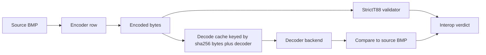

# Encoder / Decoder Interop Test Design

## Why this matters

The encode matrix now answers a deliberately narrow question: did an encoder
produce a strict-T.88 stream that `jbig2-rust` can decode back to the source
BMP? That is necessary, but it is not enough for production confidence.

JBIG2 is a many-to-one format. Two streams can be structurally valid and
pixel-equivalent while exercising very different decoder behavior: generic
regions versus text regions, refinement paths, symbol dictionaries, page
association choices, embedded versus sequential organization, and AMD3 color
extensions. Real consumers of encoded JBIG2 will not all use our decoder.
They will read streams through the Ghostscript / Artifex `jbig2dec` family,
Java's `jbig2-imageio` stack used by PDFBox and Tika, PDF renderers from Adobe
and Apple, and sometimes the ITU reference software.

We have already seen why self-roundtrip is insufficient. The old encode matrix
surfaced `rust:symbol_lossy_t85` as an interop concern: our decoder could read
the stream, but external decoders struggled. The new v88+rt encode oracle is
cleaner and less noisy, but it intentionally does not replace that downstream
compatibility signal. Interop is a first-class quality property and deserves
its own matrix.

## Proposed matrix shape

The interop cell key should be:

```
(encoder row, decoder backend, source BMP)
```

The display should avoid one giant unreadable grid. Prefer one matrix per
source:

```
Source: codeStreamTest1
rows    = encoder configurations
columns = decoder backends
cells   = decode-and-compare result for that encoder output
```

Suggested decoder columns:

- `rust` (`jbig2::Jbig2Decoder`)
- `jbig2dec` system binary
- `jbig2dec` vendored binary
- `itu-t88`
- `jbig2-imageio`

Suggested encoder rows are the same `EncodeRow` set used by the encode matrix,
subject to the same blanking rules for profile/source mismatch and mono-only
encoders on `codeStreamTest3`.

## Data flow



The validator should run once per encoded byte stream. If the stream is
invalid, display `INVALID` at the row/source level and avoid spending decoder
time on a stream whose structural status is already known.

## Verdict semantics

- `OK`: Decoder reproduced the source within the row's lossless/expected-lossy
  contract.
- `LOSSY`: Decoder reproduced a valid image with a measured pixel difference.
  The cell text should include `diff/total(pct)`.
- `DECODER_FAIL`: The decoder errored, crashed, timed out, or produced no page.
  Include the stable diagnostic token.
- `INVALID`: The encoder output failed `StrictT88`; show this once for the
  encoded stream rather than repeating the same structural finding for every
  decoder.
- `KI`: A cataloged known issue from `tools/conformance/known-issues.ron`.
  Existing WONTFIX entries for `jbig2dec` TT5/TT6 are the model.
- Blank: No meaningful tuple exists, usually because the encoder/profile does
  not target that source.

Lossless rows should require exact pixel match. Lossy rows should report diff
and use a deliberately conservative sanity ceiling until per-row baselines
exist.

## Caching and runtime budget

Java startup is expensive, and several encoder rows may produce identical
bytes for small sources. Cache decoder results by:

```
(sha256(encoded bytes), decoder backend, source label)
```

This lets the matrix avoid invoking the same decoder repeatedly for identical
streams. The cache should live inside the per-run `target/conformance-matrix`
workdir and can be in-memory first; persistent cache can come later if runtime
requires it.

The sandbox model should reuse the existing encoder/decoder presets in
`tools/conformance/main.rs`. Decoder backends get decoder limits; encoders get
encoder limits. If a future comparator process is reintroduced, it should get
a comparator sandbox rather than borrowing decoder limits.

## Relationship to the encode matrix

The encode matrix proves:

```
encoder output is StrictT88-valid and our decoder can roundtrip it
```

The interop matrix proves:

```
encoder output is consumable by the decoder ecosystem users actually run
```

Both are required. The encode matrix is fast, deterministic, and good for
structural regressions. The interop matrix is broader, noisier, and better for
product risk. Keeping them separate makes failures easier to classify.

## Color paths

`codeStreamTest3` is the only color source today. Most encoder rows are
mono-only and should remain blank. `itu-t88:Param8.ini / codeStreamTest3` is
the useful current color stream: it produces AMD3 color text-region data that
our decoder reconstructs as RGB exactly.

Interop color support will be uneven. The `jbig2dec` family has known AMD3
color limitations in the decode matrix (`color segments (NYI)`). Java and PDF
renderer behavior needs fresh evidence before being cataloged. The future
color encoder roadmap in `docs/color-encoder-roadmap.md` describes what would
be needed to add a `rust:* / codeStreamTest3` encoder row.

## Open questions

- Should the interop view be one matrix per source, or one consolidated matrix
  with decoder/source column groups?
- Should interop run as `--phase interop`, or only under an explicit
  `--interop` flag because Java and external decoders are expensive?
- Should `INVALID` suppress decoder execution, or should we still run decoders
  to measure tolerance of invalid third-party streams?
- How should lossy rows get stable regression budgets without turning the
  first implementation into a baseline-management project?
- Which PDF renderers are practical to automate locally, and which belong in a
  separate manual compatibility note?

## Out of scope for the current pass

This document is the design, not the implementation. The current encoder
conformance work stops at v88+rt plus this plan. Building the interop matrix is
a future task.
