<table>
<colgroup>
<col style="width: 14%" />
<col style="width: 0%" />
<col style="width: 25%" />
<col style="width: 20%" />
<col style="width: 39%" />
</colgroup>
<tbody>
<tr>
<td colspan="2"></td>
<td colspan="3"><strong>International Telecommunication Union</strong></td>
</tr>
<tr>
<td colspan="2"></td>
<td colspan="3"></td>
</tr>
<tr>
<td><strong>ITU-T</strong></td>
<td colspan="2" style="text-align: right;"><strong>T.88</strong></td>
<td></td>
<td></td>
</tr>
<tr>
<td colspan="2" style="text-align: left;">TELECOMMUNICATION 
STANDARDIZATION SECTOR 
OF ITU</td>
<td style="text-align: right;">(08/2018)</td>
<td></td>
<td></td>
</tr>
<tr>
<td></td>
<td colspan="4" style="text-align: left;">
SERIES T: TERMINALS FOR TELEMATIC SERVICES

Still-image compression – JPEG-1, Bi-level and JBIG
</td>
</tr>
<tr>
<td></td>
<td colspan="4" style="text-align: left;"><strong>Information technology – Lossy/lossless coding of bi-level images</strong></td>
</tr>
<tr>
<td></td>
<td colspan="4" style="text-align: left;">Recommendation ITU‑T T.88</td>
</tr>
</tbody>
</table>

ITU-T T-SERIES RECOMMENDATIONS

**TERMINALS FOR TELEMATIC SERVICES**

<table style="width:100%;">
<colgroup>
<col style="width: 82%" />
<col style="width: 17%" />
</colgroup>
<thead>
<tr>
<th style="text-align: left;"></th>
<th style="text-align: left;"></th>
</tr>
</thead>
<tbody>
<tr>
<td style="text-align: left;"><blockquote>

Facsimile – Framework

</blockquote></td>
<td style="text-align: left;">T.0–T.19</td>
</tr>
<tr>
<td style="text-align: left;"><blockquote>

Still-image compression – Test charts

</blockquote></td>
<td style="text-align: left;">T.20–T.29</td>
</tr>
<tr>
<td style="text-align: left;"><blockquote>

Facsimile – Group 3 protocols

</blockquote></td>
<td style="text-align: left;">T.30–T.39</td>
</tr>
<tr>
<td style="text-align: left;"><blockquote>

Colour representation

</blockquote></td>
<td style="text-align: left;">T.40–T.49</td>
</tr>
<tr>
<td style="text-align: left;"><blockquote>

Character coding

</blockquote></td>
<td style="text-align: left;">T.50–T.59</td>
</tr>
<tr>
<td style="text-align: left;"><blockquote>

Facsimile – Group 4 protocols

</blockquote></td>
<td style="text-align: left;">T.60–T.69</td>
</tr>
<tr>
<td style="text-align: left;"><blockquote>

Telematic services – Framework

</blockquote></td>
<td style="text-align: left;">T.70–T.79</td>
</tr>
<tr>
<td style="text-align: left;"><blockquote>

<strong>Still-image compression – JPEG-1, Bi-level and JBIG</strong>

</blockquote></td>
<td style="text-align: left;"><strong>T.80–T.89</strong></td>
</tr>
<tr>
<td style="text-align: left;"><blockquote>

Telematic services – ISDN Terminals and protocols

</blockquote></td>
<td style="text-align: left;">T.90–T.99</td>
</tr>
<tr>
<td style="text-align: left;"><blockquote>

Videotext – Framework

</blockquote></td>
<td style="text-align: left;">T.100–T.109</td>
</tr>
<tr>
<td style="text-align: left;"><blockquote>

Data protocols for multimedia conferencing

</blockquote></td>
<td style="text-align: left;">T.120–T.149</td>
</tr>
<tr>
<td style="text-align: left;"><blockquote>

Telewriting

</blockquote></td>
<td style="text-align: left;">T.150–T.159</td>
</tr>
<tr>
<td style="text-align: left;"><blockquote>

Multimedia and hypermedia framework

</blockquote></td>
<td style="text-align: left;">T.170–T.189</td>
</tr>
<tr>
<td style="text-align: left;"><blockquote>

Cooperative document handling

</blockquote></td>
<td style="text-align: left;">T.190–T.199</td>
</tr>
<tr>
<td style="text-align: left;"><blockquote>

Telematic services – Interworking

</blockquote></td>
<td style="text-align: left;">T.300–T.399</td>
</tr>
<tr>
<td style="text-align: left;"><blockquote>

Open document architecture

</blockquote></td>
<td style="text-align: left;">T.400–T.429</td>
</tr>
<tr>
<td style="text-align: left;"><blockquote>

Document transfer and manipulation

</blockquote></td>
<td style="text-align: left;">T.430–T.449</td>
</tr>
<tr>
<td style="text-align: left;"><blockquote>

Document application profile

</blockquote></td>
<td style="text-align: left;">T.500–T.509</td>
</tr>
<tr>
<td style="text-align: left;"><blockquote>

Communication application profile

</blockquote></td>
<td style="text-align: left;">T.510–T.559</td>
</tr>
<tr>
<td style="text-align: left;"><blockquote>

Telematic services – Equipment characteristics

</blockquote></td>
<td style="text-align: left;">T.560–T.619</td>
</tr>
<tr>
<td style="text-align: left;"><blockquote>

General multimedia application frameworks

</blockquote></td>
<td style="text-align: left;">T.620–T.649</td>
</tr>
<tr>
<td style="text-align: left;"><blockquote>

Still-image compression – JPEG 2000

</blockquote></td>
<td style="text-align: left;">T.800–T.829</td>
</tr>
<tr>
<td style="text-align: left;"><blockquote>

Still-image compression | JPEG XR

</blockquote></td>
<td style="text-align: left;">T.830–T.849</td>
</tr>
<tr>
<td style="text-align: left;"><blockquote>

Still-image compression – JPEG-1 extensions

</blockquote></td>
<td style="text-align: left;">T.850–T.899</td>
</tr>
<tr>
<td style="text-align: left;"></td>
<td style="text-align: left;"></td>
</tr>
</tbody>
</table>

*For further details, please refer to the list of ITU-T Recommendations.*

<table>
<colgroup>
<col style="width: 100%" />
</colgroup>
<tbody>
<tr>
<td>
INTERNATIONAL STANDARD ISO/IEC 14492

Recommendation ITU-T T.88

Information technology – Lossy/lossless coding of bi-level images
</td>
</tr>
</tbody>
</table>

<table>
<colgroup>
<col style="width: 100%" />
</colgroup>
<tbody>
<tr>
<td>
Summary

Rec. ITU-T T.88 | ISO/IEC 14492, commonly known as JBIG2, defines a coding method for bi-level images (e.g., black and white printed matter). These are images consisting of a single rectangular bit plane, with each pixel taking on one of just two possible colours. This Recommendation | International Standard has been explicitly prepared for a lossy, lossless, and lossy-to-lossless image compression.
</td>
</tr>
</tbody>
</table>

<table>
<colgroup>
<col style="width: 100%" />
</colgroup>
<tbody>
<tr>
<td>
History

<table style="width:75%;">
<colgroup>
<col style="width: 7%" />
<col style="width: 25%" />
<col style="width: 10%" />
<col style="width: 11%" />
<col style="width: 19%" />
</colgroup>
<tbody>
<tr>
<td style="text-align: center;">Edition</td>
<td>Recommendation</td>
<td style="text-align: center;">Approval</td>
<td style="text-align: center;">Study Group</td>
<td style="text-align: center;">Unique ID<a href="#fn1" class="footnote-ref" id="fnref1" role="doc-noteref">1</a></td>
</tr>
<tr>
<td style="text-align: center;">1.0</td>
<td>ITU-T T.88</td>
<td style="text-align: center;">2000-02-10</td>
<td style="text-align: center;">8</td>
<td style="text-align: center;"><a href="http://handle.itu.int/11.1002/1000/4845">11.1002/1000/4845</a></td>
</tr>
<tr>
<td style="text-align: center;">1.1</td>
<td>ITU-T T.88 (2000) Amd. 1</td>
<td style="text-align: center;">2003-06-29</td>
<td style="text-align: center;">16</td>
<td style="text-align: center;"><a href="http://handle.itu.int/11.1002/1000/6388">11.1002/1000/6388</a></td>
</tr>
<tr>
<td style="text-align: center;">1.2</td>
<td>ITU-T T.88 (2000) Amd. 2</td>
<td style="text-align: center;">2003-06-29</td>
<td style="text-align: center;">16</td>
<td style="text-align: center;"><a href="http://handle.itu.int/11.1002/1000/6389">11.1002/1000/6389</a></td>
</tr>
<tr>
<td style="text-align: center;">1.3</td>
<td>ITU-T T.88 (2000) Amd. 3</td>
<td style="text-align: center;">2011-05-14</td>
<td style="text-align: center;">16</td>
<td style="text-align: center;"><a href="http://handle.itu.int/11.1002/1000/11312">11.1002/1000/11312</a></td>
</tr>
<tr>
<td style="text-align: center;">2.0</td>
<td>ITU-T T.88</td>
<td style="text-align: center;">2018-08-29</td>
<td style="text-align: center;">16</td>
<td style="text-align: center;"><a href="http://handle.itu.int/11.1002/1000/13688">11.1002/1000/13688</a></td>
</tr>
</tbody>
</table></td>
</tr>
</tbody>
</table>
<section id="footnotes" class="footnotes footnotes-end-of-document" role="doc-endnotes">

<ol>
<li id="fn1">
* To access the Recommendation, type the URL http://handle.itu.int/ in the address field of your web browser, followed by the Recommendation's unique ID. For example, <a href="http://handle.itu.int/11.1002/1000/11830-en">http://handle.itu.int/11.1002/1000/11830-en</a>.<a href="#fnref1" class="footnote-back" role="doc-backlink">↩︎</a>
</li>
</ol>
</section>

<table>
<colgroup>
<col style="width: 100%" />
</colgroup>
<tbody>
<tr>
<td>
Keywords

Bi-level images; image compression; lossy image compression; lossless image compression; lossy-to-lossless image compression; JBIG.
</td>
</tr>
</tbody>
</table>

FOREWORD

The International Telecommunication Union (ITU) is the United Nations specialized agency in the field of tele­com­mu­ni­ca­tions, information and communication technologies (ICTs). The ITU Telecommunication Standardization Sector (ITU-T) is a permanent organ of ITU. ITU-T is responsible for studying technical, operating and tariff questions and issuing Recommendations on them with a view to standardizing telecommunications on a worldwide basis.

The World Telecommunication Standardization Assembly (WTSA), which meets every four years, establishes the topics for study by the ITU‑T study groups which, in turn, produce Recommendations on these topics.

The approval of ITU-T Recommendations is covered by the procedure laid down in WTSA Resolution 1.

In some areas of information technology which fall within ITU-T's purview, the necessary standards are prepared on a collaborative basis with ISO and IEC.

NOTE

In this Recommendation, the expression "Administration" is used for conciseness to indicate both a telecommunication administration and a recognized operating agency.

Compliance with this Recommendation is voluntary. However, the Recommendation may contain certain mandatory provisions (to ensure, e.g., interoperability or applicability) and compliance with the Recommendation is achieved when all of these mandatory provisions are met. The words "shall" or some other obligatory language such as "must" and the negative equivalents are used to express requirements. The use of such words does not suggest that compliance with the Recommendation is required of any party.

INTELLECTUAL PROPERTY RIGHTS

ITU draws attention to the possibility that the practice or implementation of this Recommendation may involve the use of a claimed Intellectual Property Right. ITU takes no position concerning the evidence, validity or applicability of claimed Intellectual Property Rights, whether asserted by ITU members or others outside of the Recommendation development process.

As of the date of approval of this Recommendation, ITU had received notice of intellectual property, protected by patents, which may be required to implement this Recommendation. However, implementers are cautioned that this may not represent the latest information and are therefore strongly urged to consult the TSB patent database at <http://www.itu.int/ITU-T/ipr/>.

 ITU 2019

All rights reserved. No part of this publication may be reproduced, by any means whatsoever, without the prior written permission of ITU.

**  
Table of Contents**

Page

[0 Introduction [v](#introduction)](#introduction)

[0.1 Interpretation and use of the requirements [v](#interpretation-and-use-of-the-requirements)](#interpretation-and-use-of-the-requirements)

[0.2 Lossy coding [ix](#lossy-coding)](#lossy-coding)

[1 Scope [1](#scope)](#scope)

[2 Normative references [1](#normative-references)](#normative-references)

[3 Definitions [1](#definitions)](#definitions)

[4 Symbols and abbreviations [3](#symbols-and-abbreviations)](#symbols-and-abbreviations)

[4.1 Abbreviations [3](#abbreviations)](#abbreviations)

[4.2 Symbol definitions [4](#symbol-definitions)](#symbol-definitions)

[4.3 Operator definitions [11](#operator-definitions)](#operator-definitions)

[5 Conventions [11](#conventions)](#conventions)

[5.1 Typographic conventions [11](#typographic-conventions)](#typographic-conventions)

[5.2 Binary notation [11](#binary-notation)](#binary-notation)

[5.3 Hexadecimal notation [11](#hexadecimal-notation)](#hexadecimal-notation)

[5.4 Integer value syntax [11](#integer-value-syntax)](#integer-value-syntax)

[5.5 Array notation and conventions [12](#array-notation-and-conventions)](#array-notation-and-conventions)

[5.6 Image and bitmap conventions [12](#image-and-bitmap-conventions)](#image-and-bitmap-conventions)

[6 Decoding Procedures [13](#decoding-procedures-1)](#decoding-procedures-1)

[6.1 Introduction to decoding procedures [13](#introduction-to-decoding-procedures)](#introduction-to-decoding-procedures)

[6.2 Generic region decoding procedure [14](#generic-region-decoding-procedure)](#generic-region-decoding-procedure)

[6.3 Generic Refinement Region Decoding Procedure [21](#generic-refinement-region-decoding-procedure)](#generic-refinement-region-decoding-procedure)

[6.4 Text Region Decoding Procedure [25](#text-region-decoding-procedure)](#text-region-decoding-procedure)

[6.5 Symbol Dictionary Decoding Procedure [33](#symbol-dictionary-decoding-procedure)](#symbol-dictionary-decoding-procedure)

[6.6 Halftone Region Decoding Procedure [41](#halftone-region-decoding-procedure)](#halftone-region-decoding-procedure)

[6.7 Pattern Dictionary Decoding Procedure [44](#pattern-dictionary-decoding-procedure)](#pattern-dictionary-decoding-procedure)

[6.8 Colour palette decoding procedure [46](#_Toc298144093)](#_Toc298144093)

[7 Control Decoding Procedure [47](#control-decoding-procedure)](#control-decoding-procedure)

[7.1 General description [47](#general-description-8)](#general-description-8)

[7.2 Segment header syntax [48](#segment-header-syntax)](#segment-header-syntax)

[7.3 Segment t ypes [52](#segment-t-ypes)](#segment-t-ypes)

[7.4 Segment syntaxes [54](#segment-syntaxes)](#segment-syntaxes)

[8 Page Make-up [82](#page-make-up)](#page-make-up)

[8.1 Decoder model [82](#decoder-model)](#decoder-model)

[8.2 Page image composition [83](#page-image-composition)](#page-image-composition)

[9 Encoding procedures (informative) [85](#encoding-procedures-informative)](#encoding-procedures-informative)

[10 Control encoding procedures (informative) [85](#control-encoding-procedures-informative)](#control-encoding-procedures-informative)

[11 Page break-up (informative) [85](#page-break-up-informative)](#page-break-up-informative)

[11.1 Page break-up architecture [86](#page-break-up-architecture)](#page-break-up-architecture)

[11.2 Page image decomposition [86](#page-image-decomposition)](#page-image-decomposition)

[11.3 Multi-page document composition [88](#multi-page-document-composition)](#multi-page-document-composition)

[Annex  A – Arithmetic integer decoding procedure [89](#_Toc524615889)](#_Toc524615889)

[A.1 General description [89](#a.1-general-description)](#a.1-general-description)

[A.2 Procedure for decoding values (except IAID) [89](#a.2-procedure-for-decoding-values-except-iaid)](#a.2-procedure-for-decoding-values-except-iaid)

[A.3 The IAID decoding procedure [91](#a.3-the-iaid-decoding-procedure)](#a.3-the-iaid-decoding-procedure)

[Annex B – Huffman table decoding procedure [93](#_Toc524615893)](#_Toc524615893)

[B.1 General description [93](#b.1-general-description)](#b.1-general-description)

[B.2 Code table structure [93](#b.2-code-table-structure)](#b.2-code-table-structure)

[B.3 Assigning the prefix codes [94](#b.3-assigning-the-prefix-codes)](#b.3-assigning-the-prefix-codes)

[B.4 Using a Huffman table [95](#b.4-using-a-huffman-table)](#b.4-using-a-huffman-table)

[B.5 Standard Huffman tables [96](#b.5-standard-huffman-tables)](#b.5-standard-huffman-tables)

Page

[Annex C – Gray-scale image decoding procedure [103](#_Toc524615902)](#_Toc524615902)

[C.1 General description [103](#c.1-general-description)](#c.1-general-description)

[C.2 Input parameters [103](#c.2-input-parameters)](#c.2-input-parameters)

[C.3 Return value [103](#c.3-return-value)](#c.3-return-value)

[C.4 Variables used in decoding [103](#c.4-variables-used-in-decoding)](#c.4-variables-used-in-decoding)

[C.5 Decoding the gray-scale image [103](#c.5-decoding-the-gray-scale-image)](#c.5-decoding-the-gray-scale-image)

[Annex D – File formats [105](#_Toc524615908)](#_Toc524615908)

[D.1 Sequential organization [105](#d.1-sequential-organization)](#d.1-sequential-organization)

[D.2 Random-access organization [105](#d.2-random-access-organization)](#d.2-random-access-organization)

[D.3 Embedded organization [106](#d.3-embedded-organization)](#d.3-embedded-organization)

[D.4 File header syntax [106](#d.4-file-header-syntax)](#d.4-file-header-syntax)

[Annex E – Arithmetic coding [108](#_Toc524615916)](#_Toc524615916)

[E.1 Binary encoding [108](#e.1-binary-encoding)](#e.1-binary-encoding)

[E.2 Description of the arithmetic encoder [109](#e.2-description-of-the-arithmetic-encoder)](#e.2-description-of-the-arithmetic-encoder)

[E.3 Arithmetic decoding procedure [116](#e.3-arithmetic-decoding-procedure)](#e.3-arithmetic-decoding-procedure)

[Annex F – Profiles [124](#_Toc503673215)](#_Toc503673215)

[Annex G – Arithmetic decoding procedure (software conventions) [127](#_Toc524615941)](#_Toc524615941)

[Annex H – Datastream example and test sequence [129](#_Toc503673217)](#_Toc503673217)

[H.1 Datastream example [129](#h.1-datastream-example)](#h.1-datastream-example)

[H.2 Test sequence for arithmetic coder [150](#h.2-test-sequence-for-arithmetic-coder)](#h.2-test-sequence-for-arithmetic-coder)

[Annex I – Patents [156](#x1-259001r287)](#x1-259001r287)

[I.1 List of patents [156](#i.1-list-of-patents)](#i.1-list-of-patents)

[I.2 Contact addresses for patent information [157](#i.2-contact-addresses-for-patent-information)](#i.2-contact-addresses-for-patent-information)

[Annex J – Compliant example encoding methods [158](#_Toc524615948)](#_Toc524615948)

[J.1 List of JBIG2 encoding components and corresponding algorithms [158](#j.1-list-of-jbig2-encoding-components-and-corresponding-algorithms)](#j.1-list-of-jbig2-encoding-components-and-corresponding-algorithms)

[J.2 Method references [159](#j.2-method-references)](#j.2-method-references)

[Annex K – Electronic conformance data and sample software [161](#_Toc524615951)](#_Toc524615951)

[K.1 Attached electronic data (informative) [161](#k.1-attached-electronic-data-informative)](#k.1-attached-electronic-data-informative)

[K.2 Working environments of the released sample software (informative) [162](#k.2-working-environments-of-the-released-sample-software-informative)](#k.2-working-environments-of-the-released-sample-software-informative)

[K.3 How to use the sample software (informative) [162](#k.3-how-to-use-the-sample-software-informative)](#k.3-how-to-use-the-sample-software-informative)

[Bibliography [165](#_Toc526924933)](#_Toc526924933)

Electronic attachments:

1\. Reference source code implementation

2\. Test bitstreams

# 0 Introduction

This Recommendation \| International Standard, informally called JBIG2, defines a coding method for bi-level images (e.g., black and white printed matter). These are images consisting of a single rectangular bit plane, with each pixel taking on one of just two possible colours. Multiple colours are to be handled using an appropriate higher level standard such as Recommendation ITU-T T.44. It is being drafted by the Joint Bi-level Image Experts Group (JBIG), a "Collaborative Team", established in 1988, that reports both to ISO/IEC JTC 1/SC29/WG1 and to ITU-T.

Compression of this type of image is also addressed by existing facsimile standards, for example by the compression algorithms in Recommendations ITU-T T.4 (MH, MR), T.6 (MMR), T.82 (JBIG1), and T.85 (Application profile of JBIG1 for facsimile). Besides the obvious facsimile application, JBIG2 will be useful for document storage and archiving, coding images on the World Wide Web, wireless data transmission, print spooling, and even teleconferencing.

As the result of a process that ended in 1993, JBIG produced a first coding standard formally designated Recommendation ITU-T T.82 \| International Standard ISO/IEC 11544, which is informally known as JBIG or JBIG1. JBIG1 is intended to behave as lossless and progressive (lossy-to-lossless) coding. Though it has the capability of lossy coding, the lossy images produced by JBIG1 have significantly lower quality than the original images because the number of pixels in the lossy image cannot exceed one quarter of those in the original image.

On the contrary, JBIG2 was explicitly prepared for lossy, lossless, and lossy-to-lossless image compression. The design goal for JBIG2 was to allow for lossless compression performance better than that of the existing standards, and to allow for lossy compression at much higher compression ratios than the lossless ratios of the existing standards, with almost no visible degradation of quality. In addition, JBIG2 allows both quality-progressive coding, with the progression going from lower to higher (or lossless) quality, and content-progressive coding, successively adding different types of image data (for example, first text, then halftones). A typical JBIG2 encoder decomposes the input bi-level image into several regions and codes each of the regions separately using a different coding method. Such content-based decomposition is very desirable especially in interactive multimedia applications. JBIG2 can also handle a set of images (multiple page document) in an explicit manner.

As is typical with image compression standards, JBIG2 explicitly defines the requirements of a compliant bitstream, and thus defines decoder behaviour. JBIG2 does not explicitly define a standard encoder, but instead is flexible enough to allow sophisticated encoder design. In fact, encoder design will be a major differentiator among competing JBIG2 implementations.

Although this Recommendation \| International Standard is phrased in terms of actions to be taken by decoders to interpret a bitstream, any decoder that produces the correct result (as defined by those actions) is compliant, regardless of the actions it actually takes.

Annexes A, B, C, D, E and F are normative, and thus form an integral part of this Recommendation \| International Standard. Annexes G, H, I, J and K are informative, and thus do not form an integral part of this Recommendation \| International Standard.

## 0.1 Interpretation and use of the requirements

This section is informative and designed to aid in interpreting the requirements of this Recommendation \| International Standard. The requirements are written to be as general as possible to allow a large amount of implementation flexibility. Hence the language of the requirements is not specific about applications or implementations. In this section a correspondence is drawn between the general wording of the requirements and the intended use of this Recom­mendation \| International Standard in typical applications.

### 0.1.1 Subject matter for JBIG2 coding

JBIG2 is used to code bi-level documents. A bi-level document contains one or more pages. A typical page contains some text data, that is, some characters of a small size arranged in horizontal or vertical rows. The characters in the text part of a page are called *symbols* in JBIG2. A page may also contain "halftone data", that is, gray-scale or colour multi-level images (e.g., photographs) that have been dithered to produce bi-level images. The periodic bitmap cells in the halftone part of the page are called *patterns* in JBIG2. In addition, a page may contain other data, such as line art and noise. Such non-text, non-halftone data is called *generic* data in JBIG2.

The JBIG2 image model treats text data and halftone data as special cases. It is expected that a JBIG2 encoder will divide the content of a page into a text region containing digitized text, a halftone region containing digitized halftones, and a generic region containing the remaining digitized image data, such as line-art. In some circumstances, it is better (in image quality or compressed data size) to consider text or halftones as generic data; conversely, in some circumstances it is better to consider generic data using one of the special cases.

An encoder is permitted to divide a single page into any number of regions, but often three regions will be sufficient, one for textual symbols, one for halftone patterns, and the third for the generic remainder. In some cases, not all types of data may be present, and the page may consist of fewer than three regions.

The various regions may overlap on the physical page. JBIG2 provides the means to specify how the overlapping regions are recombined to form the final page image.

A text region consists of a number of symbols placed at specified locations on a background. The symbols usually correspond to individual text characters. JBIG2 obtains much of its effectiveness by using individual symbols more than once. To reuse a symbol, an encoder or decoder must have a succinct way of referring to it. In JBIG2, the symbols are collected into one or more symbol dictionaries. A symbol dictionary is a set of bitmaps of text symbols, indexed so that a symbol bitmap may be referred to by an index number.

A halftone region consists of a number of patterns placed along a regular grid. The patterns usually correspond to gray-scale values. Indeed, the coding method of the pattern indices is designed as a gray-scale coder. Compression can be realized by representing the binary pixels of one grid cell by a single integer, the halftone index (which is usually a rendered gray-scale value). This many-to-one mapping (the pattern in a cell into a gray-scale value) may have the effect that edge information present in the original bitmap is lost by halftone coding. For this reason, lossless or near-lossless coding of halftones will often be better in image quality (though larger in size) if the halftone is coded with generic coding rather than halftone coding.

### 0.1.2 Relationship between segments and documents

A JBIG2 file contains the information needed to decode a bi-level document. A JBIG2 file is composed of *segments*. A typical page is coded using several segments. In a simple case, there will be a page information segment, a symbol dictionary segment, a text region segment, a pattern dictionary segment, a halftone region segment, and an end-of-page segment. The page information segment provides general information about the page, such as its size and resolution. The dictionary segments collect bitmaps referred to in the region segments. The region segments describe the appearance of the text and halftone regions by referencing bitmaps from a dictionary and specifying where they should appear on the page. The end-of-page segment marks the end of the page.

### 0.1.3 Structure and use of segments

Each segment contains a segment header, a data header, and data. The segment header is used to convey segment reference information and, in the case of multi-page documents, page association information. A data header gives information used for decoding the data in the segment. The data describes an image region or a dictionary, or provides other information.

Segments are numbered sequentially. A segment may refer to a lower-numbered, or *earlier*, segment. A region segment is always associated with one specific page of the document. A dictionary segment may be associated with one page of the document, or it may be associated with the document as a whole.

A region segment may refer to one or more earlier dictionary segments. The purpose of such a reference is to allow the decoder to identify symbols in a dictionary segment that are present into the image.

A region segment may refer to an earlier region segment. The purpose of such a reference is to combine the image described by the earlier segment with the current representation of the page.

A dictionary segment may refer to earlier dictionary segments. The symbols added to a dictionary segment may be described directly, or may be described as refinements of symbols described previously, either in the same dictionary segment or in earlier dictionary segments.

A JBIG2 file may be organized in two ways, sequential or random access. In the sequential organization, each segment's segment header immediately precedes that segment's data header and data, all in sequential order. In the random access organization, all the segment headers are collected together at the beginning of the file, followed by the data (including data headers) for all the segments, in the same order. This second organization permits a decoder to determine all segment dependencies without reading the entire file.

A third way of encapsulating of JBIG2-encoded data is to embed it in a non-JBIG2 file – this is sometimes called the *embedded organization*. In this case a different file format carries JBIG2 segments. The segment header, data header, and data of each segment are stored together, but the embedding file format may store the segments in any order, at any set of locations within its own structure.

### 0.1.4 Internal representations

Decoded data must be stored before printing or display. While this Recommendation \| International Standard does not specify how to store it, its decoding model presumes certain data structures, specifically buffers and dictionaries.  
Figure 1 illustrates major decoder components and associated buffers. In this figure, decoding procedures are outlined in bold lines, and memory components are outlined in non-bold lines. Also, bold arrows indicate that one decoding procedure invokes another decoding procedure; for example, the symbol dictionary decoding procedure invokes the generic region decoding procedure to decode the bitmaps for the symbols that it defines. Non-bold arrows indicate flow of data: the text region decoding procedure reads symbols from the symbol memory and draws them into the page buffer or an auxiliary buffer. Although it is not shown in Figure 1, the encoded data stream flows to the decoding procedures, and the block labelled "Page and auxiliary buffers" produces the final decoded page images.

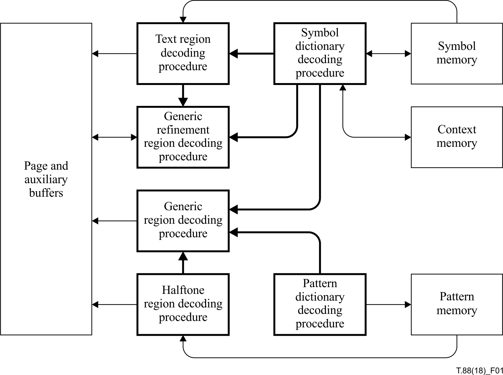

Figure 1 – Block diagram of major decoder components

The resources required to decode any given JBIG2 bitstream depend on the complexity of that bitstream. Some techniques such as striping can be used to reduce decoder memory requirements. It is estimated that a full-featured decoder may need two full-page buffers, plus about the same amount of dictionary memory, plus about 100 kilobytes of arithmetic coding context memory, to decode most bitstreams.

A buffer is a representation of a bitmap. A buffer is intended to hold a large amount of data, typically the size of a page. A buffer may contain the description of a region or of an entire page. Even if the buffer describes only a region, it has information associated with it that specifies its placement on the page. Decoding a region segment modifies the contents of a buffer.

There is one special buffer, the *page buffer*. It is intended that the decoder accumulate region data directly in the page buffer until the page has been completely decoded; then the data can be sent to an output device or file. Decoding an *immediate* region segment modifies the contents of the page buffer. The usual way of preparing a page is to decode one or more immediate region segments, each one modifying the page buffer. The decoder may output an incomplete page buffer, either as part of progressive transmission or in response to user input. Such output is optional, and its content is not specified by this Recommendation \| International Standard.

All other buffers are auxiliary buffers. It is intended that the decoder fill an auxiliary buffer, then later use it to refine the page buffer. In an application, it will often be unnecessary to have any auxiliary buffers. Decoding an *intermediate* region segment modifies the contents of an auxiliary buffer. The decoder may use auxiliary buffers to output pages other than those found in a complete page buffer, either as part of progressive transmission or in response to user input. Such output is optional, and its content is not specified by this Recommendation \| International Standard.

A symbol dictionary consists of an indexed set of bitmaps. The bitmaps in a dictionary are typically small, approximately the size of text characters. Unlike a buffer, a bitmap in a dictionary does not have page location information associated with it.

### 0.1.5 Decoding results

Decoding a segment involves invocation of one or more decoding procedures. The decoding procedures to be invoked are determined by the segment type.

The result of decoding a region segment is a bitmap stored in a buffer, possibly the page buffer. Decoding a region segment may fill a new buffer, or may modify an existing buffer. In typical applications, placing the data into a buffer involves changing pixels from the background colour to the foreground colour, but this Recommendation \| International Standard specifies other permissible ways of changing a buffer's pixels.

A typical page will be described by one or more immediate region segments, each one resulting in modification of the page buffer.

Just as it is possible to specify a new symbol in a dictionary by refining a previously specified symbol, it is also possible to specify a new buffer by refining an existing buffer. However, a region may be refined only by the generic refinement decoding procedure. Such a refinement does not make use of the internal structure of the region in the buffer being refined. After a buffer has been refined, the original buffer is no longer available.

The result of decoding a dictionary segment is a new dictionary. The symbols in the dictionary may later be placed into a buffer by the text region decoding procedure.

### 0.1.6 Decoding procedures

The *generic region decoding procedure* fills or modifies a buffer directly, pixel-by-pixel if arithmetic coding is being used, or by runs of foreground and background pixels if MMR and Huffman coding are being used. In the arithmetic coding case, the prediction context contains only pixels determined by data already decoded within the current segment.

The *generic refinement region decoding procedure* modifies a buffer pixel-by-pixel using arithmetic coding. The prediction context uses pixels determined by data already decoded within the current segment as well as pixels already present either in the page buffer or in an auxiliary buffer.

The *text region decoding procedure* takes symbols from one or more symbol dictionaries and places them in a buffer. This procedure is invoked during the decoding of a text region segment. The text region segment contains the position and index information for each symbol to be placed in the buffer; the bitmaps of the symbols are taken from the symbol dictionaries.

The *symbol dictionary decoding procedure* creates a symbol dictionary, that is, an indexed set of symbol bitmaps. A bitmap in the dictionary may be coded directly; it may be coded as a refinement of a symbol already in a dictionary; or it may be coded as an aggregation of two or more symbols already in dictionaries. This decoding procedure is invoked during the decoding of a symbol dictionary segment.

The *halftone region decoding procedure* takes patterns from a pattern dictionary and places them in a buffer. This procedure is invoked during the decoding of a halftone region segment. The halftone region segment contains the position information for all the patterns to be placed in the buffer, as well as index information for the patterns themselves. The patterns, the fixed-size bitmaps of the halftone, are taken from the halftone dictionaries.

The *pattern dictionary decoding procedure* creates a dictionary, that is, an indexed set of fixed-size bitmaps (patterns). The bitmaps in the dictionary are coded directly and jointly. This decoding procedure is invoked during the decoding of a pattern dictionary segment.

The *control decoding procedure* decodes segment headers, which include segment type information. The segment type determines which decoding procedure must be invoked to decode the segment. The segment type also determines where the decoded output from the segment will be placed. The segment reference information, also present in the segment header and decoded by the control decoding procedure, determines which other segments must be used to decode the current segment. The control decoding procedure affects everything shown in Figure 1, and so is not shown there as a separate block.

Table 1 summarizes the types of data being decoded, which decoding procedure is responsible for decoding them, and what the final representations of the decoded data are.

Table 1 – Entities in the decoding process

<table style="width:99%;">
<colgroup>
<col style="width: 15%" />
<col style="width: 30%" />
<col style="width: 30%" />
<col style="width: 24%" />
</colgroup>
<tbody>
<tr>
<td>Concept</td>
<td>JBIG2 
bitstream entity</td>
<td>JBIG2 
decoding entity</td>
<td>Physical 
representation</td>
</tr>
<tr>
<td>Document</td>
<td>JBIG2 file</td>
<td>JBIG2 decoder</td>
<td>Output medium or device</td>
</tr>
<tr>
<td>Page</td>
<td>Collection of segments</td>
<td>Implicit in control decoding procedure</td>
<td>Page buffer</td>
</tr>
<tr>
<td>Region</td>
<td>Region segment</td>
<td>Region decoding procedure</td>
<td>Page buffer or auxiliary buffer</td>
</tr>
<tr>
<td>Dictionary</td>
<td>Dictionary segment</td>
<td>Dictionary decoding procedure</td>
<td>List of symbols</td>
</tr>
<tr>
<td>Character</td>
<td>Field within a symbol dictionary segment</td>
<td>Symbol dictionary decoding procedure</td>
<td>Symbol bitmap</td>
</tr>
<tr>
<td>Gray-scale value</td>
<td>Field within a halftone dictionary segment</td>
<td>Pattern dictionary decoding procedure</td>
<td>Pattern</td>
</tr>
</tbody>
</table>

## 0.2 Lossy coding

This Recommendation \| International Standard does not define how to control lossy coding of bi-level images. Rather it defines how to perform perfect reconstruction of a bitmap that the encoder has chosen to encode. If the encoder chooses to encode a bitmap that is different than the original, the entire process becomes one of lossy coding. The different coding methods allow for different methods of introducing loss in a profitable way.

### 0.2.1 Symbol coding

Lossy symbol coding provides a natural way of doing lossy coding of text regions. The idea is to allow small differences between the original symbol bitmap and the one indexed in the symbol dictionary. Compression gain is effected by not having to code a large dictionary and, afterwards, by having a cheap symbol index coding as a consequence of the smaller dictionary. It is up to the encoder to decide when two bitmaps are essentially the same or essentially different. This technique was first described in \[1\].

The hazard of lossy symbol coding is to have *substitution errors*, that is, to have the encoder replace a bitmap corresponding to one character by a bitmap depicting a different character, so that a human reader misreads the character. The risk of substitution errors can be reduced by using intricate measures of difference between bitmaps and/or by making sure that the critical pixels of the indexed bitmap are correct. One way to control this, described in \[5\], is to index the possibly wrong symbol and then to apply refinement coding to that symbol bitmap. The idea is to encode the basic character shape at little cost, then correct pixels that the encoder believes alter the meaning of the character.

The process of beneficially introducing loss in textual regions may also take simpler forms such as removing flyspecks from documents or regularizing edges of letters. Most likely such changes will lower the code length of the region without affecting the general appearance of the region – possibly even improving the appearance.

A number of examples of performing this sort of lossy symbol coding with JBIG2 can be found in \[7\].

NOTE – Although the term "text region" is used for regions of the page coded using symbol coding, other possible uses of symbol coding include coding line-art and other non-textual data.

### 0.2.2 Generic coding

To effect near-lossless coding using generic coding, the encoder applies a preprocess to an original image and encodes the changed image losslessly. The difficulties are to ensure that the changes result in a lower code length and that the quality of the changed image does not suffer badly from the changes. Two possible preprocesses are given in \[11\]. These preprocesses flip pixels that, when flipped, significantly lower the total code length of the region, but can be flipped without seriously impairing the visual quality. The preprocesses provide for effective near-lossless coding of periodic halftones and for a moderate gain in compression for other data types. The preprocesses are not well-suited for error diffused images and images dithered with blue noise as perceptually lossless compression will not be achieved at a significantly lower rate than the lossless rate.

### 0.2.3 Halftone coding

Halftone coding is the natural way to obtain very high compression for *periodic* halftones, such as clustered-dot ordered dithered images. In contrast to lossy generic coding as described above, halftone coding does not intend to preserve the original bitmap, although this is possible in special cases. Loss can also be introduced for additional compression by not putting all the patterns of the original image into the dictionary, thereby reducing both the number of halftone patterns and the number of bits required to specify which pattern is used in which location.

For lossy coding of error diffused images and images dithered with blue noise, it is advisable to use halftone coding with a small grid size. A reconstructed image will lack fine details and may display blockiness but will be clearly recognizable. The blockiness may be reduced on the decoder side in a postprocess; for instance, by using other reconstruction patterns than those that appear in the dictionary. Error diffused images may also be coded losslessly, or with controlled loss as described above, using generic coding.

More details on performing this halftone coding can be found in \[12\].

### 0.2.4 Consequences of inadequate segmentation

In order to obtain optimum coding, both in terms of quality and file size, the correct form of encoding should be used for the appropriate regions of the document pages. This subclause briefly describes the consequences of errors in this segmentation.

Using lossy symbol coding for a document containing both text and halftone data will result in poor compression. Depending on the encoder, the quality of the halftone data may be good or bad. Using the form of lossy symbol coding described in \[5\], the visual quality will probably not suffer.

Using lossy generic coding (using the preprocesses given in \[11\]) for a document containing both symbol and halftone data usually results in good quality and moderate compression.

Line art and regions of handwritten text may be coded efficiently using generic coding, but depending on the encoder, these types of regions can also be very effectively coded with symbol coding.

INTERNATIONAL STANDARD

ITU-T RECOMMENDATION

Information technology – Lossy/lossless coding of bi-level images

# 1 Scope

This Recommendation \| International Standard[^1] defines methods for coding bi-level images and sets of images (documents consisting of multiple pages). It is particularly suitable for bi-level images consisting of text and dithered (halftone) data.

The methods defined permit lossless (bit-preserving) coding, lossy coding, and progressive coding. In progressive coding, the first image is lossy; subsequent images may be lossy or lossless.

This Recommendation \| International Standard also defines file formats to enclose the coded bi-level image data.

# 2 Normative references

The following Recommendations and International Standards contain provisions which, through references in this text, constitute provisions of this Recommendation \| International Standard. At the time of publication, the editions indicated were valid. All Recommendations and Standards are subject to revision, and parties to agreements based on this Recommendation \| International Standard are encouraged to investigate the possibility of applying the most recent edition of the Recommendations and Standards listed below. Members of IEC and ISO maintain registers of currently valid International Standards. The Telecommunication Standardization Bureau of ITU maintains a list of the currently valid ITU-T Recommendations.

– Recommendation ITU-T T.6 (1988), *Facsimile coding schemes and coding control functions for Group 4 facsimile apparatus*.

– Recommendation ITU-T T.45 (2000), *Run-length colour encoding*.

– ISO/IEC 8859-1:1998, *Information technology – 8-bit single-byte coded graphic character sets – Part 1: Latin alphabet No. 1*.

– ISO/IEC 10646:2017, *Information technology – Universal Coded Character Set (UCS)*.

# 3 Definitions

For the purposes of this Recommendation \| International Standard, the following definitions apply.

**3.1 adaptive template pixel(s)**: Special pixel(s), in a template, whose location is not fixed.

**3.2 aggregation**: Joining or merging of several individual symbols into a new symbol.

**3.3 bi-level image**: Rectangular array of bits.

**3.4 bit**: Binary digit, representing the value **0** or **1**.

**3.5 bitmap**: Bi-level image.

**3.6 buffer**: Storage area used to hold a bitmap.

**3.7 byte**: Eight bits of data.

**3.8 combination operator**: Operator used to combine the prior contents of a bitmap with new values being drawn into that bitmap.

**3.9 coordinate system**: Numbering system for two-dimensional locations where locations are labelled by two numbers, the first one increasing from left to right and the second one increasing from top to bottom.

**3.10 delta S**: Difference in the S coordinates between two successive symbol instances in a non-empty strip.

**3.11 delta T**: Difference in the T coordinates between two successive non-empty strips.

**3.12 decoding procedure**: Component of a decoder that decodes a certain type of data.

**3.12.1 integer decoding procedure**: Decoding procedure whose output on each invocation is a single value.

**3.12.2 arithmetic integer decoding procedure**: Integer decoding procedure that uses arithmetic entropy decoding.

**3.12.3 region decoding procedure**: Decoding procedure whose output is a bitmap.

**3.12.4 generic region decoding procedure**: Region decoding procedure that operates by decoding pixels individually or in runs.

**3.12.5 generic refinement region decoding procedure**: Region decoding procedure that operates by modifying a reference bitmap to produce an output bitmap.

**3.12.6 gray-scale decoding procedure**: Decoding procedure whose output is a gray-scale image.

**3.12.7 pattern dictionary decoding procedure**: Decoding procedure whose output is a list of patterns.

**3.12.8 halftone region decoding procedure**: Region decoding procedure that operates by drawing a set of patterns into a bitmap, placing the patterns according to a halftone grid.

**3.12.9 Huffman table decoding procedure**: Decoding procedure whose output is a Huffman table.

**3.12.10 text region decoding procedure**: Region decoding procedure that operates by drawing a set of symbol instances into a bitmap.

**3.12.11 symbol dictionary decoding procedure**: Decoding procedure whose output is a list of symbols.

**3.13 decoder**: Entity capable of decoding a bitstream in conformance with this Recommendation \| International Standard.

**3.14 dictionary**: List of bitmaps.

**3.14.1 pattern dictionary**: List of patterns.

**3.14.2 symbol dictionary**: List of symbols.

**3.15 export flag**: Bit indicating that a symbol is on the export list of a symbol dictionary.

**3.16 export list**: List of the symbols in a symbol dictionary that may be used by referring to that symbol dictionary.

**3.17 gray-scale image**: Rectangular array of non-negative integer indices.

**3.18 gray-scale pixel**: Integer-valued element in a gray-scale image.

**3.19 halftone grid**: Rectilinear grid of locations specifying where patterns are to be drawn.

**3.20 height class**: Set of symbols in a symbol dictionary whose heights are all equal.

**3.21 height class delta height**: Difference in height between two height classes.

**3.22 height class delta width**: Difference in width between two symbols in a height class.

**3.23 Huffman table**: Collection of table lines specifying how values are encoded.

**3.24 lossless coding**: Method of encoding data so that the decoded data are identical to the original data.

**3.25 lossy coding**: Method of encoding data so that the decoded data differ, ideally only in insignificant ways, from the original data.

**3.26 ordinal**: Value used as a counter.

**3.27 out-of-band value**: Non-numeric value that may be produced in place of an integer.

**3.28 pattern**: Bitmap produced by a pattern dictionary decoding procedure.

**3.29 pixel**: Element with **0** or **1** as its value in a bitmap.

**3.30 prefix length**: Length of the Huffman code prefix in a table line.

**3.31 range length**: Number of additional code bits in a table line.

**3.32 reference bitmap**: Bitmap used as the reference plane during the refinement region decoding procedure.

**3.33 referred-to segment**: Other segment required in order to decode the current segment.

**3.34 region**: Bitmap produced by a region decoding procedure.

**3.35 segment**: Segment header and its segment data.

**3.36 strip**: Full-width or full-height portion of the coordinate system of a text region.

**3.36.1 empty strip**: Strip containing the reference corners of no symbol instances.

**3.36.2 non-empty strip**: Strip containing the reference corner of at least one symbol instance.

**3.37 strip size**: Extent in pixels of the non-full dimension of a strip.

**3.38 symbol**: Bitmap produced by a symbol dictionary decoding procedure.

**3.39 symbol ID**: Integer used to identify a symbol or to index into an array of symbols to retrieve the symbol.

**3.40 symbol instance**: Symbol drawn, possibly with refinement, at a particular location in a text region.

**3.41 symbol instance refinement delta height**: Difference in height between a symbol instance's reference bitmap and the bitmap produced by the generic refinement region decoding procedure.

**3.42 symbol instance refinement delta width**: Difference in width between a symbol instance's reference bitmap and the bitmap produced by the generic refinement region decoding procedure.

**3.43 symbol instance refinement delta X:** Difference between the X coordinates of the top left corners of a symbol instance's reference bitmap and the bitmap produced by the generic refinement region decoding procedure.

**3.44 symbol instance refinement delta Y**: Difference between the Y coordinates of the top left corners of a symbol instance's reference bitmap and the bitmap produced by the generic refinement region decoding procedure.

**3.45 table line**: Specification of the encoding of a single value or a range of values as a Huffman code prefix followed by a fixed number of additional code bits.

**3.46 typical prediction**: Method of signalling that an entire row of a generic region is identical to the preceding row.

**3.47 value**: Integer or out-of-band indicator that is decoded.

# 4 Symbols and abbreviations

NOTE – Due to ISO nomenclature requirements, within the context of clause 4, the term "symbol" is locally used to mean a variable name.

## 4.1 Abbreviations

For the purposes of this Recommendation \| International Standard, the following abbreviations apply.

AT Adaptive Template

EOFB End-of-Facsimile Block

ID Identifier

LPS Less Probable Symbol, i.e., less probable binary value

LSB Least Significant Bit

MMR Modified Modified READ

MPS More Probable Symbol, i.e., more probable binary value

MSB Most Significant Bit

OOB Out-of-Band

READ Relative Element Address Designate

TPGD Typical prediction for generic direct bitmap coding

TPGR Typical prediction for generic refinement bitmap coding

NOTE – The term "symbol" in the abbreviations LPS and MPS does not refer to the symbols (bitmaps) in this Recommendation \| International Standard. The LPS and MPS abbreviations are used despite this because they are the generally-accepted terminology in arithmetic coding.

## 4.2 Symbol definitions

The symbols used in this Recommendation \| International Standard are listed below. A convention is used that parameters to any of the decoding procedures that are used in this Recommendation \| International Standard are indicated in **bold face**.

A Probability interval

*a* A real number

ARR An array

A1, A2, A3, A4, A5, A6, A7, A8, A9, A10, A11, A12

Adaptive template pixels in the generic region decoding procedure

B Current byte of arithmetically-coded data

B1 Byte of arithmetically-coded data following the current byte

*BHC* A height class collective bitmap in a symbol dictionary decoding procedure

*BHDC* A dictionary collective bitmap in a pattern dictionary decoding procedure

*BP* A pattern bitmap in a pattern dictionary decoding procedure

*BS* A symbol bitmap in a symbol dictionary decoding procedure

*BM* A bitmap

BP Pointer to byte B

BPST Initial value of BP

C Value of bitstream in code register

Chigh High-order 16 bits of C

Clow Low-order 16 bits of C

**COLEXTFLAG** A parameter indicating whether the generic region segment is extended to represent a coloured bitmap

CONTEXT The values of the pixels in a template used in the generic or generic refinement decoding procedure

**CPCOMPLEN** The length (in bytes) of each component's value

CPDEFCOLS The default colour set

CPEXCOLS The colours defined in the colour palette segment

**CPNCOMP** The number of colour components

**CPNVALS** The number of colour values coded in this segment

CT Renormalization shift counter

CURCODE The Huffman code for the current table line in a Huffman table

CUREXFLAG The current export flag

CURLEN The current table line prefix length in a Huffman table

CURRANGELOW The lower bound of the range of the current table line in a Huffman table

CURS The current S coordinate in a text region decoding procedure

CURT The current symbol instance's T coordinate relative to the current strip's T coordinate in a text region decoding procedure

CX A label identifying an arithmetic coding context

D Arithmetic coding decision

DFS The difference in S coordinates between the first instances of two strips

DT The number of empty strips between two non-empty strips

DW The difference in width between two symbol bitmaps in a symbol dictionary decoding procedure

EXFLAGS An array of export flags

EXINDEX An index for the array EXFLAGS

EXRUNLENGTH The length of a run of identical export flag values

EXTTEMPLATE A parameter indicating whether extended reference template is used in a generic region decoding  
procedure

FIRSTS The first S coordinate of the current strip

FIRSTCODE The first code assigned to a particular prefix length in a Huffman table

**GBATX1** The X location of adaptive template pixel 1 in a generic region decoding procedure

**GBATY1** The Y location of adaptive template pixel 1 in a generic region decoding procedure

**GBATX2** The X location of adaptive template pixel 2 in a generic region decoding procedure

**GBATY2** The Y location of adaptive template pixel 2 in a generic region decoding procedure

**GBATX3** The X location of adaptive template pixel 3 in a generic region decoding procedure

**GBATY3** The Y location of adaptive template pixel 3 in a generic region decoding procedure

**GBATX4** The X location of adaptive template pixel 4 in a generic region decoding procedure

**GBATY4** The Y location of adaptive template pixel 4 in a generic region decoding procedure

**GBATX5** The X location of adaptive template pixel 5 in a generic region decoding procedure

**GBATY5** The Y location of adaptive template pixel 5 in a generic region decoding procedure

**GBATX6** The X location of adaptive template pixel 6 in a generic region decoding procedure

**GBATY6** The Y location of adaptive template pixel 6 in a generic region decoding procedure

**GBATX7** The X location of adaptive template pixel 7 in a generic region decoding procedure

**GBATY7** The Y location of adaptive template pixel 7 in a generic region decoding procedure

**GBATX8** The X location of adaptive template pixel 8 in a generic region decoding procedure

**GBATY8** The Y location of adaptive template pixel 8 in a generic region decoding procedure

**GBATX9** The X location of adaptive template pixel 9 in a generic region decoding procedure

**GBATY9** The Y location of adaptive template pixel 9 in a generic region decoding procedure

**GBATX10** The X location of adaptive template pixel 10 in a generic region decoding procedure

**GBATY10** The Y location of adaptive template pixel 10 in a generic region decoding procedure

**GBATX11** The X location of adaptive template pixel 11 in a generic region decoding procedure

**GBATY11** The Y location of adaptive template pixel 11 in a generic region decoding procedure

**GBATX12** The X location of adaptive template pixel 12 in a generic region decoding procedure

**GBATY12** The Y location of adaptive template pixel 12 in a generic region decoding procedure

GB The prefix used for many of the variables associated with a generic (bitmap) region decoding procedure

GBCOLS An array containing the colours used in a generic region segment

**GBCOMBOP** The combination operator used in a generic region decoding procedure

GBFGCOLID The 4-byte integer indicating the foreground colour of the generic region segment

**GBH** The height of a generic region

GBREG The region produced by a generic region decoding procedure

**GBTEMPLATE** A parameter indicating the number and arrangement of the pixels in a template used in a generic region decoding procedure

**GBW** The width of a generic region

GI An array of gray-scale values

GR The prefix used for many of the variables associated with a generic refinement region decoding procedure

**GRATX1** The X location of adaptive template pixel 1 in a generic refinement region decoding procedure

**GRATY1** The Y location of adaptive template pixel 1 in a generic refinement region decoding procedure

**GRATX2** The X location of adaptive template pixel 2 in a generic refinement region decoding procedure

**GRATY2** The Y location of adaptive template pixel 2 in a generic refinement region decoding procedure

GRAY The current gray-scale value

**GRAYMAX** The largest gray-scale value for which a pattern is given in a pattern dictionary decoding procedure

**GRH** The height of a generic region being coded with refinement coding

**GRREFERENCE** The reference bitmap in a generic refinement region decoding procedure

**GRREFERENCEDX** The X offset of the reference bitmap with respect to the bitmap being decoded in a generic refinement region decoding procedure

**GRREFERENCEDY** The Y offset of the reference bitmap with respect to the bitmap being decoded in a generic refinement region decoding procedure

GRREG The region produced by a generic refinement region decoding procedure

**GRTEMPLATE** A parameter indicating the number and arrangement of the pixels in a template used in decoding a generic region with refinement coding

**GRW** The width of a generic region being coded with refinement coding

GS The prefix used for many of the variables associated with a gray-scale image decoding procedure

**GSBPP** The number of bits per gray-scale value in a gray-scale image decoding procedure

**GSH** The height of the gray-scale image in a gray-scale image decoding procedure

**GSKIP** A mask indicating gray-scale values to be skipped

**GSMMR** Whether MMR is used in a gray-scale image decoding procedure

**GSTEMPLATE** A parameter indicating the number and arrangement of the pixels in a template used in a gray‑scale image decoding procedure

**GSUSESKIP** Whether some gray-scale values should be skipped in a gray-scale image decoding procedure

GSVALS A decoded gray-scale image

**GSW** The width of the gray-scale image in a gray-scale image decoding procedure

HB The prefix used for many of the variables associated with a halftone (bitmap) region decoding procedure

**HBH** The height of a halftone region

HBPP The number of bits per value in an array of gray-scale values

**HBW** The width of a halftone region

HCHEIGHT The height of the current height class in a symbol dictionary decoding procedure

HCDH The difference in height between two height classes in a symbol dictionary decoding procedure

HCFIRSTSYM The index of the first symbol decoded in a height class

**HCOMBOP** The combination operator used in a halftone region decoding procedure

HD The prefix used for many of the variables associated with a pattern dictionary region decoding procedure

**HDEFPIXEL** The default for pixels in a halftone region

**HDMMR** Whether MMR is used in a pattern dictionary decoding procedure

**HDPATS** Array of patterns produced by a pattern dictionary decoding procedure

**HDPH** The height of the patterns in a pattern dictionary

**HDPW** The width of the patterns in a pattern dictionary

**HDTEMPLATE** The template identifier used to decode patterns in a pattern dictionary decoding procedure

**HENABLESKIP** Whether unneeded gray-scale values are skipped in a halftone region decoding procedure

**HGH** The height of the gray-scale image in a halftone region decoding procedure

**HGW** The width of the gray-scale image in a halftone region decoding procedure

**HGX** The horizontal offset of the grid in a halftone region decoding procedure

**HGY** The vertical offset of the grid in a halftone region decoding procedure

*HI* The height of a symbol instance bitmap

HIGHPREFLEN The prefix length of the upper range table line in a Huffman table

**HMMR** Whether MMR coding is used in a halftone region decoding procedure

**HNUMPATS** The number of patterns that may be used in a halftone region decoding procedure

*HOI* The height of the original bitmap of a symbol instance containing refinement information

**HPATS** Array of patterns used in a halftone region

**HPH** The height of each pattern in a halftone region

**HPW** The width of each pattern in a halftone region

**HRX** The horizontal coordinate of a halftone grid vector

**HRY** The vertical coordinate of a halftone grid vector

HSKIP A mask indicating gray-scale values to be skipped

HT The prefix used for many of the variables associated with a Huffman table decoding procedure

**HTEMPLATE** A parameter indicating the number and arrangement of the pixels in a template used in a halftone region decoding procedure

HTHIGH One greater than the largest value that is represented by any normal table line in a Huffman table

HTLOW The lowest value that is represented by any normal table line in a Huffman table

HTOFFSET The range offset of a table line when decoding using a Huffman table

HTOOB Whether a Huffman table can produce the out-of-band value OOB

HTPS The length of the encoded prefix field in a table line in a Huffman table

HTREG The region produced by a halftone region decoding procedure

HTRS The length of the encoded range field in a table line in a Huffman table

HTVAL The value decoded using a Huffman table rappeller

I The array, indexed by CX, of the indices of the adaptive probability estimates

*I* An array index

IAAI An arithmetic integer decoding procedure used to decode the number of symbol instances in an aggregation

IADH An arithmetic integer decoding procedure used to decode the difference in height between two height classes

IADS An arithmetic integer decoding procedure used to decode the S coordinate of the second and subsequent symbol instances in a strip

IADT An arithmetic integer decoding procedure used to decode the T coordinate of the second and subsequent symbol instances in a strip

IADW An arithmetic integer decoding procedure used to decode the difference in delta width between two symbols in a height class

IAEX An arithmetic integer decoding procedure used to decode export flags

IAFS An arithmetic integer decoding procedure used to decode the S coordinate of the first symbol instance in a strip

IAID An arithmetic integer decoding procedure used to decode the symbol IDs of symbol instances

IARDH An arithmetic integer decoding procedure used to decode the delta height of symbol instance refinements

IARDW An arithmetic integer decoding procedure used to decode the delta width of symbol instance refinements

IARDX An arithmetic integer decoding procedure used to decode the delta X values of symbol instance refinements

IARDY An arithmetic integer decoding procedure used to decode the delta Y values of symbol instance refinements

IARI An arithmetic integer decoding procedure used to decode the *RI* bit of symbol instances

IAIT An arithmetic integer decoding procedure used to decode the T coordinate of the symbol instances in a strip

*IBI* The bitmap of a symbol instance

*IBOI* The original bitmap of a symbol instance containing refinement information

*IDI* The symbol ID of a symbol instance

IDS The delta S value for a symbol instance in a text region decoding procedure

*J* An array index

K The ordinal for a referred-to segment

LENCOUNT A histogram of the prefix lengths in a Huffman table

LENMAX The largest prefix length in a Huffman table

LOGSBSTRIPS The base-2 logarithm of the strip size used to encode a text region

LOWPREFLEN The prefix length of the lower range table line in a Huffman table

LTP Whether the current line is coded explicitly in a generic region decoding procedure or a generic refinement region decoding procedure

*mg* Horizontal index for the current gray-scale value

**MMR** Whether MMR coding is used in a generic region decoding procedure

MPS The array, indexed by CX, of the current more probable binary values

NINSTANCES A symbol instance counter

*ng* Vertical index for the current gray-scale value

NLPS The next index for an LPS renormalization

NMPS The next index for an MPS renormalization

NSYMSDECODED The number of symbols decoded so far in a symbol dictionary decoding procedure

NTEMP The number of table lines in a Huffman table

OOB An out-of-band value

P The page with which a segment is associated

PREFLEN An array of prefix lengths representing the table lines in a Huffman table

Qe An estimate of the LPS probability

r A segment retention flag

R The number of segments referred to by some segment

RANGELEN An array of the lengths of the ranges of the table lines in a Huffman table

RANGELOW An array of the lower bounds of the ranges of the table lines in a Huffman table

RA1, RA2 Adaptive template pixels in the generic refinement region decoding procedure

*RDHI* The delta height of a symbol instance refinement bitmap

*RDWI* The delta width of a symbol instance refinement bitmap

*RDXI* The X offset of a symbol instance refinement

*RDYI* The Y offset of a symbol instance refinement

REFAGGNINST The number of symbol instances in an aggregation

*RI* A bit indicating whether refinement information is present for a symbol instance

**REFCORNER** Which corner of a symbol instance bitmap is to be used as a reference in a text region decoding procedure

S One coordinate of the coordinate system used in a text region decoding procedure

*SI* The S coordinate of a symbol instance

SB The prefix used for many of the variables associated with a symbol (bitmap) region decoding procedure

**SBCOLS** An array of colours used in a text region segment

SBCOLSECTSIZE The colour section length

**SBDSOFFSET** An offset for the coded delta S values in a text region

**SBCOMBOP** The combination operator used in a text region decoding procedure

**SBDEFPIXEL** The default for pixels in a text region

SBFGCOLID The three 1-byte integers indicating the foreground colour of the text region segment

**SBH** The height of a text region

**SBHUFF** Whether Huffman coding is used in a text region decoding procedure

**SBHUFFDS** The Huffman table used to decode the S coordinate of subsequent symbol instances in a strip

**SBHUFFDT** The Huffman table used to decode the difference in T coordinates between non-empty strips

**SBHUFFFS** The Huffman table used to decode the S coordinate of the first symbol instance in a strip

**SBHUFFRDH** The Huffman table used to decode the difference between a symbol's height and the height of a refinement coded symbol instance bitmap

**SBHUFFRDW** The Huffman table used to decode the difference between a symbol's width and the width of a refinement coded symbol instance bitmap

**SBHUFFRDX** The Huffman table used to decode the difference between a symbol instance's X coordinate and the X coordinate of a refinement coded bitmap

**SBHUFFRDY** The Huffman table used to decode the difference between a symbol instance's Y coordinate and the Y coordinate of a refinement coded symbol instance bitmap

**SBHUFFRSIZE** The Huffman table used to decode the size of a symbol instance's refinement bitmap data

**SBNUMINSTANCES** The number of symbol instances in a text region

**SBNUMSYMS** The number of symbols that may be used in a text region

**SBRATX1** The X location of the adaptive template pixel RA1 in a text region decoding procedure

**SBRATY1** The Y location of the adaptive template pixel RA1 in a text region decoding procedure

**SBRATX2** The X location of the adaptive template pixel RA2 in a text region decoding procedure

**SBRATY2** The Y location of the adaptive template pixel RA2 in a text region decoding procedure

**SBREFINE** Whether refinement coding is used in a text region decoding procedure

SBREG The region produced by a text region decoding procedure

**SBRTEMPLATE** Template identifier for refinement coding of bitmap in a text region decoding procedure

**SBSTRIPS** The height of the symbol instance strips

**SBSYMCODELEN** The length of the symbol codes used in IAID

**SBSYMCODES** An array of variable-length codes identifying individual symbols

**SBSYMS** An array of symbols used in a text region

**SBW** The width of a text region

SD The prefix used for many of the variables associated with a symbol dictionary region decoding procedure

**SDATX1** The X location of the adaptive template pixel A1 in a symbol dictionary decoding procedure

**SDATY1** The Y location of the adaptive template pixel A1 in a symbol dictionary decoding procedure

**SDATX2** The X location of the adaptive template pixel A2 in a symbol dictionary decoding procedure

**SDATY2** The Y location of the adaptive template pixel A2 in a symbol dictionary decoding procedure

**SDATX3** The X location of the adaptive template pixel A3 in a symbol dictionary decoding procedure

**SDATY3** The Y location of the adaptive template pixel A3 in a symbol dictionary decoding procedure

**SDATX4** The X location of the adaptive template pixel A4 in a symbol dictionary decoding procedure

**SDATY4** The Y location of the adaptive template pixel A4 in a symbol dictionary decoding procedure

SDEXSYMS The symbols exported from a symbol dictionary

**SDHUFF** Whether Huffman coding is used in a symbol dictionary decoding procedure

**SDHUFFAGGINST** The Huffman table used to decode the number of symbol instances in an aggregation in a symbol dictionary decoding procedure

**SDHUFFDH** The Huffman table used to decode the difference in height between two height classes in a symbol dictionary decoding procedure

**SDHUFFDW** The Huffman table used to decode the difference in width between two symbols in a symbol dictionary decoding procedure

**SDHUFFBMSIZE** The Huffman table used to decode the size of a height class collective bitmap in a symbol dictionary decoding procedure

**SDINSYMS** An array of symbols used as a parameter to a symbol dictionary decoding procedure

SDNEWSYMS The symbols decoded in a symbol dictionary

SDNEWSYMWIDTHS The widths of the symbols decoded in a symbol dictionary

**SDNUMEXSYMS** The number of symbols exported from a symbol dictionary

**SDNUMINSYMS** The number of symbols in the array that is used as a parameter to a symbol dictionary decoding procedure

**SDNUMNEWSYMS** The number of symbols generated in a symbol dictionary

**SDREFAGG** Whether refinement and aggregate coding are used in a symbol dictionary decoding procedure

**SDRATX1** The X location of the adaptive template pixel RA1 in a symbol dictionary decoding procedure

**SDRATY1** The Y location of the adaptive template pixel RA1 in a symbol dictionary decoding procedure

**SDRATX2** The X location of the adaptive template pixel RA2 in a symbol dictionary decoding procedure

**SDRATY2** The Y location of the adaptive template pixel RA2 in a symbol dictionary decoding procedure

**SDRTEMPLATE** Template identifier for refinement coding of bitmaps in a symbol dictionary decoding procedure

**SDTEMPLATE** The template identifier used to decode symbol bitmaps in a symbol dictionary decoding procedure

**SKIP** A mask of pixels to be skipped during the decoding of a generic region

SLTP A binary value indicating whether the current line was typically predicted and the previous line was not, or vice versa

STRIPT The numerically smallest T coordinate in the current strip

SWITCH Whether MPS and LPS are switched on an LPS renormalization

SYMWIDTH The current bitmap width in a symbol dictionary decoding procedure

T One coordinate of the coordinate system used in a text region decoding procedure

TEMPC A temporary register in the MQ coder

*TI* TheT coordinate of a symbol instance

TOTWIDTH The total width of the bitmaps in a height class

**TPGDON** Whether typical prediction is used in a generic region decoding procedure

**TPGRON** Whether typical prediction is used in a generic region refinement decoding procedure

TPGRPIX Whether the current pixel is to be decoded implicitly using a TPGR prediction

TPGRVAL The value of the TPGR-predicted current pixel

**TRANSPOSED** Whether the symbol instance coordinates are transposed in a text region decoding procedure

**USESKIP** Whether some pixels should be skipped in the decoding of a generic region

V1 A binary value

V2 A binary value

*WI* The width of a symbol instance bitmap

*WOI* The width of the original bitmap of a symbol instance containing refinement information

*x* The horizontal coordinate of a location on a halftone grid

X The horizontal coordinate of a pixel in a bitmap

*y* The vertical coordinate of a location on a halftone grid

Y The vertical coordinate of a pixel in a bitmap

## 4.3 Operator definitions

The following operators are defined:

OR If V1 and V2 are two binary values, then V1 OR V2 is equal to **0** if both V1 and V2 are **0**. It is equal to **1** if either of V1 or V2 is **1**. If V1 and V2 are two integer values, then it is the result of bitwise application of OR.

AND If V1 and V2 are two binary values, then V1 AND V2 is equal to **0** if either of V1 or V2 is **0**. It is equal to **1** if both V1 and V2 are **1**. If V1 and V2 are two integer values, then it is the result of bitwise application of AND.

XOR If V1 and V2 are two binary values, then V1 XOR V2 is equal to **0** if V1 and V2 are equal. It is equal to **1** if V1 and V2 differ. If V1 and V2 are two integer values, then it is the result of bitwise application of XOR.

XNOR If V1 and V2 are two binary values, then V1 XNOR V2 is equal to **0** if V1 and V2 differ. It is equal to **1** if V1 and V2 are equal.

REPLACE If V1 and V2 are two binary values, then V1 REPLACE V2 is equal to V2.

NOT If V1 is a binary value, then NOT V1 is **1** if V1 is **0**, and is **0** if V1 is **1**.

min If *x* and *y* are numbers, then min(*x*, *y*) is the smaller of *x* and *y*.

max If x and *y* are numbers, then max(*x*, *y*) is the larger of *x* and *y*.

  If a is a number, then *a* is the largest integer less than or equal to *a*.

  If a is a number, then *a* is the smallest integer greater than or equal to *a*.

\<\< If V1 and V2 are two integers, then V1 \<\< V2 is the value obtained by shifting the value of V1 leftwards by V2 bits, filling the rightmost V2 bits of the new value with **0**.

\>\> If V1 and V2 are two integers, then V1 \>\> V2 is the value obtained by shifting the value of V1 rightward by V2 bits, filling the leftmost V2 bits of the new value with **0**.

\>\> *A* If V1 and V2 are two integers, then V1 \>\> *A* V2 is the value obtained by shifting the value of V1 rightward by V2 bits, filling the leftmost V2 bits of the new value with **0** if V1 is non-negative and **1** if V1 is negative.

# 5 Conventions

## 5.1 Typographic conventions

All parameter names are given in **bold face**.

## 5.2 Binary notation

The two binary values are denoted as **0** and **1**.

## 5.3 Hexadecimal notation

The prefix 0x indicates that the following value is to be interpreted as a hexadecimal number (radix 16).

EXAMPLE – The value 0x6A is equal to the decimal value 106.

## 5.4 Integer value syntax

### 5.4.1 Bit packing

Bits are packed into bytes starting at the most significant bit. If a decoder is reading a sequence of bits out of a bitstream, it shall first read the most significant bit of the first byte, then the next most significant bit, and so on, then proceed to the next byte.

EXAMPLE – The sequence of bytes 0x2F 0x05 0xC1, if interpreted as a sequence of bits, is the sequence

**0 0 1 0 1 1 1 1 0 0 0 0 0 1 0 1 1 1 0 0 0 0 0 1**

### 5.4.2 Multi-byte values

All multi-byte values shall be interpreted in a most-significant-first manner: the first byte of each value is the most significant, and the last byte is the least significant.

EXAMPLE – The sequence of bytes 0x01 0x5C 0x99 0xFA, if interpreted as a four-byte value, represents the value 0x015C99FA.

### 5.4.3 Bit numbering

The least significant bit of any value is numbered bit 0. For a one-byte value, the most significant bit is numbered bit 7; for a two-byte value, the most significant bit is numbered bit 15; for a four-byte value, the most significant bit is numbered bit 31.

### 5.4.4 Signedness

Unless otherwise specified, all multi-bit values shall be treated as unsigned values. When a value is to be treated as a signed number, it shall be interpreted in two's-complement form.

## 5.5 Array notation and conventions

Arrays are numbered starting from zero.

EXAMPLE – A one-dimensional array ARR containing twelve elements has elements:

> ARR\[0\], ARR\[1\], . . . , ARR\[11\]

## 5.6 Image and bitmap conventions

A bitmap is a rectangular array. Every element in this array has the value **0** or **1**. An element in a bitmap is referred to as a pixel.

NOTE 1 – Throughout this Recommendation \| International Standard, pixels in bitmaps are treated as having the values **0** or **1**. In most applications of this Recommendation \| International Standard, the application will select some interpretation of these two values. A typical interpretation of these pixels is that **0** represents white, or background, and **1** represents black, or foreground. However, this is not a requirement of this Recommendation \| International Standard and applications are free to make other interpretations of these values.

The terms "left", "right", "top", "bottom", "width" and "height" are often applied to bitmaps. These terms do not refer to any physical aspect of the bitmap: if a bitmap is printed on paper, it may be printed with its "left" edge along any edge of the paper. They are used within this Recommendation \| International Standard to refer to the four edges of the bitmap as shown in Figure 2.

A pixel in a bitmap is referred to by a pair of coordinates X and Y, sometimes written as a pair (X, Y). The location (0, 0) represents the pixel in the top left corner. The X coordinate increases rightwards and the Y coordinate increases downwards.

If *BM* is a bitmap, then the pixel whose coordinates are X and Y is referred to as *BM*\[X, Y\].

NOTE 2 – These conventions are intended to make it easier to describe operations involving bitmaps, and are not intended to imply any physical characteristics of the image represented by the bitmap.

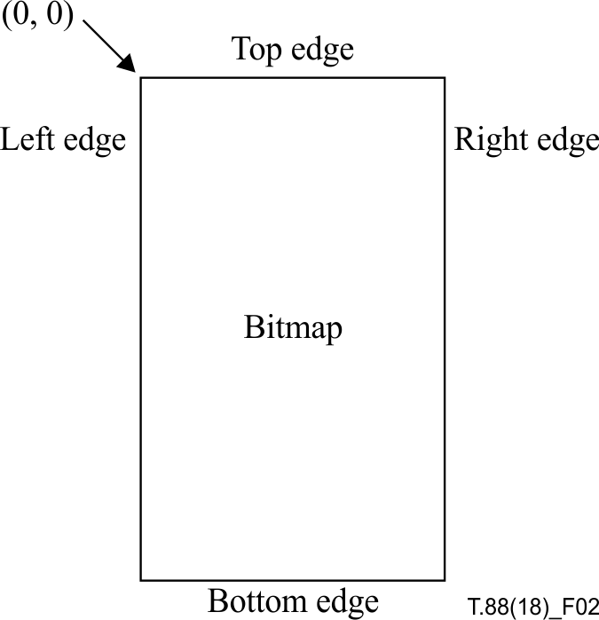

Figure 2 – The four edges of a bitmap

# 6 Decoding Procedures

## 6.1 Introduction to decoding procedures

This Recommendation \| International Standard makes use of a number of different decoding procedures for different types of data. Each of these decoding procedures produces a certain kind of data as output. The generic region decoding procedure, generic refinement region decoding procedure, halftone region decoding procedure, and text region decoding procedures all produce regions as their output. The symbol dictionary decoding procedure produces an array of symbols as its output. The pattern dictionary decoding procedure similarly produces an array of halftone cell bitmaps as its output.

The various region decoding procedures operate in different ways:

• The generic region decoding procedure decodes a bitmap, treating it simply as an array of binary pixels.

• The generic region refinement decoding procedure decodes a bitmap by treating it as an array of binary pixels, but coding each pixel with respect to some reference bitmap.

• The text region decoding procedure decodes a bitmap by drawing a collection of symbols into it, possibly applying the generic refinement region decoding procedure to each one.

• The halftone region decoding procedure decodes a bitmap by placing a collection of patterns into it, at locations specified by a halftone grid.

Each decoding procedure is specified in terms of a number of parameters and a sequence of operations, which are affected by the values of the parameters. These parameters are supplied to the decoding procedure for each invocation, and the same decoding procedure may be invoked multiple times during the course of decoding a bitstream, with different parameters each time.

Some of the decoding procedure parameters are unused in certain circumstances, usually depending on the values of other parameters. In these circumstances, no value needs to be specified for those unused parameters.

In this clause, subsequent clauses, and normative annexes, restrictions are placed on the bitstream being decoded.

EXAMPLE 1 – In 7.3, some segment types are described as "Reserved; must not be used."

EXAMPLE 2 – In 7.4.2.1.1, if the **SDHUFF** field is **0** then the **SDHUFFDH** field must contain the value **0**.

These restrictions should be interpreted as meaning that the behaviour of a decoder encountering a bitstream that does not satisfy the restrictions is undefined, and is outside the scope of this Recommendation \| International Standard.

NOTE – This means that if a decoder encounters a bitstream that does not satisfy the restrictions, it may take any action: it may give up and abort decoding; it may ignore the error and attempt to continue; it may interpret the error and change its behaviour (e.g., use the error to attempt to aid recovery from further errors); and so on.

## 6.2 Generic region decoding procedure

### 6.2.1 General description

This decoding procedure is used to decode a rectangular array of **0** or **1** values, which are coded one pixel at a time (i.e., it is used to decode a bitmap using simple, generic, coding). The decoding procedure also modifies an array of probability information which may be used by other invocations of this generic region decoding procedure.

The generic region decoding procedure may be based on sequential coding of the image pixels using arithmetic coding as specified in Annex E and a template to determine the coding state. This technique was used in Rec. ITU-T T.82 \| ISO/IEC 11544 (JBIG). This type of decoding is described in 6.2.5.

Alternatively, for improved speed but reduced compression the generic region decoding procedure may be based on Huffman coding of runs of pixels. This technique was used in the MMR (Modified Modified READ) algorithm described in Recommendation ITU-T T.6 (G4). This type of decoding is described in 6.2.6.

### 6.2.2 Input parameters

The parameters to this decoding procedure are shown in Table 2.

<table style="width:99%;">
<colgroup>
<col style="width: 20%" />
<col style="width: 10%" />
<col style="width: 7%" />
<col style="width: 9%" />
<col style="width: 50%" />
</colgroup>
<thead>
<tr>
<th colspan="5">Table 2 – Parameters for the generic region decoding procedure</th>
</tr>
<tr>
<th>Name</th>
<th>Type</th>
<th>Size 
(bits)</th>
<th>Signed?</th>
<th>Description and restrictions</th>
</tr>
</thead>
<tbody>
<tr>
<td><strong>MMR</strong></td>
<td>Integer</td>
<td>1</td>
<td>N</td>
<td>Whether MMR coding is used.</td>
</tr>
<tr>
<td><strong>GBW</strong></td>
<td>Integer</td>
<td>32</td>
<td>N</td>
<td>The width of the region.</td>
</tr>
<tr>
<td><strong>GBH</strong></td>
<td>Integer</td>
<td>32</td>
<td>N</td>
<td>The height of the region.</td>
</tr>
<tr>
<td><strong>GBTEMPLATE</strong></td>
<td>Integer</td>
<td>2</td>
<td>N</td>
<td>The template identifier.a)</td>
</tr>
<tr>
<td><strong>TPGDON</strong></td>
<td>Integer</td>
<td>1</td>
<td>N</td>
<td>Whether typical prediction is used. a)</td>
</tr>
<tr>
<td><strong>EXTTEMPLATE</strong></td>
<td>Integer</td>
<td>1</td>
<td>N</td>
<td>Whether extended reference template is used. e)</td>
</tr>
<tr>
<td><strong>USESKIP</strong></td>
<td>Integer</td>
<td><u>1</u></td>
<td><u>N</u></td>
<td>Whether some pixels should be skipped in the decoding.a)</td>
</tr>
<tr>
<td><strong>SKIP</strong></td>
<td colspan="3" style="text-align: center;">Bitmap</td>
<td>A bitmap indicating which pixels should be skipped. <strong>GBW</strong> pixels wide, <strong>GBH</strong> pixels high.c)</td>
</tr>
<tr>
<td><strong>GBATX1</strong></td>
<td>Integer</td>
<td>8</td>
<td>Y</td>
<td>The X location of the adaptive template pixel A1.a)</td>
</tr>
<tr>
<td><strong>GBATY1</strong></td>
<td>Integer</td>
<td>8</td>
<td>Y</td>
<td>The Y location of the adaptive template pixel A1.a)</td>
</tr>
<tr>
<td><strong>GBATX2</strong></td>
<td>Integer</td>
<td>8</td>
<td>Y</td>
<td>The X location of the adaptive template pixel A2.b)</td>
</tr>
<tr>
<td><strong>GBATY2</strong></td>
<td>Integer</td>
<td>8</td>
<td>Y</td>
<td>The Y location of the adaptive template pixel A2.b)</td>
</tr>
<tr>
<td><strong>GBATX3</strong></td>
<td>Integer</td>
<td>8</td>
<td>Y</td>
<td>The X location of the adaptive template pixel A3.b)</td>
</tr>
<tr>
<td><strong>GBATY3</strong></td>
<td>Integer</td>
<td>8</td>
<td>Y</td>
<td>The Y location of the adaptive template pixel A3.b)</td>
</tr>
<tr>
<td><strong>GBATX4</strong></td>
<td>Integer</td>
<td>8</td>
<td>Y</td>
<td>The X location of the adaptive template pixel A4.b)</td>
</tr>
<tr>
<td><strong>GBATY4</strong></td>
<td>Integer</td>
<td>8</td>
<td>Y</td>
<td>The Y location of the adaptive template pixel A4. b)</td>
</tr>
<tr>
<td><strong>GBATX5</strong></td>
<td>Integer</td>
<td>8</td>
<td>Y</td>
<td>The X location of the adaptive template pixel A5. d)</td>
</tr>
<tr>
<td><strong>GBATY5</strong></td>
<td>Integer</td>
<td>8</td>
<td>Y</td>
<td>The Y location of the adaptive template pixel A5. d)</td>
</tr>
<tr>
<td><strong>GBATX6</strong></td>
<td>Integer</td>
<td>8</td>
<td>Y</td>
<td>The X location of the adaptive template pixel A6. d)</td>
</tr>
<tr>
<td><strong>GBATY6</strong></td>
<td>Integer</td>
<td>8</td>
<td>Y</td>
<td>The Y location of the adaptive template pixel A6. d)</td>
</tr>
<tr>
<td><strong>GBATX7</strong></td>
<td>Integer</td>
<td>8</td>
<td>Y</td>
<td>The X location of the adaptive template pixel A7. d)</td>
</tr>
<tr>
<td><strong>GBATY7</strong></td>
<td>Integer</td>
<td>8</td>
<td>Y</td>
<td>The Y location of the adaptive template pixel A7. d)</td>
</tr>
<tr>
<td><strong>GBATX8</strong></td>
<td>Integer</td>
<td>8</td>
<td>Y</td>
<td>The X location of the adaptive template pixel A8. d)</td>
</tr>
<tr>
<td><strong>GBATY8</strong></td>
<td>Integer</td>
<td>8</td>
<td>Y</td>
<td>The Y location of the adaptive template pixel A8. d)</td>
</tr>
<tr>
<td><strong>GBATX9</strong></td>
<td>Integer</td>
<td>8</td>
<td>Y</td>
<td>The X location of the adaptive template pixel A9. d)</td>
</tr>
<tr>
<td><strong>GBATY9</strong></td>
<td>Integer</td>
<td>8</td>
<td>Y</td>
<td>The Y location of the adaptive template pixel A9. d)</td>
</tr>
<tr>
<td><strong>GBATX10</strong></td>
<td>Integer</td>
<td>8</td>
<td>Y</td>
<td>The X location of the adaptive template pixel A10. d)</td>
</tr>
<tr>
<td><strong>GBATY10</strong></td>
<td>Integer</td>
<td>8</td>
<td>Y</td>
<td>The Y location of the adaptive template pixel A10. d)</td>
</tr>
<tr>
<td><strong>GBATX11</strong></td>
<td>Integer</td>
<td>8</td>
<td>Y</td>
<td>The X location of the adaptive template pixel A11. d)</td>
</tr>
<tr>
<td><strong>GBATY11</strong></td>
<td>Integer</td>
<td>8</td>
<td>Y</td>
<td>The Y location of the adaptive template pixel A11. d)</td>
</tr>
<tr>
<td><strong>GBATX12</strong></td>
<td>Integer</td>
<td>8</td>
<td>Y</td>
<td>The X location of the adaptive template pixel A12. d)</td>
</tr>
<tr>
<td><strong>GBATY12</strong></td>
<td>Integer</td>
<td>8</td>
<td>Y</td>
<td>The Y location of the adaptive template pixel A12. d)</td>
</tr>
<tr>
<td><strong>GBCOLS</strong></td>
<td colspan="3">Array of colours (colour palette)</td>
<td>An array containing the colours used in this generic region.f)</td>
</tr>
<tr>
<td><strong>GBCOMBOP</strong></td>
<td colspan="3">Operator</td>
<td>The combination operator for this generic region. Shall take on the value REPLACE.f)</td>
</tr>
<tr>
<td><strong>COLEXTFLAG</strong></td>
<td>Integer</td>
<td>1</td>
<td>N</td>
<td>A parameter indicating whether the generic region segment is extended to represent coloured bitmap.</td>
</tr>
<tr>
<td colspan="5">
a) Unused if <strong>MMR = 1</strong>

b) Unused if <strong>MMR = 1</strong> or <strong>GBTEMPLATE ≠ 0</strong>

c) Unused if <strong>USESKIP = 0</strong> or <strong>MMR = 1</strong>

d) Used only if <strong>MMR = 0</strong> and <strong>GBTEMPLATE = 0</strong> and <strong>EXTTEMPLATE = 1</strong>

e) Used only if <strong>MMR = 0</strong> and <strong>GBTEMPLATE = 0</strong>

f) Unused if <strong>COLEXTFLAG = 0</strong>.
</td>
</tr>
</tbody>
</table>

### 6.2.3 Return value

The variable whose value is the result of this decoding procedure is shown in Table 3.

Table 3  – Return value from the generic region decoding procedure

<table style="width:99%;">
<colgroup>
<col style="width: 19%" />
<col style="width: 11%" />
<col style="width: 7%" />
<col style="width: 10%" />
<col style="width: 51%" />
</colgroup>
<tbody>
<tr>
<td>Name</td>
<td>Type</td>
<td>Size 
(bits)</td>
<td>Signed?</td>
<td>Description and restrictions</td>
</tr>
<tr>
<td>GBREG</td>
<td colspan="3">Bitmap</td>
<td>The decoded region bitmap.</td>
</tr>
</tbody>
</table>

### 6.2.4 Variables used in decoding

The variables used by this decoding procedure are shown in Table 4.

Table 4 – Variables used in the generic region decoding procedure

<table style="width:99%;">
<colgroup>
<col style="width: 15%" />
<col style="width: 8%" />
<col style="width: 7%" />
<col style="width: 10%" />
<col style="width: 57%" />
</colgroup>
<thead>
<tr>
<th>Name</th>
<th>Type</th>
<th style="text-align: center;">Size 
(bits)</th>
<th style="text-align: center;">Signed?</th>
<th>Description and restrictions</th>
</tr>
</thead>
<tbody>
<tr>
<td>LTP</td>
<td>Integer</td>
<td style="text-align: center;">1</td>
<td style="text-align: center;">N</td>
<td>Whether the current image line is coded explicitly.a)</td>
</tr>
<tr>
<td>SLTP</td>
<td>Integer</td>
<td style="text-align: center;">1</td>
<td style="text-align: center;">N</td>
<td>Whether the current line's LTP value differs from the previous line's LTP value.a)</td>
</tr>
<tr>
<td>CONTEXT</td>
<td>Integer</td>
<td style="text-align: center;">16</td>
<td style="text-align: center;">N</td>
<td>The values of the pixels in the template.a)</td>
</tr>
<tr>
<td>GBFGCOLID</td>
<td>Integer</td>
<td style="text-align: center;">32</td>
<td style="text-align: center;">N</td>
<td>The 4-byte integer indicating the colour palette ID of the foreground colour for the generic region segment.b)</td>
</tr>
<tr>
<td colspan="5">
a) Unused if <strong>MMR</strong>=1

b) Unused if <strong>COLEXTFLAG</strong> = 0.
</td>
</tr>
</tbody>
</table>

### 6.2.5 Decoding using a template and arithmetic coding

#### 6.2.5.1 General description

If **MMR** is **0** the generic region decoding procedure is based on arithmetic coding with a template to determine the coding state. The remainder of 6.2.5 describes this form of decoding, and only applies when **MMR** is **0**.

#### 6.2.5.2 Coding order and edge conventions

The coding algorithm iterates through the bitmap in raster scan order, that is, by rows from top to bottom, and within each row from left to right. The processing for a current target pixel will reference some pixels in fixed spatial relationship to the target pixel.

Near the edges of the bitmap, these neighbour references might not lie in the actual bitmap. The rule to satisfy out-of-bounds references shall be:

• All pixels lying outside the bounds of the actual bitmap have the value **0**.

#### 6.2.5.3 Fixed templates

A template defines a neighbourhood around a pixel to be coded. The values of the pixels in this neighbourhood define a context. Each context has its own adaptive probability estimate used by the arithmetic coder (see Annex E). Although a template is a geometric pattern of pixels, the pixels in a template are said to take on values when the template is aligned with a particular part of the image.

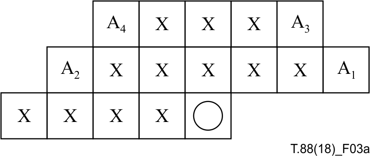

Figure 3(a) – Template when GBTEMPLATE = 0 and EXTTEMPLATE = 0,  
showing the AT pixels at their nominal locations

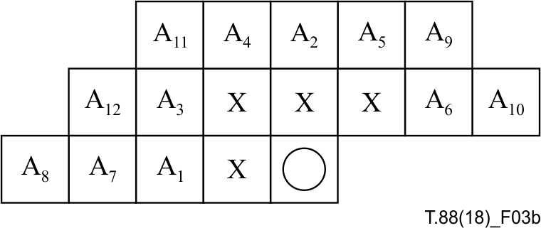

Figure 3(b) – Template when GBTEMPLATE = 0 and EXTTEMPLATE = 1,  
showing the AT pixels at their nominal locations

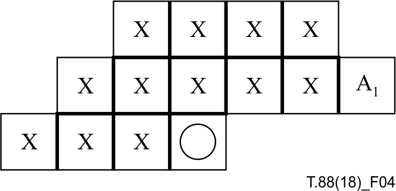

Figure 4 – Template when GBTEMPLATE = 1  
showing the AT pixels at its nominal location

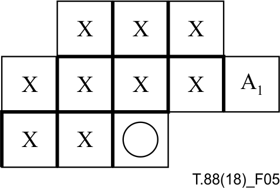

**Figure 5 – Template when GBTEMPLATE = 2  
showing the AT pixels at its nominal location**

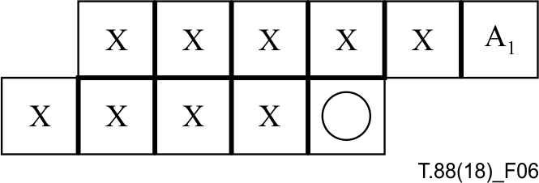

**Figure 6 – Template when GBTEMPLATE = 3  
showing the AT pixels at its nominal location**

NOTE 1 – A rule of thumb is to use large templates for large bitmaps. Thus a full-size periodic halftone should be coded with the 16-pixel template and tiny bitmaps such as usual symbol bitmaps should be coded with one of the 10-pixel templates. In some cases an intermediate template is desired, for performance or decoder memory requirements; in this case the 13-pixel template should be used. It is also possible to generate further templates by placing one or more of the AT pixels on top of a regular template pixel, thus fixing its value.

NOTE 2 – The 10-pixel templates are those used in Rec. ITU-T T.82 \| ISO/IEC 11544 (JBIG). Software execution speed is somewhat higher with the two-line template than any of the three-line templates. For most images the 10-pixel, three-line template gives higher compression than the 10-pixel, two-line template.

#### 6.2.5.4 Adaptive template pixels

In coding the image, the template shall be allowed to change in the restricted way described in this clause.

The pixels that are allowed to change are called AT pixels. Their nominal locations are indicated by 'A1', 'A2', 'A3', 'A4', 'A5', 'A6', 'A7', 'A8', 'A9', 'A10', 'A11', and 'A12' in Figures 3(a), 3(b), 4, 5 and 6. Note that some templates have fewer than four AT pixels. In general, an AT pixel can be located anywhere in the field shown in Figure 7, not including the current pixel. Hence, there is the possibility of using an effective template size of 15, 14, 13, 12, 11, 10, 9, 8, 7, 6, 5, or 4 pixels by having the moved location of the AT pixel overlap a regular template pixel. The actual locations of the AT pixels for any invocation of this decoding procedure are specified as parameters to the decoding procedure. The location of the pixel A1 is given by (**GBATX1**, **GBATY1**). If **GBTEMPLATE** is 0 then:

• the location of the pixel A2 is given by (**GBATX2**, **GBATY2**);

• the location of the pixel A3 is given by (**GBATX3**, **GBATY3**);

• and the location of the pixel A4 is given by (**GBATX4**, **GBATY4**).

Additionally, if **GBTEMPLATE** is 0 and **EXTTEMPLATE** is 1, then:

• the location of the pixel A5 is given by (**GBATX5**, **GBATY5**);

• the location of the pixel A6 is given by (**GBATX6**, **GBATY6**);

• the location of the pixel A7 is given by (**GBATX7**, **GBATY7**);

• the location of the pixel A8 is given by (**GBATX8**, **GBATY8**);

• the location of the pixel A9 is given by (**GBATX9**, **GBATY9**);

• the location of the pixel A10 is given by (**GBATX10**, **GBATY10**);

• the location of the pixel A11 is given by (**GBATX11**, **GBATY11**);

• the location of the pixel A12 is given by (**GBATX12**, **GBATY12**).

NOTE 1 – Some profiles may restrict AT pixel locations to a smaller range than that shown in Figure 7.

NOTE 2 – The indices of the AT pixels in Figures 3(a) and 3(b) correspond to the expected goodness. If moving only one AT pixel from its nominal location shown in Figure 3(a), it is advisable to move A4. The next pixel to move is A3 and so on.

NOTE 3 – The nominal locations of the AT pixels are as shown in Table 5. These locations should be used unless other locations improve compression performance. Some profiles may restrict AT pixel locations to only these nominal locations.

NOTE 4 – If an AT pixel's location overlaps any regular template pixel's location, then the AT pixel's value can be ignored (since it duplicates another value). This can reduce the memory requirements of the decoder, since not all CX values can occur. However, when TPGD is enabled (**TPGDON** = **1**), the context used to code the SLTP value is used, regardless of whether AT pixels overlap regular template pixels. This means that contexts where the AT pixel's value differs from the regular template pixel's value can still occur, but only for SLTP when TPGD is enabled.

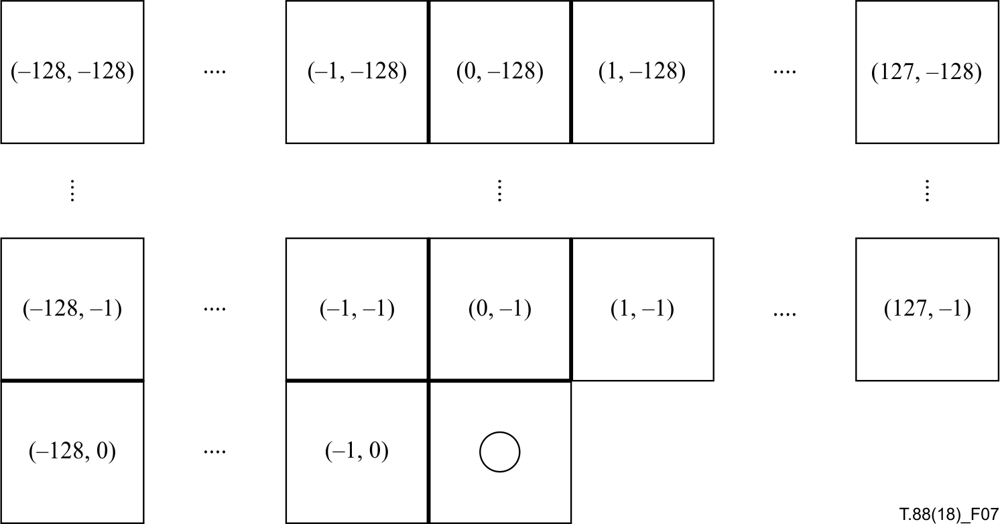

Figure 7 – Field to which AT pixel locations are restricted

<table>
<colgroup>
<col style="width: 12%" />
<col style="width: 12%" />
<col style="width: 6%" />
<col style="width: 7%" />
<col style="width: 7%" />
<col style="width: 7%" />
<col style="width: 7%" />
<col style="width: 7%" />
<col style="width: 7%" />
<col style="width: 7%" />
<col style="width: 7%" />
<col style="width: 6%" />
</colgroup>
<tbody>
<tr>
<td colspan="12">Table 5 – The nominal values of the AT pixel locations</td>
</tr>
<tr>
<td colspan="2" style="text-align: center;"><strong>GBTEMPLATE</strong></td>
<td colspan="2" style="text-align: center;"><u>0</u></td>
<td colspan="2" style="text-align: center;">0</td>
<td colspan="2" style="text-align: center;">1</td>
<td colspan="2" style="text-align: center;">2</td>
<td colspan="2" style="text-align: center;">3</td>
</tr>
<tr>
<td colspan="2" style="text-align: center;"><strong>EXTTEMPLATE</strong></td>
<td colspan="2" style="text-align: center;">1</td>
<td colspan="2" style="text-align: center;">0</td>
<td colspan="2" style="text-align: center;">0</td>
<td colspan="2" style="text-align: center;">0</td>
<td colspan="2" style="text-align: center;">0</td>
</tr>
<tr>
<td style="text-align: center;"><strong>GBATX1</strong></td>
<td style="text-align: center;"><strong>GBATY1</strong></td>
<td style="text-align: center;">–2</td>
<td style="text-align: center;"><u>0</u></td>
<td style="text-align: center;">3</td>
<td style="text-align: center;">–1</td>
<td style="text-align: center;">3</td>
<td style="text-align: center;">–1</td>
<td style="text-align: center;">2</td>
<td style="text-align: center;">–1</td>
<td style="text-align: center;">2</td>
<td style="text-align: center;">–1</td>
</tr>
<tr>
<td style="text-align: center;"><strong>GBATX2</strong></td>
<td style="text-align: center;"><strong>GBATY2</strong></td>
<td style="text-align: center;">0</td>
<td style="text-align: center;">–2</td>
<td style="text-align: center;">–3</td>
<td style="text-align: center;">–1</td>
<td style="text-align: center;">NA</td>
<td style="text-align: center;">NA</td>
<td style="text-align: center;">NA</td>
<td style="text-align: center;">NA</td>
<td style="text-align: center;">NA</td>
<td style="text-align: center;">NA</td>
</tr>
<tr>
<td style="text-align: center;"><strong>GBATX3</strong></td>
<td style="text-align: center;"><strong>GBATY3</strong></td>
<td style="text-align: center;">–2</td>
<td style="text-align: center;">–1</td>
<td style="text-align: center;">2</td>
<td style="text-align: center;">–2</td>
<td style="text-align: center;">NA</td>
<td style="text-align: center;">NA</td>
<td style="text-align: center;">NA</td>
<td style="text-align: center;">NA</td>
<td style="text-align: center;">NA</td>
<td style="text-align: center;">NA</td>
</tr>
<tr>
<td style="text-align: center;"><strong>GBATX4</strong></td>
<td style="text-align: center;"><strong>GBATY4</strong></td>
<td style="text-align: center;">–1</td>
<td style="text-align: center;">–2</td>
<td style="text-align: center;">–2</td>
<td style="text-align: center;">–2</td>
<td style="text-align: center;">NA</td>
<td style="text-align: center;">NA</td>
<td style="text-align: center;">NA</td>
<td style="text-align: center;">NA</td>
<td style="text-align: center;">NA</td>
<td style="text-align: center;">NA</td>
</tr>
<tr>
<td style="text-align: center;"><strong>GBATX5</strong></td>
<td style="text-align: center;"><strong>GBATY5</strong></td>
<td style="text-align: center;">1</td>
<td style="text-align: center;">–2</td>
<td style="text-align: center;">NA</td>
<td style="text-align: center;">NA</td>
<td style="text-align: center;">NA</td>
<td style="text-align: center;">NA</td>
<td style="text-align: center;">NA</td>
<td style="text-align: center;">NA</td>
<td style="text-align: center;">NA</td>
<td style="text-align: center;">NA</td>
</tr>
<tr>
<td style="text-align: center;"><strong>GBATX6</strong></td>
<td style="text-align: center;"><strong>GBATY6</strong></td>
<td style="text-align: center;">2</td>
<td style="text-align: center;">–1</td>
<td style="text-align: center;">NA</td>
<td style="text-align: center;">NA</td>
<td style="text-align: center;">NA</td>
<td style="text-align: center;">NA</td>
<td style="text-align: center;">NA</td>
<td style="text-align: center;">NA</td>
<td style="text-align: center;">NA</td>
<td style="text-align: center;">NA</td>
</tr>
<tr>
<td style="text-align: center;"><strong>GBATX7</strong></td>
<td style="text-align: center;"><strong>GBATY7</strong></td>
<td style="text-align: center;">–3</td>
<td style="text-align: center;">0</td>
<td style="text-align: center;">NA</td>
<td style="text-align: center;">NA</td>
<td style="text-align: center;">NA</td>
<td style="text-align: center;">NA</td>
<td style="text-align: center;">NA</td>
<td style="text-align: center;">NA</td>
<td style="text-align: center;">NA</td>
<td style="text-align: center;">NA</td>
</tr>
<tr>
<td style="text-align: center;"><strong>GBATX8</strong></td>
<td style="text-align: center;"><strong>GBATY8</strong></td>
<td style="text-align: center;">–4</td>
<td style="text-align: center;">0</td>
<td style="text-align: center;">NA</td>
<td style="text-align: center;">NA</td>
<td style="text-align: center;">NA</td>
<td style="text-align: center;">NA</td>
<td style="text-align: center;">NA</td>
<td style="text-align: center;">NA</td>
<td style="text-align: center;">NA</td>
<td style="text-align: center;">NA</td>
</tr>
<tr>
<td style="text-align: center;"><strong>GBATX9</strong></td>
<td style="text-align: center;"><strong>GBATY9</strong></td>
<td style="text-align: center;">2</td>
<td style="text-align: center;">–2</td>
<td style="text-align: center;">NA</td>
<td style="text-align: center;">NA</td>
<td style="text-align: center;">NA</td>
<td style="text-align: center;">NA</td>
<td style="text-align: center;">NA</td>
<td style="text-align: center;">NA</td>
<td style="text-align: center;">NA</td>
<td style="text-align: center;">NA</td>
</tr>
<tr>
<td style="text-align: center;"><strong>GBATX10</strong></td>
<td style="text-align: center;"><strong>GBATY10</strong></td>
<td style="text-align: center;">3</td>
<td style="text-align: center;">–1</td>
<td style="text-align: center;">NA</td>
<td style="text-align: center;">NA</td>
<td style="text-align: center;">NA</td>
<td style="text-align: center;">NA</td>
<td style="text-align: center;">NA</td>
<td style="text-align: center;">NA</td>
<td style="text-align: center;">NA</td>
<td style="text-align: center;">NA</td>
</tr>
<tr>
<td style="text-align: center;"><strong>GBATX11</strong></td>
<td style="text-align: center;"><strong>GBATY11</strong></td>
<td style="text-align: center;">–2</td>
<td style="text-align: center;">–2</td>
<td style="text-align: center;">NA</td>
<td style="text-align: center;">NA</td>
<td style="text-align: center;">NA</td>
<td style="text-align: center;">NA</td>
<td style="text-align: center;">NA</td>
<td style="text-align: center;">NA</td>
<td style="text-align: center;">NA</td>
<td style="text-align: center;">NA</td>
</tr>
<tr>
<td style="text-align: center;"><strong>GBATX12</strong></td>
<td style="text-align: center;"><strong>GBATY12</strong></td>
<td style="text-align: center;">–3</td>
<td style="text-align: center;">–1</td>
<td style="text-align: center;">NA</td>
<td style="text-align: center;">NA</td>
<td style="text-align: center;">NA</td>
<td style="text-align: center;">NA</td>
<td style="text-align: center;">NA</td>
<td style="text-align: center;">NA</td>
<td style="text-align: center;">NA</td>
<td style="text-align: center;">NA</td>
</tr>
<tr>
<td colspan="12">NOTE – NA means that the parameter has no nominal value.</td>
</tr>
</tbody>
</table>

#### 6.2.5.5 Typical prediction for generic direct coding (TPGD)

Typical prediction for generic direct coding can be enabled or disabled with the **TPGDON** parameter. If typical prediction for generic direct coding is enabled (**TPGDON** is **1**), then before the first pixel of each row is decoded, a value indicating that a row is typical shall be decoded. If the row is typical then each pixel of this row is identical to the corresponding pixel in the row immediately above, and so no other pixels of this row need to be decoded. If the row is not typical, then each pixel of this row needs to be decoded.

NOTE – The value decoded before the first pixel of each row is not used in any pixel's template.

#### 6.2.5.6 Skipped pixels

If the parameter **USESKIP** is **1**, then the parameter **SKIP** contains a **GBW**-by-**GBH** bitmap. Each pixel in **SKIP** corresponds to a pixel in the bitmap being decoded; if the pixel in **SKIP** is **1** then the corresponding pixel in the bitmap being decoded is **0** and is not actually decoded.

**6.2.5.7** **Decoding the bitmap**

The decoding of the bitmap proceeds as follows:

1\) Set:

LTP  =  **0**

2\) Create a bitmap GBREG of width **GBW** and height **GBH** pixels.

3\) Decode each row as follows:

a\) If all **GBH** rows have been decoded then the decoding is complete; proceed to step 4).

b\) If **TPGDON** is **1**, then decode a bit using the arithmetic entropy coder, where the context used to decode this bit varies depending on the template in use:

• If **GBTEMPLATE** is 0, use the context shown in Figure 8.

• If **GBTEMPLATE** is 1, use the context shown in Figure 9.

• If **GBTEMPLATE** is 2, use the context shown in Figure 10.

• If **GBTEMPLATE** is 3, use the context shown in Figure 11.

Let SLTP be the value of this bit. Set:

LTP  =  LTP XOR SLTP

NOTE – In Figures 8 to 11, the template is shown with the AT pixel or pixels in their nominal locations. The same pixel values (**0** or **1**) shall be used for the AT pixels no matter what their actual locations are. That is, moving the AT pixels does not affect the context that is used to decode SLTP.

c\) If LTP = **1** then set every pixel of the current row of GBREG equal to the corresponding pixel of the row immediately above.

d\) If LTP = **0** then, from left to right, decode each pixel of the current row of GBREG. The procedure for each pixel is as follows:

i\) If **USESKIP** is **1** and the pixel in the bitmap **SKIP** at the location corresponding to the current pixel is **1**, then set the current pixel to **0**.

ii\) Otherwise:

• Place the template given by parameters **GBTEMPLATE**, **GBATX1** through **GBATX12** and **GBATY1** through **GBATY12** so that the current pixel is aligned with the location denoted by a circle in the figure describing the appearance of the template with identifier **GBTEMPLATE**.

• Form an integer CONTEXT by gathering the values of the image pixels overlaid by the template (including AT pixels) at its current location. The order of this gathering is not standardized, but shall be consistent and independent of the location of the AT pixels.

• Decode the current pixel by invoking the arithmetic entropy decoding procedure, with CX set to the value formed by concatenating the label "GB" and the 10-16 pixel values gathered in CONTEXT. The result of this invocation is the value of the current pixel.

EXAMPLE – If **GBTEMPLATE** is 2, the image pixels overlaid by the template are as shown in Figure 10, and the pixels are gathered in reading order (in rows from top to bottom, and within each row from left to right), then CX is set to "GB**0011100101**".

4\) After all the rows have been decoded, the current contents of the bitmap GBREG are the results that shall be obtained by every decoder, whether it performs this exact sequence of steps or not.

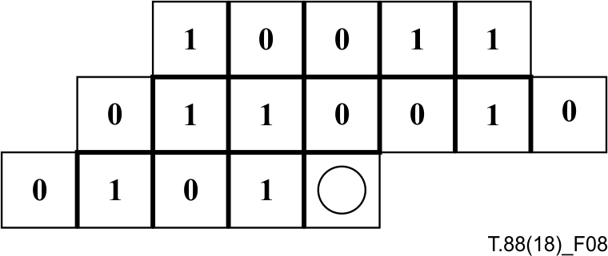

Figure 8 – Reused context for coding the SLTP value  
when GBTEMPLATE is 0

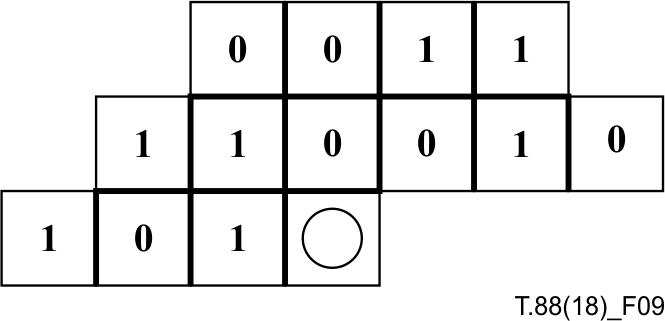

Figure 9 – Reused context for coding the SLTP value  
when GBTEMPLATE is 1

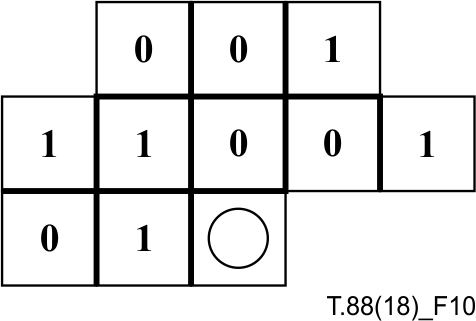

Figure 10 – Reused context for coding the SLTP value  
when GBTEMPLATE is 2

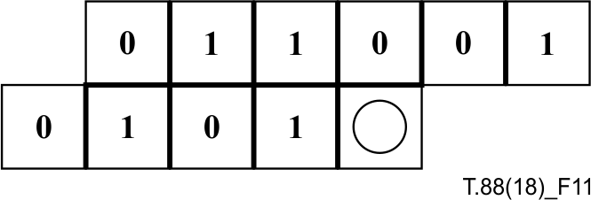

Figure 11 – Reused context for coding the SLTP value  
when GBTEMPLATE is 3

FIGURE 11/T.88...\[D11\]

### 6.2.6 Decoding using MMR coding

If **MMR** is **1**, the generic region decoding procedure is identical to an MMR (Modified Modified READ) decoder described in Recommendation ITU-T T.6, with the following exceptions:

• An invocation of the generic region decoding procedure with **MMR** equal to **1** shall consume an integral number of bytes, beginning and ending on a byte boundary. This may involve skipping over some bits in the last byte read.

• The decoder in Recommendation ITU-T T.6 is specified as producing pixels whose value may be either "black" or "white". For the purposes of this Recommendation \| International Standard, the result of using the MMR decoder shall be interpreted as follows:

– Pixels decoded by the MMR decoder having the value "black" shall be treated as having the value **1**.

– Pixels decoded by the MMR decoder having the value "white" shall be treated as having the value **0**.

• If the number of bytes contained in the encoded bitmap is known in advance, then it is permissible for the data stream not to contain an EOFB (**000000000001000000000001**) at the end of the MMR-encoded data. The cases where the number of bytes is known are when this decoding procedure is invoked:

– from within the pattern dictionary decoding procedure;

– from within the symbol dictionary decoding procedure; or

– as part of decoding a generic region whose data length is known.

The number of bytes is not known when this decoding procedure is invoked from within the gray-scale image decoding procedure, or when it is invoked as part of a decoding generic region whose data length is not known. In these cases, EOFB must be present.

NOTE 1 – The sources of the byte count, in the cases where it is known, are:

– Within the pattern dictionary decoding procedure, the byte count is known because all the segment data, beyond the fixed-length data header, is a single MMR-encoded data block, so the MMR data length can be computed from the segment data length.

– Within the symbol dictionary decoding procedure, the byte count is known from BMSIZE.

– Within the generic region decoding procedure, the byte count is again known from the segment data length.

The reason for allowing EOFB to be optional is that an EOFB is three bytes long, while the byte count is often known beforehand, or can be encoded in fewer than three bytes. Thus, omitting an EOFB reduces the bitmap's coded data size; in symbol dictionaries, where there are often many small bitmaps encoded separately, this savings can be significant.

NOTE 2 – A decoder can take a number of approaches to deal with EOFB in the cases where it is optional. These approaches take advantage of the known byte count and the fact that the EOFB, if present, is counted in this byte count. Two possible approaches are:

– Invoke the MMR decoding procedure, and always check for EOFB after the bitmap has been decoded. However, allow the MMR decoding procedure to examine no more bytes than are known to be part of the MMR-compressed data block. If the MMR decoding procedure runs out of data while checking for EOFB, this is not an error, but a normal condition indicating that EOFB was not present.

– Invoke the MMR decoding procedure, and never check for EOFB after the bitmap has been decoded, in the cases where EOFB is optional. If the MMR decoding procedure consumes fewer bytes than are known to part of the MMR-compressed data block, this is not an error, but a normal condition indicating that EOFB was present. Skip over such unconsumed bytes.

• The extension codes of T.6, including uncompressed mode, must not be present in the MMR-encoded data.

NOTE 3 – MMR provides less compression than image bitmap compression based on arithmetic coding. Image bitmap decoding using MMR is faster than image bitmap decoding based on arithmetic coding.

### 6.2.7 Colour extension of generic region segment

If **COLEXTFLAG** is 1, after the decoding procedure described in 6.2.5 or 6.2.6, read GBFGCOLID which is a 4-byte integer indicating the colour palette ID, and set the colour specified by **GBCOLS**\[GBFGCOLID\] to the segment's foreground colour.

The background colour of the segment of which **COLEXTFLAG** is 1 is regarded as transparent.

NOTE – GBFGCOLID (the foreground colour information) has a fixed 4-byte field and is put at the end of the region segment only when **COLEXTFLAG** is 1. The decoder can find the address of GBFGCOLID by subtracting 4 from the segment data length recorded in the segment header.

## 6.3 Generic Refinement Region Decoding Procedure

### 6.3.1 General description

This decoding procedure is used to decode a rectangular array of **0** or **1** values, which are coded one pixel at a time. There is a reference bitmap known to the decoding procedure, and this is used as part of the decoding process. The reference bitmap is intended to resemble the bitmap being decoded, and this similarity is used to increase compression. Each pixel is decoded using a context comprising pixels drawn from the reference bitmap as well as previously-decoded pixels from the bitmap being decoded.

### 6.3.2 Input parameters

The parameters to this decoding procedure are shown in Table 6.

Table 6 – Parameters for the generic refinement region decoding procedure

<table style="width:99%;">
<colgroup>
<col style="width: 21%" />
<col style="width: 10%" />
<col style="width: 6%" />
<col style="width: 10%" />
<col style="width: 50%" />
</colgroup>
<tbody>
<tr>
<td>Name</td>
<td>Type</td>
<td>Size 
(bits)</td>
<td>Signed?</td>
<td>Description and restrictions</td>
</tr>
<tr>
<td><strong>GRW</strong></td>
<td style="text-align: center;">Integer</td>
<td style="text-align: center;">32</td>
<td style="text-align: center;">N</td>
<td>The width of the region.</td>
</tr>
<tr>
<td><strong>GRH</strong></td>
<td style="text-align: center;">Integer</td>
<td style="text-align: center;">32</td>
<td style="text-align: center;">N</td>
<td>The height of the region.</td>
</tr>
<tr>
<td><strong>GRTEMPLATE</strong></td>
<td style="text-align: center;">Integer</td>
<td style="text-align: center;">1</td>
<td style="text-align: center;">N</td>
<td>The template identifier.</td>
</tr>
<tr>
<td><strong>GRREFERENCE</strong></td>
<td colspan="3" style="text-align: center;">Bitmap</td>
<td>The reference bitmap.</td>
</tr>
<tr>
<td><strong>GRREFERENCEDX</strong></td>
<td style="text-align: center;">Integer</td>
<td style="text-align: center;">32</td>
<td style="text-align: center;">Y</td>
<td>The X offset of the reference bitmap with respect to the bitmap being decoded.</td>
</tr>
<tr>
<td><strong>GRREFERENCEDY</strong></td>
<td style="text-align: center;">Integer</td>
<td style="text-align: center;">32</td>
<td style="text-align: center;">Y</td>
<td>The Y offset of the reference bitmap with respect to the bitmap being decoded.</td>
</tr>
<tr>
<td><strong>TPGRON</strong></td>
<td style="text-align: center;">Integer</td>
<td style="text-align: center;">1</td>
<td style="text-align: center;">N</td>
<td>Whether typical prediction for generic refinement is used.</td>
</tr>
<tr>
<td><strong>GRATX1</strong></td>
<td style="text-align: center;">Integer</td>
<td style="text-align: center;">8</td>
<td style="text-align: center;">Y</td>
<td>The X location of the adaptive template pixel RA1.a)</td>
</tr>
<tr>
<td><strong>GRATY1</strong></td>
<td style="text-align: center;">Integer</td>
<td style="text-align: center;">8</td>
<td style="text-align: center;">Y</td>
<td>The Y location of the adaptive template pixel RA1.a)</td>
</tr>
<tr>
<td><strong>GRATX2</strong></td>
<td style="text-align: center;">Integer</td>
<td style="text-align: center;">8</td>
<td style="text-align: center;">Y</td>
<td>The X location of the adaptive template pixel RA2.a)</td>
</tr>
<tr>
<td><strong>GRATY2</strong></td>
<td style="text-align: center;">Integer</td>
<td style="text-align: center;">8</td>
<td style="text-align: center;">Y</td>
<td>The Y location of the adaptive template pixel RA2.a)</td>
</tr>
<tr>
<td colspan="5">a) Unused if <strong>GRTEMPLATE ≠ 0</strong>.</td>
</tr>
</tbody>
</table>

### 6.3.3 Return value

The variable whose value is the result of this decoding procedure is shown in Table 7.

Table 7 – Return value from the generic refinement region decoding procedure

<table style="width:94%;">
<colgroup>
<col style="width: 19%" />
<col style="width: 10%" />
<col style="width: 6%" />
<col style="width: 9%" />
<col style="width: 47%" />
</colgroup>
<tbody>
<tr>
<td>Name</td>
<td>Type</td>
<td>Size 
(bits)</td>
<td>Signed?</td>
<td>Description and restrictions</td>
</tr>
<tr>
<td>GRREG</td>
<td colspan="3">Bitmap</td>
<td>The decoded region bitmap.</td>
</tr>
</tbody>
</table>

### 6.3.4 Variables used in decoding

The variables used by this decoding procedure are shown in Table 8.

Table 8 – Variables used in the generic refinement region decoding procedure

<table style="width:94%;">
<colgroup>
<col style="width: 19%" />
<col style="width: 10%" />
<col style="width: 6%" />
<col style="width: 9%" />
<col style="width: 47%" />
</colgroup>
<tbody>
<tr>
<td>Name</td>
<td>Type</td>
<td>Size 
(bits)</td>
<td>Signed?</td>
<td>Description and restrictions</td>
</tr>
<tr>
<td>CONTEXT</td>
<td style="text-align: center;">Integer</td>
<td style="text-align: center;">13</td>
<td style="text-align: center;">N</td>
<td>The values of the pixels in the template.</td>
</tr>
<tr>
<td>LTP</td>
<td style="text-align: center;">Integer</td>
<td style="text-align: center;">1</td>
<td style="text-align: center;">N</td>
<td>Whether the current image line is decoded explicitly.a)</td>
</tr>
<tr>
<td>SLTP</td>
<td style="text-align: center;">Integer</td>
<td style="text-align: center;">1</td>
<td style="text-align: center;">N</td>
<td>Whether the current line's LTP value is different from the previous line's LTP value.a)</td>
</tr>
<tr>
<td>TPGRPIX</td>
<td style="text-align: center;">Integer</td>
<td style="text-align: center;">1</td>
<td style="text-align: center;">N</td>
<td>Whether the current pixel is to be decoded implicitly using a TPGR prediction.a)</td>
</tr>
<tr>
<td>TPGRVAL</td>
<td style="text-align: center;">Integer</td>
<td style="text-align: center;">1</td>
<td style="text-align: center;">N</td>
<td>Value of the TPGR-predicted current pixel.a)</td>
</tr>
<tr>
<td colspan="5">a) Unused if <strong>TPGRON</strong> = <strong>0</strong>.</td>
</tr>
</tbody>
</table>

### 6.3.5 Decoding using a template and arithmetic coding

#### 6.3.5.1 General description

The generic refinement region decoding procedure is based on arithmetic coding with a template to determine the coding state. The remainder of 6.3.5 describes this form of decoding.

#### 6.3.5.2 Coding order and edge conventions

The coding algorithm iterates through the refined bitmap being decoded, along with a reference bitmap, in raster scan order. That is, it iterates by rows from top to bottom, and within each row from left to right. The processing for a current target pixel will reference some pixels in fixed spatial relationship to the target pixel. Some of these pixels are drawn from the reference version of the bitmap, and some of these pixels are drawn from the already-coded pixels of the refined bitmap.

Near the edges of the bitmap, these neighbour references might not lie in the actual bitmap. The rule to satisfy out-of-bounds references shall be:

• All pixels lying outside the bounds of the actual bitmap or the reference bitmap have the value **0**.

#### 6.3.5.3 Fixed templates and adaptive templates

A template defines a neighbourhood around a pixel to be coded. The values of the pixels in this neighbourhood define a context. Each context has its own adaptive probability estimate used by the arithmetic coder (see Annex E). Although a template is a geometric pattern of pixels, the pixels in a template are said to take on values when the template is aligned with a particular part of the image.

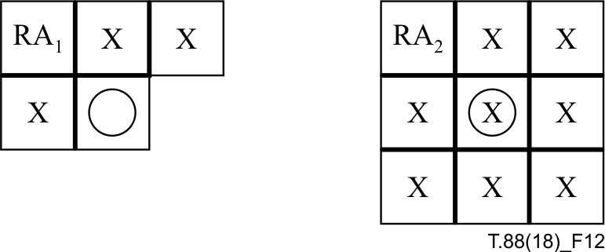

Figure 12 – 13-pixel refinement template showing  
the AT pixels at their nominal locations

Figure 12 shows the template which shall be used when GRTEMPLATE is 0. Figure 13 shows the template which shall be used when GRTEMPLATE is 1. In each of these figures, the left-hand group indicates the pixels from the already-coded pixels of the refined bitmap that are in the template, and the right-hand group indicates the pixels from the reference version of the template that are in the template. Each group in each figure includes a pixel denoted by a circle;

these pixels all correspond to the pixel to be coded. The pixels marked with an 'X' correspond to ordinary pixels in the template. The pixels denoted RA1-RA2 are special pixels in the template. They are denoted "adaptive" or AT pixels. These pixels are special in that their locations are allowed to change during the process of encoding the image. See 6.3.5.4 for a description of AT pixels. The legends RA1-RA2 indicate the nominal locations of AT pixels 1 to 2.

The AT pixel RA1 can be located anywhere in the field shown in Figure 7, not including the current pixel. The AT pixel RA2 can be located anywhere in the range (−128, −128) to (127, 127) in the reference bitmap.

The pixels in the left hand group of each template shall be aligned with the already-decoded pixels of the bitmap being decoded, with the pixel denoted by a circle lying on the pixel to be decoded. Let (X, Y) be the location of this pixel. The pixels of the right hand group of each template shall be aligned with the reference bitmap **GRREFERENCE**, with the pixel denoted by a circle placed at the location (X – **GRREFERENCEDX**, Y – **GRREFERENCEDY**). The values of the pixels in the template shall be combined to form a context. Each pixel in the template (including the adaptive pixels) shall correspond to a specific bit in the context, although the pixels in the template may be assigned to bits in the context in any order. Because there are up to 13 pixels in the template, contexts can take on up to 8192 different values. This context shall be used to identify which adaptive probability estimate shall be used by the arithmetic coder for encoding the pixel to be coded (see Annex E).

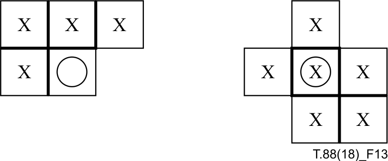

Figure 13 – 10-pixel refinement template

#### 6.3.5.4 Adaptive template pixels

In coding the image, the template shall be allowed to change in the restricted way described in this clause.

The pixels that are allowed to change shall be called AT pixels. Their nominal locations are indicated by 'RA1' and 'RA2' in Figure 12. Note that only one template has AT pixels.

#### 6.3.5.5 Typical prediction for generic refinement (TPGR)

Typical prediction for generic refinement can be enabled or disabled with the **TPGRON** parameter. If typical prediction for generic refinement is enabled (**TPGRON** is **1**) then before the first pixel of each row is decoded, a value indicating whether a row is typical shall be decoded. If the row is not typical, each pixel of the row needs to be explicitly decoded. If the row is typical, all typically-predictable pixels can be implicitly decoded using their predicted value, with the remainder of the pixels still being explicitly decoded. For a pixel to be typically-predictable it must meet the criteria defined in 6.3.5.6, step 3d).

NOTE – The value decoded before the first pixel of each row is not used in any pixel's template.

#### 6.3.5.6 Decoding the refinement bitmap

The decoding of the bitmap proceeds as follows:

1\) Set LTP = **0**.

2\) Create a bitmap GRREG of width **GRW** and height **GRH** pixels.

3\) Decode each row as follows:

a\) If all **GRH** rows have been decoded, then the decoding is complete; proceed to step 4).

b\) If **TPGRON** is **1**, then decode a bit using the arithmetic entropy coder, where the context used to decode this bit varies depending on the template in use:

• If **GRTEMPLATE** is **0**, use the context shown in Figure 14.

• If **GRTEMPLATE** is **1**, use the context shown in Figure 15.

Let SLTP be the value of this decoded bit. Set:

LTP  =  LTP XOR SLTP

c\) If LTP = **0** then, from left to right, explicitly decode all pixels of the current row of GRREG. The procedure for each pixel is as follows:

i\) Place the template given by parameters **GRTEMPLATE** (and **GRATX1**, **GRATY1**, **GRATX2** and **GRATY2** if **GRTEMPLATE** is **0**) so that the current pixel is aligned with the location denoted by a circle in the figure describing the appearance of the template with identifier **GRTEMPLATE**.

ii\) Form an integer CONTEXT by gathering the values of the image pixels overlaid by the template (including AT pixels) at its current location. The order of this gathering is not standardized, but must be consistent and independent of the location of the AT pixels.

iii\) Decode the current pixel by invoking the arithmetic entropy decoding procedure, with CX set to the value formed by concatenating the label "GR" and the 10-13 pixel values gathered in CONTEXT. The result of this invocation is the value of the current pixel.

EXAMPLE – If **GRTEMPLATE** is **1**, the image pixels overlaid by the template are as shown in Figure 15, and the pixels are gathered in reading order (in rows from top to bottom, and within each row from left to right, with the pixels in GRREG considered before the pixels in GRREFERENCE), then CX is set to "GR**0000001000**".

d\) If LTP = **1** then, from left to right, implicitly decode certain pixels of the current row of GRREG, and explicitly decode the rest. The procedure for each pixel is as follows:

i\) Set TPGRPIX equal to **1** if:

• **TPGRON** is **1** AND;

• a 3 × 3 pixel array in the reference bitmap (Figure 16), centred at the location corresponding to the current pixel, contains pixels all of the same value.

When TPGRPIX is set to **1**, set TPGRVAL equal to the current pixel predicted value, which is the common value of the nine adjacent pixels in the 3 × 3 array.

ii\) If TPGRPIX is **1** then implicitly decode the current pixel by setting it equal to its predicted value (TPGRVAL).

iii\) Otherwise, explicitly decode the current pixel using the methodology of steps 3 c) i) through 3 c) iii) above.

> 4\) After all the rows have been decoded, the current contents of the bitmap GRREG are the results that shall be obtained by every decoder, whether it performs this exact sequence of steps or not.

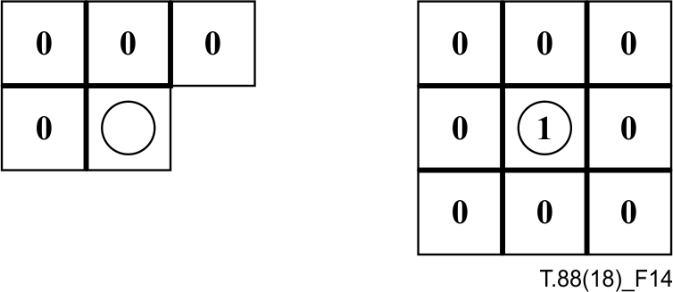

Figure 14 – Reused context for coding the SLTP value  
when GRTEMPLATE is 0

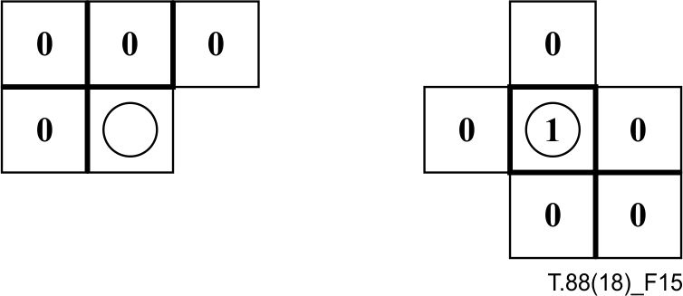

Figure 15 – Reused context for coding the SLTP  
value when GRTEMPLATE is 1

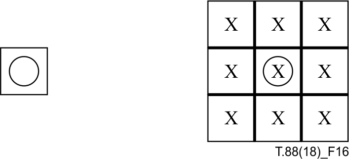

Figure 16 – TPGR template

## 6.4 Text Region Decoding Procedure

### 6.4.1 General description

This decoding procedure is used to decode a bitmap by decoding a number of symbol instances. A symbol instance contains a location and a symbol ID, and possibly a refinement bitmap. These symbol instances are combined to form the decoded bitmap.

NOTE – This decoding procedure will normally be used to decode the text part of a page. The symbols are normally single text characters from some font or alphabet.

### 6.4.2 Input parameters

The parameters to this decoding procedure are shown in Table 9.

NOTE – The values of some of these parameters in a typical situation, where a bitmap containing text characters in standard English reading order is being decoded, and **1** is the foreground pixel value, are:

• **SBDEFPIXEL** is **0**

• **SBCOMBOP** is OR

• **TRANSPOSED** is **0**

• **REFCORNER** is BOTTOMLEFT

<table style="width:99%;">
<colgroup>
<col style="width: 19%" />
<col style="width: 7%" />
<col style="width: 6%" />
<col style="width: 8%" />
<col style="width: 57%" />
</colgroup>
<thead>
<tr>
<th colspan="5">Table 9 – Parameters for the text region decoding procedure</th>
</tr>
<tr>
<th>Name</th>
<th>Type</th>
<th style="text-align: center;">Size 
(bits)</th>
<th style="text-align: center;">Signed?</th>
<th>Description and restrictions</th>
</tr>
</thead>
<tbody>
<tr>
<td><strong>SBHUFF</strong></td>
<td>Integer</td>
<td style="text-align: center;">1</td>
<td style="text-align: center;">N</td>
<td>Whether Huffman coding is used.</td>
</tr>
<tr>
<td><strong>SBREFINE</strong></td>
<td>Integer</td>
<td style="text-align: center;">1</td>
<td style="text-align: center;">N</td>
<td>Whether refinement coding is used.</td>
</tr>
<tr>
<td><strong>SBW</strong></td>
<td>Integer</td>
<td style="text-align: center;">32</td>
<td style="text-align: center;">N</td>
<td>The width of the region.</td>
</tr>
<tr>
<td><strong>SBH</strong></td>
<td>Integer</td>
<td style="text-align: center;">32</td>
<td style="text-align: center;">N</td>
<td>The height of the region.</td>
</tr>
<tr>
<td><strong>SBNUMINSTANCES</strong></td>
<td>Integer</td>
<td style="text-align: center;">32</td>
<td style="text-align: center;">N</td>
<td>The number of symbol instances in this region.</td>
</tr>
<tr>
<td><strong>SBSTRIPS</strong></td>
<td>Integer</td>
<td style="text-align: center;">4</td>
<td style="text-align: center;">N</td>
<td>The size of the symbol instance strips. May take on the values 1, 2, 4 or 8.</td>
</tr>
<tr>
<td><strong>SBNUMSYMS</strong></td>
<td>Integer</td>
<td style="text-align: center;">32</td>
<td style="text-align: center;">N</td>
<td>The number of symbols that may be used in this region.</td>
</tr>
<tr>
<td><strong>SBSYMCODES</strong></td>
<td colspan="3" style="text-align: center;">Array of Huffman codes</td>
<td>An array containing the codes for the symbols used in this region. Contains <strong>SBNUMSYMS</strong> codes.a)</td>
</tr>
<tr>
<td><strong>SBSYMCODELEN</strong></td>
<td>Integer</td>
<td style="text-align: center;">6</td>
<td style="text-align: center;">N</td>
<td>The length of the symbol codes used in IAID.d)</td>
</tr>
<tr>
<td><strong>SBSYMS</strong></td>
<td colspan="3" style="text-align: center;">Array of symbols</td>
<td>An array containing the symbols used in this text region. Contains <strong>SBNUMSYMS</strong> symbols.</td>
</tr>
<tr>
<td><strong>SBDEFPIXEL</strong></td>
<td>Integer</td>
<td style="text-align: center;">1</td>
<td style="text-align: center;">N</td>
<td>The default pixel for this bitmap.</td>
</tr>
<tr>
<td><strong>SBCOMBOP</strong></td>
<td colspan="3" style="text-align: center;">Operator</td>
<td>The combination operator for this text region. May take on the values OR, AND, XOR<u>,</u> XNOR and REPLACE.e)</td>
</tr>
<tr>
<td><strong>TRANSPOSED</strong></td>
<td>Integer</td>
<td style="text-align: center;">1</td>
<td style="text-align: center;">N</td>
<td>Whether the strips run vertically.</td>
</tr>
<tr>
<td><strong>REFCORNER</strong></td>
<td colspan="3" style="text-align: center;">Corner</td>
<td>The reference corner of each symbol instance bitmap. May take on the values TOPLEFT, TOPRIGHT, BOTTOMLEFT and BOTTOMRIGHT.</td>
</tr>
<tr>
<td><strong>SBDSOFFSET</strong></td>
<td>Integer</td>
<td style="text-align: center;">5</td>
<td style="text-align: center;">Y</td>
<td>An offset for all the delta S values.</td>
</tr>
<tr>
<td><strong>SBHUFFFS</strong></td>
<td colspan="3" style="text-align: center;">Huffman table</td>
<td>The Huffman table used to decode the S coordinate of the first symbol instance in each strip.a)</td>
</tr>
<tr>
<td><strong>SBHUFFFDS</strong></td>
<td colspan="3" style="text-align: center;">Huffman table</td>
<td>The Huffman table used to decode the S coordinate of subsequent symbol instances in each strip. a)</td>
</tr>
<tr>
<td><strong>SBHUFFDT</strong></td>
<td colspan="3" style="text-align: center;">Huffman table</td>
<td>The Huffman table used to decode the difference in T coordinates between non-empty strips.a)</td>
</tr>
<tr>
<td><strong>SBHUFFRDW</strong></td>
<td colspan="3" style="text-align: center;">Huffman table</td>
<td>The Huffman table used to decode the difference between a symbol's width and the width of a refinement coded bitmap.b)</td>
</tr>
<tr>
<td><strong>SBHUFFRDH</strong></td>
<td colspan="3" style="text-align: center;">Huffman table</td>
<td>The Huffman table used to decode the difference between a symbol's height and the height of a refinement coded bitmap.b)</td>
</tr>
<tr>
<td><strong>SBHUFFRDX</strong></td>
<td colspan="3" style="text-align: center;">Huffman table</td>
<td>The Huffman table used to decode the difference between a symbol instance's X coordinate and the X coordinate of a refinement coded bitmap.b)</td>
</tr>
<tr>
<td><strong>SBHUFFRDY</strong></td>
<td colspan="3" style="text-align: center;">Huffman table</td>
<td>The Huffman table used to decode the difference between a symbol instance's Y coordinate and the Y coordinate of a refinement coded bitmap.b)</td>
</tr>
<tr>
<td><strong>SBHUFFRSIZE</strong></td>
<td colspan="3" style="text-align: center;">Huffman table</td>
<td>The Huffman table used to decode the size of a symbol instance's refinement bitmap data.b)</td>
</tr>
<tr>
<td><strong>SBRTEMPLATE</strong></td>
<td style="text-align: center;">Integer</td>
<td style="text-align: center;">1</td>
<td style="text-align: center;">N</td>
<td>Template identifier for refinement coding of symbol instance bitmaps.c)</td>
</tr>
<tr>
<td><strong>SBRATX1</strong></td>
<td>Integer</td>
<td style="text-align: center;">8</td>
<td style="text-align: center;">Y</td>
<td>The X location of the adaptive template pixel RA1.c)</td>
</tr>
<tr>
<td><strong>SBRATY1</strong></td>
<td>Integer</td>
<td style="text-align: center;">8</td>
<td style="text-align: center;">Y</td>
<td>The Y location of the adaptive template pixel RA1.c)</td>
</tr>
<tr>
<td><strong>SBRATX2</strong></td>
<td>Integer</td>
<td style="text-align: center;">8</td>
<td style="text-align: center;">Y</td>
<td>The X location of the adaptive template pixel RA2.c)</td>
</tr>
<tr>
<td><strong>SBRATY2</strong></td>
<td>Integer</td>
<td style="text-align: center;">8</td>
<td style="text-align: center;">Y</td>
<td>The Y location of the adaptive template pixel RA2.c)</td>
</tr>
<tr>
<td><strong>COLEXTFLAG</strong></td>
<td>Integer</td>
<td style="text-align: center;">1</td>
<td style="text-align: center;">N</td>
<td>A parameter indicating whether the generic region segment is extended to represent coloured bitmap.</td>
</tr>
<tr>
<td><strong>SBCOLS</strong></td>
<td colspan="3">Array of colours</td>
<td>An array containing the colours used in this text region.f)</td>
</tr>
<tr>
<td colspan="5">
a) Unused if <strong>SBHUFF</strong> = <strong>0</strong>.

b) Unused if <strong>SBHUFF</strong> = <strong>0</strong> or <strong>SBREFINE</strong> = <strong>0</strong>.

c) Unused if <strong>SBREFINE</strong> = <strong>0</strong>.

d) Unused if <strong>SBHUFF</strong> = <strong>1</strong>.

e) REPLACE operator is used if and only if <strong>COLEXTFLAG</strong> = 1.

f) Unused if <strong>COLEXTFLAG</strong> = 0.
</td>
</tr>
</tbody>
</table>

### 6.4.3 Return value

The variable whose value is the result of this decoding procedure is shown in Table 10.

Table 10 – Return value from the text region decoding procedure

<table style="width:99%;">
<colgroup>
<col style="width: 21%" />
<col style="width: 10%" />
<col style="width: 6%" />
<col style="width: 10%" />
<col style="width: 50%" />
</colgroup>
<tbody>
<tr>
<td>Name</td>
<td>Type</td>
<td>Size 
(bits)</td>
<td>Signed?</td>
<td>Description and restrictions</td>
</tr>
<tr>
<td>SBREG</td>
<td colspan="3">Bitmap</td>
<td>The decoded region bitmap.</td>
</tr>
</tbody>
</table>

### 6.4.4 Variables used in decoding

The variables used by this decoding procedure are shown in Table 11.

<table style="width:99%;">
<colgroup>
<col style="width: 21%" />
<col style="width: 10%" />
<col style="width: 6%" />
<col style="width: 10%" />
<col style="width: 50%" />
</colgroup>
<thead>
<tr>
<th colspan="5">Table 11 – Variables used in the text region decoding procedure</th>
</tr>
<tr>
<th>Name</th>
<th style="text-align: center;">Type</th>
<th style="text-align: center;">Size 
(bits)</th>
<th style="text-align: center;">Signed?</th>
<th>Description and restrictions</th>
</tr>
</thead>
<tbody>
<tr>
<td>STRIPT</td>
<td style="text-align: center;">Integer</td>
<td style="text-align: center;">32</td>
<td style="text-align: center;">Y</td>
<td>The numerically smallest T coordinate in the current strip.</td>
</tr>
<tr>
<td>FIRSTS</td>
<td style="text-align: center;">Integer</td>
<td style="text-align: center;">32</td>
<td style="text-align: center;">Y</td>
<td>The first S coordinate of the current strip.</td>
</tr>
<tr>
<td>NINSTANCES</td>
<td style="text-align: center;">Integer</td>
<td style="text-align: center;">32</td>
<td style="text-align: center;">N</td>
<td>A symbol instance counter.</td>
</tr>
<tr>
<td>DT</td>
<td style="text-align: center;">Integer</td>
<td style="text-align: center;">32</td>
<td style="text-align: center;">Y</td>
<td>The number of empty strips between two non-empty strips.</td>
</tr>
<tr>
<td>DFS</td>
<td style="text-align: center;">Integer</td>
<td style="text-align: center;">32</td>
<td style="text-align: center;">Y</td>
<td>The difference in S coordinates between the first symbol instances of two strips.</td>
</tr>
<tr>
<td>CURS</td>
<td style="text-align: center;">Integer</td>
<td style="text-align: center;">32</td>
<td style="text-align: center;">Y</td>
<td>The current S coordinate.</td>
</tr>
<tr>
<td>CURT</td>
<td style="text-align: center;">Integer</td>
<td style="text-align: center;">3</td>
<td style="text-align: center;">N</td>
<td>The current symbol instance's T coordinate relative to the current strip.</td>
</tr>
<tr>
<td><em>SI</em></td>
<td style="text-align: center;">Integer</td>
<td style="text-align: center;">32</td>
<td style="text-align: center;">Y</td>
<td>A symbol instance's S coordinate.</td>
</tr>
<tr>
<td><em>TI</em></td>
<td style="text-align: center;">Integer</td>
<td style="text-align: center;">32</td>
<td style="text-align: center;">Y</td>
<td>A symbol instance's T coordinate.</td>
</tr>
<tr>
<td><em>IDI</em></td>
<td style="text-align: center;">Integer</td>
<td style="text-align: center;">32</td>
<td style="text-align: center;">N</td>
<td>A symbol instance's symbol ID.</td>
</tr>
<tr>
<td><em>IBI</em></td>
<td colspan="3" style="text-align: center;">Bitmap</td>
<td>A symbol instance's symbol bitmap.</td>
</tr>
<tr>
<td><em>WI</em></td>
<td style="text-align: center;">Integer</td>
<td style="text-align: center;">32</td>
<td style="text-align: center;">N</td>
<td>The width of a symbol instance's symbol bitmap.</td>
</tr>
<tr>
<td><em>HI</em></td>
<td style="text-align: center;">Integer</td>
<td style="text-align: center;">32</td>
<td style="text-align: center;">N</td>
<td>The height of a symbol instance's symbol bitmap.</td>
</tr>
<tr>
<td>IDS</td>
<td style="text-align: center;">Integer</td>
<td style="text-align: center;">32</td>
<td style="text-align: center;">Y</td>
<td>The difference in S coordinates between two symbol instances within a strip.</td>
</tr>
<tr>
<td><em>RI</em></td>
<td style="text-align: center;">Integer</td>
<td style="text-align: center;">1</td>
<td style="text-align: center;">N</td>
<td>Whether a symbol instance's symbol bitmap is coded using refinement.</td>
</tr>
<tr>
<td><em>RDWI</em></td>
<td style="text-align: center;">Integer</td>
<td style="text-align: center;">32</td>
<td style="text-align: center;">Y</td>
<td>The delta width of a symbol instance's refinement bitmap.a)</td>
</tr>
<tr>
<td><em>RDHI</em></td>
<td style="text-align: center;">Integer</td>
<td style="text-align: center;">32</td>
<td style="text-align: center;">Y</td>
<td>The delta height of a symbol instance's refinement bitmap.a)</td>
</tr>
<tr>
<td><em>RDXI</em></td>
<td style="text-align: center;">Integer</td>
<td style="text-align: center;">32</td>
<td style="text-align: center;">Y</td>
<td>The delta X of a symbol instance's refinement bitmap.a)</td>
</tr>
<tr>
<td><em>RDY I</em></td>
<td style="text-align: center;">Integer</td>
<td style="text-align: center;">32</td>
<td style="text-align: center;">Y</td>
<td>The delta Y of a symbol instance's refinement bitmap.a)</td>
</tr>
<tr>
<td><em>IBOI</em></td>
<td colspan="3" style="text-align: center;">Bitmap</td>
<td>A symbol instance's original symbol bitmap.a)</td>
</tr>
<tr>
<td><em>WOI</em></td>
<td style="text-align: center;">Integer</td>
<td style="text-align: center;">32</td>
<td style="text-align: center;">N</td>
<td>The width of <em>IBOI</em>.a)</td>
</tr>
<tr>
<td><em>HOI</em></td>
<td style="text-align: center;">Integer</td>
<td style="text-align: center;">32</td>
<td style="text-align: center;">N</td>
<td>The height of <em>IBOI</em>.a)</td>
</tr>
<tr>
<td>SBCOLSECTSIZE</td>
<td style="text-align: center;">Integer</td>
<td style="text-align: center;">32</td>
<td style="text-align: center;">N</td>
<td>The colour section length.b)</td>
</tr>
<tr>
<td>SBFGCOLID</td>
<td style="text-align: center;">Integer</td>
<td style="text-align: center;">32</td>
<td style="text-align: center;">N</td>
<td>An array of colour palette ID, indicating the colour of each symbol instance.b)</td>
</tr>
<tr>
<td colspan="5">
a) Unused if <strong>SBREFINE</strong> = <strong>0</strong>.

b) Unused if <strong>COLEXTFLAG</strong> = 0.
</td>
</tr>
</tbody>
</table>

### 6.4.5 Decoding the text region

A symbol-coded bitmap is represented by a set of symbol instances. Each symbol instance encodes a location, a symbol ID, and possibly refinement information. The location of each symbol instance comprises an S coordinate and a T coordinate. If **TRANSPOSED** is **0**, then the S coordinate axis corresponds to the X axis of the bitmap, and the T axis corresponds to the Y axis of the bitmap. If **TRANSPOSED** is **1**, then the S coordinate axis corresponds to the Y axis of the bitmap, and the T axis corresponds to the X axis of the bitmap.

NOTE 1 – Transposing the coordinate axes allows efficient coding of text running vertically. The reference corner is variable because the most efficient coding is usually obtained when the reference corner of each symbol instance lies on a text baseline, and the text baselines may run in any direction.

In order to improve compression, symbol instances are grouped into strips according to their *TI* values. This is done according to the value of **SBSTRIPS**. Symbol instances having *TI* values between 0 and **SBSTRIPS** – 1 are grouped into one strip, symbol instances having *TI* values between **SBSTRIPS** and 2 × **SBSTRIPS** – 1 into the next, and so on. Within each strip, the symbol instances are coded in the order of increasing S coordinate.

NOTE 2 – Normally the strips occur in the order of strictly increasing T coordinates, and the symbol instances within each strip occur in the order of nondecreasing S coordinates. However, it is possible for negative delta S or delta T values to occur during the decoding, meaning that the strips and symbol instances might occur in any order.

The overall structure of the data to be decoded in order to reconstruct the text region is shown in Figure 17. The format of each strip is as shown in Figure 19. When **SBREFINE** is **0**, the format of each symbol instance is as shown in Figure 20. When **SBREFINE** is **1**, the format of each symbol instance is as shown in Figure 21.

NOTE 3 – There may be some symbol instances whose reference corner lies off the top of the region. If these are to be coded, there must be some way to have a strip that also lies above the top of the region. The initial value of STRIPT is the coordinate with respect to which the first strip is located.

|                      |
|:--------------------:|
| Initial STRIPT value |
|     First strip      |
|     Second strip     |
|        . . .         |
|      Last strip      |

Figure 17 – Coded structure of a text region

<table style="width:85%;">
<colgroup>
<col style="width: 85%" />
</colgroup>
<tbody>
<tr>
<td><table style="width:37%;">
<colgroup>
<col style="width: 36%" />
</colgroup>
<thead>
<tr>
<th style="text-align: center;">Initial STRIPT values</th>
</tr>
</thead>
<tbody>
<tr>
<td style="text-align: center;">First strip</td>
</tr>
<tr>
<td style="text-align: center;">Second strip</td>
</tr>
<tr>
<td style="text-align: center;">…</td>
</tr>
<tr>
<td style="text-align: center;">Last strip</td>
</tr>
<tr>
<td style="text-align: center;">Colour section</td>
</tr>
</tbody>
</table></td>
</tr>
</tbody>
</table>

**Figure 18 – Coded structure of a text region extended for colour text**

|                        |
|:----------------------:|
|        Delta T         |
| First symbol instance  |
| Second symbol instance |
|         . . .          |
|  Last symbol instance  |
|          OOB           |

Figure 19 – Structure of a strip

|                              |
|:----------------------------:|
| Symbol instance S coordinate |
| Symbol instance T coordinate |
|  Symbol instance symbol ID   |

Figure 20 – Structure of a symbol instance when SBREFINE is 0

|                                        |
|:--------------------------------------:|
|      Symbol instance S coordinate      |
|      Symbol instance T coordinate      |
|       Symbol instance symbol ID        |
| Symbol instance refinement information |

Figure 21 – Structure of a symbol instance when SBREFINE is 1

<table style="width:85%;">
<colgroup>
<col style="width: 85%" />
</colgroup>
<tbody>
<tr>
<td><table style="width:37%;">
<colgroup>
<col style="width: 36%" />
</colgroup>
<thead>
<tr>
<th style="text-align: center;">Colour palette IDs</th>
</tr>
</thead>
<tbody>
<tr>
<td style="text-align: center;">Colour section length</td>
</tr>
</tbody>
</table></td>
</tr>
</tbody>
</table>

**Figure 22 – Coded structure of colour section**

> NOTE 4 – If **COLEXTFLAG** is 1 then a colour section, which specifies the colours of all symbol instances, is put at the end of the region as shown in Figure 18. The colour section consists of two parts as shown in Figure 22: colour palette IDs and colour section length. The colour palette IDs, which is encoded in the data structure based on Recommendation ITU-T T.45, contains the information that specifies the colour of every symbol instances in the segment. The colour section length is a 4-byte field that contains the length of the colour section, in bytes.
>
> NOTE 5 – The background colour of the segment of which **COLEXTFLAG** is 1 is regarded as transparent.

The result of decoding a text region shall be the bitmap that is produced by the following steps:

1\) Fill a bitmap SBREG, of the size given by **SBW** and **SBH**, with the **SBDEFPIXEL** value.

2\) Decode the initial STRIPT value as described in 6.4.6. Negate the decoded value and assign this negated value to the variable STRIPT. Assign the value 0 to FIRSTS. Assign the value 0 to NINSTANCES.

3\) If **COLEXTFLAG** is 1, decode the colour section as described in 6.4.12.

4\) Decode each strip as follows:

a\) If NINSTANCES is equal to **SBNUMINSTANCES** then there are no more strips to decode, and the process of decoding the text region is complete; proceed to step 4).

b\) Decode the strip's delta T value as described in 6.4.6. Let DT be the decoded value. Set:

STRIPT  =  STRIPT  +  DT

c\) Decode each symbol instance in the strip as follows:

i\) If the current symbol instance is the first symbol instance in the strip, then decode the first symbol instance's S coordinate as described in 6.4.7. Let DFS be the decoded value. Set:

FIRSTS  =  FIRSTS  +  DFS  
 CURS  =  FIRSTS

ii\) Otherwise, if the current symbol instance is not the first symbol instance in the strip, decode the symbol instance's S coordinate as described in 6.4.8. If the result of this decoding is OOB then the last symbol instance of the strip has been decoded; proceed to step 3 d). Otherwise, let IDS be the decoded value. Set:

CURS  =  CURS  + IDS  +  **SBDSOFFSET**

NOTE 6 – The intended use of **SBDSOFFSET** is to make the most common value decoded in 6.4.8 zero. The shortest code in all of the default tables used in 6.4.8 is for the value zero.

iii\) Decode the symbol instance's T coordinate as described in 6.4.9. Let CURT be the decoded value. Set:

*TI*  =  STRIPT + CURT

iv\) Decode the symbol instance's symbol ID as described in 6.4.10. Let *IDI* be the decoded value.

v\) Determine the symbol instance's bitmap *IBI* as described in 6.4.11. The width and height of this bitmap shall be denoted as *WI* and *HI* respectively.

vi\) Update CURS as follows:

• If **TRANSPOSED** is **0**, and **REFCORNER** is TOPRIGHT or BOTTOMRIGHT, set:

CURS  =  CURS  +  *WI*  –  1

• If **TRANSPOSED** is **1**, and **REFCORNER** is BOTTOMLEFT or BOTTOMRIGHT, set:

CURS  =  CURS  +  *HI*  –  1

• Otherwise, do not change CURS in this step.

vii\) Set:

*SI*  =  CURS

viii\) Determine the location of the symbol instance bitmap with respect to SBREG as follows:

• If **TRANSPOSED** is **0**, then:

> – If **REFCORNER** is TOPLEFT then the top left pixel of the symbol instance bitmap *IBI* shall be placed at SBREG\[*SI*, *TI*\].
>
> – If **REFCORNER** is TOPRIGHT then the top right pixel of the symbol instance bitmap *IBI* shall be placed at SBREG\[*SI*, *TI*\].
>
> – If **REFCORNER** is BOTTOMLEFT then the bottom left pixel of the symbol instance bitmap *IBI* shall be placed at SBREG\[*SI*, *TI*\].
>
> – If **REFCORNER** is BOTTOMRIGHT then the bottom right pixel of the symbol instance bitmap *IBI* shall be placed at SBREG\[*SI*, *TI*\].

• If **TRANSPOSED** is **1**, then:

> – If **REFCORNER** is TOPLEFT then the top left pixel of the symbol instance bitmap *IBI* shall be placed at SBREG\[*TI*, *SI*\].
>
> – If **REFCORNER** is TOPRIGHT then the top right pixel of the symbol instance bitmap *IBI* shall be placed at SBREG\[*TI*, *SI*\].
>
> – If **REFCORNER** is BOTTOMLEFT then the bottom left pixel of the symbol instance bitmap *IBI* shall be placed at SBREG\[*TI*, *SI*\].
>
> – If **REFCORNER** is BOTTOMRIGHT then the bottom right pixel of the symbol instance bitmap *IBI* shall be placed at SBREG\[*TI*, *SI*\].

If any part of *IBI*, when placed at this location, lies outside the bounds of SBREG, then ignore this part of *IBI* in step 3 c) ix).

ix\) If **COLEXTFLAG** is 1, set the colour specified by **SBCOLS**\[SBFGCOLID\[NINSTANCES\]\] to the foreground colour of the symbol instance bitmap *IBI*.

x\) Draw *IBI* into SBREG. Combine each pixel of *IBI* with the current value of the corresponding pixel in SBREG, using the combination operator specified by **SBCOMBOP**. Write the results of each combination into that pixel in SBREG.

xi\) Update CURS as follows:

• If **TRANSPOSED** is **0**, and **REFCORNER** is TOPLEFT or BOTTOMLEFT, set:

CURS  =  CURS  +  *WI*  –  1

• If **TRANSPOSED** is **1**, and **REFCORNER** is TOPLEFT or TOPRIGHT, set:

CURS  =  CURS  +  *HI*  –  1

• Otherwise, do not change CURS in this step.

NOTE 7 – The CURS update rules are designed to allow the gap between adjacent symbol instances to be encoded, rather than the distance between their reference corners; this takes out one source of variation (the symbol instance bitmap width or height), and allows better compression.

xii\) Set:

NINSTANCES  =  NINSTANCES  +  1

d\) When the strip has been completely decoded, decode the next strip.

5\) After all the strips have been decoded, the current contents of SBREG are the results that shall be obtained by every decoder, whether it performs this exact sequence of steps or not.

NOTE 8 – The colour palette (**SBCOLS**) is created by concatenating the default colour set (CPDEFCOLS) and the additional colours (CPEXCOLS) defined in the colour palette segment referred to by this segment.

### 6.4.6 Strip delta T

If **SBHUFF** is **1**, decode a value using the Huffman table specified by **SBHUFFDT** and multiply the resulting value by **SBSTRIPS**.

If **SBHUFF** is **0**, decode a value using the IADT integer arithmetic decoding procedure (see Annex A) and multiply the resulting value by **SBSTRIPS**.

### 6.4.7 First symbol instance S coordinate

NOTE – The symbol instance S coordinate value for the first symbol instance of each strip is coded differently from the subsequent symbol instances in each strip. This takes advantage of the beginnings of lines being aligned.

If **SBHUFF** is **1**, decode a value using the Huffman table specified by **SBHUFFFS**.

If **SBHUFF** is **0**, decode a value using the IAFS integer arithmetic decoding procedure (see Annex A).

### 6.4.8 Subsequent symbol instance S coordinate

If **SBHUFF** is **1**, decode a value using the Huffman table specified by **SBHUFFDS**.

If **SBHUFF** is **0**, decode a value using the IADS integer arithmetic decoding procedure (see Annex A).

In either case it is possible that the result of this decoding is the out-of-band value OOB.

**6.4.9** **Symbol instance T coordinate**

If **SBSTRIPS** = 1, then the value decoded is always zero. Otherwise:

• If **SBHUFF** is **1**, decode a value by reading log2**SBSTRIPS** bits directly from the bitstream.

• If **SBHUFF** is **0**, decode a value using the IAIT integer arithmetic decoding procedure (see Annex A).

NOTE – If **SBSTRIPS** = 1, then no bits are consumed, and the IAIT integer arithmetic decoding procedure is never invoked.

### 6.4.10 Symbol instance symbol ID

If **SBHUFF** is **1**, decode a value by reading one bit at a time until the resulting bit string is equal to one of the entries in **SBSYMCODES**. The resulting value, which is *IDI*, is the index of the entry in **SBSYMCODES** that is read.

If **SBHUFF** is **0**, decode a value using the IAID integer arithmetic decoding procedure (see Annex A). Set *IDI* to the resulting value.

### 6.4.11 Symbol instance bitmap

In some cases, the symbol instance bitmap *IBI* is simply the bitmap of the symbol identified by *IDI*. In other cases, however, the symbol instance bitmap is that bitmap modified by additional refinement information. The bit indicating which of the options is true for a symbol instance is called *RI*.

If **SBREFINE** is **0**, then set *RI* to **0**.

If **SBREFINE** is **1**, then decode *RI* as follows:

• If **SBHUFF** is **1**, then read one bit and set *RI* to the value of that bit.

• If **SBHUFF** is **0**, then decode one bit using the IARI integer arithmetic decoding procedure and set *RI* to the value of that bit.

If *RI* is **0** then set the symbol instance bitmap *IBI* to **SBSYMS**\[*IDI*\].

If *RI* is **1** then determine the symbol instance bitmap as follows:

1\) Decode the symbol instance refinement delta width as described in 6.4.11.1. Let *RDWI* be the value decoded.

2\) Decode the symbol instance refinement delta height as described in 6.4.11.2. Let *RDHI* be the value decoded.

3\) Decode the symbol instance refinement X offset as described in 6.4.11.3. Let *RDXI* be the value decoded.

4\) Decode the symbol instance refinement Y offset as described in 6.4.11.4. Let *RDYI* be the value decoded.

5\) If **SBHUFF** is **1**, then:

a\) Decode the symbol instance refinement bitmap data size as described in 6.4.11.5.

b\) Skip over any bits remaining in the last byte read.

6\) Let *IBOI* be **SBSYMS**\[*IDI*\]. Let *WOI* be the width of *IBOI* and *HOI* be the height of *IBOI*. The symbol instance bitmap *IBI* is the result of applying the generic refinement region decoding procedure described in 6.3. Set the parameters to this decoding procedure as shown in Table 12.

7\) If **SBHUFF** is **1**, then skip over any bits remaining in the last byte read. The total number of bytes processed by the generic refinement bitmap decoding procedure must be equal to the value read in step 5 a).

#### 6.4.11.1 Symbol instance refinement delta width

This field, and the following fields, indicate the size, location and contents of the refined symbol bitmap, as the size might not be the same as the size of the bitmap of the symbol whose ID is given in this symbol instance; also, the change in the size of the bitmap might extend to the left and top, not just to the right and bottom, so we need to supply an offset as well as a size. Note that the offsets are given in terms of X and Y, not S and T.

If **SBHUFF** is **1**, decode a value using the Huffman table specified by **SBHUFFRDW**.

If **SBHUFF** is **0**, decode a value using the IARDW integer arithmetic decoding procedure (see Annex A).

Table 12 – Parameters used to decode a symbol instance's bitmap using refinement

|                   |                     |
|-------------------|---------------------|
| Name              | Value               |
| **GRW**           | *WOI* + *RDWI*      |
| **GRH**           | *HOI* + *RDHI*      |
| **GRTEMPLATE**    | **SBRTEMPLATE**     |
| **GRREFERENCE**   | *IBOI*              |
| **GRREFERENCEDX** | *RDWI*/2 + *RDXI* |
| **GRREFERENCEDY** | *RDHI*/2 + *RDYI* |
| **TPGRON**        | **0**               |
| **GRATX1**        | **SBRATX1**         |
| **GRATY1**        | **SBRATY1**         |
| **GRATX2**        | **SBRATX2**         |
| **GRATY2**        | **SBRATY2**         |

#### 6.4.11.2 Symbol instance refinement delta height

If **SBHUFF** is **1**, decode a value using the Huffman table specified by **SBHUFFRDH**.

If **SBHUFF** is **0**, decode a value using the IARDH integer arithmetic decoding procedure (see Annex A).

#### 6.4.11.3 Symbol instance refinement X offset

If **SBHUFF** is **1**, decode a value using the Huffman table specified by **SBHUFFRDX**.

If **SBHUFF** is **0**, decode a value using the IARDX integer arithmetic decoding procedure (see Annex A).

#### 6.4.11.4 Symbol instance refinement Y offset

If **SBHUFF** is **1**, decode a value using the Huffman table specified by **SBHUFFRDY**.

If **SBHUFF** is **0**, decode a value using the IARDY integer arithmetic decoding procedure (see Annex A).

#### 6.4.11.5 Symbol instance refinement bitmap data size

Decode a value using the Huffman table specified by **SBHUFFRSIZE**.

**6.4.12 Colour section**

If **COLEXTFLAG** is 1, the colour information recorded in the colour section needs to be decoded as shown in this clause.

**6.4.12.1 Colour section length**

The decoding procedure of the colour section begins with achieving its top address by subtracting the SBCOLSECTSIZE from the segment data length defined in the segment header. SBCOLSECTSIZE is a 4-byte field at the end of the text region segment data part. The decoder can find the end of the data part by reading the segment data length in the segment header.

**6.4.12.2 Colour palette IDs**

The field of the colour palette IDs is decoded in accordance with Recommendation ITU-T T.45 and the result is stored in SBFGCOLID. The number of elements in SBFGCOLID is equal to the number of symbol instances in the text region segment (**SBNUMINSTANCES**).

> NOTE – If the codestream has the coloured text region segment, the ITU-T T.45 for colour palette IDs in the colour section is restricted as follows:
>
> • The number of colour components is 1 (NCOMP = 1 in the header of ITU-T T.45 codestream).
>
> • The length of each colour component's value is 1-byte (COMPLEN = 1 in the header of ITU-T T.45 codestream).
>
> • The number of colour values is equal to SBNUMINSTANCES (NVALS = SBNUMINSTANCES in the header of ITU‑T T.45 codestream).

## 6.5 Symbol Dictionary Decoding Procedure

### 6.5.1 General description

This decoding procedure is used to decode a set of symbols; these symbols can then be used by text region decoding procedures, or in some cases by other symbol dictionary decoding procedures.

### 6.5.2 Input parameters

The parameters to this decoding procedure are shown in Table 13.

The **SDREFAGG** parameter determines how the symbols in this symbol dictionary are coded. If **SDREFAGG** is **0** then each symbol bitmap is coded via direct bitmap coding. If **SDREFAGG** is **1** then each symbol bitmap is coded by refining or aggregating previously-defined symbol bitmaps. These previously-defined symbol bitmaps may be drawn from other dictionaries and provided as input to this decoding procedure in **SDINSYMS**, or may be defined in the current dictionary.

**6.5.3** **Return value**

The variable whose value is the result of this decoding procedure is shown in Table 14.

**6.5.4** **Variables used in decoding**

The variables used by this decoding procedure are shown in Table 15.

<table style="width:99%;">
<colgroup>
<col style="width: 18%" />
<col style="width: 7%" />
<col style="width: 6%" />
<col style="width: 8%" />
<col style="width: 57%" />
</colgroup>
<thead>
<tr>
<th colspan="5">Table 13 – Parameters for the symbol dictionary decoding procedure</th>
</tr>
<tr>
<th>Name</th>
<th style="text-align: center;">Type</th>
<th style="text-align: center;">Size 
(bits)</th>
<th style="text-align: center;">Signed?</th>
<th>Description and restrictions</th>
</tr>
</thead>
<tbody>
<tr>
<td><strong>SDHUFF</strong></td>
<td style="text-align: center;">Integer</td>
<td style="text-align: center;">1</td>
<td style="text-align: center;">N</td>
<td>Whether Huffman coding is used.</td>
</tr>
<tr>
<td><strong>SDREFAGG</strong></td>
<td style="text-align: center;">Integer</td>
<td style="text-align: center;">1</td>
<td style="text-align: center;">N</td>
<td>Whether refinement and aggregate coding are used.</td>
</tr>
<tr>
<td><strong>SDNUMINSYMS</strong></td>
<td style="text-align: center;">Integer</td>
<td style="text-align: center;">32</td>
<td style="text-align: center;">N</td>
<td>The number of symbols that are used as input to this symbol dictionary decoding procedure.</td>
</tr>
<tr>
<td><strong>SDINSYMS</strong></td>
<td colspan="3" style="text-align: center;">Array of symbols</td>
<td>An array containing the symbols that are used as input to this symbol dictionary decoding procedure. Contains <strong>SDNUMINSYMS</strong> symbols.</td>
</tr>
<tr>
<td><strong>SDNUMNEWSYMS</strong></td>
<td style="text-align: center;">Integer</td>
<td style="text-align: center;">32</td>
<td style="text-align: center;">N</td>
<td>The number of symbols to be defined in this symbol dictionary.</td>
</tr>
<tr>
<td><strong>SDNUMEXSYMS</strong></td>
<td style="text-align: center;">Integer</td>
<td style="text-align: center;">32</td>
<td style="text-align: center;">N</td>
<td>The number of symbols to be exported from this symbol dictionary.</td>
</tr>
<tr>
<td><strong>SDHUFFDH</strong></td>
<td colspan="3" style="text-align: center;">Huffman table</td>
<td>The Huffman table used to decode the difference in height between two height classes.a)</td>
</tr>
<tr>
<td><strong>SDHUFFDW</strong></td>
<td colspan="3" style="text-align: center;">Huffman table</td>
<td>The Huffman table used to decode the difference in width between two symbols.a)</td>
</tr>
<tr>
<td><strong>SDHUFFBMSIZE</strong></td>
<td colspan="3" style="text-align: center;">Huffman table</td>
<td>The Huffman table used to decode the size of a height class collective bitmap.a)</td>
</tr>
<tr>
<td><strong>SDHUFFAGGINST</strong></td>
<td colspan="3" style="text-align: center;">Huffman table</td>
<td>The Huffman table used to decode the number of symbol instances in an aggregation.b)</td>
</tr>
<tr>
<td><strong>SDTEMPLATE</strong></td>
<td style="text-align: center;">Integer</td>
<td style="text-align: center;">2</td>
<td style="text-align: center;">N</td>
<td>The template identifier used to decode symbol bitmaps.c)</td>
</tr>
<tr>
<td><strong>SDATX1</strong></td>
<td style="text-align: center;">Integer</td>
<td style="text-align: center;">8</td>
<td style="text-align: center;">Y</td>
<td>The X location of the adaptive template pixel A1.c)</td>
</tr>
<tr>
<td><strong>SDATY1</strong></td>
<td style="text-align: center;">Integer</td>
<td style="text-align: center;">8</td>
<td style="text-align: center;">Y</td>
<td>The Y location of the adaptive template pixel A1.c)</td>
</tr>
<tr>
<td><strong>SDATX2</strong></td>
<td style="text-align: center;">Integer</td>
<td style="text-align: center;">8</td>
<td style="text-align: center;">Y</td>
<td>The X location of the adaptive template pixel A2.c)</td>
</tr>
<tr>
<td><strong>SDATY2</strong></td>
<td style="text-align: center;">Integer</td>
<td style="text-align: center;">8</td>
<td style="text-align: center;">Y</td>
<td>The Y location of the adaptive template pixel A2.c)</td>
</tr>
<tr>
<td><strong>SDATX3</strong></td>
<td style="text-align: center;">Integer</td>
<td style="text-align: center;">8</td>
<td style="text-align: center;">Y</td>
<td>The X location of the adaptive template pixel A3.c)</td>
</tr>
<tr>
<td><strong>SDATY3</strong></td>
<td style="text-align: center;">Integer</td>
<td style="text-align: center;">8</td>
<td style="text-align: center;">Y</td>
<td>The Y location of the adaptive template pixel A3.c)</td>
</tr>
<tr>
<td><strong>SDATX4</strong></td>
<td style="text-align: center;">Integer</td>
<td style="text-align: center;">8</td>
<td style="text-align: center;">Y</td>
<td>The X location of the adaptive template pixel A4.c)</td>
</tr>
<tr>
<td><strong>SDATY4</strong></td>
<td style="text-align: center;">Integer</td>
<td style="text-align: center;">8</td>
<td style="text-align: center;">Y</td>
<td>The Y location of the adaptive template pixel A4.c)</td>
</tr>
<tr>
<td><strong>SDRTEMPLATE</strong></td>
<td style="text-align: center;">Integer</td>
<td style="text-align: center;">1</td>
<td style="text-align: center;">N</td>
<td>Template identifier for refinement coding of bitmaps.d)</td>
</tr>
<tr>
<td><strong>SDRATX1</strong></td>
<td style="text-align: center;">Integer</td>
<td style="text-align: center;">8</td>
<td style="text-align: center;">Y</td>
<td>The X location of the adaptive template pixel RA1.d)</td>
</tr>
<tr>
<td><strong>SDRATY1</strong></td>
<td style="text-align: center;">Integer</td>
<td style="text-align: center;">8</td>
<td style="text-align: center;">Y</td>
<td>The Y location of the adaptive template pixel RA1.d)</td>
</tr>
<tr>
<td><strong>SDRATX2</strong></td>
<td style="text-align: center;">Integer</td>
<td style="text-align: center;">8</td>
<td style="text-align: center;">Y</td>
<td>The X location of the adaptive template pixel RA2.d)</td>
</tr>
<tr>
<td><strong>SDRATY2</strong></td>
<td style="text-align: center;">Integer</td>
<td style="text-align: center;">8</td>
<td style="text-align: center;">Y</td>
<td>The Y location of the adaptive template pixel RA2.d)</td>
</tr>
<tr>
<td colspan="5">
a) Unused if <strong>SDHUFF = 0</strong>.

b) Unused if <strong>SDHUFF = 0</strong> or <strong>SDREFAGG = 0</strong>.

c) Unused if <strong>SDHUFF = 1</strong>.

d) Unused if <strong>SDREFAGG = 0</strong>.
</td>
</tr>
</tbody>
</table>

Table 14 – Return value from the symbol dictionary decoding procedure

<table style="width:99%;">
<colgroup>
<col style="width: 21%" />
<col style="width: 10%" />
<col style="width: 6%" />
<col style="width: 10%" />
<col style="width: 50%" />
</colgroup>
<tbody>
<tr>
<td>Name</td>
<td>Type</td>
<td>Size 
(bits)</td>
<td>Signed?</td>
<td>Description and restrictions</td>
</tr>
<tr>
<td>SDEXSYMS</td>
<td colspan="3">Array of symbols</td>
<td>The symbols exported by this symbol dictionary. Contains <strong>SDNUMEXSYMS</strong> symbols.</td>
</tr>
</tbody>
</table>

<table style="width:99%;">
<colgroup>
<col style="width: 22%" />
<col style="width: 10%" />
<col style="width: 6%" />
<col style="width: 10%" />
<col style="width: 49%" />
</colgroup>
<thead>
<tr>
<th colspan="5">Table 15 – Variables used in the symbol dictionary decoding procedure</th>
</tr>
<tr>
<th>Name</th>
<th>Type</th>
<th>Size 
(bits)</th>
<th>Signed?</th>
<th>Description and restrictions</th>
</tr>
</thead>
<tbody>
<tr>
<td>SDNEWSYMS</td>
<td colspan="3">Array of symbols</td>
<td>The symbols defined in this symbol dictionary. Contains <strong>SDNUMNEWSYMS</strong> symbols.</td>
</tr>
<tr>
<td>SDNEWSYMWIDTHS</td>
<td colspan="3">Array of integers</td>
<td>The widths of the symbols in SDNEWSYMS. Contains <strong>SDNUMNEWSYMS</strong> integers. Each integer is a 32-bit unsigned value.</td>
</tr>
<tr>
<td>HCHEIGHT</td>
<td>Integer</td>
<td>32</td>
<td>N</td>
<td>Height of the current height class.</td>
</tr>
<tr>
<td>NSYMSDECODED</td>
<td>Integer</td>
<td>32</td>
<td>N</td>
<td>How many symbols have been decoded so far.</td>
</tr>
<tr>
<td>HCDH</td>
<td>Integer</td>
<td>32</td>
<td>Y</td>
<td>The difference in height between two height classes.</td>
</tr>
<tr>
<td>SYMWIDTH</td>
<td>Integer</td>
<td>32</td>
<td>N</td>
<td>The width of the current symbol.</td>
</tr>
<tr>
<td>TOTWIDTH</td>
<td>Integer</td>
<td>32</td>
<td>N</td>
<td>The width of the current height class.</td>
</tr>
<tr>
<td>HCFIRSTSYM</td>
<td>Integer</td>
<td>32</td>
<td>N</td>
<td>The index of the first symbol in the current height class.</td>
</tr>
<tr>
<td>DW</td>
<td>Integer</td>
<td>32</td>
<td>Y</td>
<td>The difference in width between two symbols.</td>
</tr>
<tr>
<td><em>BS</em></td>
<td colspan="3">Bitmap</td>
<td>The current symbol's bitmap.</td>
</tr>
<tr>
<td><em>BHC</em></td>
<td colspan="3">Bitmap</td>
<td>The current height class collective bitmap.</td>
</tr>
<tr>
<td><em>I</em></td>
<td>Integer</td>
<td>32</td>
<td>N</td>
<td>An array index.</td>
</tr>
<tr>
<td><em>J</em></td>
<td>Integer</td>
<td>32</td>
<td>N</td>
<td>An array index.</td>
</tr>
<tr>
<td>REFAGGNINST</td>
<td>Integer</td>
<td>32</td>
<td>N</td>
<td>The number of symbol instances in an aggregation.</td>
</tr>
<tr>
<td>EXFLAGS</td>
<td colspan="3">Array of integers</td>
<td>
The export flags for this dictionary.

Contains <strong>SDNUMINSYMS</strong> + <strong>SDNUMNEWSYMS</strong> values. Each value is one bit.
</td>
</tr>
<tr>
<td>EXINDEX</td>
<td>Integer</td>
<td>32</td>
<td>N</td>
<td>An array index.</td>
</tr>
<tr>
<td>CUREXFLAG</td>
<td>Integer</td>
<td>1</td>
<td>N</td>
<td>The current export flag.</td>
</tr>
<tr>
<td>EXRUNLENGTH</td>
<td>Integer</td>
<td>32</td>
<td>N</td>
<td>The length of a run of identical export flag values.</td>
</tr>
</tbody>
</table>

### 6.5.5 Decoding the symbol dictionary

The internal structure of a symbol dictionary is shown in Figure 23. The symbols defined in the dictionary are ordered into height classes: a height class contains a number of symbols whose bitmaps are the same height.

NOTE 1 – In most cases, the height classes occur in the order of strictly increasing height, shortest through tallest. If **SDREFAGG** is **1**, though, a symbol may be coded as a refinement of a larger symbol defined in the same dictionary. In this case, the height class for that base symbol must be decoded (and therefore must occur) before the shorter height class of the symbol that is coded by refining it. For this reason, height class delta heights (and symbol delta widths) may be zero or negative, as well as positive.

|                          |
|:------------------------:|
|    First height class    |
|   Second height class    |
|          . . .           |
|    Last height class     |
| List of exported symbols |

Figure 23 – The structure of a symbol dictionary

If **SDHUFF** is **1** and **SDREFAGG** is **0** then the format of a height class is as shown in Figure 24. Otherwise, the format of a height class is as shown in Figure 25. The fields mentioned in those figures are described fully below.

|                                |
|:------------------------------:|
|   Height class delta height    |
|  Delta width for first symbol  |
| Delta width for second symbol  |
|             . . .              |
|              OOB               |
| Height class collective bitmap |

Figure 24 – Height class coding when SDHUFF is 1 and SDREFAGG is 0

|                               |
|:-----------------------------:|
|   Height class delta height   |
| Delta width for first symbol  |
|    Bitmap for first symbol    |
| Delta width for second symbol |
|   Bitmap for second symbol    |
|             . . .             |
|              OOB              |

Figure 25 – Height class coding when SDHUFF is 0 or SDREFAGG is 1

The result of decoding a symbol dictionary is an array SDEXSYMS containing **SDNUMEXSYMS** bitmaps. This array shall be the array produced by the following steps:

1\) Create an array SDNEWSYMS of bitmaps, having **SDNUMNEWSYMS** entries.

2\) If **SDHUFF** is **1** and **SDREFAGG** is **0**, create an array SDNEWSYMWIDTHS of integers, having **SDNUMNEWSYMS** entries.

3\) Set:

|              |     |     |
|-------------:|:---:|-----|
|     HCHEIGHT |  =  | 0   |
| NSYMSDECODED |  =  | 0   |

4\) Decode each height class as follows:

a\) If NSYMSDECODED = **SDNUMNEWSYMS** then all the symbols in the dictionary have been decoded; proceed to step 5).

b\) Decode the height class delta height as described in 6.5.6. Let HCDH be the decoded value. Set:

|            |     |                |
|-----------:|:---:|----------------|
|   HCHEIGHT |  =  | HCEIGHT + HCDH |
|   SYMWIDTH |  =  | 0              |
|   TOTWIDTH |  =  | 0              |
| HCFIRSTSYM |  =  | NSYMSDECODED   |

c\) Decode each symbol within the height class as follows:

i\) Decode the delta width for the symbol as described in 6.5.7. If the result of this decoding is OOB then all the symbols in this height class have been decoded; proceed to step 4 d). Otherwise let DW be the decoded value and set:

|          |     |                     |
|---------:|:---:|---------------------|
| SYMWIDTH |  =  | SYMWIDTH + DW       |
| TOTWIDTH |  =  | TOTWIDTH + SYMWIDTH |

ii\) If **SDHUFF** is **0** or **SDREFAGG** is **1**, then decode the symbol's bitmap as described in 6.5.8. Let *BS* be the decoded bitmap (this bitmap has width SYMWIDTH and height HCHEIGHT). Set:

SDNEWSYMS\[NSYMSDECODED\] = *BS*

iii\) If **SDHUFF** is **1** and **SDREFAGG** is **0**, then set:

SDNEWSYMWIDTHS\[NSYMSDECODED\] = SYMWIDTH

iv\) Set:

|              |     |                  |
|-------------:|:---:|------------------|
| NSYMSDECODED |  =  | NSYMSDECODED + 1 |

d\) If **SDHUFF** is **1** and **SDREFAGG** is **0**, then decode the height class collective bitmap as described in 6.5.9. Let *BHC* be the decoded bitmap. This bitmap has width TOTWIDTH and height HCHEIGHT. Break up the bitmap *BHC* as follows to obtain the symbols SDNEWSYMS\[HCFIRSTSYM\] through SDNEWSYMS\[NSYMSDECODED – 1\].

*BHC* contains the NSYMSDECODED – HCFIRSTSYM symbols concatenated left-to-right, with no intervening gaps. For each *I* between HCFIRSTSYM and NSYMSDECODED – 1:

• the width of SDNEWSYMS\[*I*\] is the value of SDNEWSYMWIDTHS\[*I*\];

• the height of SDNEWSYMS\[*I*\] is HCHEIGHT; and

• the bitmap SDNEWSYMS\[*I*\] can be obtained by extracting the columns of *BHC* from:

through

EXAMPLE – Columns 0 through SDNEWSYMWIDTHS\[HCFIRSTSYM\] – 1 of *BHC* contain the bitmap for SDNEWSYMS\[HCFIRSTSYM\], the first symbol in the height class.

5\) Determine which symbol bitmaps are exported from this symbol dictionary, as described in 6.5.10. These bitmaps can be drawn from the symbols that are used as input to the symbol dictionary decoding procedure as well as the new symbols produced by the decoding procedure.

NOTE 2 – Not all the new symbols need to be exported; this allows the dictionary to define a symbol, use it via refinement/aggregate coding to build other symbols, and not actually export the original symbol. Also, since input symbols can be exported, this dictionary can, in effect, copy symbols from other dictionaries.

### 6.5.6 Height class delta height

If **SDHUFF** is **1**, decode a value using the Huffman table specified by **SDHUFFDH**.

If **SDHUFF** is **0**, decode a value using the IADH integer arithmetic decoding procedure (see Annex A).

### 6.5.7 Delta width

If **SDHUFF** is **1**, decode a value using the Huffman table specified by **SDHUFFDW**.

If **SDHUFF** is **0**, decode a value using the IADW integer arithmetic decoding procedure (see Annex A).

In either case it is possible that the result of this decoding is the out-of-band value OOB.

### 6.5.8 Symbol bitmap

This field is only present if **SDHUFF** = **0** or **SDREFAGG** = **1**. This field takes one of two forms; **SDREFAGG** determines which form is used.

#### 6.5.8.1 Direct-coded symbol bitmap

If **SDREFAGG** is **0**, then decode the symbol's bitmap using a generic region decoding procedure as described in 6.2. Set the parameters to this decoding procedure as shown in Table 16.

Table 16 – Parameters used to decode a symbol's bitmap using generic bitmap decoding

|                |                |
|----------------|----------------|
| Name           | Value          |
| **MMR**        | **0**          |
| **GBW**        | SYMWIDTH       |
| **GBH**        | HCHEIGHT       |
| **GBTEMPLATE** | **SDTEMPLATE** |
| **TPGDON**     | **0**          |
| **USESKIP**    | **0**          |
| **GBATX1**     | **SDATX1**     |
| **GBATY1**     | **SDATY1**     |
| **GBATX2**     | **SDATX2**     |
| **GBATY2**     | **SDATY2**     |
| **GBATX3**     | **SDATX3**     |
| **GBATY3**     | **SDATY3**     |
| **GBATX4**     | **SDATX4**     |
| **GBATY4**     | **SDATY4**     |

#### 6.5.8.2 Refinement/aggregate-coded symbol bitmap

If **SDREFAGG** is **1**, then the symbol's bitmap is coded by refinement and aggregation of other, previously-defined, symbols. Decode the bitmap as follows:

1\) Decode the number of symbol instances contained in the aggregation, as specified in 6.5.8.2.1. Let REFAGGNINST be the value decoded.

2\) If REFAGGNINST is greater than one, then decode the bitmap itself using a text region decoding procedure as described in 6.4. Set the parameters to this decoding procedure as shown in Table 17.

3\) If REFAGGNINST is equal to one, then decode the bitmap as described in 6.5.8.2.2.

##### 6.5.8.2.1 Number of symbol instances in aggregation

If **SDHUFF** is **1**, decode a value using the Huffman table specified by **SDHUFFAGGINST**.

If **SDHUFF** is **0**, decode a value using the IAAI integer arithmetic decoding procedure (see Annex A).

##### 6.5.8.2.2 Decoding a bitmap when REFAGGNINST = 1

If a symbol's bitmap is coded by refinement/aggregate coding, and there is only one symbol in the aggregation, then the bitmap is decoded as follows. This is essentially the procedure followed by the symbol region decoding procedure, except that when a value is known, it is not decoded.

1\) Set **SBHUFF** = **SDHUFF**.

2\) Decode a symbol ID as described in 6.4.10, using the values of **SBSYMCODES** and **SBSYMCODELEN** described in 6.5.8.2.3. Let *IDI* be the value decoded.

3\) Decode the instance refinement X offset as described in 6.4.11.3. If **SDHUFF** is **1**, use Table B.15 for **SBHUFFRDX**. Let *RDXI* be the value decoded.

4\) Decode the instance refinement Y offset as described in 6.4.11.4. If **SDHUFF** is **1**, use Table B.15 for **SBHUFFRDX**. Let *RDYI* be the value decoded.

5\) If **SDHUFF** is **1** then:

a\) Decode the symbol instance refinement bitmap data size as described in 6.4.11.5, using Table B.1 for **SBHUFFRSIZE**.

b\) Skip over any bits remaining in the last byte read.

6\) Let *IBOI* be **SBSYMS**\[*IDI*\], where **SBSYMS** is as shown in 6.5.8.2.4. The symbol's bitmap is the result of applying the generic refinement region decoding procedure described in 6.3. Set the parameters to this decoding procedure as shown in Table 18.

7\) If **SBHUFF** is **1**, then skip over any bits remaining in the last byte read. The total number of bytes processed by the generic refinement region decoding procedure must be equal to the value read in step 5 a).

Table 17 – Parameters used to decode a symbol's bitmap using refinement/aggregate decoding

<table style="width:58%;">
<colgroup>
<col style="width: 19%" />
<col style="width: 38%" />
</colgroup>
<tbody>
<tr>
<td>Name</td>
<td>Value</td>
</tr>
<tr>
<td><strong>SBHUFF</strong></td>
<td><strong>SDHUFF</strong></td>
</tr>
<tr>
<td><strong>SBREFINE</strong></td>
<td><strong>1</strong></td>
</tr>
<tr>
<td><strong>SBW</strong></td>
<td>SYMWIDTH</td>
</tr>
<tr>
<td><strong>SBH</strong></td>
<td>HCHEIGHT</td>
</tr>
<tr>
<td><strong>SBNUMINSTANCES</strong></td>
<td>REFAGGNINST</td>
</tr>
<tr>
<td><strong>SBSTRIPS</strong></td>
<td>1</td>
</tr>
<tr>
<td><strong>SBNUMSYMS</strong></td>
<td><strong>SDNUMINSYMS</strong> + NSYMSDECODED</td>
</tr>
<tr>
<td><strong>SBSYMCODES</strong></td>
<td>See 6.5.8.2.3.a)</td>
</tr>
<tr>
<td><strong>SBSYMCODELEN</strong></td>
<td>See 6.5.8.2.3.b)</td>
</tr>
<tr>
<td><strong>SBSYMS</strong></td>
<td>See 6.5.8.2.4.</td>
</tr>
<tr>
<td><strong>SBDEFPIXEL</strong></td>
<td>0</td>
</tr>
<tr>
<td><strong>SBCOMBOP</strong></td>
<td>OR</td>
</tr>
<tr>
<td><strong>TRANSPOSED</strong></td>
<td>0</td>
</tr>
<tr>
<td><strong>REFCORNER</strong></td>
<td>TOPLEFT</td>
</tr>
<tr>
<td><strong>SBDSOFFSET</strong></td>
<td>0</td>
</tr>
<tr>
<td><strong>SBHUFFFS</strong></td>
<td>Table B.6a)</td>
</tr>
<tr>
<td><strong>SBHUFFDS</strong></td>
<td>Table B.8a)</td>
</tr>
<tr>
<td><strong>SBHUFFDT</strong></td>
<td>Table B.11a)</td>
</tr>
<tr>
<td><strong>SBHUFFRDW</strong></td>
<td>Table B.15a)</td>
</tr>
<tr>
<td><strong>SBHUFFRDH</strong></td>
<td>Table B.15a)</td>
</tr>
<tr>
<td><strong>SBHUFFRDX</strong></td>
<td>Table B.15a)</td>
</tr>
<tr>
<td><strong>SBHUFFRDY</strong></td>
<td>Table B.15a)</td>
</tr>
<tr>
<td><strong>SBHUFFRSIZE</strong></td>
<td>Table B.1a)</td>
</tr>
<tr>
<td><strong>SBRTEMPLATE</strong></td>
<td><strong>SDRTEMPLATE</strong></td>
</tr>
<tr>
<td><strong>SBRATX1</strong></td>
<td><strong>SDRATX1</strong></td>
</tr>
<tr>
<td><strong>SBRATY1</strong></td>
<td><strong>SDRATY1</strong></td>
</tr>
<tr>
<td><strong>SBRATX2</strong></td>
<td><strong>SDRATX2</strong></td>
</tr>
<tr>
<td><strong>SBRATY2</strong></td>
<td><strong>SDRATY2</strong></td>
</tr>
<tr>
<td colspan="2">
a) If <strong>SDHUFF = 0</strong> then this parameter has no value.

b) If <strong>SDHUFF = 1</strong> then this parameter has no value.
</td>
</tr>
</tbody>
</table>

<table style="width:76%;">
<colgroup>
<col style="width: 38%" />
<col style="width: 38%" />
</colgroup>
<thead>
<tr>
<th colspan="2">Table 18 – Parameters used to decode a symbol's bitmap when REFAGGNINST = 1</th>
</tr>
<tr>
<th>Name</th>
<th>Value</th>
</tr>
</thead>
<tbody>
<tr>
<td><strong>GRW</strong></td>
<td>SYMWIDTH</td>
</tr>
<tr>
<td><strong>GRH</strong></td>
<td>HCHEIGHT</td>
</tr>
<tr>
<td><strong>GRTEMPLATE</strong></td>
<td><strong>SDRTEMPLATE</strong></td>
</tr>
<tr>
<td><strong>GRREFERENCE</strong></td>
<td><em>IBOI</em></td>
</tr>
<tr>
<td><strong>GRREFERENCEDX</strong></td>
<td><em>RDXI</em></td>
</tr>
<tr>
<td><strong>GRREFERENCEDY</strong></td>
<td><em>RDYI</em></td>
</tr>
<tr>
<td><strong>TPGRON</strong></td>
<td><strong>0</strong></td>
</tr>
<tr>
<td><strong>GRATX1</strong></td>
<td><strong>SDRATX1</strong></td>
</tr>
<tr>
<td><strong>GRATY1</strong></td>
<td><strong>SDRATY1</strong></td>
</tr>
<tr>
<td><strong>GRATX2</strong></td>
<td><strong>SDRATX2</strong></td>
</tr>
<tr>
<td><strong>GRATY2</strong></td>
<td><strong>SDRATY2</strong></td>
</tr>
</tbody>
</table>

##### 6.5.8.2.3 Setting SBSYMCODES and SBSYMCODELEN

When **SDHUFF** = **1**, set **SBSYMCODES** to an array of **SBNUMSYMS** codes, where the length of each code is:

max(log2 (**SDNUMINSYMS** + **SDNUMNEWSYMS**), 1)

and the code **SBSYMCODES**\[*I*\] is *I* (for *I* between 0 and **SBNUMSYMS** – 1).

NOTE – This sets the codes as equal-length codes, assigned starting from zero. The code lengths are computed from the maximum number of symbols available in this symbol dictionary: all the imported symbols and all the symbols defined here. There is some wastage in choosing this code length and assigning these codes. However, doing it this way means that neither the code lengths nor the actual codes assigned to each symbol changes during the process of decoding this symbol dictionary.

Similarly, when **SDHUFF** is **0**, **SBSYMCODELEN** should be set to:

log2 (**SDNUMINSYMS** + **SDNUMNEWSYMS**)

so that the length of the bit strings decoded using IAID will not change during the decoding of this symbol dictionary.

##### 6.5.8.2.4 Setting SBSYMS

Set **SBSYMS** to an array of **SDNUMINSYMS** + NSYMSDECODED symbols, formed by concatenating the array **SDINSYMS** and the first NSYMSDECODED entries of the array SDNEWSYMS.

### 6.5.9 Height class collective bitmap

This field is only present if **SDHUFF** = **1** and **SDREFAGG** = **0**.

This field contains the bitmaps of all the symbols in the height class, concatenated left to right, and MMR encoded. It is preceded by a count of its size in bytes.

This field is decoded as follows:

1\) Read the size in bytes using the **SDHUFFBMSIZE** Huffman table. Let BMSIZE be the value decoded.

2\) Skip over any bits remaining in the last byte read.

3\) If BMSIZE is zero, then the bitmap is stored uncompressed, and the actual size in bytes is:

HCHEIGHT × 

> Decode the bitmap by reading this many bytes and treating it as HCHEIGHT rows of TOTWIDTH pixels, each row padded out to a byte boundary with 0-7 **0** bits.

4\) Otherwise, decode the bitmap using a generic bitmap decoding procedure as described in 6.2. Set the parameters to this decoding procedure as shown in Table 19.

Table 19 – Parameters used to decode a height class collective bitmap

|         |          |
|---------|----------|
| Name    | Value    |
| **MMR** | **1**    |
| **GBW** | TOTWIDTH |
| **GBH** | HCHEIGHT |

5\) Skip over any bits remaining in the last byte read.

NOTE – BMSIZE is used to determine the number of bytes of MMR-encoded data, and thus allow the encoder to omit EOFB (see 6.2.6); this usually results in a reduction in encoded data size. It also allows the encoder to transmit the bitmap uncompressed in the cases where MMR coding would result in an expansion.

### 6.5.10 Exported symbols

The symbols that may be exported from a given dictionary include any of the symbols that are input to the dictionary, plus any of the symbols defined in the dictionary.

The array of symbols exported from the dictionary is produced by decoding a bit for each of those symbols. These bits form an array EXFLAGS of **SDNUMINSYMS** + **SDNUMNEWSYMS** binary values, each one corresponding to an input symbol or a newly-defined symbol. A **1** bit for a symbol indicates that the symbol is exported. Exactly **SDNUMEXSYMS** symbols must be exported from the dictionary. The order of exported symbols is the order produced by concatenating the array **SDINSYMS** and the array SDNEWSYMS.

The following procedure produces this array of exported symbols:

1\) Set:

|           |     |     |
|----------:|:---:|-----|
|   EXINDEX |  =  | 0   |
| CUREXFLAG |  =  | 0   |

2\) Decode a value using Table B.1 if **SDHUFF** is **1**, or the IAEX integer arithmetic decoding procedure if **SDHUFF** is **0**. Let EXRUNLENGTH be the decoded value.

3\) Set EXFLAGS\[EXINDEX\] through EXFLAGS\[EXINDEX + EXRUNLENGTH – 1\] to CUREXFLAG. If EXRUNLENGTH = 0, then this step does not change any values.

4\) Set:

|           |     |                       |
|----------:|:---:|-----------------------|
|   EXINDEX |  =  | EXINDEX + EXRUNLENGTH |
| CUREXFLAG |  =  | NOT(CUREXFLAG)        |

5\) Repeat steps 2) through 4) until EXINDEX = **SDNUMINSYMS** + **SDNUMNEWSYMS**.

6\) The array EXFLAGS now contains **1** for each symbol that is exported from the dictionary, and **0** for each symbol that is not exported.

7\) Set:

|     |     |     |
|----:|:---:|-----|
| *I* |  =  | 0   |
| *J* |  =  | 0   |

8\) For each value of *I* from 0 to **SDNUMINSYMS** + **SDNUMNEWSYMS** – 1, if EXFLAGS\[*I*\] = **1** then perform the following steps:

a\) If *I* \< **SDNUMINSYMS** then set:

|                 |     |                     |
|----------------:|:---:|---------------------|
| SDEXSYMS\[*J*\] |  =  | **SDINSYMS**\[*I*\] |
|             *J* |  =  | *J* + 1             |

b\) If *I* ≥ **SDNUMINSYMS** then set:

|                 |     |                                    |
|----------------:|:---:|------------------------------------|
| SDEXSYMS\[*J*\] |  =  | SDNEWSYMS\[*I* – **SDNUMINSYMS**\] |
|             *J* |  =  | *J* + 1                            |

NOTE – Most dictionaries will export exactly the new symbols that they define; they will not export any of the symbols in **SDINSYMS**. In this case, the first **SDNUMINSYMS** values in EXFLAGS are **0**, and the remaining **SDNUMNEWSYMS** values are **1**.

## 6.6 Halftone Region Decoding Procedure

### 6.6.1 General description

This decoding procedure is used to decode a bitmap by decoding an array of values, which are used to draw patterns into a halftone grid. These patterns are combined to form the decoded bitmap.

NOTE – This form of coding is suitable to efficiently transmitting a bitmap containing periodic halftone image data, such as clustered-dot ordered dithered data. Other forms of halftone image data, such as error-diffused data, may be converted into this form via descreening, or may be coded in a form more closely resembling the original using generic bitmap coding.

### 6.6.2 Input parameters

The parameters to this decoding procedure are shown in Table 20.

Table 20 – Parameters for the halftone region decoding procedure

<table style="width:99%;">
<colgroup>
<col style="width: 21%" />
<col style="width: 10%" />
<col style="width: 6%" />
<col style="width: 10%" />
<col style="width: 50%" />
</colgroup>
<tbody>
<tr>
<td>Name</td>
<td>Type</td>
<td>Size 
(bits)</td>
<td>Signed?</td>
<td>Description and restrictions</td>
</tr>
<tr>
<td><strong>HBW</strong></td>
<td style="text-align: center;">Integer</td>
<td style="text-align: center;">32</td>
<td style="text-align: center;">N</td>
<td>The width of the region.</td>
</tr>
<tr>
<td><strong>HBH</strong></td>
<td style="text-align: center;">Integer</td>
<td style="text-align: center;">32</td>
<td style="text-align: center;">N</td>
<td>The height of the region.</td>
</tr>
<tr>
<td><strong>HMMR</strong></td>
<td style="text-align: center;">Integer</td>
<td style="text-align: center;">1</td>
<td style="text-align: center;">N</td>
<td>Whether MMR coding is used.</td>
</tr>
<tr>
<td><strong>HTEMPLATE</strong></td>
<td style="text-align: center;">Integer</td>
<td style="text-align: center;">2</td>
<td style="text-align: center;">N</td>
<td>The template identifier.a)</td>
</tr>
<tr>
<td><strong>HNUMPATS</strong></td>
<td style="text-align: center;">Integer</td>
<td style="text-align: center;">32</td>
<td style="text-align: center;">N</td>
<td>The number of patterns that may be used in this region.</td>
</tr>
<tr>
<td><strong>HPATS</strong></td>
<td colspan="3" style="text-align: center;">Array of patterns</td>
<td>An array containing the patterns used in this region. Contains <strong>HNUMPATS</strong> patterns.</td>
</tr>
<tr>
<td><strong>HDEFPIXEL</strong></td>
<td style="text-align: center;">Integer</td>
<td style="text-align: center;">1</td>
<td style="text-align: center;">N</td>
<td>The default pixel for this bitmap.</td>
</tr>
<tr>
<td><strong>HCOMBOP</strong></td>
<td colspan="3" style="text-align: center;">Operator</td>
<td>The combination operator used in this halftone region. May take on the values OR, AND, XOR, XNOR and REPLACE.</td>
</tr>
<tr>
<td><strong>HENABLESKIP</strong></td>
<td style="text-align: center;">Integer</td>
<td style="text-align: center;">1</td>
<td style="text-align: center;">N</td>
<td>Whether unneeded gray-scale values are skipped.a)</td>
</tr>
<tr>
<td><strong>HGW</strong></td>
<td style="text-align: center;">Integer</td>
<td style="text-align: center;">32</td>
<td style="text-align: center;">N</td>
<td>The width of the gray-scale image.</td>
</tr>
<tr>
<td><strong>HGH</strong></td>
<td style="text-align: center;">Integer</td>
<td style="text-align: center;">32</td>
<td style="text-align: center;">N</td>
<td>The height of the gray-scale image.</td>
</tr>
<tr>
<td><strong>HGX</strong></td>
<td style="text-align: center;">Integer</td>
<td style="text-align: center;">32</td>
<td style="text-align: center;">Y</td>
<td>256 times the horizontal offset of the grid origin.</td>
</tr>
<tr>
<td><strong>HGY</strong></td>
<td style="text-align: center;">Integer</td>
<td style="text-align: center;">32</td>
<td style="text-align: center;">Y</td>
<td>256 times the vertical offset of the grid origin.</td>
</tr>
<tr>
<td><strong>HRX</strong></td>
<td style="text-align: center;">Integer</td>
<td style="text-align: center;">16</td>
<td style="text-align: center;">N</td>
<td>256 times the horizontal coordinate of the grid vector.</td>
</tr>
<tr>
<td><strong>HRY</strong></td>
<td style="text-align: center;">Integer</td>
<td style="text-align: center;">16</td>
<td style="text-align: center;">N</td>
<td>256 times the vertical coordinate of the grid vector.</td>
</tr>
<tr>
<td><strong>HPW</strong></td>
<td style="text-align: center;">Integer</td>
<td style="text-align: center;">8</td>
<td style="text-align: center;">N</td>
<td>The width of each pattern.</td>
</tr>
<tr>
<td><strong>HPH</strong></td>
<td style="text-align: center;">Integer</td>
<td style="text-align: center;">8</td>
<td style="text-align: center;">N</td>
<td>The height of each pattern.</td>
</tr>
<tr>
<td colspan="5">a) Unused if <strong>HMMR = 1</strong></td>
</tr>
</tbody>
</table>

### 6.6.3 Return value

The variable whose value is the result of this decoding procedure is shown in Table 21.

Table 21 – Return value from the halftone region decoding procedure

<table style="width:94%;">
<colgroup>
<col style="width: 19%" />
<col style="width: 10%" />
<col style="width: 6%" />
<col style="width: 9%" />
<col style="width: 47%" />
</colgroup>
<tbody>
<tr>
<td>Name</td>
<td>Type</td>
<td>Size 
(bits)</td>
<td>Signed?</td>
<td>Description and restrictions</td>
</tr>
<tr>
<td>HTREG</td>
<td style="text-align: center;">Bitmap</td>
<td></td>
<td></td>
<td>The decoded region bitmap</td>
</tr>
</tbody>
</table>

### 6.6.4 Variables used in decoding

The variables used by this decoding procedure are shown in Table 22.

### 6.6.5 Decoding the halftone region

A halftone-coded bitmap is represented by a set of pattern instances. Each instance encodes a pattern. The location of each pattern is not coded explicitly but given by a grid global to the entire halftone bitmap. The halftone grid origin is specified by parameters **HGX** and **HGY**. The grid period is defined by parameters **HRX** and **HRY** (see Figure 26). **HGX**, **HGY**, **HRX** and **HRY** are scaled by 256, which means that the grid origin and grid period have a fractional part of 8 bits.

NOTE 1 – Note that **HRX** and **HRY** are unsigned values; that is, their values are always greater than or equal to zero. This means that the grid vector is restricted to lie in a single quadrant. Despite this restriction, any halftone grid can be encoded by a suitable adjustment of **HGX** and **HGY**: **HGX** and **HGY** must be set so that the grid's origin is the leftmost corner. This is the top left corner in the case where the grid is axis-aligned, or is a slight counter-clockwise rotation of an axis-aligned grid (as shown in Figure 26) and is the bottom left corner in the case where the grid is a slight clockwise rotation of an axis aligned grid.

The possible patterns are given in a dictionary. The identity of a pattern is specified by an index which will usually represent the gray-scale value of the pattern.

Table 22 – Variables used in the halftone region decoding procedure

<table style="width:100%;">
<colgroup>
<col style="width: 21%" />
<col style="width: 10%" />
<col style="width: 6%" />
<col style="width: 10%" />
<col style="width: 50%" />
</colgroup>
<tbody>
<tr>
<td>Name</td>
<td>Type</td>
<td>Size 
(bits)</td>
<td>Signed?</td>
<td>Description and restrictions</td>
</tr>
<tr>
<td><em>ng</em></td>
<td style="text-align: center;">Integer</td>
<td style="text-align: center;">32</td>
<td style="text-align: center;">N</td>
<td>Horizontal index for the current gray-scale value.</td>
</tr>
<tr>
<td><em>mg</em></td>
<td style="text-align: center;">Integer</td>
<td style="text-align: center;">32</td>
<td style="text-align: center;">N</td>
<td>Vertical index for the current gray-scale value.</td>
</tr>
<tr>
<td><em>x</em></td>
<td style="text-align: center;">Integer</td>
<td style="text-align: center;">32</td>
<td style="text-align: center;">Y</td>
<td>The horizontal coordinate for the pattern corresponding to the current gray-scale value.</td>
</tr>
<tr>
<td><em>y</em></td>
<td style="text-align: center;">Integer</td>
<td style="text-align: center;">32</td>
<td style="text-align: center;">Y</td>
<td>The vertical coordinate for the pattern corresponding to the current gray-scale value.</td>
</tr>
<tr>
<td>HSKIP</td>
<td colspan="3" style="text-align: center;">Bitmap</td>
<td>Skip mask. HSKIP is <strong>HGW</strong> by <strong>HGH</strong> pixels.a)</td>
</tr>
<tr>
<td>HBPP</td>
<td style="text-align: center;">Integer</td>
<td style="text-align: center;">32</td>
<td style="text-align: center;">N</td>
<td>The number of bits per value in the array of gray-scale values.</td>
</tr>
<tr>
<td>GI</td>
<td colspan="3" style="text-align: center;">Array</td>
<td>Array of gray-scale values. GI is a <strong>HGW</strong> by <strong>HGH</strong> array, each entry of which is a HBPP bits unsigned integer.</td>
</tr>
<tr>
<td colspan="5">a) Unused if <strong>HENABLESKIP</strong> = <strong>0</strong>.</td>
</tr>
</tbody>
</table>

NOTE 2 – We use the term gray-scale value for the index to illustrate the compression idea. There is no requirement in this Recommendation \| International Standard that the index does indeed correspond to the gray-scale value.

The result of decoding a halftone bitmap is the bitmap that is produced by the following steps:

1\) Fill a bitmap HTREG, of the size given by **HBW** and **HBH**, with the **HDEFPIXEL** value.

2\) If **HENABLESKIP** equals **1**, compute a bitmap HSKIP as shown in 6.6.5.1.

3\) Set HBPP to log2 (**HNUMPATS**).

4\) Decode an image GI of size **HGW** by **HGH** with HBPP bits per pixel using the gray-scale image decoding procedure as described in Annex C. Set the parameters to this decoding procedure as shown in Table 23.

Let GI be the results of invoking this decoding procedure.

5\) Place sequentially the patterns corresponding to the values in GI into HTREG by the procedure described in 6.6.5.2. The rendering procedure is illustrated in Figure 26. The outline of two patterns are marked by dotted boxes.

6\) After all the patterns have been placed on the bitmap, the current contents of the halftone-coded bitmap are the results that shall be obtained by every decoder, whether it performs this exact sequence of steps or not.

> NOTE 3 – If **HGX** is 0, **HGY** is 0, **HRX** is equal to **HPW** × 256 and **HRY** is 0, then the grid is simple: it is axis-aligned, the primary direction is horizontal, and the grid step is equal to the size of the patterns. In this case, it is possible to optimize the drawing process, as none of the patterns can overlap.

#### 6.6.5.1 Computing HSKIP

The bitmap HSKIP contains **1** at a pixel if drawing a pattern at the corresponding location on the halftone grid does not affect any pixels of HTREG. It is computed as follows:

1\) For each value of *mg* between 0 and **HGH** – 1, beginning from 0, perform the following steps:

a\) For each value of *ng* between 0 and **HGW** – 1, beginning from 0, perform the following steps:

i\) Set:

*x*  =  (**HGX**  +  *mg*  ×  **HRY**  +  *ng*  ×  **HRX**)  \>\>  *A* 8  
*y*  =  (**HGY**  +  *mg*  ×  **HRX**  –  *ng*  ×  **HRY**)  \>\>  *A* 8

ii\) If ((*x* + **HPW** ≤ 0) OR (*x* ≥ **HBW**) OR (*y* + **HPH** ≤ 0) OR (*y* ≥ **HBH**)) then set:

HSKIP\[*ng*, *mg*\] =** 1**

Otherwise, set:

HSKIP\[*ng*, *mg*\] =** 0**

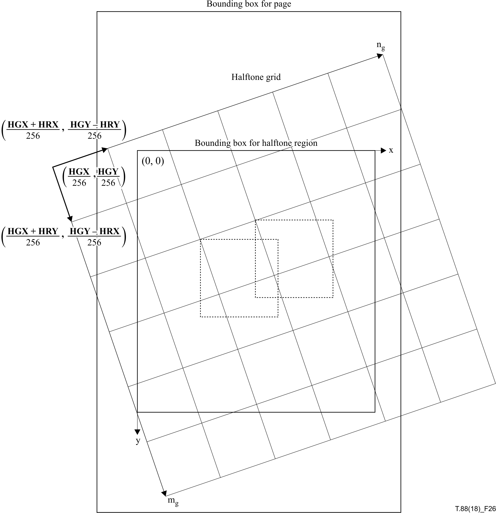

Figure 26 – Specification of coordinate systems and grid parameters

Table 23 – Parameters used to decode a halftone region's gray-scale value array

<table style="width:58%;">
<colgroup>
<col style="width: 29%" />
<col style="width: 29%" />
</colgroup>
<tbody>
<tr>
<td>Name</td>
<td>Value</td>
</tr>
<tr>
<td><strong>GSMMR</strong></td>
<td><strong>HMMR</strong></td>
</tr>
<tr>
<td><strong>GSW</strong></td>
<td><strong>HGW</strong></td>
</tr>
<tr>
<td><strong>GSH</strong></td>
<td><strong>HGH</strong></td>
</tr>
<tr>
<td><strong>GSBPP</strong></td>
<td>HBPP</td>
</tr>
<tr>
<td><strong>GSUSESKIP</strong></td>
<td><strong>HENABLESKIP</strong></td>
</tr>
<tr>
<td><strong>GSKIP</strong></td>
<td>HSKIP a)</td>
</tr>
<tr>
<td><strong>GSTEMPLATE</strong></td>
<td><strong>HTEMPLATE</strong> b)</td>
</tr>
<tr>
<td colspan="2">
a) If <strong>HENABLESKIP = 0</strong> then this parameter has no value.

b) If <strong>HMMR = 1</strong> then this parameter has no value.
</td>
</tr>
</tbody>
</table>

#### 6.6.5.2 Rendering the patterns

Draw the patterns into HTREG using the following procedure:

1\) For each value of *mg* between 0 and **HGH** – 1, beginning from 0, perform the following steps.

a\) For each value of *ng* between 0 and **HGW** – 1, beginning from 0, perform the following steps.

i\) Set:

*x*  =  (**HGX**  +  *mg*  ×  **HRY**  +  *ng*  ×  **HRX**)  \>\>  *A* 8  
*y*  =  (**HGY**  +  *mg*  ×  **HRX**  –  *ng*  ×  **HRY**)  \>\>  *A* 8

ii\) Draw the pattern **HPATS**\[GI\[*ng*, *mg*\]\] into HTREG such that its upper left pixel is at location (*x*, *y*) in HTREG.

A pattern is drawn into HTREG as follows. Each pixel of the pattern shall be combined with the current value of the corresponding pixel in the halftone-coded bitmap, using the combination operator specified by **HCOMBOP**. The results of each combination shall be written into that pixel in the halftone-coded bitmap.

If any part of a decoded pattern, when placed at location (*x*, *y*) lies outside the actual halftone-coded bitmap, then this part of the pattern shall be ignored in the process of combining the pattern with the bitmap.

NOTE – The gray-scale image can be used by the decoder to get a good rendition of the halftone on a multi-level output device of limited spatial resolution such as a computer screen. The use of the gray-scale image for such purposes is outside the scope of this Recommendation \| International Standard.

The gray-scale image is coded by bit-plane coding so the decoder will receive the gray-scale image progressively. Consequently, the decoder may render a halftoned image using the quantized gray-scale values as indices. Such intermediate halftoned images shall not influence the final halftone-coded bitmap.

## 6.7 Pattern Dictionary Decoding Procedure

### 6.7.1 General description

This decoding procedure is used to decode a set of fixed-size patterns; these patterns can then be used by halftone region decoding procedures.

### 6.7.2 Input parameters

The parameters to this decoding procedure are shown in Table 24.

Table 24 – Parameters for the pattern dictionary decoding procedure

<table style="width:94%;">
<colgroup>
<col style="width: 19%" />
<col style="width: 10%" />
<col style="width: 6%" />
<col style="width: 9%" />
<col style="width: 47%" />
</colgroup>
<tbody>
<tr>
<td>Name</td>
<td>Type</td>
<td>Size 
(bits)</td>
<td>Signed?</td>
<td>Description and restrictions</td>
</tr>
<tr>
<td><strong>HDMMR</strong></td>
<td style="text-align: center;">Integer</td>
<td style="text-align: center;">1</td>
<td style="text-align: center;">N</td>
<td>Whether MMR is used.</td>
</tr>
<tr>
<td><strong>HDPW</strong></td>
<td style="text-align: center;">Integer</td>
<td style="text-align: center;">32</td>
<td style="text-align: center;">N</td>
<td>The width of each pattern.</td>
</tr>
<tr>
<td><strong>HDPH</strong></td>
<td style="text-align: center;">Integer</td>
<td style="text-align: center;">32</td>
<td style="text-align: center;">N</td>
<td>The height of each pattern.</td>
</tr>
<tr>
<td><strong>GRAYMAX</strong></td>
<td style="text-align: center;">Integer</td>
<td style="text-align: center;">32</td>
<td style="text-align: center;">N</td>
<td>The largest gray-scale value for which a pattern is given.</td>
</tr>
<tr>
<td><strong>HDTEMPLATE</strong></td>
<td style="text-align: center;">Integer</td>
<td style="text-align: center;">2</td>
<td style="text-align: center;">N</td>
<td>The template used to code the patterns.a)</td>
</tr>
<tr>
<td colspan="5">a) Unused if <strong>HDMMR = 1</strong>.</td>
</tr>
</tbody>
</table>

### 6.7.3 Return value

The variable whose value is the result of this decoding procedure is shown in Table 25.

Table 25 – Return value from the pattern dictionary decoding procedure

<table style="width:94%;">
<colgroup>
<col style="width: 19%" />
<col style="width: 10%" />
<col style="width: 6%" />
<col style="width: 9%" />
<col style="width: 47%" />
</colgroup>
<tbody>
<tr>
<td>Name</td>
<td>Type</td>
<td>Size 
(bits)</td>
<td>Signed?</td>
<td>Description and restrictions</td>
</tr>
<tr>
<td><strong>HDPATS</strong></td>
<td colspan="3">Array of patterns</td>
<td>The patterns exported by this pattern dictionary. Contains <strong>GRAYMAX</strong> + 1 patterns.</td>
</tr>
</tbody>
</table>

### 6.7.4 Variables used in decoding

The variables used by this decoding procedure are shown in Table 26.

Table 26 – Variables used in the pattern dictionary decoding procedure

<table style="width:94%;">
<colgroup>
<col style="width: 19%" />
<col style="width: 10%" />
<col style="width: 6%" />
<col style="width: 9%" />
<col style="width: 47%" />
</colgroup>
<tbody>
<tr>
<td>Name</td>
<td>Type</td>
<td>Size 
(bits)</td>
<td>Signed?</td>
<td>Description and restrictions</td>
</tr>
<tr>
<td>GRAY</td>
<td>Integer</td>
<td>32</td>
<td>N</td>
<td>Gray-scale index.</td>
</tr>
<tr>
<td><em>BHDC</em></td>
<td colspan="3">Bitmap</td>
<td>The dictionary collective bitmap.</td>
</tr>
<tr>
<td><em>BP</em></td>
<td colspan="3">Bitmap</td>
<td>A bitmap of size <strong>HDPW</strong> by <strong>HDPH</strong>.</td>
</tr>
</tbody>
</table>

### 6.7.5 Decoding the pattern dictionary

The result of decoding a pattern dictionary is a set of patterns: **HDPATS\[0\]** · · · **HDPATS\[GRAYMAX\]**. These patterns shall be the patterns produced by the following steps:

1\) Create a bitmap *BHDC*. The height of this bitmap is **HDPH**. The width of the bitmap is (**GRAYMAX** + 1) × **HDPW**. This bitmap contains all the patterns concatenated left to right.

2\) Decode the collective bitmap using a generic region decoding procedure as described in 6.2. Set the parameters to this decoding procedure as shown in Table 27.

3\) Set:

GRAY  =  0

4\) While GRAY ≤ **GRAYMAX**:

a\) Let the subimage of *BHDC* consisting of **HPH** rows and columns **HDPW** × GRAY through **HDPW** × (GRAY + 1) – 1 be denoted *BP* . Set:

**HDPATS**\[GRAY\]  =  *BP*

b\) Set:

GRAY  =  GRAY  +  1

Table 27 – Parameters used to decode a pattern dictionary's collective bitmap

<table style="width:70%;">
<colgroup>
<col style="width: 34%" />
<col style="width: 34%" />
</colgroup>
<tbody>
<tr>
<td>Name</td>
<td>Value</td>
</tr>
<tr>
<td><strong>MMR</strong></td>
<td><strong>HDMMR</strong></td>
</tr>
<tr>
<td><strong>GBW</strong></td>
<td><strong>(GRAYMAX + 1) × HDPW</strong></td>
</tr>
<tr>
<td><strong>GBH</strong></td>
<td><strong>HDPH</strong></td>
</tr>
<tr>
<td><strong>GBTEMPLATE</strong></td>
<td><strong>HDTEMPLATEa)</strong></td>
</tr>
<tr>
<td><strong>TPGDON</strong></td>
<td><strong>0a)</strong></td>
</tr>
<tr>
<td><strong>USESKIP</strong></td>
<td><strong>0</strong></td>
</tr>
<tr>
<td><strong>GBATX1</strong></td>
<td><strong>–HDPWa)</strong></td>
</tr>
<tr>
<td><strong>GBATY1</strong></td>
<td>0a)</td>
</tr>
<tr>
<td><strong>GBATX2</strong></td>
<td>–3b)</td>
</tr>
<tr>
<td><strong>GBATY2</strong></td>
<td>–1b)</td>
</tr>
<tr>
<td><strong>GBATX3</strong></td>
<td>2b)</td>
</tr>
<tr>
<td><strong>GBATY3</strong></td>
<td>–2b)</td>
</tr>
<tr>
<td><strong>GBATX4</strong></td>
<td>–2b)</td>
</tr>
<tr>
<td><strong>GBATY4</strong></td>
<td>–2b)</td>
</tr>
<tr>
<td colspan="2">
a) If <strong>HDMMR = 1</strong> then this parameter has no value.

b) If <strong>HDMMR = 1</strong> or <strong>HDTEMPLATE ≠ 0</strong> then this parameter has no value.
</td>
</tr>
</tbody>
</table>

**6.8 Colour palette decoding procedure**

**6.8.1 General description**

This decoding procedure is used to decode a set of colours; these colours can then be used by generic and text region decoding procedures.

**6.8.2 Input parameters**

The colour palette segment requires no input parameter.

The parameters to this decoding procedure are shown in Table 28.

Table 28 – Parameters for the colour palette decoding procedure

<table style="width:99%;">
<colgroup>
<col style="width: 17%" />
<col style="width: 10%" />
<col style="width: 10%" />
<col style="width: 13%" />
<col style="width: 46%" />
</colgroup>
<thead>
<tr>
<th>Name</th>
<th style="text-align: center;">Type</th>
<th style="text-align: center;">Size 
(bits)</th>
<th style="text-align: center;">Signed?</th>
<th>Description and restrictions</th>
</tr>
</thead>
<tbody>
<tr>
<td><strong>CPNCOMP</strong></td>
<td style="text-align: center;">Integer</td>
<td style="text-align: center;">8</td>
<td style="text-align: center;">N</td>
<td>The number of colour components.</td>
</tr>
<tr>
<td><strong>CPCOMPLEN</strong></td>
<td style="text-align: center;">Integer</td>
<td style="text-align: center;">8</td>
<td style="text-align: center;">N</td>
<td>The length (in bytes) of each component's value. Make take on the values 1, 2 or 4.</td>
</tr>
<tr>
<td><strong>CPNVALS</strong></td>
<td style="text-align: center;">Integer</td>
<td style="text-align: center;">8</td>
<td style="text-align: center;">N</td>
<td>The number of colour values coded in this segment.</td>
</tr>
</tbody>
</table>

**6.8.3 Return value**

The variable whose value is the result of this decoding procedure is shown in Table 29.

Table 29 – Return value from the colour palette decoding procedure

<table style="width:99%;">
<colgroup>
<col style="width: 17%" />
<col style="width: 10%" />
<col style="width: 10%" />
<col style="width: 13%" />
<col style="width: 46%" />
</colgroup>
<thead>
<tr>
<th>Name</th>
<th>Type</th>
<th>Size 
(bits)</th>
<th>Signed?</th>
<th>Description and restrictions</th>
</tr>
</thead>
<tbody>
<tr>
<td>CPDEFCOLS</td>
<td colspan="3">Array of colours</td>
<td>The default colour set.</td>
</tr>
<tr>
<td>CPEXCOLS</td>
<td colspan="3">Array of colours</td>
<td>The colours defined in this segment.</td>
</tr>
</tbody>
</table>

**6.8.4 Decoding the colour palette**

The data part shall be stored as a sequence of the colour value (CVAL) that consists of **CPNCOMP** fields, and each field shall consist of **CPCOMPLEN** octets.

The result of decoding is stored in CPEXCOLS, and the end of the data part shall be determined when the number of CVAL is equal to **CPNVALS**.

**6.8.5 Default colour set**

Thirty-two colours are defined and registered in CPDEFCOLS (default colour set), as shown in Table 30.

<table style="width:68%;">
<colgroup>
<col style="width: 7%" />
<col style="width: 20%" />
<col style="width: 20%" />
<col style="width: 20%" />
</colgroup>
<thead>
<tr>
<th colspan="4" style="text-align: center;">Table 30 – Definition of default colour set</th>
</tr>
<tr>
<th style="text-align: center;">ID</th>
<th style="text-align: center;">Colour name</th>
<th style="text-align: center;">Colour value (RGB)</th>
<th style="text-align: center;">Colour value (Hex)</th>
</tr>
</thead>
<tbody>
<tr>
<td style="text-align: center;">0</td>
<td style="text-align: center;">Black</td>
<td style="text-align: center;">0, 0, 0</td>
<td style="text-align: center;">#000000</td>
</tr>
<tr>
<td style="text-align: center;">1</td>
<td style="text-align: center;">Gray</td>
<td style="text-align: center;">128, 128, 128</td>
<td style="text-align: center;">#808080</td>
</tr>
<tr>
<td style="text-align: center;">2</td>
<td style="text-align: center;">Silver</td>
<td style="text-align: center;">192, 192, 192</td>
<td style="text-align: center;">#c0c0c0</td>
</tr>
<tr>
<td style="text-align: center;">3</td>
<td style="text-align: center;">White</td>
<td style="text-align: center;">255, 255, 255</td>
<td style="text-align: center;">#ffffff</td>
</tr>
<tr>
<td style="text-align: center;">4</td>
<td style="text-align: center;">Red</td>
<td style="text-align: center;">255, 0, 0</td>
<td style="text-align: center;">#ff0000</td>
</tr>
<tr>
<td style="text-align: center;">5</td>
<td style="text-align: center;">Lime</td>
<td style="text-align: center;">0, 255, 0</td>
<td style="text-align: center;">#00ff00</td>
</tr>
<tr>
<td style="text-align: center;">6</td>
<td style="text-align: center;">Blue</td>
<td style="text-align: center;">0, 0, 255</td>
<td style="text-align: center;">#0000ff</td>
</tr>
<tr>
<td style="text-align: center;">7</td>
<td style="text-align: center;">Yellow</td>
<td style="text-align: center;">255, 255, 0-</td>
<td style="text-align: center;">#ffff00</td>
</tr>
<tr>
<td style="text-align: center;">8</td>
<td style="text-align: center;">Aqua</td>
<td style="text-align: center;">0, 255, 255</td>
<td style="text-align: center;">#00ffff</td>
</tr>
<tr>
<td style="text-align: center;">9</td>
<td style="text-align: center;">Fuchsia</td>
<td style="text-align: center;">255, 0, 255</td>
<td style="text-align: center;">#ff00ff</td>
</tr>
<tr>
<td style="text-align: center;">10</td>
<td style="text-align: center;">Maroon</td>
<td style="text-align: center;">128, 0, 0</td>
<td style="text-align: center;">#800000</td>
</tr>
<tr>
<td style="text-align: center;">11</td>
<td style="text-align: center;">Green</td>
<td style="text-align: center;">0, 128, 0</td>
<td style="text-align: center;">#008000</td>
</tr>
<tr>
<td style="text-align: center;">12</td>
<td style="text-align: center;">Navy</td>
<td style="text-align: center;">0, 0, 128</td>
<td style="text-align: center;">#000080</td>
</tr>
<tr>
<td style="text-align: center;">13</td>
<td style="text-align: center;">Olive</td>
<td style="text-align: center;">128, 128, 0</td>
<td style="text-align: center;">#808000</td>
</tr>
<tr>
<td style="text-align: center;">14</td>
<td style="text-align: center;">Teal</td>
<td style="text-align: center;">0, 128, 128</td>
<td style="text-align: center;">#008080</td>
</tr>
<tr>
<td style="text-align: center;">15</td>
<td style="text-align: center;">Purple</td>
<td style="text-align: center;">128, 0, 128</td>
<td style="text-align: center;">#800080</td>
</tr>
<tr>
<td style="text-align: center;">16</td>
<td style="text-align: center;">Orange</td>
<td style="text-align: center;">255, 165, 0</td>
<td style="text-align: center;">#ffa500</td>
</tr>
<tr>
<td style="text-align: center;">17</td>
<td style="text-align: center;"></td>
<td style="text-align: center;">204, 204, 0</td>
<td style="text-align: center;">#cccc00</td>
</tr>
<tr>
<td style="text-align: center;">18</td>
<td style="text-align: center;"></td>
<td style="text-align: center;">153, 0, 0</td>
<td style="text-align: center;">#990000</td>
</tr>
<tr>
<td style="text-align: center;">19</td>
<td style="text-align: center;"></td>
<td style="text-align: center;">0, 204, 0</td>
<td style="text-align: center;">#00cc00</td>
</tr>
<tr>
<td style="text-align: center;">20</td>
<td style="text-align: center;"></td>
<td style="text-align: center;">0, 153, 0</td>
<td style="text-align: center;">#009900</td>
</tr>
<tr>
<td style="text-align: center;">21</td>
<td style="text-align: center;"></td>
<td style="text-align: center;">204, 204, 0</td>
<td style="text-align: center;">#cccc00</td>
</tr>
<tr>
<td style="text-align: center;">22</td>
<td style="text-align: center;"></td>
<td style="text-align: center;">153, 153, 0</td>
<td style="text-align: center;">#999900</td>
</tr>
<tr>
<td style="text-align: center;">23</td>
<td style="text-align: center;"></td>
<td style="text-align: center;">102, 0, 0</td>
<td style="text-align: center;">#660000</td>
</tr>
<tr>
<td style="text-align: center;">24</td>
<td style="text-align: center;"></td>
<td style="text-align: center;">0, 0, 204</td>
<td style="text-align: center;">#0000cc</td>
</tr>
<tr>
<td style="text-align: center;">25</td>
<td style="text-align: center;"></td>
<td style="text-align: center;">0, 0, 153</td>
<td style="text-align: center;">#000099</td>
</tr>
<tr>
<td style="text-align: center;">26</td>
<td style="text-align: center;"></td>
<td style="text-align: center;">204, 0, 204</td>
<td style="text-align: center;">#cc00cc</td>
</tr>
<tr>
<td style="text-align: center;">27</td>
<td style="text-align: center;"></td>
<td style="text-align: center;">153, 0, 153</td>
<td style="text-align: center;">#990099</td>
</tr>
<tr>
<td style="text-align: center;">28</td>
<td style="text-align: center;"></td>
<td style="text-align: center;">0, 204, 204</td>
<td style="text-align: center;">#00cccc</td>
</tr>
<tr>
<td style="text-align: center;">29</td>
<td style="text-align: center;"></td>
<td style="text-align: center;">0, 153, 153</td>
<td style="text-align: center;">#009999</td>
</tr>
<tr>
<td style="text-align: center;">30</td>
<td style="text-align: center;"></td>
<td style="text-align: center;">102, 102, 102</td>
<td style="text-align: center;">#666666</td>
</tr>
<tr>
<td style="text-align: center;">31</td>
<td style="text-align: center;"></td>
<td style="text-align: center;">153, 153, 153</td>
<td style="text-align: center;">#999999</td>
</tr>
</tbody>
</table>

> NOTE 1 – The default colour set in Table 30 includes the standard colours defined in the Cascading Style Sheets Level 2 Revision 1 (CSS 2.1) Specification (http://www.w3.org/TR/CSS2/).
>
> NOTE 2 – If there is no region segment in which the colour palette ID or the largest element of the colour palette IDs is equal to or smaller than 32, the elements recorded in the colour palette segment are never used in any region segment. Therefore, the colour palette sections are not always required even if the documents include segments with colour extension.

# 7 Control Decoding Procedure

## 7.1 General description

This decoding procedure controls the invocation of all the other decoding procedure. The encoded bitstream consists of a collection of segments, each containing a part of the data necessary for decoding. There are several different types of segments.

A segment has two parts: a segment header part and a segment data part. All types of segments use a common format for the segment header, but different formats for segment data.

Some segments give information about the structure of the document: start of page, end of page, and so on. Some segments code regions, used in turn to produce the decoded image of a certain page. Some segments ("dictionary segments") do neither, but instead define resources that can be used by segments that code regions.

A segment can be associated with some page, or not associated with any page. A segment can refer to other, preceding, segments. A segment also includes retention bits for the segment that it refers to, and for itself; these indicate when the decoder may discard the data created by decoding a segment.

EXAMPLE – A text region segment may make use of symbols defined in preceding symbol dictionary segments. This is indicated by the text region's segment header referring to those symbol dictionary segments.

The format of segment headers is described in 7.2. The types of segments are defined in 7.3. The syntax of each type of segment is defined in 7.4.

In the following, some references are made to "preceding" and "following" segments (and other indications implying an order of segments). These terms are defined with reference to the order imposed on the segments by their segment numbers: a segment precedes all segments whose segment numbers are larger than its segment number. In the sequential and random-access organizations (see D.1 and D.2), the segments must appear in the file in increasing order of their segment numbers. However, in the embedded organization (see D.3), this is not the case because the JBIG2 segments are encapsulated in another file format.

NOTE – It is possible for there to be gaps in the segment numbering. A JBIG2 file might contain segments numbered 2, 3, 4, 8 and 10. This can occur due to editing: the segment numbers might originally have been contiguous, but at some point in the life of the file some pages were deleted and the remaining segments not renumbered.

A segment's header part always begins and ends on a byte boundary.

A segment's data part always begins and ends on a byte boundary. Any unused bits in the final byte of a segment must contain **0**, and shall not be examined by the decoder.

The segment header part and the segment data part of a segment need not occur contiguously in the bitstream being decoded. See Annex D for an organization where the segment header part of a segment may be stored at some distance from the segment data part of that segment.

This clause contains figures that describe various parts of the encoded data, such as Figures 27 and 33. These conventions used in these figures are:

• The first byte encountered in the bitstream is at the left end.

• Fields whose sizes are fixed, and that are always present, are outlined with narrow lines.

• Fields whose sizes are not fixed, or that are not present in all cases, or whose structures are fully described elsewhere, are outlined with heavy lines.

• Some figures (such as Figure 27) are divided into fields, each of which is an integral number of bytes long. In these figures, hash marks extending down from the top of the figure denote byte boundaries, and fields are separated by lines running the full height of the figure.

• The remaining figures are divided into fields, each of which is an integral number of bits long, making up an integral number of bytes. In these figures, short hash marks extending up from the bottom of the figure show bit boundaries. Fields are separated by longer hash marks extending up from the bottom of the figure. Each bit's number is shown below the figure.

## 7.2 Segment header syntax

### 7.2.1 Segment header fields

A segment header contains the fields shown in Figure 27 and described below.

<table style="width:97%;">
<colgroup>
<col style="width: 4%" />
<col style="width: 4%" />
<col style="width: 4%" />
<col style="width: 4%" />
<col style="width: 11%" />
<col style="width: 17%" />
<col style="width: 17%" />
<col style="width: 14%" />
<col style="width: 4%" />
<col style="width: 4%" />
<col style="width: 4%" />
<col style="width: 4%" />
</colgroup>
<tbody>
<tr>
<td></td>
<td></td>
<td></td>
<td></td>
<td rowspan="2" style="text-align: center;">Segment 
header 
flags</td>
<td rowspan="2" style="text-align: center;">Referred-to segment count and 
retention flags</td>
<td rowspan="2" style="text-align: center;">Referred-to segment numbers</td>
<td rowspan="2" style="text-align: center;">Segment page 
association</td>
<td></td>
<td></td>
<td></td>
<td></td>
</tr>
<tr>
<td colspan="4" style="text-align: center;">Segment number</td>
<td colspan="4" style="text-align: center;">Segment data length</td>
</tr>
</tbody>
</table>

Figure 27 – Segment header structure

**Segment number** – see 7.2.2.

**Segment header flags** – see 7.2.3.

**Referred-to segment count and retention flags** – see 7.2.4.

**Referred-to segment number fields** – see 7.2.5.

**Segment page association** – see 7.2.6.

**Segment data length** – see 7.2.7.

### 7.2.2 Segment number

This four-byte field contains the segment's segment number. The valid range of segment numbers is 0 through 4294967295 (0xFFFFFFFF) inclusive. As mentioned before, it is possible for there to be gaps in the segment numbering.

### 7.2.3 Segment header flags

This is a 1-byte field. The bits that are defined are shown in Figure 28 and are described below.

<table style="width:70%;">
<colgroup>
<col style="width: 8%" />
<col style="width: 8%" />
<col style="width: 8%" />
<col style="width: 8%" />
<col style="width: 8%" />
<col style="width: 8%" />
<col style="width: 8%" />
<col style="width: 8%" />
</colgroup>
<tbody>
<tr>
<td style="text-align: center;">Deferred 
non-retain</td>
<td style="text-align: center;">Page 
association 
size</td>
<td colspan="6" style="text-align: center;">Segment type</td>
</tr>
<tr>
<td style="text-align: center;"></td>
<td style="text-align: center;"></td>
<td style="text-align: center;"></td>
<td style="text-align: center;"></td>
<td style="text-align: center;"></td>
<td style="text-align: center;"></td>
<td style="text-align: center;"></td>
<td style="text-align: center;"></td>
</tr>
<tr>
<td style="text-align: center;"></td>
<td style="text-align: center;"></td>
<td style="text-align: center;"></td>
<td style="text-align: center;"></td>
<td style="text-align: center;"></td>
<td style="text-align: center;"></td>
<td style="text-align: center;"></td>
<td style="text-align: center;"></td>
</tr>
<tr>
<td style="text-align: center;">7</td>
<td style="text-align: center;">6</td>
<td style="text-align: center;">5</td>
<td style="text-align: center;">4</td>
<td style="text-align: center;">3</td>
<td style="text-align: center;">2</td>
<td style="text-align: center;">1</td>
<td style="text-align: center;">0</td>
</tr>
</tbody>
</table>

Figure 28 – Segment header flags

**Bits 0-5** Segment type. See 7.3.

**Bit 6** Page association field size. See 7.2.6.

**Bit 7** Deferred non-retain. If this bit is **1**, this segment is flagged as retained only by itself and its attached extension segments, and is flagged as non-retained by the last attached extension segments. An extension segment is an attached extension segment when it refers to only one segment, and the only segments (if any) between it and that referred-to segment are other extension segments also referring only to that referred-to segment.

NOTE – The intention of this bit is to indicate to the decoder that the segment is only referred to by a small number of extension segments. The decoder may take some expensive actions when segments are flagged as retained, but if this retention is only for the benefit of the segment's attached extension segments, these actions may not be necessary. Knowing this in advance is helpful.

### 7.2.4 Referred-to segment count and retention flags

This field contains one or more bytes indicating how many other segments are referred to by this segment, and which segments contain data that is needed after this segment.

NOTE – The decoder's memory requirements can be reduced by letting it know when it is allowed to forget about the data represented by some previous segment.

The number of bytes in this field depends on the number of segments referred to by this segment. If this segment refers to four or fewer segments, then this field is one byte long. If this segment refers to more than four segments, then this field is 4 + (R + 1)/8 bytes long where R is the number of segments that this segment refers to.

EXAMPLE – If this segment refers to between five and seven other segments, then the field is five bytes long; if it refers to between eight and fifteen other segments, then the field is six bytes long.

The three most significant bits of the first byte in this field determine the length of the field. If the value of this three-bit subfield is between 0 and 4, then the field is one byte long. If the value of this three-bit subfield is 7, then the field is at least five bytes long. This three-bit subfield must not contain values of 5 and 6.

In the case where the field is one byte long, that byte is formatted as shown in Figure 29 and as described below.

<table style="width:70%;">
<colgroup>
<col style="width: 8%" />
<col style="width: 8%" />
<col style="width: 8%" />
<col style="width: 8%" />
<col style="width: 8%" />
<col style="width: 8%" />
<col style="width: 8%" />
<col style="width: 8%" />
</colgroup>
<tbody>
<tr>
<td colspan="3" style="text-align: center;">Count of referred-to 
segments</td>
<td style="text-align: center;">Retain bit 
for 4th 
segment</td>
<td style="text-align: center;">Retain bit 
for 3rd 
segment</td>
<td style="text-align: center;">Retain bit 
for 2nd 
segment</td>
<td style="text-align: center;">Retain bit 
for 1st 
segment</td>
<td style="text-align: center;">Retain bit 
for this 
segment</td>
</tr>
<tr>
<td style="text-align: center;"></td>
<td style="text-align: center;"></td>
<td style="text-align: center;"></td>
<td style="text-align: center;"></td>
<td style="text-align: center;"></td>
<td style="text-align: center;"></td>
<td style="text-align: center;"></td>
<td style="text-align: center;"></td>
</tr>
<tr>
<td style="text-align: center;"></td>
<td style="text-align: center;"></td>
<td style="text-align: center;"></td>
<td style="text-align: center;"></td>
<td style="text-align: center;"></td>
<td style="text-align: center;"></td>
<td style="text-align: center;"></td>
<td style="text-align: center;"></td>
</tr>
<tr>
<td style="text-align: center;">7</td>
<td style="text-align: center;">6</td>
<td style="text-align: center;">5</td>
<td style="text-align: center;">4</td>
<td style="text-align: center;">3</td>
<td style="text-align: center;">2</td>
<td style="text-align: center;">1</td>
<td style="text-align: center;">0</td>
</tr>
</tbody>
</table>

Figure 29 – Referred-to segment count and retention flags – short form

**Bit 0** Retain bit for this segment.

**Bit 1** Retain bit for the first referred-to segment. If this segment refers to no other segments, this field must contain **0**.

**Bit 2** Retain bit for the second referred-to segment. If this segment refers to fewer than two other segments, this field must contain **0**.

**Bit 3** Retain bit for the third referred-to segment. If this segment refers to fewer than three other segments, this field must contain **0**.

**Bit 4** Retain bit for the fourth referred-to segment. If this segment refers to fewer than four other segments, this field must contain **0**.

**Bits 5-7** Count of referred-to segments. This field may take on values between zero and four. This specifies the number of segments that this segment refers to.

In the case where the field is in the long format (at least five bytes long), it is composed of an initial four-byte field, followed by a succession of one-byte fields. The initial four-byte field is formatted as follows.

**Bits 0-28** Count of referred-to segments. This specifies the number of segments that this segment refers to.

**Bits 29-31** Indication of long-form format. This field must contain the value 7.

The first one-byte field following the initial four-byte field is formatted as follows.

**Bit 0** Retain bit for this segment.

**Bit 1** Retain bit for the first referred-to segment.

**Bit 2** Retain bit for the second referred-to segment.

**Bit 3** Retain bit for the third referred-to segment.

**Bit 4** Retain bit for the fourth referred-to segment.

**Bit 5** Retain bit for the fifth referred-to segment. If this segment refers to fewer than five other segments, this field must contain **0**.

**Bit 6** Retain bit for the sixth referred-to segment. If this segment refers to fewer than six other segments, this field must contain **0**.

**Bit 7** Retain bit for the seventh referred-to segment. If this segment refers to fewer than seven other segments, this field must contain **0**.

The second one-byte field, if present, contains retain bits for the eighth through fifteenth referred-to segments; the bits corresponding to any segments beyond the count of segments actually referred to must be **0**. Succeeding one-byte fields are formatted similarly.

If the retain bit for this segment value is **0**, then no segment may refer to this segment.

If the retain bit for the first referred-to segment value is **0**, then no segment after this one may refer to the first segment that this segment refers to (i.e., this segment is the last segment that refers to that other segment). Further retain bit values have similar meanings: if the retain bit for the Kth referred-to segment value is **0**, then no segment after this one may refer to the Kth segment that this segment refers to.

### 7.2.5 Referred-to segment numbers

This field contains the segment numbers of the segments that this segment refers to, if any. The number of values in this field is determined by the referred-to segment count and retention flags field. Each value is the segment number of a segment that this segment refers to. If a segment refers to other segments, it must refer to only segments with lower segment numbers. When the current segment's number is 256 or less, then each referred-to segment number is one byte long. Otherwise, when the current segment's number is 65536 or less, each referred-to segment number is two bytes long. Otherwise, each referred-to segment number is four bytes long.

### 7.2.6 Segment page association

This field encodes the number of the page to which this segment belongs. The first page must be numbered "1". This field may contain a value of zero; this value indicates that this segment is not associated with any page.

A segment that has a non-zero segment page association may only be referred to by segments having the same segment page association value as it.

This field is one byte long if this segment's page association field size flag bit is **0**, and is four bytes long if this segment's page association field size flag bit is **1**.

> NOTE – Most documents have fewer than 256 pages, so this field has a short form that can hold values from 0 to 255 in a single byte. The page association field for unassociated segments can also be only a single byte long.

### 7.2.7 Segment data length

This 4-byte field contains the length of the segment's segment data part, in bytes.

If the segment's type is "Immediate generic region", then the length field may contain the value 0xFFFFFFFF. This value is intended to mean that the length of the segment's data part is unknown at the time that the segment header is written (for example in a streaming application such as facsimile). In this case, the true length of the segment's data part shall be determined through examination of the data: if the segment uses template-based arithmetic coding, then the segment's data part ends with the two-byte sequence 0xFF 0xAC followed by a four-byte row count. If the segment uses MMR coding, then the segment's data part ends with the two-byte sequence 0x00 0x00 followed by a four-byte row count. The form of encoding used by the segment may be determined by examining the eighteenth byte of its segment data part, and the end sequences can occur anywhere after that eighteenth byte.

> NOTE – Given a list of segment headers in the random-access organization (see Figure D.2), a decoder can build a map of the rest of the file by knowing the length of the data associated with each segment. This allows it to perform random access.

### 7.2.8 Segment header example

EXAMPLE 1 – A segment header consisting of the sequence of bytes:

> 0x00  0x00  0x00  0x20  0x86  0x6B  0x02  0x1E  0x05  0x04

is parsed as follows:

**0x00**  **0x00**  **0x00**  **0x20**  This segment's number is 0x00000020, or 32 decimal.

**0x86**  This segment's type is 6. Its page association field is one byte long. It is retained by only its attached extension segments.

**0x6B**  This segment refers to three other segments. It is referred to by some other segment. This is the last reference to the second of the three segments that it refers to.

**0x02**  **0x1E**  **0x05**  The three segments that it refers to are numbers 2, 30, and 5.

**0x04**  This segment is associated with page number 4.

EXAMPLE 2 – A segment header consisting of the sequence of bytes, in hexadecimal:

|     |     |     |     |     |     |     |     |     |     |     |     |     |     |     |     |
|-----|-----|-----|-----|-----|-----|-----|-----|-----|-----|-----|-----|-----|-----|-----|-----|
| 00  | 00  | 02  | 34  | 40  | E0  | 00  | 00  | 09  | 02  | FD  | 01  | 00  | 00  | 02  | 00  |
| 1E  | 00  | 05  | 02  | 00  | 02  | 01  | 02  | 02  | 02  | 03  | 02  | 04  | 00  | 00  | 04  |
| 01  |     |     |     |     |     |     |     |     |     |     |     |     |     |     |     |

is parsed as follows:

**00**  **00**  **02**  **34**  This segment's number is 0x00000234, or 564 decimal.

**40**  This segment's type is 0. Its page association field is four bytes long.

**E0**  **00**  **00**  **09**  This segment's referred-to segment count field is in the long format. This segment refers to nine other segments.

**02**  **FD**  This segment is referred to by some other segment. This is the last reference to the first and eighth of the nine segments that it refers to.

**01**  **00**  **...**   **02**  **04**  The nine segments that it refers to are each identified by two bytes, since this segment's number is between 256 and 65535. The segments that it refers to are, in decimal, numbers 256, 2, 30, 5, 512, 513, 514, 515, and 516.

**00**  **00**  **04**  **01**  This segment is associated with page number 1025.

## 7.3 Segment t ypes

Each segment has a certain type. This type specifies the type of the data associated with the segment. This type restricts which other segments it may refer to, and which other segments may refer to it. These restrictions are detailed in 7.3.1.

The segment type is a number between 0 and 63, inclusive. Not all values are allowed. The allowed list of segment types, their full names, and where their formats are defined, are:

**0** Symbol dictionary – see 7.4.2.

**4** Intermediate text region – see 7.4.3.

**6** Immediate text region – see 7.4.3.

**7** Immediate lossless text region – see 7.4.3.

**16** Pattern dictionary – see 7.4.4.

**20** Intermediate halftone region – see 7.4.5.

**22** Immediate halftone region – see 7.4.5.

**23** Immediate lossless halftone region – see 7.4.5.

**36** Intermediate generic region – see 7.4.6.

**38** Immediate generic region – see 7.4.6.

**39** Immediate lossless generic region – see 7.4.6.

**40** Intermediate generic refinement region – see 7.4.7.

**42** Immediate generic refinement region – see 7.4.7.

**43** Immediate lossless generic refinement region – see 7.4.7.

**48** Page information – see 7.4.8.

**49** End of page – see 7.4.9.

**50** End of stripe – see 7.4.10.

**51** End of file – see 7.4.11.

**52** Profiles – see 7.4.12.

**53** Tables – see 7.4.13.

**54** Colour palette – see 7.4.16

**62** Extension – see 7.4.14.

All other segment types are reserved and must not be used.

NOTE – These segment type numbers are allocated according to the following rules. The two high-order bits (bits 4-5) of this number specify the primary type of the segment, and the four low-order (bits 0-3) bits specify the secondary type of the segment.

The primary types are:

**0** Symbol bitmap data

**1** Halftone bitmap data

**2** Generic bitmap data

**3** Metadata

Primary types 0-2 are collectively referred to as region types.

For the region types, the interpretation of the four low-order bits is:

**Bit 0** If this bit is **1**, it indicates that the segment makes some region of the page lossless.

**Bit 1** If this bit is **1**, it indicates that the segment can be drawn immediately into the page bitmap. If this bit is **0**, it indicates that the segment is an intermediate segment. See 8.2.

**Bits 2-3** These two bits define a subtype of the primary type:

**0**  Dictionary

**1**  Direct Region

**2**  Refinement Region

For metadata, the interpretations of the four low-order bits are:

**0** Page information

**1** End of page

**2** End of stripe

**3** End of file

**4** Profiles

**5** Tables

**6-13** Reserved

**14** Extension

**15** Reserved

The segments of types "intermediate text region", "immediate text region", "immediate lossless text region", "intermediate halftone region", "immediate halftone region", "immediate lossless halftone region", "intermediate generic region", "immediate generic region", "immediate lossless generic region", "intermediate generic refinement region", "immediate generic refinement region", and "immediate lossless generic refinement region" are collectively referred to as "region segments".

The segments of types "intermediate text region", "immediate text region", "immediate lossless text region", "intermediate halftone region", "immediate halftone region", "immediate lossless halftone region", "intermediate generic region", "immediate generic region", and "immediate lossless generic region", are collectively referred to as "direct region segments".

The segments of types "intermediate text region", "intermediate halftone region", "intermediate generic region", and "intermediate generic refinement region" are collectively referred to as "intermediate region segments".

The segments of types "immediate text region", "immediate lossless text region", "immediate halftone region", "immediate lossless halftone region", "immediate generic region", "immediate lossless generic region", "immediate generic refinement region", and "immediate lossless generic refinement region" are collectively referred to as "immediate region segments".

The segments of types "intermediate generic refinement region", "immediate generic refinement region" and "immediate lossless generic refinement region" are collectively referred to as "refinement region segments".

### 7.3.1 Rules for segment references

The rules for segment references are as follows:

• An intermediate region segment may only be referred to by one other non-extension segment; it may be referred to by any number of extension segments.

• A segment of type "symbol dictionary" (type 0) may refer to any number of segments of type "symbol dictionary" and to up to four segments of type "tables".

• A segment of type "intermediate text region", "immediate text region" or "immediate lossless text region" (type 4, 6 or 7) may refer to any number of segments of type "symbol dictionary" and to up to eight segments of type "tables". Additionally, it may refer to any number of segments of type "colour palette segment", if it has **COLEXTFLAG** = 1 in its region segment flags.

• A segment of type "pattern dictionary" (type 16) must not refer to any other segment.

• A segment of type "intermediate halftone region", "immediate halftone region" or "immediate lossless halftone region" (type 20, 22 or 23) must refer to exactly one segment, and this segment must be of type "pattern dictionary".

• A segment of type "intermediate generic region", "immediate generic region" or "immediate lossless generic region" (type 36, 38 or 39) must not refer to any other segment. If it has **COLEXTFLAG** = 1 in its region segment flags, however, it may refer to any number of segments of the type "colour palette segment".

• A segment of type "intermediate generic refinement region" (type 40) must refer to exactly one other segment. This other segment must be an intermediate region segment.

• A segment of type "immediate generic refinement region" or "immediate lossless generic refinement region" (type 42 or 43) may refer to either zero other segments or exactly one other segment. If it refers to one other segment then that segment must be an intermediate region segment.

• A segment of type "page information" (type 48) must not refer to any other segments.

• A segment of type "end of page" (type 49) must not refer to any other segments.

• A segment of type "end of stripe" (type 50) must not refer to any other segments.

• A segment of type "end of file" (type 51) must not refer to any other segments.

• A segment of type "profiles" (type 52) must not refer to any other segments.

• A segment of type "tables" (type 53) must not refer to any other segments.

• A segment of type "extension" (type 62) may refer to any number of segments of any type, unless the extension segment's type imposes some restriction.

• A segment of type "colour palette" (type 54) must not refer to any other segments.

### 7.3.2 Rules for page associations

Every region segment must be associated with some page (i.e., have a non-zero page association field). "Page information", "end of page" and "end of stripe" segments must be associated with some page. "End of file" segments must not be associated with any page. Segments of other types may be associated with a page or not.

If a segment is not associated with any page, then it must not refer to any segment that is associated with any page.

If a segment is associated with a page, then it may refer to segments that are not associated with any page, and to segments that are associated with the same page. It must not refer to any segment that is associated with a different page.

## 7.4 Segment syntaxes

This subclause describes in detail the syntax of the segment data part of each type of segment, and how it is to be decoded.

### 7.4.1 Region segment information field

Every region segment's data part begins with a region segment information field; its format is specified here. A region segment information field contains the following subfields, as shown in Figure 30 and as described below:

<table style="width:83%;">
<colgroup>
<col style="width: 4%" />
<col style="width: 4%" />
<col style="width: 4%" />
<col style="width: 4%" />
<col style="width: 4%" />
<col style="width: 4%" />
<col style="width: 4%" />
<col style="width: 4%" />
<col style="width: 4%" />
<col style="width: 4%" />
<col style="width: 4%" />
<col style="width: 4%" />
<col style="width: 4%" />
<col style="width: 4%" />
<col style="width: 4%" />
<col style="width: 4%" />
<col style="width: 11%" />
</colgroup>
<tbody>
<tr>
<td style="text-align: center;"></td>
<td style="text-align: center;"></td>
<td style="text-align: center;"></td>
<td style="text-align: center;"></td>
<td style="text-align: center;"></td>
<td style="text-align: center;"></td>
<td style="text-align: center;"></td>
<td style="text-align: center;"></td>
<td style="text-align: center;"></td>
<td style="text-align: center;"></td>
<td style="text-align: center;"></td>
<td style="text-align: center;"></td>
<td style="text-align: center;"></td>
<td style="text-align: center;"></td>
<td style="text-align: center;"></td>
<td style="text-align: center;"></td>
<td rowspan="2" style="text-align: center;">Region segment flags</td>
</tr>
<tr>
<td colspan="4" style="text-align: center;">Region segment 
bitmap width</td>
<td colspan="4" style="text-align: center;">Region segment 
bitmap height</td>
<td colspan="4" style="text-align: center;">Region segment 
bitmap X location</td>
<td colspan="4" style="text-align: center;">Region segment 
bitmap Y location</td>
</tr>
</tbody>
</table>

Figure 30 – Region segment data header structure

**Region segment bitmap width** – see 7.4.1.1.

**Region segment bitmap height** – see 7.4.1.2.

**Region segment bitmap X location** – see 7.4.1.3.

**Region segment bitmap Y location** – see 7.4.1.4.

**Region segment flags** – see 7.4.1.5.

#### 7.4.1.1 Region segment bitmap width

This four-byte field gives the width in pixels of the bitmap encoded in this segment.

#### 7.4.1.2 Region segment bitmap height

This four-byte field gives the height in pixels of the bitmap encoded in this segment.

#### 7.4.1.3 Region segment bitmap X location

This four-byte field gives the horizontal offset in pixels of the bitmap encoded in this segment relative to the page bitmap.

#### 7.4.1.4 Region segment bitmap Y location

This four-byte field gives the vertical offset in pixels of the bitmap encoded in this segment relative to the page bitmap.

#### 7.4.1.5 Region segment flags

This one-byte field is formatted as shown in Figure 31 and as described below.

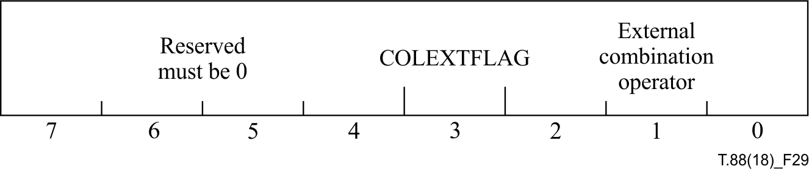

Figure 31 – Region segment flags field structure

**Bits 0-2** External combination operator. This three-bit field can take on the following values, representing one of five possible combination operators:

**0**  OR

**1**  AND

**2**  XOR

**3**  XNOR

**4**  REPLACE

NOTE 1 – These operators describe how the segment's bitmap is to be combined with the page bitmap. REPLACE is intended to be used by refinement regions, where the refined region replaces the region it's refining. Operators such as AND can be used for masking, where a portion of the page bitmap that already contains data is to be cleared so that another bitmap can be written there – think of writing a bitmap through a mask.

NOTE 2 – Intermediate region segments are never combined directly with the page, and so their location and external combination operators are not used. However, these values can still be useful: if a decoder wishes to draw a version of the page before all segments have been decoded (for progressive build-up), then it might want to render intermediate segments; setting the location and external combination according to how the final refinement of that intermediate segment will be combined with the page can help the decoder produce a useful sequence of progressive refinements of the page.

> NOTE 3 – If the colour extension flag (**COLEXTFLAG**) is equal to 1, the external combination operator must be REPLACE.

**Bit 3** Colour extension flag (**COLEXTFLAG**)

This field specifies whether the region segment is extended to represent coloured bitmap.

**Bits 4-7** Reserved; must be **0**.

In other words, this region segment information field describes the size and location of the bitmap encoded in this segment.

EXAMPLE – If the size and location values are (in order) 100, 200, 50 and 75, then this segment describes a bitmap 100 pixels wide, 200 pixels high, whose top left corner is 50 pixels to the right of, and 75 pixels below, the page's top left corner.

### 7.4.2 Symbol dictionary segment syntax

#### 7.4.2.1 Symbol dictionary segment data header

A symbol dictionary segment's data part begins with a symbol dictionary segment data header, containing the fields shown in Figure 32 and described below:

<table style="width:83%;">
<colgroup>
<col style="width: 5%" />
<col style="width: 5%" />
<col style="width: 4%" />
<col style="width: 4%" />
<col style="width: 4%" />
<col style="width: 4%" />
<col style="width: 4%" />
<col style="width: 4%" />
<col style="width: 4%" />
<col style="width: 4%" />
<col style="width: 4%" />
<col style="width: 4%" />
<col style="width: 4%" />
<col style="width: 4%" />
<col style="width: 4%" />
<col style="width: 4%" />
<col style="width: 4%" />
<col style="width: 4%" />
</colgroup>
<tbody>
<tr>
<td style="text-align: center;"></td>
<td style="text-align: center;"></td>
<td style="text-align: center;"></td>
<td style="text-align: center;"></td>
<td style="text-align: center;"></td>
<td style="text-align: center;"></td>
<td style="text-align: center;"></td>
<td style="text-align: center;"></td>
<td style="text-align: center;"></td>
<td style="text-align: center;"></td>
<td style="text-align: center;"></td>
<td style="text-align: center;"></td>
<td style="text-align: center;"></td>
<td style="text-align: center;"></td>
<td style="text-align: center;"></td>
<td style="text-align: center;"></td>
<td style="text-align: center;"></td>
<td style="text-align: center;"></td>
</tr>
<tr>
<td colspan="2" style="text-align: center;">Symbol 
dictionary 
flags</td>
<td colspan="4" style="text-align: center;">Symbol dictionary 
AT flags</td>
<td colspan="4" style="text-align: center;">Symbol dictionary 
refinement AT flags</td>
<td colspan="4" style="text-align: center;"><strong>SDNUMEXSYMS</strong></td>
<td colspan="4" style="text-align: center;"><strong>SDNUMNEWSYMS</strong></td>
</tr>
</tbody>
</table>

Figure 32 – Symbol dictionary segment data header structure

**Symbol dictionary flags** – see 7.4.2.1.1.

**Symbol dictionary AT flags** – see 7.4.2.1.2.

**Symbol dictionary refinement AT flags** – see 7.4.2.1.3.

**SDNUMEXSYMS** – see 7.4.2.1.4.

**SDNUMNEWSYMS** – see 7.4.2.1.5.

##### 7.4.2.1.1 Symbol dictionary flags

This two-byte field is formatted as shown in Figure 33 and as described below:

<table>
<colgroup>
<col style="width: 6%" />
<col style="width: 6%" />
<col style="width: 6%" />
<col style="width: 6%" />
<col style="width: 6%" />
<col style="width: 6%" />
<col style="width: 6%" />
<col style="width: 6%" />
<col style="width: 6%" />
<col style="width: 6%" />
<col style="width: 6%" />
<col style="width: 6%" />
<col style="width: 6%" />
<col style="width: 6%" />
<col style="width: 6%" />
<col style="width: 6%" />
</colgroup>
<tbody>
<tr>
<td colspan="3" style="text-align: center;"></td>
<td style="text-align: center;"></td>
<td colspan="2" style="text-align: center;"></td>
<td style="text-align: center;"></td>
<td style="text-align: center;"></td>
<td style="text-align: center;"></td>
<td style="text-align: center;"></td>
<td colspan="2" style="text-align: center;"></td>
<td colspan="2" style="text-align: center;"></td>
<td style="text-align: center;"></td>
<td style="text-align: center;"></td>
</tr>
<tr>
<td colspan="3" style="text-align: center;">Reserved 
Must be <strong>0</strong></td>
<td style="text-align: center;">sdrtemp- 
late</td>
<td colspan="2" style="text-align: center;"><strong>SDTEMPLATE</strong></td>
<td style="text-align: center;">Bitmap 
coding 
context 
retained</td>
<td style="text-align: center;">Bitmap 
coding 
context 
used</td>
<td style="text-align: center;"><strong>sdhuff-agginst</strong> 
selection</td>
<td style="text-align: center;"><strong>sdhuff- 
bmsize</strong> 
selection</td>
<td colspan="2" style="text-align: center;"><strong>SDHUFFDW</strong> 
selection</td>
<td colspan="2" style="text-align: center;"><strong>SDHUFFDH</strong> 
selection</td>
<td style="text-align: center;"><strong>SDREF- 
AGG</strong></td>
<td style="text-align: center;"><strong>sdhuff</strong></td>
</tr>
<tr>
<td style="text-align: center;"></td>
<td style="text-align: center;"></td>
<td style="text-align: center;"></td>
<td style="text-align: center;"></td>
<td style="text-align: center;"></td>
<td style="text-align: center;"></td>
<td style="text-align: center;"></td>
<td style="text-align: center;"></td>
<td style="text-align: center;"></td>
<td style="text-align: center;"></td>
<td style="text-align: center;"></td>
<td style="text-align: center;"></td>
<td style="text-align: center;"></td>
<td style="text-align: center;"></td>
<td style="text-align: center;"></td>
<td style="text-align: center;"></td>
</tr>
<tr>
<td style="text-align: center;"></td>
<td style="text-align: center;"></td>
<td style="text-align: center;"></td>
<td style="text-align: center;"></td>
<td style="text-align: center;"></td>
<td style="text-align: center;"></td>
<td style="text-align: center;"></td>
<td style="text-align: center;"></td>
<td style="text-align: center;"></td>
<td style="text-align: center;"></td>
<td style="text-align: center;"></td>
<td style="text-align: center;"></td>
<td style="text-align: center;"></td>
<td style="text-align: center;"></td>
<td style="text-align: center;"></td>
<td style="text-align: center;"></td>
</tr>
<tr>
<td style="text-align: center;">15</td>
<td style="text-align: center;">14</td>
<td style="text-align: center;">13</td>
<td style="text-align: center;">12</td>
<td style="text-align: center;">11</td>
<td style="text-align: center;">10</td>
<td style="text-align: center;">9</td>
<td style="text-align: center;">8</td>
<td style="text-align: center;">7</td>
<td style="text-align: center;">6</td>
<td style="text-align: center;">5</td>
<td style="text-align: center;">4</td>
<td style="text-align: center;">3</td>
<td style="text-align: center;">2</td>
<td style="text-align: center;">1</td>
<td style="text-align: center;">0</td>
</tr>
</tbody>
</table>

Figure 33 – Symbol dictionary flags field structure

**Bit 0** **SDHUFF**

If this bit is **1**, then the segment uses the Huffman encoding variant. If this bit is **0**, then the segment uses the arithmetic encoding variant. The setting of this flag determines how the data in this segment are encoded, and may also modify the order in which some of the data are encoded.

**Bit 1** **SDREFAGG**

If this bit is **0**, then no refinement or aggregate coding is used in this segment. If this bit is **1**, then every symbol bitmap is refinement/aggregate coded.

**Bit 2-3** **SDHUFFDH** selection. This two-bit field can take on one of three values, indicating which table is to be used for **SDHUFFDH**

**0**  Table B.4

**1**  Table B.5

**3**  User-supplied table

The value 2 is not permitted.

If **SDHUFF** is **0** then this field must contain the value 0.

**Bits 4-5** **SDHUFFDW** selection. This two-bit field can take on one of three values, indicating which table is to be used for **SDHUFFDW**.

**0**  Table B.2

**1**  Table B.3

**3**  User-supplied table

The value 2 is not permitted.

If **SDHUFF** is **0** then this field must contain the value 0.

**Bit 6** **SDHUFFBMSIZE** selection.

If this field is **0** then Table B.1 is used for **SDHUFFBMSIZE**. If this field is **1** then a user-supplied table is used for **SDHUFFBMSIZE**.

If **SDHUFF** is **0** then this field must contain the value **0**.

**Bit 7 SDHUFFAGGINST** selection.

If this field is **0** then Table B.1 is used for **SDHUFFAGGINST**. If this field is **1** then a user-supplied table is used for **SDHUFFAGGINST**.

If **SDHUFF** is **0** or **SDREFAGG** is **0** then this field must contain the value **0**.

**Bit 8** Bitmap coding context used.

If **SDHUFF** is **1** and **SDREFAGG** is **0** then this field must contain the value **0**.

**Bit 9** Bitmap coding context retained.

If **SDHUFF** is **1** and **SDREFAGG** is **0** then this field must contain the value **0**.

**Bits 10-11** **SDTEMPLATE**

This field controls the template used to decode symbol bitmaps if **SDHUFF** is **0**. If **SDHUFF** is **1**, this field must contain the value 0.

**Bit 12** **SDRTEMPLATE**

This field controls the template used to decode symbol bitmaps if **SDREFAGG** is **1**. If **SDREFAGG** is **0**, this field must contain the value **0**.

**Bits 13-15** Reserved; must be **0**.

##### 7.4.2.1.2 Symbol dictionary AT flags

This field is only present if **SDHUFF** is **0**. If **SDTEMPLATE** is **0**, it is an eight-byte field, formatted as shown in Figure 34 and as described below.

|  |  |  |  |  |  |  |  |
|:--:|:--:|:--:|:--:|:--:|:--:|:--:|:--:|
| **SDATX1** | **SDATY1** | **SDATX2** | **SDATY2** | **SDATX3** | **SDATY3** | **SDATX4** | **SDATY4** |

Figure 34 – Symbol dictionary AT flags field structure when SDTEMPLATE is 0

**Byte 0** **SDATX1**

**Byte 1** **SDATY1**

**Byte 2** **SDATX2**

**Byte 3** **SDATY2**

**Byte 4** **SDATX3**

**Byte 5** **SDATY3**

**Byte 6** **SDATX4**

**Byte 7** **SDATY4**

If **SDTEMPLATE** is 1, 2 or 3, it is a two-byte field formatted as shown in Figure 35 and as described below.

|            |            |
|:----------:|:----------:|
| **SDATX1** | **SDATY1** |

Figure 35 – Symbol dictionary AT flags field structure when SDTEMPLATE is not 0

**Byte 0** **SDATX1**

**Byte 1** **SDATY1**

If **SDTEMPLATE** is 1, 2 or 3 then the values of **SDATX2** through **SDATX4** and **SDATY2** through **SDATY4** are all zero.

The AT coordinate X and Y fields are signed values, and may take on values that are permitted according to Figure 7.

##### 7.4.2.1.3 Symbol dictionary refinement AT flags

This field is only present if **SDREFAGG** is **1** and **SDRTEMPLATE** is **0**. It is a four-byte field, formatted as shown in Figure 36 and as described below.

|             |             |             |             |
|:-----------:|:-----------:|:-----------:|:-----------:|
| **SDRATX1** | **SDRATY1** | **SDRATX2** | **SDRATY2** |

Figure 36 – Symbol dictionary refinement AT flags field structure

**Byte 0** **SDRATX1**

**Byte 1** **SDRATY1**

**Byte 2** **SDRATX2**

**Byte 3** **SDRATY2**

The AT coordinate X and Y fields are signed values, and may take on values that are permitted according to 6.3.5.3.

##### 7.4.2.1.4 Number of exported symbols (SDNUMEXSYMS)

This four-byte field contains the number of symbols exported from this dictionary.

It is very useful for the decoder to be able to find out easily how many symbols are present – for example, it might want to allocate an array of structures before beginning to decode the dictionary.

##### 7.4.2.1.5 Number of new symbols (SDNUMNEWSYMS)

This four-byte field contains the number of symbols defined in this dictionary.

NOTE – **SDNUMEXSYMS** and **SDNUMNEWSYMS** are often, but not always, the same value. For example, if a dictionary re-exports some of the symbols that it imported from dictionaries that it refers to, then the dictionary effectively copies those symbols. Those symbols are reflected in **SDNUMEXSYMS** but not in **SDNUMNEWSYMS**. Another possible source of difference comes from the possibility that a dictionary defines some symbols that it does not export.

##### 7.4.2.1.6 Symbol dictionary segment Huffman table selection

Set the values of the parameters **SDHUFFDH**, **SDHUFFDW**, **SDHUFFBMSIZE** and **SDHUFFAGGINST** according to the selection fields shown in 7.4.2.1.1, and the tables segments referred to by this segment. More precisely, of these four Huffman tables, some may be specified to use some standard table, and some may be specified to use a user-supplied table. The number specified to use a user-supplied table must be equal to the number of tables segments referred to by this segment. These tables segments are matched up with the Huffman tables using user-supplied tables according to the order in which the tables segments are referred to, and the order:

1\) **SDHUFFDH**

2\) **SDHUFFDW**

3\) **SDHUFFBMSIZE**

4\) **SDHUFFAGGINST**

If a user-specified table is used for **SDHUFFDW**, then this table must be capable of coding the out-of-band value OOB. If a user-specified table is used for **SDHUFFDH**, **SDHUFFBMSIZE** or **SDHUFFAGGINST**, then this table must not be capable of coding the out-of-band value OOB.

EXAMPLE – If **SDHUFFDH** and **SDHUFFAGGINST** are specified to use user-supplied tables, and **SDHUFFDW** and **SDHUFFBMSIZE** are specified to use standard tables (Tables B.2 and B.1 respectively), then this segment must refer to exactly two tables segments; the tables segment that is referred to first is used for **SDHUFFDH** and the tables segment that is referred to second is used for **SDHUFFAGGINST**.

#### 7.4.2.2 Decoding a symbol dictionary segment

A symbol dictionary segment is decoded according to the following steps:

1\) Interpret its header, as described in 7.4.2.1.

2\) Decode (or retrieve the results of decoding) any referred-to symbol dictionary and tables segments.

3\) If the "bitmap coding context used" bit in the header was **1**, then, as described in E.3.8, set the arithmetic coding statistics for the generic region and generic refinement region decoding procedures to the values that they contained at the end of decoding the last-referred-to symbol dictionary segment. That symbol dictionary segment's symbol dictionary segment data header must have had the "bitmap coding context retained" bit equal to **1**. The values of **SDHUFF**, **SDREFAGG**, **SDTEMPLATE**, **SDRTEMPLATE**, and all of the AT locations (both direct and refinement) for this symbol dictionary must match the corresponding values from the symbol dictionary whose context values are being used.

4\) If the "bitmap coding context used" bit in the header was **0**, then, as described in E.3.7, reset all the arithmetic coding statistics for the generic region and generic refinement region decoding procedures to zero.

5\) Reset the arithmetic coding statistics for all the contexts of all the arithmetic integer coders to zero.

6\) Invoke the symbol dictionary decoding procedure described in 6.5, with the parameters to the symbol dictionary decoding procedure set as shown in Table 31.

7\) If the "bitmap coding context retained" bit in the header was **1**, then, as described in E.3.8, preserve the current contents of the arithmetic coding statistics for the generic region and generic refinement region decoding procedures.

NOTE – Step 3) is intended to reduce the coding costs of symbol dictionaries. A side-effect of decoding a symbol dictionary is that the arithmetic coding statistics used for coding bitmaps "learn" the approximate statistics of the symbols in that symbol dictionary. These two steps (3 and 7) allow some limited reuse of these statistics: the statistics learned when decoding the symbol dictionary, that is the last symbol dictionary referred to, are used as a starting point for decoding this symbol dictionary.

Step 7) is explicitly present because not every symbol dictionary's arithmetic coding statistics will be used by another dictionary. Knowing that they will not be used allows the decoder to discard them, reducing memory usage.

<table style="width:99%;">
<colgroup>
<col style="width: 33%" />
<col style="width: 66%" />
</colgroup>
<thead>
<tr>
<th colspan="2">Table 31 – Parameters used to decode a symbol dictionary segment</th>
</tr>
<tr>
<th>Name</th>
<th>Value</th>
</tr>
</thead>
<tbody>
<tr>
<td><strong>SDHUFF</strong></td>
<td>As shown in 7.4.2.1.1.</td>
</tr>
<tr>
<td><strong>SDREFAGG</strong></td>
<td>As shown in 7.4.2.1.1.</td>
</tr>
<tr>
<td><strong>SDNUMINSYMS</strong></td>
<td>The total number of exported symbols from all the symbol dictionary segments referred to by this segment.</td>
</tr>
<tr>
<td><strong>SDINSYMS</strong></td>
<td>Concatenate the exported symbol arrays from all the symbol dictionary segments referred to by this segment, in the order in which they are referred to.</td>
</tr>
<tr>
<td><strong>SDNUMNEWSYMS</strong></td>
<td>As shown in 7.4.2.1.5.</td>
</tr>
<tr>
<td><strong>SDNUMEXSYMS</strong></td>
<td>As shown in 7.4.2.1.4.</td>
</tr>
<tr>
<td><strong>SDHUFFDH</strong></td>
<td>See 7.4.2.1.6.</td>
</tr>
<tr>
<td><strong>SDHUFFDW</strong></td>
<td>See 7.4.2.1.6.</td>
</tr>
<tr>
<td><strong>SDHUFFBMSIZE</strong></td>
<td>See 7.4.2.1.6.</td>
</tr>
<tr>
<td><strong>SDHUFFAGGINST</strong></td>
<td>See 7.4.2.1.6.</td>
</tr>
<tr>
<td><strong>SDTEMPLATE</strong></td>
<td>See 7.4.2.1.1.</td>
</tr>
<tr>
<td><strong>SDATX1</strong></td>
<td>See 7.4.2.1.2.</td>
</tr>
<tr>
<td><strong>SDATY1</strong></td>
<td>See 7.4.2.1.2.</td>
</tr>
<tr>
<td><strong>SDATX2</strong></td>
<td>See 7.4.2.1.2.</td>
</tr>
<tr>
<td><strong>SDATY2</strong></td>
<td>See 7.4.2.1.2.</td>
</tr>
<tr>
<td><strong>SDATX3</strong></td>
<td>See 7.4.2.1.2.</td>
</tr>
<tr>
<td><strong>SDATY3</strong></td>
<td>See 7.4.2.1.2.</td>
</tr>
<tr>
<td><strong>SDATX4</strong></td>
<td>See 7.4.2.1.2.</td>
</tr>
<tr>
<td><strong>SDATY4</strong></td>
<td>See 7.4.2.1.2.</td>
</tr>
<tr>
<td><strong>SDRTEMPLATE</strong></td>
<td>See 7.4.2.1.1.</td>
</tr>
<tr>
<td><strong>SDRATX1</strong></td>
<td>See 7.4.2.1.3.</td>
</tr>
<tr>
<td><strong>SDRATY1</strong></td>
<td>See 7.4.2.1.3.</td>
</tr>
<tr>
<td><strong>SDRATX2</strong></td>
<td>See 7.4.2.1.3.</td>
</tr>
<tr>
<td><strong>SDRATY2</strong></td>
<td>See 7.4.2.1.3.</td>
</tr>
</tbody>
</table>

### 7.4.3 Text region segment syntax

The data parts of all three of the text region segment types ("intermediate text region", "immediate text region" and "immediate lossless text region") are coded identically, but are acted upon differently, see 8.2. The syntax of these segment types' data parts is specified here.

#### 7.4.3.1 Text region segment data header

The data part of a text region segment begins with a text region segment data header. This header contains the fields shown in Figure 37 and described below.

**Region segment information field** – see 7.4.1.

**Text region segment flags** –  see 7.4.3.1.1.

**Text region segment Huffman flags** – see 7.4.3.1.2.

**Text region segment refinement AT flags** – see 7.4.3.1.3.

**SBNUMINSTANCES – **see 7.4.3.1.4.

**Text region segment symbol ID Huffman decoding table** – see 7.4.3.1.5.

<table>
<colgroup>
<col style="width: 14%" />
<col style="width: 5%" />
<col style="width: 5%" />
<col style="width: 16%" />
<col style="width: 17%" />
<col style="width: 5%" />
<col style="width: 5%" />
<col style="width: 5%" />
<col style="width: 5%" />
<col style="width: 20%" />
</colgroup>
<tbody>
<tr>
<td rowspan="2" style="text-align: center;">Region segment 
information field</td>
<td style="text-align: center;"></td>
<td style="text-align: center;"></td>
<td rowspan="2" style="text-align: center;">Text region segment 
Huffman flags</td>
<td rowspan="2" style="text-align: center;">Text region 
segment refinement 
AT flags</td>
<td style="text-align: center;"></td>
<td style="text-align: center;"></td>
<td style="text-align: center;"></td>
<td style="text-align: center;"></td>
<td rowspan="2" style="text-align: center;">Text region 
segment symbol ID 
Huffman decoding table</td>
</tr>
<tr>
<td colspan="2" style="text-align: center;">Text region 
segment flags</td>
<td colspan="4" style="text-align: center;"><strong>SBNUMINSTANCES</strong></td>
</tr>
</tbody>
</table>

Figure 37 – Text region segment data header

##### 7.4.3.1.1 Text region segment flags

This two-byte field is formatted as shown in Figure 38 and as described below.

|     |     |     |     |     |     |     |     |     |     |     |     |     |     |     |     |
|:---:|:---:|:---:|:---:|:---:|:---:|:---:|:---:|:---:|:---:|:---:|:---:|:---:|:---:|:---:|:---:|
|     |     |     |     |     |     |     |     |     |     |     |     |     |     |     |     |

<table style="width:100%;">
<colgroup>
<col style="width: 6%" />
<col style="width: 6%" />
<col style="width: 6%" />
<col style="width: 6%" />
<col style="width: 6%" />
<col style="width: 6%" />
<col style="width: 6%" />
<col style="width: 6%" />
<col style="width: 6%" />
<col style="width: 6%" />
<col style="width: 6%" />
<col style="width: 6%" />
<col style="width: 6%" />
<col style="width: 6%" />
<col style="width: 6%" />
<col style="width: 6%" />
</colgroup>
<tbody>
<tr>
<td style="text-align: center;"><strong>SBR- 
TEMP- 
LATE</strong></td>
<td colspan="5" style="text-align: center;"><strong>SBDSOFFSET</strong></td>
<td style="text-align: center;"><strong>SBDEF- 
PIXEL</strong></td>
<td colspan="2" style="text-align: center;"><strong>SBCOMBOP</strong></td>
<td style="text-align: center;"><strong>TRANS-POSED</strong></td>
<td colspan="2" style="text-align: center;"><strong>REFCORNER</strong></td>
<td colspan="2" style="text-align: center;">LOGSBSTRIPS</td>
<td style="text-align: center;"><strong>SBREF-INE</strong></td>
<td style="text-align: center;"><strong>SNHUFF</strong></td>
</tr>
<tr>
<td style="text-align: center;"></td>
<td style="text-align: center;"></td>
<td style="text-align: center;"></td>
<td style="text-align: center;"></td>
<td style="text-align: center;"></td>
<td style="text-align: center;"></td>
<td style="text-align: center;"></td>
<td style="text-align: center;"></td>
<td style="text-align: center;"></td>
<td style="text-align: center;"></td>
<td style="text-align: center;"></td>
<td style="text-align: center;"></td>
<td style="text-align: center;"></td>
<td style="text-align: center;"></td>
<td style="text-align: center;"></td>
<td style="text-align: center;"></td>
</tr>
<tr>
<td style="text-align: center;"></td>
<td style="text-align: center;"></td>
<td style="text-align: center;"></td>
<td style="text-align: center;"></td>
<td style="text-align: center;"></td>
<td style="text-align: center;"></td>
<td style="text-align: center;"></td>
<td style="text-align: center;"></td>
<td style="text-align: center;"></td>
<td style="text-align: center;"></td>
<td style="text-align: center;"></td>
<td style="text-align: center;"></td>
<td style="text-align: center;"></td>
<td style="text-align: center;"></td>
<td style="text-align: center;"></td>
<td style="text-align: center;"></td>
</tr>
<tr>
<td style="text-align: center;">15</td>
<td style="text-align: center;">14</td>
<td style="text-align: center;">13</td>
<td style="text-align: center;">12</td>
<td style="text-align: center;">11</td>
<td style="text-align: center;">10</td>
<td style="text-align: center;">9</td>
<td style="text-align: center;">8</td>
<td style="text-align: center;">7</td>
<td style="text-align: center;">6</td>
<td style="text-align: center;">5</td>
<td style="text-align: center;">4</td>
<td style="text-align: center;">3</td>
<td style="text-align: center;">2</td>
<td style="text-align: center;">1</td>
<td style="text-align: center;">0</td>
</tr>
</tbody>
</table>

Figure 38 – Text region flags field structure

**Bit 0** **SBHUFF**

If this bit is **1**, then the segment uses the Huffman encoding variant. If this bit is **0**, then the segment uses the arithmetic encoding variant. The setting of this flag determines how the data in this segment are encoded.

**Bit 1** **SBREFINE**

If this bit is **0**, then the segment contains no symbol instance refinements. If this bit is **1**, then the segment may contain symbol instance refinements.

**Bits 2-3** LOGSBSTRIPS

This two-bit field codes the base-2 logarithm of the strip size used to encode the segment. Thus, strip sizes of 1, 2, 4, and 8 can be encoded.

**Bits 4-5** **REFCORNER.** The four values that this two-bit field can take on are:

**0**  BOTTOMLEFT

**1**  TOPLEFT

**2**  BOTTOMRIGHT

**3**  TOPRIGHT

NOTE – The best compression is usually achieved when the reference point of each symbol is on the text baseline. Given that text can run in any of eight directions, there needs to be some flexibility in which corner of a given symbol is used as the reference point.

**Bit 6** **TRANSPOSED**

If this bit is **1**, then the primary direction of coding is top-to-bottom. If this bit is **0**, then the primary direction of coding is left-to-right. This allows for text running up and down the page.

**Bits 7-8** **SBCOMBOP**. This field has four possible values, representing one of four possible combination operators:

**0**  OR

**1**  AND

**2**  XOR

**3**  XNOR

**Bit 9** **SBDEFPIXEL**

This bit contains the initial value for every pixel in the text region, before any symbols are drawn.

**Bits 10-14** **SBDSOFFSET**

This signed five-bit field contains the value of **SBDSOFFSET** – see 6.4.8.

**Bit 15** **SBRTEMPLATE**

This field controls the template used to decode symbol instance refinements if **SBREFINE** is **1**. If **SBREFINE** is **0**, this field must contain the value **0**.

##### 7.4.3.1.2 Text region segment Huffman flags

This field is only present if **SBHUFF** is **1**.

This two-byte field is formatted as shown in Figure 39 and as described below.

|     |     |     |     |     |     |     |     |     |
|:---:|:---:|:---:|:---:|:---:|:---:|:---:|:---:|:---:|
|     |     |     |     |     |     |     |     |     |

<table>
<colgroup>
<col style="width: 6%" />
<col style="width: 6%" />
<col style="width: 6%" />
<col style="width: 6%" />
<col style="width: 6%" />
<col style="width: 6%" />
<col style="width: 6%" />
<col style="width: 6%" />
<col style="width: 6%" />
<col style="width: 6%" />
<col style="width: 6%" />
<col style="width: 6%" />
<col style="width: 6%" />
<col style="width: 6%" />
<col style="width: 6%" />
<col style="width: 6%" />
</colgroup>
<tbody>
<tr>
<td style="text-align: center;">Reserved Must be <strong>0</strong></td>
<td style="text-align: center;"><strong>SBHUFF- 
RSIZE</strong> 
selection</td>
<td colspan="2" style="text-align: center;"><strong>SBHUFFRDY 
</strong>selection</td>
<td colspan="2" style="text-align: center;"><strong>SBHUFFRDX</strong> 
selection</td>
<td colspan="2" style="text-align: center;"><strong>SBHUFFRDH</strong> 
selection</td>
<td colspan="2" style="text-align: center;"><strong>SBHUFFRDW</strong> 
selection</td>
<td colspan="2" style="text-align: center;"><strong>SBHUFFDT</strong> 
selection</td>
<td colspan="2" style="text-align: center;"><strong>SBHUFFDS</strong> 
selection</td>
<td colspan="2" style="text-align: center;"><strong>SBHUFFFS</strong> 
selection</td>
</tr>
<tr>
<td style="text-align: center;"></td>
<td style="text-align: center;"></td>
<td style="text-align: center;"></td>
<td style="text-align: center;"></td>
<td style="text-align: center;"></td>
<td style="text-align: center;"></td>
<td style="text-align: center;"></td>
<td style="text-align: center;"></td>
<td style="text-align: center;"></td>
<td style="text-align: center;"></td>
<td style="text-align: center;"></td>
<td style="text-align: center;"></td>
<td style="text-align: center;"></td>
<td style="text-align: center;"></td>
<td style="text-align: center;"></td>
<td style="text-align: center;"></td>
</tr>
<tr>
<td style="text-align: center;"></td>
<td style="text-align: center;"></td>
<td style="text-align: center;"></td>
<td style="text-align: center;"></td>
<td style="text-align: center;"></td>
<td style="text-align: center;"></td>
<td style="text-align: center;"></td>
<td style="text-align: center;"></td>
<td style="text-align: center;"></td>
<td style="text-align: center;"></td>
<td style="text-align: center;"></td>
<td style="text-align: center;"></td>
<td style="text-align: center;"></td>
<td style="text-align: center;"></td>
<td style="text-align: center;"></td>
<td style="text-align: center;"></td>
</tr>
<tr>
<td style="text-align: center;">15</td>
<td style="text-align: center;">14</td>
<td style="text-align: center;">13</td>
<td style="text-align: center;">12</td>
<td style="text-align: center;">11</td>
<td style="text-align: center;">10</td>
<td style="text-align: center;">9</td>
<td style="text-align: center;">8</td>
<td style="text-align: center;">7</td>
<td style="text-align: center;">6</td>
<td style="text-align: center;">5</td>
<td style="text-align: center;">4</td>
<td style="text-align: center;">3</td>
<td style="text-align: center;">2</td>
<td style="text-align: center;">1</td>
<td style="text-align: center;">0</td>
</tr>
</tbody>
</table>

Figure 39 – Text region Huffman flags field structure

**Bits 0-1 SBHUFFFS** selection. This two-bit field can take on one of three values, indicating which table is to be used for **SBHUFFFS**.

**0**  Table B.6

**1**  Table B.7

**3**  User-supplied table

The value 2 is not permitted.

**Bits 2-3** **SBHUFFDS** selection. This two-bit field can take on one of four values, indicating which table is to be used for **SBHUFFDS**.

**0**  Table B.8

**1**  Table B.9

**2**  Table B.10

**3**  User-supplied table

**Bits 4-5** **SBHUFFDT** selection. This two-bit field can take on one of four values, indicating which table is to be used for **SBHUFFDT**.

**0**  Table B.11

**1**  Table B.12

**2**  Table B.13

**3**  User-supplied table

**Bits 6-7** **SBHUFFRDW** selection. This two-bit field can take on one of three values, indicating which table is to be used for **SBHUFFRDW**.

**0**  Table B.14

**1**  Table B.15

**3**  User-supplied table

The value 2 is not permitted. If **SBREFINE** is **0** then this field must contain the value 0.

**Bits 8-9** **SBHUFFRDH** selection. This two-bit field can take on one of three values, indicating which table is to be used for **SBHUFFRDH**.

**0**  Table B.14

**1**  Table B.15

**3**  User-supplied table

The value 2 is not permitted. If **SBREFINE** is **0** then this field must contain the value 0.

**Bits 10-11** **SBHUFFRDX** selection. This two-bit field can take on one of three values, indicating which table is to be used for **SBHUFFRDX**.

**0**  Table B.14

**1**  Table B.15

**3**  User-supplied table

The value 2 is not permitted. If **SBREFINE** is **0** then this field must contain the value 0.

**Bits 12-13** **SBHUFFRDY** selection. This two-bit field can take on one of three values, indicating which table is to be used for **SBHUFFRDY**.

**0**  Table B.14

**1**  Table B.15

**3**  User-supplied table

The value 2 is not permitted. If **SBREFINE** is **0** then this field must contain the value 0.

**Bit 14** **SBHUFFRSIZE** selection. If this field is **0** then Table B.1 is used for **SBHUFFRSIZE**. If this field is **1** then a user-supplied table is used for **SBHUFFRSIZE**. If **SBREFINE** is **0** then this field must contain the value **0**.

**Bit 15** Reserved; must be **0**.

##### 7.4.3.1.3 Text region refinement AT flags

This field is only present if **SBREFINE** is **1** and **SBRTEMPLATE** is **0**. It is a four-byte field, formatted as shown in Figure 40 and as described below.

|             |             |             |             |
|:-----------:|:-----------:|:-----------:|:-----------:|
| **SBRATX1** | **SBRATY1** | **SBRATX2** | **SBRATY2** |

Figure 40 – Text region refinement AT flags field structure

**Byte 0** **SBRATX1**

**Byte 1** **SBRATY1**

**Byte 2** **SBRATX2**

**Byte 3** **SBRATY2**

The AT coordinate X and Y fields are signed values, and may take on values that are permitted according to 6.3.5.3.

##### 7.4.3.1.4 Number of symbol instances (SBNUMINSTANCES)

This four-byte field contains the number of symbol instances coded in this segment.

##### 7.4.3.1.5 Text region segment symbol ID Huffman decoding table

This field contains a coded version of the Huffman codes used to decode symbol instance IDs in the text region decoding procedure. It is decoded as specified in 7.4.3.1.7. It is only present if **SBHUFF** is **1**.

##### 7.4.3.1.6 Text region segment Huffman table selection

Set the values of the parameters **SBHUFFFS**, **SBHUFFDS**, **SBHUFFDT**, **SBHUFFRDW**, **SBHUFFRDH**, **SBHUFFRDX**, **SBHUFFRDY** and **SBHUFFRSIZE** according to the selection fields shown in 7.4.3.1.2, and the tables segments referred to by this segment. More precisely, of these eight Huffman tables, some may be specified to use some standard table, and some may be specified to use a user-supplied table. The number specified to use a user-supplied table must be equal to the number of tables segments referred to by this segment. These tables segments are matched up with the Huffman tables using user-supplied tables according to the order in which the tables segments are referred to, and the order:

1\) **SBHUFFFS**

2\) **SBHUFFDS**

3\) **SBHUFFDT**

4\) **SBHUFFRDW**

5\) **SBHUFFRDH**

6\) **SBHUFFRDX**

7\) **SBHUFFRDY**

8\) **SBHUFFRSIZE**

If a user-specified table is used for **SBHUFFDS**, then this table must be capable of coding the out-of-band value OOB. If a user-specified table is used for **SBHUFFFS**, **SBHUFFDT**, **SBHUFFRDW**, **SBHUFFRDH**, **SBHUFFRDX**, **SBHUFFRDY** or **SBHUFFRSIZE** then this table must not be capable of coding the out-of-band value OOB.

##### 7.4.3.1.7 Symbol ID Huffman table decoding

This table is encoded as **SBNUMSYMS** symbol ID code lengths; the actual codes in **SBSYMCODES** are assigned from these symbol ID code lengths using the algorithm in B.3.

The symbol ID code lengths themselves are run-length coded and the runs Huffman coded. This is very similar to the "zlib" coded format documented in RFC 1951, though not identical. The encoding is based on the codes shown in Table 29.

Decoding a symbol ID Huffman table proceeds as follows:

1\) Read the code lengths for RUNCODE0 through RUNCODE34; each is stored as a four-bit value.

2\) Given the lengths, assign Huffman codes for RUNCODE0 through RUNCODE34 using the algorithm in B.3.

3\) Read a Huffman code using this assignment. This decodes into one of RUNCODE0 through RUNCODE34. If it is RUNCODE32, read two additional bits. If it is RUNCODE33, read three additional bits. If it is RUNCODE34, read seven additional bits.

4\) Interpret the RUNCODE code and the additional bits (if any) according to Table 29. This gives the symbol ID code lengths for one or more symbols.

5\) Repeat steps 3) and 4) until the symbol ID code lengths for all **SBNUMSYMS** symbols have been determined.

6\) Skip over the remaining bits in the last byte read, so that the actual text region decoding procedure begins on a byte boundary.

7\) Assign a Huffman code to each symbol by applying the algorithm in B.3 to the symbol ID code lengths just decoded. The result is the symbol ID Huffman table **SBSYMCODES**.

<table style="width:76%;">
<colgroup>
<col style="width: 17%" />
<col style="width: 58%" />
</colgroup>
<thead>
<tr>
<th colspan="2">Table 32 – Meaning of the run codes</th>
</tr>
</thead>
<tbody>
<tr>
<td>RUNCODE0</td>
<td>Symbol ID code length is 0</td>
</tr>
<tr>
<td>RUNCODE1</td>
<td>Symbol ID code length is 1</td>
</tr>
<tr>
<td>RUNCODE2</td>
<td>Symbol ID code length is 2</td>
</tr>
<tr>
<td>RUNCODE3</td>
<td>Symbol ID code length is 3</td>
</tr>
<tr>
<td>RUNCODE4</td>
<td>Symbol ID code length is 4</td>
</tr>
<tr>
<td>RUNCODE5</td>
<td>Symbol ID code length is 5</td>
</tr>
<tr>
<td>RUNCODE6</td>
<td>Symbol ID code length is 6</td>
</tr>
<tr>
<td>RUNCODE7</td>
<td>Symbol ID code length is 7</td>
</tr>
<tr>
<td>RUNCODE8</td>
<td>Symbol ID code length is 8</td>
</tr>
<tr>
<td>RUNCODE9</td>
<td>Symbol ID code length is 9</td>
</tr>
<tr>
<td>RUNCODE10</td>
<td>Symbol ID code length is 10</td>
</tr>
<tr>
<td>RUNCODE11</td>
<td>Symbol ID code length is 11</td>
</tr>
<tr>
<td>RUNCODE12</td>
<td>Symbol ID code length is 12</td>
</tr>
<tr>
<td>RUNCODE13</td>
<td>Symbol ID code length is 13</td>
</tr>
<tr>
<td>RUNCODE14</td>
<td>Symbol ID code length is 14</td>
</tr>
<tr>
<td>RUNCODE15</td>
<td>Symbol ID code length is 15</td>
</tr>
<tr>
<td>RUNCODE16</td>
<td>Symbol ID code length is 16</td>
</tr>
<tr>
<td>RUNCODE17</td>
<td>Symbol ID code length is 17</td>
</tr>
<tr>
<td>RUNCODE18</td>
<td>Symbol ID code length is 18</td>
</tr>
<tr>
<td>RUNCODE19</td>
<td>Symbol ID code length is 19</td>
</tr>
<tr>
<td>RUNCODE20</td>
<td>Symbol ID code length is 20</td>
</tr>
<tr>
<td>RUNCODE21</td>
<td>Symbol ID code length is 21</td>
</tr>
<tr>
<td>RUNCODE22</td>
<td>Symbol ID code length is 22</td>
</tr>
<tr>
<td>RUNCODE23</td>
<td>Symbol ID code length is 23</td>
</tr>
<tr>
<td>RUNCODE24</td>
<td>Symbol ID code length is 24</td>
</tr>
<tr>
<td>RUNCODE25</td>
<td>Symbol ID code length is 25</td>
</tr>
<tr>
<td>RUNCODE26</td>
<td>Symbol ID code length is 26</td>
</tr>
<tr>
<td>RUNCODE27</td>
<td>Symbol ID code length is 27</td>
</tr>
<tr>
<td>RUNCODE28</td>
<td>Symbol ID code length is 28</td>
</tr>
<tr>
<td>RUNCODE29</td>
<td>Symbol ID code length is 29</td>
</tr>
<tr>
<td>RUNCODE30</td>
<td>Symbol ID code length is 30</td>
</tr>
<tr>
<td>RUNCODE31</td>
<td>Symbol ID code length is 31</td>
</tr>
<tr>
<td>RUNCODE32</td>
<td>Copy the previous symbol ID code length 3-6 times. The next two bits, plus 3, indicate this repeat length.</td>
</tr>
<tr>
<td>RUNCODE33</td>
<td>Repeat a symbol ID code length of 0 for 3-10 times. The next three bits, plus 3, indicate this repeat length.</td>
</tr>
<tr>
<td>RUNCODE34</td>
<td>Repeat a symbol ID code length of 0 for 11-138 times. The next seven bits, plus 11, indicate this repeat length.</td>
</tr>
</tbody>
</table>

EXAMPLE 1 – Suppose that **SBNUMSYMS** is 32 and the symbol ID code lengths for these 32 symbols are, in order:

|     |     |     |     |     |     |     |     |     |     |     |     |     |     |     |     |
|:---:|:---:|:---:|:---:|:---:|:---:|:---:|:---:|:---:|:---:|:---:|:---:|:---:|:---:|:---:|:---:|
|  0  |  0  |  0  |  9  |  6  |  6  |  6  |  6  |  3  |  4  |  4  |  4  |  4  |  4  |  4  |  0  |
|  7  |  9  |  8  |  7  |  5  |  5  |  5  |  5  |  5  |  5  |  3  |  6  |  7  |  4  |  7  |  7  |

These symbol ID code lengths might be transmitted as the sequence of bytes, in hexadecimal:

|      |      |      |      |      |      |      |      |      |
|:----:|:----:|:----:|:----:|:----:|:----:|:----:|:----:|:----:|
| 0x50 | 0x03 | 0x35 | 0x32 | 0x53 | 0x00 | 0x00 | 0x00 | 0x00 |
| 0x00 | 0x00 | 0x00 | 0x00 | 0x00 | 0x00 | 0x00 | 0x35 | 0x0F |
| 0x8B | 0x30 | 0x9E | 0xB8 | 0x5F | 0x1D | 0xD2 | 0x83 | 0x00 |

Interpretation of this sequence of bytes can be separated into the following three steps:

1\) The first 17 bytes plus the first four bits of the 18th byte assign code lengths to the 35 run codes as follows:

|           |     |           |     |           |     |
|:---------:|:---:|:---------:|:---:|:---------:|:---:|
| RUNCODE0  |  5  | RUNCODE1  |  0  | RUNCODE2  |  0  |
| RUNCODE3  |  3  | RUNCODE4  |  3  | RUNCODE5  |  5  |
| RUNCODE6  |  3  | RUNCODE7  |  2  | RUNCODE8  |  5  |
| RUNCODE9  |  3  | RUNCODE10 |  0  | RUNCODE11 |  0  |
| RUNCODE12 |  0  | RUNCODE13 |  0  | RUNCODE14 |  0  |
| RUNCODE15 |  0  | RUNCODE16 |  0  | RUNCODE17 |  0  |
| RUNCODE18 |  0  | RUNCODE19 |  0  | RUNCODE20 |  0  |
| RUNCODE21 |  0  | RUNCODE22 |  0  | RUNCODE23 |  0  |
| RUNCODE24 |  0  | RUNCODE25 |  0  | RUNCODE26 |  0  |
| RUNCODE27 |  0  | RUNCODE28 |  0  | RUNCODE29 |  0  |
| RUNCODE30 |  0  | RUNCODE31 |  0  | RUNCODE32 |  3  |
| RUNCODE33 |  5  | RUNCODE34 |  0  |           |     |

Recall that codes that are not used are assigned a symbol ID code length of zero.

2\) The algorithm of B.3 assigns the following Huffman codes to the run codes (run codes that are not assigned Huffman codes are omitted).

|           |           |          |         |           |         |
|:---------:|:---------:|:--------:|:-------:|:---------:|:-------:|
| RUNCODE0  | **11100** | RUNCODE3 | **010** | RUNCODE4  | **011** |
| RUNCODE5  | **11101** | RUNCODE6 | **100** | RUNCODE7  | **00**  |
| RUNCODE8  | **11110** | RUNCODE9 | **101** | RUNCODE32 | **110** |
| RUNCODE33 | **11111** |          |         |           |         |

3\) The remaining part of the byte sequence is:

0xF  0x8B  0x30  0x9E  0xB8  0x5F  0x1D  0xD2  0x83  0x00

where half of the first byte has already been consumed. Decoding this sequence using these Huffman codes provides the following results:

|  |  |
|----|----|
| **11111 000** | RUNCODE33(0) – that is, RUNCODE33 followed by three bits containing the value 0, indicating a run of three zero lengths |
| **101** | RUNCODE9 |
| **100** | RUNCODE6 |
| **110 00** | RUNCODE32(0) – that is, RUNCODE32 followed by two bits containing the value 0 |
| **010** | RUNCODE3 |
| **011** | RUNCODE4 |
| **110 10** | RUNCODE32(2) |
| **11100** | RUNCODE0 |
| **00** | RUNCODE7 |
| **101** | RUNCODE9 |
| **11110** | RUNCODE8 |
| **00** | RUNCODE7 |
| **11101** | RUNCODE5 |
| **110 10** | RUNCODE32(2) |
| **010** | RUNCODE3 |
| **100** | RUNCODE6 |
| **00** | RUNCODE7 |
| **011** | RUNCODE4 |
| **00** | RUNCODE7 |
| **00** | RUNCODE7 |
| **0000** | Four bits of padding to fill the last byte. |

4\) After interpreting the run codes according to Table 32, the desired sequence of symbol ID code lengths is decoded.

EXAMPLE 2 – This example describes how an encoder might generate an encoded symbol ID Huffman table. The symbol ID table is identical to that in the previous example.

Suppose that a text region refers to a dictionary containing 32 symbols, and that each symbol is used as follows:

|     |     |     |     |     |     |     |     |     |     |     |     |     |     |     |     |
|:---:|:---:|:---:|:---:|:---:|:---:|:---:|:---:|:---:|:---:|:---:|:---:|:---:|:---:|:---:|:---:|
|  0  |  0  |  0  |  1  |  8  |  8  |  8  |  8  | 64  | 32  | 32  | 32  | 32  | 32  | 32  |  0  |
|  4  |  1  |  2  |  4  | 16  | 16  | 16  | 16  | 16  | 16  | 64  |  8  |  4  | 32  |  4  |  4  |

For example, the first, second and third symbols in the symbol dictionary are not used at all, the fourth symbol is used once, the fifth symbol is used eight times, and so on.

Table 33 then shows, from right to left, the progression of the encoding.

<table style="width:99%;">
<colgroup>
<col style="width: 20%" />
<col style="width: 12%" />
<col style="width: 16%" />
<col style="width: 24%" />
<col style="width: 24%" />
</colgroup>
<thead>
<tr>
<th colspan="5">Table 33 – Example of symbol ID Huffman table encoding</th>
</tr>
<tr>
<th>Symbol</th>
<th style="text-align: center;">Use count</th>
<th style="text-align: center;">Symbol ID code length</th>
<th>Runs</th>
<th>RUNCODEs</th>
</tr>
</thead>
<tbody>
<tr>
<td>Symbol #1</td>
<td style="text-align: center;">0</td>
<td style="text-align: center;">0</td>
<td rowspan="3">Length 3 run of 0</td>
<td rowspan="3">RUNCODE33(0)</td>
</tr>
<tr>
<td>Symbol #2</td>
<td style="text-align: center;">0</td>
<td style="text-align: center;">0</td>
</tr>
<tr>
<td>Symbol #3</td>
<td style="text-align: center;">0</td>
<td style="text-align: center;">0</td>
</tr>
<tr>
<td>Symbol #4</td>
<td style="text-align: center;">1</td>
<td style="text-align: center;">9</td>
<td>Length 1 run of 9</td>
<td>RUNCODE9</td>
</tr>
<tr>
<td>Symbol #5</td>
<td style="text-align: center;">8</td>
<td style="text-align: center;">6</td>
<td rowspan="4">Length 4 run of 6</td>
<td>RUNCODE6</td>
</tr>
<tr>
<td>Symbol #6</td>
<td style="text-align: center;">8</td>
<td style="text-align: center;">6</td>
<td rowspan="3">RUNCODE32(0)</td>
</tr>
<tr>
<td>Symbol #7</td>
<td style="text-align: center;">8</td>
<td style="text-align: center;">6</td>
</tr>
<tr>
<td>Symbol #8</td>
<td style="text-align: center;">8</td>
<td style="text-align: center;">6</td>
</tr>
<tr>
<td>Symbol #9</td>
<td style="text-align: center;">64</td>
<td style="text-align: center;">3</td>
<td>Length 1 run of 3</td>
<td>RUNCODE3</td>
</tr>
<tr>
<td>Symbol #10</td>
<td style="text-align: center;">32</td>
<td style="text-align: center;">4</td>
<td rowspan="6">Length 6 run of 4</td>
<td>RUNCODE4</td>
</tr>
<tr>
<td>Symbol #11</td>
<td style="text-align: center;">32</td>
<td style="text-align: center;">4</td>
<td rowspan="5">RUNCODE32(2)</td>
</tr>
<tr>
<td>Symbol #12</td>
<td style="text-align: center;">32</td>
<td style="text-align: center;">4</td>
</tr>
<tr>
<td>Symbol #13</td>
<td style="text-align: center;">32</td>
<td style="text-align: center;">4</td>
</tr>
<tr>
<td>Symbol #14</td>
<td style="text-align: center;">32</td>
<td style="text-align: center;">4</td>
</tr>
<tr>
<td>Symbol #15</td>
<td style="text-align: center;">32</td>
<td style="text-align: center;">4</td>
</tr>
<tr>
<td>Symbol #16</td>
<td style="text-align: center;">0</td>
<td style="text-align: center;">0</td>
<td>Length 1 run of 0</td>
<td>RUNCODE0</td>
</tr>
<tr>
<td>Symbol #17</td>
<td style="text-align: center;">4</td>
<td style="text-align: center;">7</td>
<td>Length 1 run of 7</td>
<td>RUNCODE7</td>
</tr>
<tr>
<td>Symbol #18</td>
<td style="text-align: center;">1</td>
<td style="text-align: center;">9</td>
<td>Length 1 run of 9</td>
<td>RUNCODE9</td>
</tr>
<tr>
<td>Symbol #19</td>
<td style="text-align: center;">2</td>
<td style="text-align: center;">8</td>
<td>Length 1 run of 8</td>
<td>RUNCODE8</td>
</tr>
<tr>
<td>Symbol #20</td>
<td style="text-align: center;">4</td>
<td style="text-align: center;">7</td>
<td>Length 1 run of 7</td>
<td>RUNCODE7</td>
</tr>
<tr>
<td>Symbol #21</td>
<td style="text-align: center;">16</td>
<td style="text-align: center;">5</td>
<td rowspan="6">Length 6 run of 5</td>
<td>RUNCODE5</td>
</tr>
<tr>
<td>Symbol #22</td>
<td style="text-align: center;">16</td>
<td style="text-align: center;">5</td>
<td rowspan="5">RUNCODE32(2)</td>
</tr>
<tr>
<td>Symbol #23</td>
<td style="text-align: center;">16</td>
<td style="text-align: center;">5</td>
</tr>
<tr>
<td>Symbol #24</td>
<td style="text-align: center;">16</td>
<td style="text-align: center;">5</td>
</tr>
<tr>
<td>Symbol #25</td>
<td style="text-align: center;">16</td>
<td style="text-align: center;">5</td>
</tr>
<tr>
<td>Symbol #26</td>
<td style="text-align: center;">16</td>
<td style="text-align: center;">5</td>
</tr>
<tr>
<td>Symbol #27</td>
<td style="text-align: center;">64</td>
<td style="text-align: center;">3</td>
<td>Length 1 run of 3</td>
<td>RUNCODE3</td>
</tr>
<tr>
<td>Symbol #28</td>
<td style="text-align: center;">8</td>
<td style="text-align: center;">6</td>
<td>Length 1 run of 6</td>
<td>RUNCODE6</td>
</tr>
<tr>
<td>Symbol #29</td>
<td style="text-align: center;">4</td>
<td style="text-align: center;">7</td>
<td>Length 1 run of 7</td>
<td>RUNCODE7</td>
</tr>
<tr>
<td>Symbol #30</td>
<td style="text-align: center;">32</td>
<td style="text-align: center;">4</td>
<td>Length 1 run of 4</td>
<td>RUNCODE4</td>
</tr>
<tr>
<td>Symbol #31</td>
<td style="text-align: center;">4</td>
<td style="text-align: center;">7</td>
<td rowspan="2">Length 2 run of 7</td>
<td>RUNCODE7</td>
</tr>
<tr>
<td>Symbol #32</td>
<td style="text-align: center;">4</td>
<td style="text-align: center;">7</td>
<td>RUNCODE7</td>
</tr>
</tbody>
</table>

Using a standard Huffman tree algorithm, the code lengths shown in the "Symbol ID code length" column are assigned to the symbols (where a symbol ID code length of 0 represents "unused"). Next, those code lengths are grouped into runs, as shown in the "Runs" column. Following that, each run is expressed as one or more RUNCODEs, each one potentially with some extra bits. For example, RUNCODE32(2) represents RUNCODE32, followed by two bits encoding the value "2", meaning "Copy the previous symbol ID code length 5 times".

Once that has been done, the number of times each RUNCODE is used is counted. These counts are as follows (unused RUNCODEs are not shown):

|           |     |          |     |           |     |
|:---------:|:---:|:--------:|:---:|:---------:|:---:|
| RUNCODE0  |  1  | RUNCODE3 |  2  | RUNCODE4  |  2  |
| RUNCODE5  |  1  | RUNCODE6 |  2  | RUNCODE7  |  5  |
| RUNCODE8  |  1  | RUNCODE9 |  2  | RUNCODE32 |  3  |
| RUNCODE33 |  1  |          |     |           |     |

These counts are then converted into code lengths using a standard Huffman tree algorithm:

|           |     |          |     |           |     |
|:---------:|:---:|:--------:|:---:|:---------:|:---:|
| RUNCODE0  |  5  | RUNCODE3 |  3  | RUNCODE4  |  3  |
| RUNCODE5  |  5  | RUNCODE6 |  3  | RUNCODE7  |  2  |
| RUNCODE8  |  5  | RUNCODE9 |  3  | RUNCODE32 |  3  |
| RUNCODE33 |  5  |          |     |           |     |

The algorithm of B.3 assigns the following Huffman codes to the run codes:

|           |           |          |         |           |         |
|:---------:|:---------:|:--------:|:-------:|:---------:|:-------:|
| RUNCODE0  | **11100** | RUNCODE3 | **010** | RUNCODE4  | **011** |
| RUNCODE5  | **11101** | RUNCODE6 | **100** | RUNCODE7  | **00**  |
| RUNCODE8  | **11110** | RUNCODE9 | **101** | RUNCODE32 | **110** |
| RUNCODE33 | **11111** |          |         |           |         |

and these Huffman codes are then used to encode the "RUNCODEs" column of Table 33:

|               |              |
|---------------|--------------|
| **11111 000** | RUNCODE33(0) |
| **101**       | RUNCODE9     |
| **100**       | RUNCODE6     |
| **110 00**    | RUNCODE32(0) |
| **010**       | RUNCODE3     |
| **011**       | RUNCODE4     |
| **110 10**    | RUNCODE32(2) |
| **11100**     | RUNCODE0     |
| **00**        | RUNCODE7     |
| **101**       | RUNCODE9     |
| **11110**     | RUNCODE8     |
| **00**        | RUNCODE7     |
| **11101**     | RUNCODE5     |
| **110 10**    | RUNCODE32(2) |
| **010**       | RUNCODE3     |
| **100**       | RUNCODE6     |
| **00**        | RUNCODE7     |
| **011**       | RUNCODE4     |
| **00**        | RUNCODE7     |
| **00**        | RUNCODE7     |

The encoder now emits the encoded RUNCODE code lengths, followed by the sequence of RUNCODEs, plus four bits of padding to fill the last byte, yielding the sequence of bytes:

|      |      |      |      |      |      |      |      |      |
|:----:|:----:|:----:|:----:|:----:|:----:|:----:|:----:|:----:|
| 0x50 | 0x03 | 0x35 | 0x32 | 0x53 | 0x00 | 0x00 | 0x00 | 0x00 |
| 0x00 | 0x00 | 0x00 | 0x00 | 0x00 | 0x00 | 0x00 | 0x35 | 0x0F |
| 0x8B | 0x30 | 0x9E | 0xB8 | 0x5F | 0x1D | 0xD2 | 0x83 | 0x00 |

#### 7.4.3.2 Decoding a text region segment

A text region segment is decoded according to the following steps:

1\) Interpret its header, as described in 7.4.3.1.

2\) Decode (or retrieve the results of decoding) any referred-to symbol dictionary and tables segments.

3\) As described in E.3.7, reset all the arithmetic coding statistics to zero.

4\) Invoke the text region decoding procedure described in 6.4, with the parameters to the text region decoding procedure set as shown in Table 34.

<table>
<colgroup>
<col style="width: 24%" />
<col style="width: 75%" />
</colgroup>
<thead>
<tr>
<th colspan="2">Table 34 – Parameters used to decode a text region segment</th>
</tr>
<tr>
<th>Name</th>
<th>Value</th>
</tr>
</thead>
<tbody>
<tr>
<td><strong>SBHUFF</strong></td>
<td>As shown in 7.4.3.1.1.</td>
</tr>
<tr>
<td><strong>SBREFINE</strong></td>
<td>As shown in 7.4.3.1.1.</td>
</tr>
<tr>
<td><strong>SBDEFPIXEL</strong></td>
<td>As shown in 7.4.3.1.1.</td>
</tr>
<tr>
<td><strong>SBCOMBOP</strong></td>
<td>As shown in 7.4.3.1.1.</td>
</tr>
<tr>
<td><strong>TRANSPOSED</strong></td>
<td>As shown in 7.4.3.1.1.</td>
</tr>
<tr>
<td><strong>REFCORNER</strong></td>
<td>As shown in 7.4.3.1.1.</td>
</tr>
<tr>
<td><strong>SBDSOFFSET</strong></td>
<td>As shown in 7.4.3.1.1.</td>
</tr>
<tr>
<td><strong>SBW</strong></td>
<td>As specified by the region segment bitmap width in this segment's region segment data header.</td>
</tr>
<tr>
<td><strong>SBH</strong></td>
<td>As specified by the region segment bitmap height in this segment's region segment data header.</td>
</tr>
<tr>
<td><strong>SBNUMINSTANCES</strong></td>
<td>As shown in 7.4.3.1.4.</td>
</tr>
<tr>
<td><strong>SBSTRIPS</strong></td>
<td>2LOGSBSTRIPS</td>
</tr>
<tr>
<td><strong>SBNUMSYMS</strong></td>
<td>The total number of exported symbols in all the symbol dictionary segments referred to by this segment.</td>
</tr>
<tr>
<td><strong>SBSYMCODES</strong></td>
<td>As specified in 7.4.3.1.7.</td>
</tr>
<tr>
<td><strong>SBSYMCODELEN</strong></td>
<td>log2 <strong>SBNUMSYMS</strong></td>
</tr>
<tr>
<td><strong>SBSYMS</strong></td>
<td>Concatenate the exported symbol arrays from all the symbol dictionary segments referred to by this segment, in the order in which they are referred to.</td>
</tr>
<tr>
<td><strong>SBHUFFFS</strong></td>
<td>See 7.4.3.1.6.</td>
</tr>
<tr>
<td><strong>SBHUFFDS</strong></td>
<td>See 7.4.3.1.6.</td>
</tr>
<tr>
<td><strong>SBHUFFDT</strong></td>
<td>See 7.4.3.1.6.</td>
</tr>
<tr>
<td><strong>SBHUFFRDW</strong></td>
<td>See 7.4.3.1.6.</td>
</tr>
<tr>
<td><strong>SBHUFFRDH</strong></td>
<td>See 7.4.3.1.6.</td>
</tr>
<tr>
<td><strong>SBHUFFRDX</strong></td>
<td>See 7.4.3.1.6.</td>
</tr>
<tr>
<td><strong>SBHUFFRDY</strong></td>
<td>See 7.4.3.1.6.</td>
</tr>
<tr>
<td><strong>SBHUFFRSIZE</strong></td>
<td>See 7.4.3.1.6.</td>
</tr>
<tr>
<td><strong>SBRTEMPLATE</strong></td>
<td>As shown in 7.4.3.1.1.</td>
</tr>
<tr>
<td><strong>SBRATX1</strong></td>
<td>See 7.4.3.1.3.</td>
</tr>
<tr>
<td><strong>SBRATY1</strong></td>
<td>See 7.4.3.1.3.</td>
</tr>
<tr>
<td><strong>SBRATX2</strong></td>
<td>See 7.4.3.1.3.</td>
</tr>
<tr>
<td><strong>SBRATY2</strong></td>
<td>See 7.4.3.1.3.</td>
</tr>
<tr>
<td><strong>COLEXTFLAG</strong></td>
<td>A parameter indicating whether the generic region segment is extended to represent coloured bitmap.</td>
</tr>
<tr>
<td><strong>SBCOLS</strong></td>
<td>Concatenation of the default colour set and the additional colours from the colour palette segments referred to by this segment.</td>
</tr>
</tbody>
</table>

### 7.4.4 Pattern dictionary segment syntax

#### 7.4.4.1 Pattern dictionary segment data header

A pattern dictionary segment's data part begins with a pattern dictionary segment data header, formatted as shown in Figure 41 and as described below.

<table style="width:56%;">
<colgroup>
<col style="width: 11%" />
<col style="width: 11%" />
<col style="width: 11%" />
<col style="width: 5%" />
<col style="width: 5%" />
<col style="width: 5%" />
<col style="width: 5%" />
</colgroup>
<tbody>
<tr>
<td rowspan="2" style="text-align: center;">Pattern dictionary flags</td>
<td rowspan="2" style="text-align: center;"><strong>HDPW</strong></td>
<td rowspan="2" style="text-align: center;"><strong>HDPH</strong></td>
<td style="text-align: center;"></td>
<td style="text-align: center;"></td>
<td style="text-align: center;"></td>
<td style="text-align: center;"></td>
</tr>
<tr>
<td colspan="4" style="text-align: center;"><strong>GRAYMAX</strong></td>
</tr>
</tbody>
</table>

Figure 41 –Pattern dictionary header structure

**Pattern dictionary flags** – see 7.4.4.1.1.

**HDPW** – see 7.4.4.1.2.

**HDPH** – see 7.4.4.1.3.

**GRAYMAX** – see 7.4.4.1.4.

##### 7.4.4.1.1 Pattern dictionary flags

This one-byte field is formatted as shown in Figure 42 and as described below.

**Bit 0** **HDMMR**

If this bit is **1**, then the segment uses the MMR encoding variant. If this bit is **0**, then the segment uses the arithmetic encoding variant.

**Bits 1-2** **HDTEMPLATE**

This field controls the template used to decode patterns if **HDMMR** is **0**. If **HDMMR** is **1**, this field must contain the value 0.

**Bits 3-7** Reserved; must be **0**.

<table style="width:71%;">
<colgroup>
<col style="width: 0%" />
<col style="width: 8%" />
<col style="width: 0%" />
<col style="width: 8%" />
<col style="width: 0%" />
<col style="width: 8%" />
<col style="width: 0%" />
<col style="width: 8%" />
<col style="width: 0%" />
<col style="width: 8%" />
<col style="width: 0%" />
<col style="width: 8%" />
<col style="width: 0%" />
<col style="width: 8%" />
<col style="width: 0%" />
<col style="width: 8%" />
</colgroup>
<tbody>
<tr>
<td colspan="10" style="text-align: center;">Reserved 
Must be <strong>0</strong></td>
<td colspan="4" style="text-align: center;"><strong>HDTEMPLATE</strong></td>
<td colspan="2" style="text-align: center;"><strong>HDMMR</strong></td>
</tr>
<tr>
<td colspan="2" style="text-align: center;"></td>
<td colspan="2" style="text-align: center;"></td>
<td colspan="2" style="text-align: center;"></td>
<td colspan="2" style="text-align: center;"></td>
<td colspan="2" style="text-align: center;"></td>
<td colspan="2" style="text-align: center;"></td>
<td colspan="2" style="text-align: center;"></td>
<td colspan="2" style="text-align: center;"></td>
</tr>
<tr>
<td colspan="2" style="text-align: center;"></td>
<td colspan="2" style="text-align: center;"></td>
<td colspan="2" style="text-align: center;"></td>
<td colspan="2" style="text-align: center;"></td>
<td colspan="2" style="text-align: center;"></td>
<td colspan="2" style="text-align: center;"></td>
<td colspan="2" style="text-align: center;"></td>
<td colspan="2" style="text-align: center;"></td>
</tr>
<tr>
<td colspan="2" style="text-align: center;">7</td>
<td colspan="2" style="text-align: center;">6</td>
<td colspan="2" style="text-align: center;">5</td>
<td colspan="2" style="text-align: center;">4</td>
<td colspan="2" style="text-align: center;">3</td>
<td colspan="2" style="text-align: center;">2</td>
<td colspan="2" style="text-align: center;">1</td>
<td colspan="2" style="text-align: center;">0</td>
</tr>
</tbody>
</table>

Figure 42 – Pattern dictionary flags field structure

##### 7.4.4.1.2 Width of the patterns in the pattern dictionary (HDPW)

This one-byte field contains the width of the patterns defined in this pattern dictionary. Its value must be greater than zero.

##### 7.4.4.1.3 Height of the patterns in the pattern dictionary (HDPH)

This one-byte field contains the height of the patterns defined in this pattern dictionary. Its value must be greater than zero.

##### 7.4.4.1.4 Largest gray-scale value (GRAYMAX)

This four-byte field contains one less than the number of patterns defined in this pattern dictionary.

#### 7.4.4.2 Decoding a pattern dictionary segment

A pattern dictionary segment is decoded according to the following steps:

1\) Interpret its header, as described in 7.4.4.1.

2\) As described in E.3.7, reset all the arithmetic coding statistics to zero.

3\) Invoke the pattern dictionary decoding procedure described in 6.7, with the parameters to the pattern dictionary decoding procedure set as shown in Table 35.

Table 35 – Parameters used to decode a pattern dictionary segment

|                |                        |
|----------------|------------------------|
| Name           | Value                  |
| **HDMMR**      | As shown in 7.4.4.1.1. |
| **HDTEMPLATE** | As shown in 7.4.4.1.1. |
| **HDPW**       | As shown in 7.4.4.1.2. |
| **HDPH**       | As shown in 7.4.4.1.3. |
| **GRAYMAX**    | As shown in 7.4.4.1.4. |

### 7.4.5 Halftone region segment syntax

The data parts of all three of the halftone region segment types ("intermediate halftone region", "immediate halftone region" and "immediate lossless halftone region") are coded identically, but are acted upon differently, see 8.2. The syntax of these segment types' data parts is specified here.

#### 7.4.5.1 Halftone region segment data header

The data part of a halftone region segment begins with a halftone region segment data header. This header contains the fields shown in Figure 43 and described below.

<table style="width:70%;">
<colgroup>
<col style="width: 17%" />
<col style="width: 17%" />
<col style="width: 17%" />
<col style="width: 17%" />
</colgroup>
<tbody>
<tr>
<td rowspan="2" style="text-align: center;">Region segment 
information field</td>
<td rowspan="2" style="text-align: center;">Halftone region 
segment flags</td>
<td rowspan="2" style="text-align: center;">Halftone grid 
position and size</td>
<td rowspan="2" style="text-align: center;">Halftone grid vector</td>
</tr>
<tr>
</tr>
</tbody>
</table>

Figure 43 – Halftone region segment data header structure

**Region segment information field** – see 7.4.1.

**Halftone region segment flags** – see 7.4.5.1.1.

**Halftone grid position and size** – see 7.4.5.1.2.

**Halftone grid vector** – see 7.4.5.1.3.

##### 7.4.5.1.1 Halftone region segment flags

This one-byte field is formatted as shown in Figure 44 and as described below.

<table style="width:70%;">
<colgroup>
<col style="width: 8%" />
<col style="width: 8%" />
<col style="width: 8%" />
<col style="width: 8%" />
<col style="width: 8%" />
<col style="width: 8%" />
<col style="width: 8%" />
<col style="width: 8%" />
</colgroup>
<tbody>
<tr>
<td style="text-align: center;"><strong>HDEF- 
PIXEL</strong></td>
<td colspan="3" style="text-align: center;"><strong>HCOMBOP</strong></td>
<td style="text-align: center;"><strong>HENABLE- 
SKIP</strong></td>
<td colspan="2" style="text-align: center;"><strong>HTEMPLATE</strong></td>
<td style="text-align: center;"><strong>HMMR</strong></td>
</tr>
<tr>
<td style="text-align: center;"></td>
<td style="text-align: center;"></td>
<td style="text-align: center;"></td>
<td style="text-align: center;"></td>
<td style="text-align: center;"></td>
<td style="text-align: center;"></td>
<td style="text-align: center;"></td>
<td style="text-align: center;"></td>
</tr>
<tr>
<td style="text-align: center;"></td>
<td style="text-align: center;"></td>
<td style="text-align: center;"></td>
<td style="text-align: center;"></td>
<td style="text-align: center;"></td>
<td style="text-align: center;"></td>
<td style="text-align: center;"></td>
<td style="text-align: center;"></td>
</tr>
<tr>
<td style="text-align: center;">7</td>
<td style="text-align: center;">6</td>
<td style="text-align: center;">5</td>
<td style="text-align: center;">4</td>
<td style="text-align: center;">3</td>
<td style="text-align: center;">2</td>
<td style="text-align: center;">1</td>
<td style="text-align: center;">0</td>
</tr>
</tbody>
</table>

Figure 44 – Halftone region segment flags field structure

**Bit 0** **HMMR**

If this bit is **1**, then the segment uses the MMR encoding variant. If this bit is **0**, then the segment uses the arithmetic encoding variant.

**Bits 1-2** **HTEMPLATE**

This field controls the template used to decode halftone gray-scale value bitplanes if **HMMR** is **0**. If **HMMR** is **1**, this field must contain the value 0.

**Bit 3** **HENABLESKIP**

This field controls whether gray-scale values that do not contribute to the region contents are skipped during decoding. If **HMMR** is **1**, this field must contain the value **0**.

**Bits 4-6** **HCOMBOP**

This field has five possible values, representing one of five possible combination operators:

**0**  OR

**1**  AND

**2**  XOR

**3**  XNOR

**4**  REPLACE

**Bit 7** **HDEFPIXEL**

This bit contains the initial value for every pixel in the halftone region, before any patterns are drawn.

##### 7.4.5.1.2 Halftone grid position and size

This field describes the location and size of the grid of gray-scale values. See Figure 26 for an illustration of these values. It is formatted as shown in Figure 45 and as described below.

<table style="width:71%;">
<colgroup>
<col style="width: 4%" />
<col style="width: 4%" />
<col style="width: 4%" />
<col style="width: 4%" />
<col style="width: 4%" />
<col style="width: 4%" />
<col style="width: 4%" />
<col style="width: 4%" />
<col style="width: 4%" />
<col style="width: 4%" />
<col style="width: 4%" />
<col style="width: 4%" />
<col style="width: 4%" />
<col style="width: 4%" />
<col style="width: 4%" />
<col style="width: 4%" />
</colgroup>
<tbody>
<tr>
<td style="text-align: center;"></td>
<td style="text-align: center;"></td>
<td style="text-align: center;"></td>
<td style="text-align: center;"></td>
<td style="text-align: center;"></td>
<td style="text-align: center;"></td>
<td style="text-align: center;"></td>
<td style="text-align: center;"></td>
<td style="text-align: center;"></td>
<td style="text-align: center;"></td>
<td style="text-align: center;"></td>
<td style="text-align: center;"></td>
<td style="text-align: center;"></td>
<td style="text-align: center;"></td>
<td style="text-align: center;"></td>
<td style="text-align: center;"></td>
</tr>
<tr>
<td colspan="4" style="text-align: center;"><strong>HGW</strong></td>
<td colspan="4" style="text-align: center;"><strong>HGH</strong></td>
<td colspan="4" style="text-align: center;"><strong>HGX</strong></td>
<td colspan="4" style="text-align: center;"><strong>HGY</strong></td>
</tr>
</tbody>
</table>

Figure 45 – Halftone grid position and size field structure

**HGW – **see 7.4.5.1.2.1.

**HGH – **see 7.4.5.1.2.2.

**HGX – **see 7.4.5.1.2.3.

**HGY – **see 7.4.5.1.2.4.

###### 7.4.5.1.2.1 Width of the gray-scale image (HGW)

This four-byte field contains the width of the array of gray-scale values.

###### 7.4.5.1.2.2 Height of the gray-scale image (HGH)

This four-byte field contains the height of the array of gray-scale values.

###### 7.4.5.1.2.3 Horizontal offset of the grid (HGX)

This signed four-byte field contains 256 times the horizontal offset of the origin of the halftone grid.

###### 7.4.5.1.2.4 Vertical offset of the grid (HGY)

This signed four-byte field contains 256 times the vertical offset of the origin of the halftone grid.

##### 7.4.5.1.3 Halftone grid vector

This field describes the vector used to draw the grid of gray-scale values. See Figure 26 for an illustration of these values. It is formatted as shown in Figure 46 and as described below.

|     |     |     |     |
|:---:|:---:|:---:|:---:|
|     |     |     |     |

|         |         |
|:-------:|:-------:|
| **HRX** | **HRY** |

Figure 46 – Halftone grid vector field structure

**HRX – **See 7.4.5.1.3.1.

**HRY – **See 7.4.5.1.3.2.

###### 7.4.5.1.3.1 Horizontal coordinate of the halftone grid vector (HRX)

This unsigned two-byte field contains 256 times the horizontal coordinate of the halftone grid vector.

###### 7.4.5.1.3.2 Vertical coordinate of the halftone grid vector (HRY)

This unsigned two-byte field contains 256 times the vertical coordinate of the halftone grid vector.

#### 7.4.5.2 Decoding a halftone region segment

A halftone region segment is decoded according to the following steps:

1\) Interpret its header, as described in 7.4.5.1.

2\) Decode (or retrieve the results of decoding) the referred-to pattern dictionary segment.

3\) As described in E.3.7, reset all the arithmetic coding statistics to zero.

4\) Invoke the halftone region decoding procedure described in 6.6, with the parameters to the halftone region decoding procedure set as shown in Table 36.

<table style="width:99%;">
<colgroup>
<col style="width: 33%" />
<col style="width: 66%" />
</colgroup>
<thead>
<tr>
<th colspan="2">Table 36 – Parameters used to decode a halftone region segment</th>
</tr>
<tr>
<th>Name</th>
<th>Value</th>
</tr>
</thead>
<tbody>
<tr>
<td><strong>HBW</strong></td>
<td>As specified by the region segment bitmap width in this segment's region segment data header.</td>
</tr>
<tr>
<td><strong>HBH</strong></td>
<td>As specified by the region segment bitmap height in this segment's region segment data header.</td>
</tr>
<tr>
<td><strong>HMMR</strong></td>
<td>As shown in 7.4.5.1.1.</td>
</tr>
<tr>
<td><strong>HTEMPLATE</strong></td>
<td>As shown in 7.4.5.1.1.</td>
</tr>
<tr>
<td><strong>HENABLESKIP</strong></td>
<td>As shown in 7.4.5.1.1.</td>
</tr>
<tr>
<td><strong>HCOMBOP</strong></td>
<td>As shown in 7.4.5.1.1.</td>
</tr>
<tr>
<td><strong>HDEFPIXEL</strong></td>
<td>As shown in 7.4.5.1.1.</td>
</tr>
<tr>
<td><strong>HGW</strong></td>
<td>As shown in 7.4.5.1.2.1.</td>
</tr>
<tr>
<td><strong>HGH</strong></td>
<td>As shown in 7.4.5.1.2.2.</td>
</tr>
<tr>
<td><strong>HGX</strong></td>
<td>As shown in 7.4.5.1.2.3.</td>
</tr>
<tr>
<td><strong>HGY</strong></td>
<td>As shown in 7.4.5.1.2.4.</td>
</tr>
<tr>
<td><strong>HRX</strong></td>
<td>As shown in 7.4.5.1.3.1.</td>
</tr>
<tr>
<td><strong>HRY</strong></td>
<td>As shown in 7.4.5.1.3.2.</td>
</tr>
<tr>
<td><strong>HNUMPATS</strong></td>
<td>The number of patterns in the pattern dictionary segment referred to by this segment.</td>
</tr>
<tr>
<td><strong>HPATS</strong></td>
<td>The patterns in the pattern dictionary segment referred to by this segment.</td>
</tr>
<tr>
<td><strong>HPW</strong></td>
<td>The width, in pixels, of each of the patterns contained in <strong>HPATS</strong>.</td>
</tr>
<tr>
<td><strong>HPH</strong></td>
<td>The height, in pixels, of each of the patterns contained in <strong>HPATS</strong>.</td>
</tr>
</tbody>
</table>

### 7.4.6 Generic region segment syntax

The data parts of all three of the generic region segment types ("intermediate generic region", "immediate generic region" and "immediate lossless generic region") are coded identically, but are acted upon differently, see 8.2. The syntax of these segment types' data parts is specified here.

#### 7.4.6.1 Generic region segment data header

The data part of a generic region segment begins with a generic region segment data header. This header contains the fields shown in Figure 47 and described below.

<table style="width:53%;">
<colgroup>
<col style="width: 17%" />
<col style="width: 17%" />
<col style="width: 17%" />
</colgroup>
<tbody>
<tr>
<td style="text-align: center;">Region segment 
information field</td>
<td style="text-align: center;">Generic region segment flags</td>
<td style="text-align: center;">Generic region segment AT flags</td>
</tr>
</tbody>
</table>

Figure 47 – Generic region segment data header structure

**Region segment information field** – see 7.4.1.

**Generic region segment flags** – see 7.4.6.2.

**Generic region segment AT flags** – see 7.4.6.3.

#### 7.4.6.2 Generic region segment flags

This one-byte field is formatted as shown in Figure 48 and as described below.

<table style="width:80%;">
<colgroup>
<col style="width: 9%" />
<col style="width: 9%" />
<col style="width: 9%" />
<col style="width: 9%" />
<col style="width: 9%" />
<col style="width: 9%" />
<col style="width: 9%" />
<col style="width: 9%" />
</colgroup>
<tbody>
<tr>
<td colspan="8" style="text-align: left;">EXTTEMPLATE</td>
</tr>
<tr>
<td colspan="3" style="text-align: center;">Reserved – Must be <strong>0</strong></td>
<td style="text-align: center;"></td>
<td style="text-align: center;">TPGDON</td>
<td colspan="2" style="text-align: center;">GBTEMPLATE</td>
<td style="text-align: center;">MMR</td>
</tr>
<tr>
<td style="text-align: center;"></td>
<td style="text-align: center;"></td>
<td style="text-align: center;"></td>
<td style="text-align: center;"></td>
<td style="text-align: center;"></td>
<td style="text-align: center;"></td>
<td style="text-align: center;"></td>
<td style="text-align: center;"></td>
</tr>
<tr>
<td style="text-align: center;">7</td>
<td style="text-align: center;">6</td>
<td style="text-align: center;">5</td>
<td style="text-align: center;">4</td>
<td style="text-align: center;">3</td>
<td style="text-align: center;">2</td>
<td style="text-align: center;">1</td>
<td style="text-align: center;">0</td>
</tr>
</tbody>
</table>

Figure 48 – Generic region segment flags field structure

**Bit 0** **MMR**

**Bits 1-2** **GBTEMPLATE**

This field specifies the template used for template-based arithmetic coding. If **MMR** is **1** then this field must contain the value zero.

**Bit 3** **TPGDON**

This field specifies whether typical prediction for generic direct coding is used.

**Bit 4** **EXTTEMPLATE**

This field specifies whether extended reference template is used.

**Bits 5-7** Reserved; must be zero.

#### 7.4.6.3 Generic region segment AT flags

This field is only present if **MMR** is **0**. If **GBTEMPLATE** is 0 and **EXTTEMPLATE** is **0**, it is an eight-byte field, formatted as shown in Figure 49 and as described below.

|  |  |  |  |  |  |  |  |
|:--:|:--:|:--:|:--:|:--:|:--:|:--:|:--:|
| **GBATX1** | **GBATY1** | **GBATX2** | **GBATY2** | **GBATX3** | **GBATY3** | **GBATX4** | **GBATY4** |

Figure 49 – Generic region AT flags field structure when GBTEMPLATE is 0

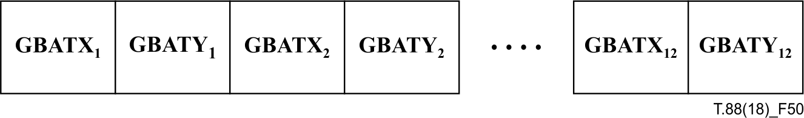

Figure 50 – Generic region AT flags field structure when GBTEMPLATE is 0 and EXTTEMPLATE is 1

If **GBTEMPLATE** is 0 and **EXTTEMPLATE** is 1, it is a 32-byte field, formatted as shown in Figure 50 and as described below.

**Byte 0 GBATX1**

**Byte 1 GBATY1**

**Byte 2 GBATX2**

**Byte 3 GBATY2**

**Byte 4 GBATX3**

**Byte 5 GBATY3**

**Byte 6 GBATX4**

**Byte 7 GBATY4**

**Byte 8 GBATX5**

**Byte 9 GBATY5**

**Byte 10 GBATX6**

**Byte 11 GBATY6**

**Byte 12 GBATX7**

**Byte 13 GBATY7**

**Byte 14 GBATX8**

**Byte 15 GBATY8**

**Byte 16 GBATX9**

**Byte 17 GBATY9**

**Byte 18 GBATX10**

**Byte 19 GBATY10**

**Byte 20 GBATX11**

**Byte 21 GBATY11**

**Byte 22 GBATX12**

**Byte 23 GBATY12**

The AT coordinate X and Y fields are signed values, and may take on values that are permitted according to Figure 7.

If **GBTEMPLATE** is 1, 2 or 3, it is a two-byte field formatted as shown in Figure 51 and as described below. If **GBTEMPLATE** is 1, 2 or 3 then the values of **GBATX2** through **GBATX4** and **GBATY2** through **GBATY4** are all zero.

|            |            |
|:----------:|:----------:|
| **GBATX1** | **GBATY1** |

Figure 51 – Generic region AT flags field structure when GBTEMPLATE is not 0

**Byte 0 GBATX1**

**Byte 1 GBATY1**

The AT coordinate X and Y fields are signed values, and may take on values that are permitted according to Figure 7.

#### 7.4.6.4 Decoding a generic region segment

A generic region segment is decoded according to the following steps:

1\) Interpret its header, as described in 7.4.6.1

2\) As described in E.3.7, reset all the arithmetic coding statistics to zero.

3\) Invoke the generic region decoding procedure described in 6.2, with the parameters to the generic region decoding procedure set as shown in Table 37.

<table style="width:99%;">
<colgroup>
<col style="width: 21%" />
<col style="width: 77%" />
</colgroup>
<thead>
<tr>
<th colspan="2">Table 37 – Parameters used to decode a generic region segment</th>
</tr>
<tr>
<th>Name</th>
<th>Value</th>
</tr>
</thead>
<tbody>
<tr>
<td><strong>MMR</strong></td>
<td>As shown in 7.4.6.2.</td>
</tr>
<tr>
<td><strong>GBTEMPLATE</strong></td>
<td>As shown in 7.4.6.2.</td>
</tr>
<tr>
<td><strong>TPGDON</strong></td>
<td>As shown in 7.4.6.2.</td>
</tr>
<tr>
<td><strong>EXTTEMPLATE</strong></td>
<td>As shown in 7.4.6.2.</td>
</tr>
<tr>
<td><strong>USESKIP</strong></td>
<td>0</td>
</tr>
<tr>
<td><strong>GBW</strong></td>
<td>As specified by the region segment bitmap width in this segment's region segment data header.</td>
</tr>
<tr>
<td><strong>GBH</strong></td>
<td>As specified by the region segment bitmap height in this segment's region segment data header.</td>
</tr>
<tr>
<td><strong>GBATX1</strong></td>
<td>See 7.4.6.3.</td>
</tr>
<tr>
<td><strong>GBATY1</strong></td>
<td>See 7.4.6.3.</td>
</tr>
<tr>
<td><strong>GBATX2</strong></td>
<td>See 7.4.6.3.</td>
</tr>
<tr>
<td><strong>GBATY2</strong></td>
<td>See 7.4.6.3.</td>
</tr>
<tr>
<td><strong>GBATX3</strong></td>
<td>See 7.4.6.3.</td>
</tr>
<tr>
<td><strong>GBATY3</strong></td>
<td>See 7.4.6.3.</td>
</tr>
<tr>
<td><strong>GBATX4</strong></td>
<td>See 7.4.6.3.</td>
</tr>
<tr>
<td><strong>GBATY4</strong></td>
<td>See 7.4.6.3.</td>
</tr>
<tr>
<td><strong>COLEXTFLAG</strong></td>
<td>A parameter indicating whether the generic region segment is extended to represent coloured bitmap.</td>
</tr>
<tr>
<td><strong>GBCOLS</strong></td>
<td>Concatenation of the default colour set and the additional colours from the colour palette segments referred to by this segment.</td>
</tr>
<tr>
<td><strong>GBATX5</strong></td>
<td>See 7.4.6.3.</td>
</tr>
<tr>
<td><strong>GBATY5</strong></td>
<td>See 7.4.6.3.</td>
</tr>
<tr>
<td><strong>GBATX6</strong></td>
<td>See 7.4.6.3.</td>
</tr>
<tr>
<td><strong>GBATY6</strong></td>
<td>See 7.4.6.3.</td>
</tr>
<tr>
<td><strong>GBATX7</strong></td>
<td>See 7.4.6.3.</td>
</tr>
<tr>
<td><strong>GBATY7</strong></td>
<td>See 7.4.6.3.</td>
</tr>
<tr>
<td><strong>GBATX8</strong></td>
<td>See 7.4.6.3.</td>
</tr>
<tr>
<td><strong>GBATY8</strong></td>
<td>See 7.4.6.3.</td>
</tr>
<tr>
<td><strong>GBATX9</strong></td>
<td>See 7.4.6.3.</td>
</tr>
<tr>
<td><strong>GBATY9</strong></td>
<td>See 7.4.6.3.</td>
</tr>
<tr>
<td><strong>GBATX10</strong></td>
<td>See 7.4.6.3.</td>
</tr>
<tr>
<td><strong>GBATY10</strong></td>
<td>See 7.4.6.3.</td>
</tr>
<tr>
<td><strong>GBATX11</strong></td>
<td>See 7.4.6.3.</td>
</tr>
<tr>
<td><strong>GBATY11</strong></td>
<td>See 7.4.6.3.</td>
</tr>
<tr>
<td><strong>GBATX12</strong></td>
<td>See 7.4.6.3.</td>
</tr>
<tr>
<td><strong>GBATY12</strong></td>
<td>See 7.4.6.3.</td>
</tr>
</tbody>
</table>

As a special case, as noted in 7.2.7, an immediate generic region segment may have an unknown length. In this case, it is also possible that the segment may contain fewer rows of bitmap data than are indicated in the segment's region segment information field.

In order for the decoder to correctly decode the segment, it needs to read the four-byte row count field, which is stored in the last four bytes of the segment's data part. These four bytes can be detected without knowing the length of the data part in advance: if **MMR** is **1**, they are preceded by the two-byte sequence 0x00 0x00; if **MMR** is **0**, they are preceded by the two-byte sequence 0xFF 0xAC. The row count field contains the actual number of rows contained in this segment; it must be no greater than the region segment bitmap height value in the segment's region segment information field.

NOTE – The sequence 0x00 0x00 cannot occur within MMR-encoded data; the sequence 0xFF 0xAC can occur only at the end of arithmetically-coded data. Thus, those sequences cannot occur by chance in the data that is decoded to generate the contents of the generic region.

### 7.4.7 Generic refinement region syntax

The data parts of all three of the generic refinement region segment types ("intermediate generic refinement region", "immediate generic refinement region" and "immediate lossless generic refinement region") are coded identically, but are acted upon differently, see 8.2. The syntax of these segment types' data parts is specified here.

#### 7.4.7.1 Generic refinement region segment data header

The data part of a generic refinement region segment begins with a generic refinement region segment data header. This header contains the fields shown in Figure 52 and described below.

<table style="width:46%;">
<colgroup>
<col style="width: 17%" />
<col style="width: 10%" />
<col style="width: 17%" />
</colgroup>
<tbody>
<tr>
<td style="text-align: center;">Region segment 
information field</td>
<td style="text-align: center;">Generic refinement region segment flags</td>
<td style="text-align: center;">Generic refinement 
region segment 
AT flags</td>
</tr>
</tbody>
</table>

Figure 52 – Generic refinement region segment data header structure

**Region segment information field** – see 7.4.1.

**Generic refinement region segment flags** – see 7.4.7.2.

**Generic refinement region segment AT flags** – see 7.4.7.3.

#### 7.4.7.2 Generic refinement region segment flags

This one-byte field is formatted as shown in Figure 53 and as described below.

<table style="width:70%;">
<colgroup>
<col style="width: 8%" />
<col style="width: 8%" />
<col style="width: 8%" />
<col style="width: 8%" />
<col style="width: 8%" />
<col style="width: 8%" />
<col style="width: 8%" />
<col style="width: 8%" />
</colgroup>
<tbody>
<tr>
<td colspan="6" style="text-align: center;">Reserved 
Must be <strong>0</strong></td>
<td style="text-align: center;"><strong>TPGRON</strong></td>
<td style="text-align: center;"><strong>GRTEMP-LATE</strong></td>
</tr>
<tr>
<td style="text-align: center;"></td>
<td style="text-align: center;"></td>
<td style="text-align: center;"></td>
<td style="text-align: center;"></td>
<td style="text-align: center;"></td>
<td style="text-align: center;"></td>
<td style="text-align: center;"></td>
<td style="text-align: center;"></td>
</tr>
<tr>
<td style="text-align: center;"></td>
<td style="text-align: center;"></td>
<td style="text-align: center;"></td>
<td style="text-align: center;"></td>
<td style="text-align: center;"></td>
<td style="text-align: center;"></td>
<td style="text-align: center;"></td>
<td style="text-align: center;"></td>
</tr>
<tr>
<td style="text-align: center;">7</td>
<td style="text-align: center;">6</td>
<td style="text-align: center;">5</td>
<td style="text-align: center;">4</td>
<td style="text-align: center;">3</td>
<td style="text-align: center;">2</td>
<td style="text-align: center;">1</td>
<td style="text-align: center;">0</td>
</tr>
</tbody>
</table>

Figure 53 – Generic refinement region segment flags field structure

**Bit 0** **GRTEMPLATE**

This field specifies the template used for template-based arithmetic coding.

**Bit 1** **TPGRON**

This field specifies whether typical prediction for generic refinement is used.

**Bits 2-7** Reserved; must be zero.

#### 7.4.7.3 Generic refinement region segment AT flags

This field is only present if **GRTEMPLATE** is **0**. It is a four-byte field, formatted as shown in Figure 54 and as described below.

|            |            |            |            |
|:----------:|:----------:|:----------:|:----------:|
| **GRATX1** | **GRATY1** | **GRATX2** | **GRATY2** |

Figure 54 – Generic refinement region AT flags field structure

**Byte 0** **GRATX1**

**Byte 1** **GRATY1**

**Byte 2** **GRATX2**

**Byte 3** **GRATY2**

The AT coordinate X and Y fields are signed values, and may take on values that are permitted according to 6.3.5.3.

#### 7.4.7.4 Reference bitmap selection

If this segment refers to another region segment, then set the reference bitmap **GRREFERENCE** to be the current contents of the auxiliary buffer associated with the region segment that this segment refers to.

If this segment does not refer to another region segment, set **GRREFERENCE** to be a bitmap containing the current contents of the page buffer (see clause 8), restricted to the area of the page buffer specified by this segment's region segment information field.

#### 7.4.7.5 Decoding a generic refinement region segment

A generic refinement region segment is decoded according to the following steps:

1\) Interpret its header as described in 7.4.7.1. If this segment does not refer to another region segment then its external combination operator must be REPLACE. If it does refer to another region segment, then this segment's region bitmap size, location, and external combination operator must be equal to that other segment's region bitmap size, location, and external combination operator.

NOTE – The requirement that the locations and external combination operators match is present to assist decoders that want to produce images of a page that is only partially decoded: it ensures that the final location and external combination operator is known for all intermediate segments. These partially-decoded page images are outside the scope of this Recommendation \| International Standard.

2\) As described in E.3.7, reset all the arithmetic coding statistics to zero.

3\) Determine the buffer associated with the region segment that this segment refers to.

4\) Invoke the generic refinement region decoding procedure described in 6.3, with the parameters to the generic refinement region decoding procedure set as shown in Table 38.

### 7.4.8 Page information segment syntax

A page information segment describes a page. It contains the fields shown in Figure 55 and described below.

**Page bitmap width** – see 7.4.8.1.

**Page bitmap height** – see 7.4.8.2.

**Page X resolution** – see 7.4.8.3.

Table 38 – Parameters used to decode a generic refinement region segment

|  |  |
|----|----|
| Name | Value |
| **GRTEMPLATE** | As shown in 7.4.6.2. |
| **TPGRON** | As shown in 7.4.6.2. |
| **GRW** | As specified by the region segment bitmap width in this segment's region segment data header. |
| **GRH** | As specified by the region segment bitmap height in this segment's region segment data header. |
| **GRREFERENCE** | See 7.4.7.4. |
| **GRREFERENCEDX** | 0 |
| **GRREFERENCEDY** | 0 |
| **GRATX1** | See 7.4.7.3. |
| **GRATX2** | See 7.4.7.3. |
| **GRATY1** | See 7.4.7.3. |
| **GRATY2** | See 7.4.7.3. |

<table>
<colgroup>
<col style="width: 4%" />
<col style="width: 4%" />
<col style="width: 4%" />
<col style="width: 4%" />
<col style="width: 4%" />
<col style="width: 4%" />
<col style="width: 4%" />
<col style="width: 4%" />
<col style="width: 4%" />
<col style="width: 4%" />
<col style="width: 4%" />
<col style="width: 4%" />
<col style="width: 4%" />
<col style="width: 4%" />
<col style="width: 4%" />
<col style="width: 4%" />
<col style="width: 12%" />
<col style="width: 6%" />
<col style="width: 6%" />
</colgroup>
<tbody>
<tr>
<td></td>
<td></td>
<td></td>
<td></td>
<td></td>
<td></td>
<td></td>
<td></td>
<td></td>
<td></td>
<td></td>
<td></td>
<td></td>
<td></td>
<td></td>
<td></td>
<td rowspan="2" style="text-align: center;">Page 
segment 
flags</td>
<td></td>
<td></td>
</tr>
<tr>
<td colspan="4" style="text-align: center;">Page bitmap width</td>
<td colspan="4" style="text-align: center;">Page bitmap height</td>
<td colspan="4" style="text-align: center;">Page X resolution</td>
<td colspan="4" style="text-align: center;">Page Y resolution</td>
<td colspan="2" style="text-align: center;">Page 
striping 
information</td>
</tr>
</tbody>
</table>

Figure 55 – Page information segment structure

**Page Y resolution** – see 7.4.8.4.

**Page segment flags** – see 7.4.8.5.

**Page striping information** – see 7.4.8.6.

The first segment that is associated with any page must be a page information segment.

#### 7.4.8.1 Page bitmap width

This is a four-byte value containing the width in pixels of the page's bitmap.

#### 7.4.8.2 Page bitmap height

This is a four-byte value containing the height in pixels of the page's bitmap. In some cases, this value may not be known at the time that the page information segment is written. In this case, this field must contain 0xFFFFFFFF, and the actual page height may be communicated later, once it is known.

#### 7.4.8.3 Page X resolution

This is a four-byte value containing the resolution of the original page medium, measured in pixels/metre in the horizontal direction. If this value is unknown, then this field must contain 0x00000000.

#### 7.4.8.4 Page Y resolution

This is a four-byte value containing the resolution of the original page medium, measured in pixels/metre in the vertical direction. If this value is unknown, then this field must contain 0x00000000.

#### 7.4.8.5 Page segment flags

This is a one-byte field. It is formatted as shown in Figure 56 and as described below.

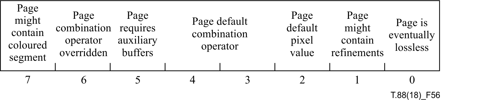

Figure 56 – Page segment flags field structure

**Bit 0** Page is eventually lossless. If this bit is **0**, then the file does not contain a lossless representation of the original (pre-coding) page. If this bit is **1**, then the file contains enough information to reconstruct the original page.

**Bit 1** Page might contain refinements. If this bit is **0**, then no refinement region segment may be associated with the page. If this bit is **1**, then such segments may be associated with the page.

**Bit 2** Page default pixel value. This bit contains the initial value for every pixel in the page, before any region segments are decoded or drawn.

**Bits 3-4** Page default combination operator. This field has four possible values, representing one of four possible combination operators:

**0**  OR

**1**  AND

**2**  XOR

**3**  XNOR

This operator is used to merge overlapping region segments, and also to combine region segments with the page default pixel value.

**Bit 5** Page requires auxiliary buffers. If this bit is **0**, then no region segment requiring an auxiliary buffer may be associated with the page. If this bit is **1**, then such segments may be associated with the page.

**Bit 6** Page combination operator overridden. If this bit is **0**, then every direct region segment associated with this page must use the page's default combination operator. If this bit is **1**, then direct region segments associated with this page may use any combination operators.

**Bit 7** Page might contain coloured segment. If this bit is 0, then no segment with colour extension may be associated with the page. If this bit is 1, then such segments may be associated with the page, and the background of this page shall be treated as transparent irrespective of the value of bit 2 (Page default pixel value).

NOTE 1 – All region segments, except for refinement region segments, are direct region segments. Because of the requirements in 7.4.7.5 restricting the external combination operators of refinement region segments, if this bit is **0**, then refinement region segments associated with this page that refer to no region segments must have an external combination operator of REPLACE, and all other region segments associated with this page must have the external combination operator specified by this page's "Page default combination operator".

NOTE 2 – If all the direct region segments associated with a page use the same combination operator, then it is possible to reorder them to some extent (it is not possible to switch the relative order of any refinement segment). If some of them use different combination operators, then the decoder is unable do any such reordering. Furthermore, the decoder cannot tell from the segment headers whether any such non-default combination operators are used in the page, so this bit indicates that reordering may be possible, if the decoder wishes to perform it.

#### 7.4.8.6 Page striping information

This is a two-byte field. It is formatted as shown in Figure 57 and as described below.

<table>
<colgroup>
<col style="width: 6%" />
<col style="width: 0%" />
<col style="width: 5%" />
<col style="width: 1%" />
<col style="width: 5%" />
<col style="width: 1%" />
<col style="width: 4%" />
<col style="width: 2%" />
<col style="width: 3%" />
<col style="width: 1%" />
<col style="width: 4%" />
<col style="width: 1%" />
<col style="width: 4%" />
<col style="width: 1%" />
<col style="width: 5%" />
<col style="width: 0%" />
<col style="width: 4%" />
<col style="width: 1%" />
<col style="width: 5%" />
<col style="width: 0%" />
<col style="width: 5%" />
<col style="width: 0%" />
<col style="width: 5%" />
<col style="width: 0%" />
<col style="width: 5%" />
<col style="width: 0%" />
<col style="width: 6%" />
<col style="width: 6%" />
<col style="width: 0%" />
<col style="width: 6%" />
</colgroup>
<tbody>
<tr>
<td></td>
<td colspan="2"></td>
<td colspan="2"></td>
<td colspan="2"></td>
<td colspan="2"></td>
<td colspan="2"></td>
<td colspan="2"></td>
<td colspan="2"></td>
<td colspan="2"></td>
<td colspan="2"></td>
<td colspan="2"></td>
<td colspan="2"></td>
<td colspan="2"></td>
<td colspan="2"></td>
<td colspan="2"></td>
<td></td>
</tr>
<tr>
<td colspan="2" style="text-align: center;">Page is striped</td>
<td colspan="28" style="text-align: center;">Maximum stripe size</td>
</tr>
<tr>
<td colspan="2" style="text-align: center;"></td>
<td colspan="2" style="text-align: center;"></td>
<td colspan="2" style="text-align: center;"></td>
<td colspan="2" style="text-align: center;"></td>
<td colspan="2" style="text-align: center;"></td>
<td colspan="2" style="text-align: center;"></td>
<td colspan="2" style="text-align: center;"></td>
<td colspan="2" style="text-align: center;"></td>
<td colspan="2" style="text-align: center;"></td>
<td colspan="2" style="text-align: center;"></td>
<td colspan="2" style="text-align: center;"></td>
<td colspan="2" style="text-align: center;"></td>
<td colspan="2" style="text-align: center;"></td>
<td style="text-align: center;"></td>
<td style="text-align: center;"></td>
<td colspan="2" style="text-align: center;"></td>
</tr>
<tr>
<td colspan="2" style="text-align: center;"></td>
<td colspan="2" style="text-align: center;"></td>
<td colspan="2" style="text-align: center;"></td>
<td colspan="2" style="text-align: center;"></td>
<td colspan="2" style="text-align: center;"></td>
<td colspan="2" style="text-align: center;"></td>
<td colspan="2" style="text-align: center;"></td>
<td colspan="2" style="text-align: center;"></td>
<td colspan="2" style="text-align: center;"></td>
<td colspan="2" style="text-align: center;"></td>
<td colspan="2" style="text-align: center;"></td>
<td colspan="2" style="text-align: center;"></td>
<td colspan="2" style="text-align: center;"></td>
<td style="text-align: center;"></td>
<td style="text-align: center;"></td>
<td colspan="2" style="text-align: center;"></td>
</tr>
<tr>
<td colspan="2" style="text-align: center;">15</td>
<td colspan="2" style="text-align: center;">14</td>
<td colspan="2" style="text-align: center;">13</td>
<td colspan="2" style="text-align: center;">12</td>
<td colspan="2" style="text-align: center;">11</td>
<td colspan="2" style="text-align: center;">10</td>
<td colspan="2" style="text-align: center;">9</td>
<td colspan="2" style="text-align: center;">8</td>
<td colspan="2" style="text-align: center;">7</td>
<td colspan="2" style="text-align: center;">6</td>
<td colspan="2" style="text-align: center;">5</td>
<td colspan="2" style="text-align: center;">4</td>
<td colspan="2" style="text-align: center;">3</td>
<td style="text-align: center;">2</td>
<td style="text-align: center;">1</td>
<td colspan="2" style="text-align: center;">0</td>
</tr>
</tbody>
</table>

Figure 57 – Page striping information field structure

**Bits 0-14** Maximum stripe size

**Bit 15** Page is striped

If the "page is striped" bit is **1**, then the page may have end of stripe segments associated with it. In this case, the maximum size of each stripe (the distance between an end of stripe segment's end row and the end row of the previous end of stripe segment, or 0 in the case of the first end of stripe segment) must be no more than the page's maximum stripe size.

If the page's bitmap height is unknown (indicated by a page bitmap height of 0xFFFFFFFF) then the "page is striped" bit must be **1**.

### 7.4.9 End of page segment syntax

An end of page segment has no associated data. Its segment data length field must be zero.

The last segment that is associated with any page must be an end of page segment. Each page must have exactly one end of page segment associated with it.

If a page's height was originally unknown, then there must be at least one end of stripe segment associated with the page. In this case, the end row of that last stripe is the last row of the page bitmap and no region segment may occur between the last end of stripe segment and the end of page segment.

### 7.4.10 End of stripe segment syntax

An end of stripe segment states that the encoder has finished coding a portion of the page with which the segment is associated, and will not revisit it. It specifies the Y coordinate of a row of the page; no segment following the end of stripe may modify any portion of the page bitmap that lines on or above that row; furthermore, no segment preceding the end of stripe may modify any portion of the page bitmap that lies below that row. This row is called the "end row" of the stripe.

NOTE 1 – In some cases, the decoder may only have a limited amount of buffer memory for the page bitmap, smaller than the size of the page. The decoder needs to be told when it is able to output the current buffer contents and clear the buffer for the next stripe of the page.

The end row specified by an end of stripe segment must lie below any previous end row for that page.

A page whose height was originally unknown must contain at least one end of stripe segment.

NOTE 2 – An end of stripe segment is used to communicate the size of the page in this case.

The segment data of an end of stripe segment consists of one four-byte value, specifying the Y coordinate of the end row.

NOTE 3 – If a stripe boundary breaks a line of text into two parts, a top part and a bottom part, the characters straddling the stripe boundary are also broken. One way of handling these straddling characters is to code them with a generic region, or to add the top halves and bottom halves to a symbol dictionary and use those top and bottom halves as other symbols.

However, if the encoder has more buffer space than the decoder, a more efficient encoding method is possible: the encoder can (temporarily) ignore the stripe boundary, and generate a list of symbol instances, and a symbol dictionary. It can then encode a text region in each stripe; the first text region contains all the symbol instances that affect the portion of the page above the stripe boundary; the second text region contains all the symbol instances that affect the portion below the stripe boundary.

This means that some symbol instances appear twice, both times using the same symbol in the symbol dictionary. The first appearance encodes the top half of the character, where the bottom half is clipped off by the drawing rules used in the text region decoding procedure. The second appearance likewise encodes the bottom half of the character: the entire character is encoded, but the top half is clipped off. Thus, this encoding method reduces the amount of symbol dictionary data required.

### 7.4.11 End of file segment syntax

If a file contains an end of file segment, it must be the last segment.

An end of file segment has no associated data. Its segment data length field must be zero.

### 7.4.12 Profiles segment syntax

A profiles segment contains a list of the profiles that a given JBIG2 data stream is in compliance with. If any profiles segments are present, then the first segment of the data stream must be a profiles segment, and must not be associated with any page. Profiles of this Recommendation \| International Standard are listed in Annex F.

A profiles segment begins with a four-byte field containing the number of profiles listed. This field is followed by that many four-byte fields. Each of those fields contains a profile identification number. The data stream must be in compliance with each of the profiles listed.

More than one profiles segment may be present. If more than one is present, then each one, other than the first one, must be associated with a page. No page may have more than one profiles segment associated with it. Also, each profiles segment past the first one must be more restrictive than the first one; that is, it must list all of the profile identification numbers listed in the first segment, and possibly more. The segments making up each page must, collectively, be in compliance with each of the profiles listed in any profiles segment associated with that page.

NOTE – The global profiles segment allows a decoder to find out quickly that it cannot decode a given data stream. Allowing each page to contain a possibly different (though more restrictive) profiles segment eases moving pages from one file to another.

### 7.4.13 Code table segment syntax

A code table segment's syntax is described in Annex B.

### 7.4.14 Extension segment syntax

An extension segment's data begins with a extension header:

**Extension type**: This is a four-byte field which contains an identification of the type of data that are present in the extension segment:

The three most significant bits of this field have special meaning:

**Bit 29** Reserved. Future revisions of this Recommendation \| International Standard may define extension types; extension types may also be registered by other parties. Other parties may register only extension types with this bit equal to **0**; all extension types having bit 29 equal to **1** are reserved for future revisions of this Recommendation \| International Standard.

**Bit 30** Dependent. If this bit is **1**, then the coding of the data in the extension segment is dependent on the exact encoding of the data in the segments that the extension segment refers to. Any file manipulation program that modifies those referred-to segments needs to modify this extension segment's data correspondingly; if it does not understand the extension segment (due to not recognising its extension type), and if it is not a necessary extension segment, then the segment should be deleted.

EXAMPLE – An extension segment containing a CRC of the segment that it refers to should be flagged as dependent.

**Bit 31** Necessary. If this bit is **1**, then any decoder that does not know how to parse extensions of this extension segment's type will not be able to correctly decode the file to produce the intended decoded page images.

NOTE – This is intended to facilitate future extensions to JBIG2, such as coding improvements. If this bit is **1**, then a decoder that does not understand the extension knows that it has encountered data necessary to the correct decoding of the page that it cannot handle. For example, an extension segment containing a region that is coded with some new method would be flagged as "necessary", as without that region the page image is not complete. Another example might be an extension segment containing a set of colours that should be applied to the symbols on the page as they are drawn.

If the "necessary" bit is **1**, then the "reserved" bit must also be **1**.

The remainder of the extension segment's data immediately follows the extension type field, and is formatted in some way particular to the type of extension.

### 7.4.15 Defined extension types

The following extension types are currently defined.

0x20000000  Single-byte coded comment. See 7.4.15.1.

0x20000002  Multi-byte coded comment. See 7.4.15.2.

#### 7.4.15.1 Single-byte coded comment

A single-byte coded comment extension segment holds textual information about some other segment, page, or the bitstream as a whole. If it refers to no other segments, and is associated with no page, then it contains some set of comments applying to the entire bitstream. If it refers to no other segments, but is associated with some page, then it contains some set of comments applying to that page. If it refers to some segments, then it contains some set of comments applying to those segments.

A single-byte coded comment segment contains a number of (name, value) pairs. Each element of each pair is a string of characters, and is terminated by a 0x00 byte. The last pair is followed by an additional 0x00 byte. The other bytes shall be interpreted according to ISO/IEC 8859-1:1998.

NOTE – A single-byte coded comment extension segment may contain any valid ISO/IEC 8859-1 character, including those whose values are greater than 127.

EXAMPLE – The comment containing the following pairs

|        |                                       |
|--------|---------------------------------------|
| Title  | An Illustrated History of False Teeth |
| Author | The Big Cheese                        |

is stored as the following sequence of bytes. The bytes are shown as hexadecimal numbers together with their printable equivalents, with "." indicating an unprintable byte. Note the four-byte extension type at the start of the segment data:

|     |     |     |     |     |     |     |     |     |     |     |     |     |     |     |     |                  |
|-----|-----|-----|-----|-----|-----|-----|-----|-----|-----|-----|-----|-----|-----|-----|-----|------------------|
| 20  | 00  | 00  | 00  | 54  | 69  | 74  | 6C  | 65  | 00  | 41  | 6E  | 20  | 49  | 6C  | 6C  | ...Title.An Ill  |
| 75  | 73  | 74  | 72  | 61  | 74  | 65  | 64  | 20  | 48  | 69  | 73  | 74  | 6F  | 72  | 79  | ustrated History |
| 20  | 6F  | 66  | 20  | 46  | 61  | 6C  | 73  | 65  | 20  | 54  | 65  | 65  | 74  | 68  | 00  | of False Teeth.  |
| 41  | 75  | 74  | 68  | 6F  | 72  | 00  | 54  | 68  | 65  | 20  | 42  | 69  | 67  | 20  | 43  | Author.The Big C |
| 68  | 65  | 65  | 73  | 65  | 00  | 00  |     |     |     |     |     |     |     |     |     | heese..          |

#### 7.4.15.2 Multi-byte coded comment

A multi-byte coded comment extension segment is formatted in the same manner as a single-byte coded comment extension segment, except that the individual characters each occupy two bytes, in the ISO/IEC 10646:2017 encoding (UCS-2). Each element of each pair in the comment is terminated by a 0x0000 and the final pair is followed by an additional 0x0000.

### 7.4.16 Colour palette segment syntax

#### 7.4.16.1 Colour palette segment data header

A colour palette segment's data part begins with a colour palette segment data header, containing the fields shown in Figure 58 and described below:

Figure 58 – Colour palette segment data header structure

**Colour palette flags** – see 7.4.16.1.1.

**CPNCOMP** – see 7.4.16.1.2.

**CPCOMPLEN** – see 7.4.16.1.3.

**CPNVALS** – see 7.4.16.1.4.

##### 7.4.16.1.1 Colour palette flags

This one-byte field is formatted as shown in Figure 59 and described below:

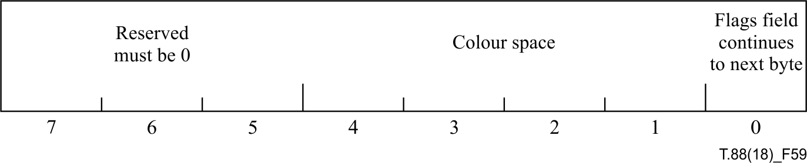

Figure 59 – Structure of the first byte of colour palette flags

**Bit 0** Flags field continues to next byte. If this bit is 1, the next following byte is also treated as the colour palette flags. If this bit is 0, the colour palette segment body starts from the following byte.

**Bits 1-4** Colour space. This field has four possible values, representing one of four possible colour spaces represented in this segment: 

> **0** RGB
>
> **1** sRGB
>
> **2** Adobe RGB
>
> **3-15** Reserved

**Bits 5-7** Reserved; must be **0**.

##### 7.4.16.1.2 Number of components (CPNCOMP)

This one-byte field specifies how many colour components are used. It shall take on a value from 1 to 255.

NOTE – The number of components is equal to the dimension of the colour space. For example, if the colour space of this segment is RGB, the number of components shall be 3 (CPNCOMP = 3) because the dimension of RGB colour space is 3.

##### 7.4.16.1.3 Component length (CPCOMPLEN)

This one-byte field specifies the length (in bytes) of each component's value. It shall take on one of the values 1, 2 or 4.

NOTE – The component length is equal to 1 in the header of the ITU-T T.45 data.

##### 7.4.16.1.4 Number of values (CPNVALS)

This four-byte field specifies how many colour values are coded. It shall take on a value from 0 to (2^32 – 1).

#### 7.4.16.2 Decoding a colour palette segment

A colour palette segment is decoded according to the following steps:

1\) Interpret its header, as described in 7.4.16.1

2\) Invoke the colour palette decoding procedure described in 6.8.4.

# 8 Page Make-up

## 8.1 Decoder model

This clause describes the result that a decoder conforming to this Recommendation \| International Standard shall produce when decoding a page. It does this by specifying a set of steps that produce the correct result; a conforming decoder need not perform these exact steps, but shall produce the same result as if the steps had been followed.

Here we describe only the steps taken to decode a single page. A conforming decoder may operate on multiple pages at once, as long as it produces the correct final result for each page.

In the following description, we will assume for simplicity that the decoder has a single page buffer, auxiliary buffers to be used while decoding that page, and additional dictionary memory. Decoders with other components are allowed, as long as they produce the same page buffer as this abstract decoder does.

At the end of the decoding process, the page buffer contains the result of decoding the page.

Each auxiliary buffer has a location associated with it; this location is the location of the buffer's top left pixel, relative to the top left pixel of the page buffer. Some region segments require the use of auxiliary buffers; others can be decoded directly into the page buffer. See 8.2 for details on how combinations of image segments are to be interpreted.

The dictionary memory contains the information obtained by decoding dictionary segments.

## 8.2 Page image composition

The final bitmap for each page is coded by zero or more region segments associated with that page. Each region segment describes some of the contents of a rectangular region of the page. Since these regions of the page may overlap, and since some parts of the page might be described at multiple levels of refinement, it is important to define what the rules for region segment composition are. Also, since a decoder might want to display intermediate representations of a page, based on partial information, it is useful to suggest the interpretation of partial pages.

As described in 7.4.8, each page has a default pixel value (**0** or **1**) and one of four combination operators (OR, AND, XOR, XNOR); these are specified in its page information segment. Each region segment also specifies a combination operator of its own. The "page combination operator overridden" flag bit in the page information segment specifies whether any of the page's direct region segments overrides the page combination operator. If the bit is **0**, then no direct region segment associated with this page overrides the page combination operator. The decoder may use this information to optimize its decoding.

The result of decoding a region segment is a bitmap. The size of this bitmap and its location with respect to the page buffer are given in the region segment information field.

The final contents of the page buffer that the decoder shall produce as the final result of decoding a page are those that would be generated by the following steps:

1\) Decode the page information segment.

2\) Create the page buffer, of the size given in the page information segment.

If the page height is unknown, then this is not possible. However, in this case the page must be striped, and the maximum stripe height specified, and the initial page buffer can be created with height initially equal to this maximum stripe height. As each end of stripe segment is encountered, the page buffer's height can be increased, so that the last row in the new buffer is the maximum stripe height plus the end row of the previous stripe. The end of page segment (together with the last end of stripe segment) allows determination of the page's actual height.

Alternately, when the page height is unknown, the decoder may use a fixed-size buffer whose height is equal to the page's maximum stripe height. As each end of stripe segment is encountered, the decoder can print, or copy to some other location, all the rows in this buffer up to and including the stripe's end row, then clear the buffer in preparation for the next stripe. The decoder may follow this strategy whenever the page is striped, even if the page height is known beforehand.

NOTE 1 – The steps below can be followed regardless of which striping strategy is followed. The restrictions imposed by striping ensure that once an end of stripe segment is seen, no part of the page above or on that stripe's end row can be modified, and so the presentation below is phrased in terms of a page buffer that is the full size of the page, even when the page's height is not known initially.

3\) Fill the page buffer with the page's default pixel value.

4\) Fetch the next region segment associated with that page.

5\) The following cases exist:

a\) The region segment is an immediate direct region segment. In this case, decode the region segment. The result of decoding the region segment is a bitmap; combine this bitmap with the current contents of the page buffer, using the region segment's combination operator.

b\) The region segment is an intermediate direct region segment. In this case, allocate a new auxiliary buffer, using the size and location specified in the segment's region segment information field. This buffer is initially associated with the region segment. Decode the region segment, placing the resulting bitmap into the auxiliary buffer.

c\) The region segment is an immediate refinement region segment that refers to no other segments. In this case, the region segment is acting as a refinement of part of the page buffer. Perform the refinement according to the region segment on the part of the page buffer specified in the region segment, according to the data contained in the refinement region segment. This replaces a part of the page buffer with a refined version.

d\) The region segment is an immediate refinement region segment that refers to another region segment. This other region segment must be a previously occurring intermediate region segment that has not yet had a refinement region segment refer to it. The other region segment thus has an auxiliary buffer associated with it. Note that the other region segment may itself be an intermediate refinement region segment. Perform the refinement operation on that auxiliary buffer, according to the data contained in the current region segment, and combine the resulting buffer with the page buffer using the current region segment's combination operator, at the location associated with the auxiliary buffer. Discard the auxiliary buffer.

e\) The region segment is an intermediate refinement region segment. This region segment must refer to one other region segment, which must be a previously occurring intermediate region segment that has not yet had a refinement region segment refer to it; the other region segment thus has an auxiliary buffer associated with it. Perform the refinement operation on that auxiliary buffer, according to the data contained in the current region segment. Replace the previous contents of the auxiliary buffer with the bitmap resulting from the refinement. Change the association of the auxiliary buffer, so that it is now associated with the current region segment, and is no longer associated with the other region segment.

6\) Repeat steps 4) and 5) until there are no more region segments associated with the page. At this point, all auxiliary buffers that have been allocated should have been refined, drawn into the page, and discarded, as described in step 5 d); no auxiliary buffers should remain.

7\) The result of decompressing that page is given by the final contents of the page buffer.

The rules described in step 5) are quite simple in principle. Immediate region segments are to be drawn into the page buffer, either by simply drawing them (direct segments, step 5 a), by refining a part of the page buffer (refinement segments referring to no other segments, step 5 c), or by refining and then drawing an auxiliary buffer (refinement segments referring to some other segment, step 5 d). Intermediate region segments involve creating an auxiliary buffer containing the region bitmap (direct segments, step 5 b), or replacing the current contents of an auxiliary buffer (refinement segments, step 5 e).

Some examples of these rules in operation:

EXAMPLE 1 – If the page contains no region segments, then the page buffer is filled entirely with the page's default pixel value.

EXAMPLE 2 – The page information segment for page 1 specifies that the page default combination operator is OR and the page default pixel value is **0**. The region segments associated with page 1 are, in order:

• Segment 3, an immediate lossless text region segment whose external combination operator is OR;

• Segment 4, an immediate lossless generic region segment whose external combination operator is OR;

• Segment 6, an immediate lossless halftone region segment whose external combination operator is OR.

The resulting page bitmap can be obtained by decoding segments 3, 4 and 6, and drawing each one at its specified region location, using OR, into a bitmap initially containing **0** everywhere. Note that the order in which these three segments are decoded and drawn does not affect the resulting page bitmap. Also, if segment 3 has an internal combination operator of OR and a default pixel value of **0**, then it may be drawn by simply drawing the symbol instances directly into the page buffer; it is not necessary to decode it into a temporary bitmap then draw that bitmap into the page buffer. A similar observation holds for segment 6.

EXAMPLE 3 – The page information segment for page 2 specifies that the page default combination operator is OR and the page default pixel value is **0**. The region segments associated with page 2 are, in order:

• Segment 7, an intermediate text region segment;

• Segment 8, an intermediate generic bitmap region segment;

• Segment 13, an immediate generic bitmap refinement region segment whose external combination operator is OR that refers to segment 8;

• Segment 14, an immediate generic bitmap refinement region segment whose external combination operator is OR that refers to segment 7;

• Segment 19, an immediate text region segment whose external combination operator is OR;

• Segment 22, an immediate generic bitmap region segment whose external combination operator is OR.

The resulting page buffer is the buffer that would be obtained by following the steps:

1\) Fill the page buffer with the value **0**;

2\) Decode segment 7 into an auxiliary buffer;

3\) Decode segment 8 into an auxiliary buffer;

4\) Refine segment 8's auxiliary buffer, according to the refinement information in segment 13, and draw the refined buffer into the page buffer using OR, discarding the auxiliary buffer after this is done;

5\) Refine segment 7's auxiliary buffer, according to the refinement information in segment 14, and draw the refined buffer into the page buffer using OR, discarding the auxiliary buffer after this is done;

6\) Decode segment 19 and draw the resulting bitmap into the page buffer using OR;

7\) Decode segment 22 and draw the resulting bitmap into the page buffer using OR.

The correct result is also obtained no matter what order steps 4) through 7) are performed in; thus a conforming decoder is free to choose any order to decode these steps. In fact, any order of steps 2) through 7) produces the correct result, as long as step 2) is performed before step 5) and step 3) is performed before step 4).

EXAMPLE 4 – If a page contains several immediate direct-coded region segments that do not override the page's combination operator, and an immediate refinement region segment that does not refer to any other segments, then the resulting page buffer is the buffer that would be obtained by:

• filling the page buffer with the page's default pixel value;

• drawing all the direct-coded region segments that precede the refinement region segment;

• refining the portion of the region covered by the refinement region segment;

• drawing all the direct-coded region segments that follow the refinement region segment.

In this case, the order of drawing does matter: all the immediate segments that precede the refinement segment shall be drawn before the refinement segment is drawn, and the refinement segment shall be drawn before any of the immediate segments that follow it.

NOTE 2 – In some cases, the decoder may want to display some intermediate form of the page. For example, it may want to provide the user with a progressive display of the page contents as the page segments are received over some transmission medium. Any intermediate page bitmaps that it displays are entirely up to the decoder, and are not specified by this Recommendation \| International Standard.

One potential strategy a decoder could use is to take the current contents of the page buffer and any currently active auxiliary buffers, and combine all of these buffers using the page's default combination operator, and display that to the user. If the page combination operator is XOR or XNOR, then this combination can be done reversibly, and so might be done into the actual page buffer, then undone after it has been displayed to the user. If the page combination operator is OR or AND, then this combination is not reversible and an extra buffer is required to hold the results of the combination.

The step-by-step description above is intended to specify only the results of the decompression. A conforming decoder may take any steps it desires, as long as the final page buffer is the same as would have been obtained by following the steps.

EXAMPLE 5 – A decoder might notice that an intermediate region segment refers to a region of the page that is not overlapped by any other region segment, and so might not actually allocate an auxiliary buffer for that region segment, but might use the page buffer immediately. It can do this only if it is sure that this will not change the final results of decoding the page's region segments.

# 9 Encoding procedures (informative)

The encoding procedures in this clause are essentially the inverse of the decoding procedures already described in clause 6 and will not be duplicated here. The inverse of generic region encoding is described in 6.2. The inverse of generic refinement encoding is described in 6.3. The inverse of text region encoding is described in 6.4. The inverse of symbol dictionary encoding is described in 6.5. The inverse of halftone region encoding is described in 6.6. The inverse of pattern dictionary encoding is described in 6.7.

# 10 Control encoding procedures (informative)

The control encoding procedures in this clause are essentially the inverse of the decoding control procedures already described in clause 7 and will not be duplicated here. The inverse of segment header syntax encoding is described in 7.2. The inverse of segment type encoding is described in 7.3. The segment types syntax for the region segment information field, symbol dictionary segment, text region segment, pattern dictionary segment, halftone region segment, generic region, generic refinement segment, end of page segment, end of stripe segment, end of file segment, profiles segment, code table segment and extension segment are described in detail in 7.4.1 to 7.4.15 respectively.

# 11 Page break-up (informative)

The page break-up ("Front end") procedures in this clause are conceptually the inverse of the page make-up ("Back end") procedures already described in clause 8. However, page break-up also requires additional page and document decomposition steps prior to encoding.

## 11.1 Page break-up architecture

This clause describes the JBIG2 encoder break-up defined by compliant, but optional, technical 'components' (with a range of 'algorithms' possible to implement each of these components). These JBIG2 page break-up components are a set of processing steps labelled: Capture, Filter, Orient (de-skew), Identify, eXtract, Screen, Align (register), Match, Post‑match, Dictionary (optimize), and Refine. An example sequence of this component set is illustrated in the Architectural Components Figure 60 as the horizontal axis with abbreviated labels C F O I X S A M P D R (leading from input on the left to a compressed data stream on the right). The vertical dimension above each label represents the range of possible algorithms that may be used to implement each component. The horizontal band illustrates an example JBIG2 compliant page break-up method, using some algorithm for each architectural component and spanning overthese components.

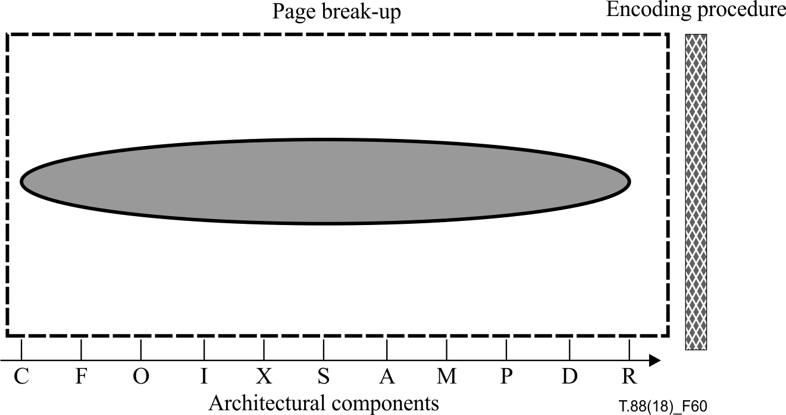

Figure 60 – JBIG2 encoding architectural components

A compliant JBIG2 encoder need not include all architectural components, nor use them in exactly the above sequence.

## 11.2 Page image decomposition

A page image is decomposed into several groups of sub-images such as marks \[J2\], line-arts, residues and halftones. Each group is identified and then compressed using an appropriate set of processing (architectural components) from those summarized in 11.2.1 to 11.2.11. Processing may include one or more of these component techniques prior to bitstream creation. The specific algorithm selected for each processing step is left up to the implementer but compliant examples for each processing step are provided in J.1. Implementing a full combination of these components, each using a compliant example encoding method, will result in an encoder capable of producing reasonable near‑lossless quality for most 300 + dpi images.

### 11.2.1 Capture (rasterize)

Capture (rasterization) is a process by which an image source is converted into a two-dimensional bi-level raster image. This is done by mapping a region of the image source to a set of pixels of the raster image, and then assigning a 1-bit colour value to each pixel. In the scope of this amendment, two types of images are defined: generated and scanned images. A generated image is an image converted from a computer-generated metafile or vector graphic (e.g., a bitmap rasterized from a document created using a typical word processor), whereas a scanned image is an image obtained from a paper document by means of imaging hardware such as a scanner or facsimile.

### 11.2.2 Filter

In most cases, a scanning process is noisy, and the resulting scanned image may contain random pixel values not representative of the original source. These pixels or small groups of pixels are called flyspecks. It is often desireable to remove flyspecks in a scanned image to improve compression efficiency as well as visual quality of the reconstructed image. A scanned image also contains quantization errors, i.e., identical marks in the original image may be slightly different in the scanned image. Smoothing the edges of the marks helps to recover the equivalence of such identical marks in the scanned image and also improve compression efficiency. These filtering techniques are shown as a reference in J.1. Filtering is seldom required for generated images although these techniques may still be applied.

### 11.2.3 Orient (de-skew)

A scanned image may be skewed when it is scanned or photocopied at a slight angle, and it is often beneficial to identify and adjust any skew prior to compression. In most texts, marks (characters) are aligned in straight lines, and examining the slope of these lines that align pairs of marks yields the skew angle. Several methods of de-skewing are shown as a reference in J.1.

### 11.2.4 Identify

Identification of sub-image categories involves two processes: segmentation and classification. First an image is segmented into groups of sub-mages or 'regions' having similar characteristics. These regions (segments) are then classified into pre-defined categories such as textual data, line-art and halftones, to which appropriate compression methods are applied.

### 11.2.5 Extract

A symbol (character) is a mark consisting of black pixels. A symbol boundary is first traced by observing the connectivity of black pixels, and the adjacent black pixels are extracted to form a symbol. Although simply extracting all the pixels confined by the boundary may work in most cases, it does not handle nested marks. Several methods are shown as a reference in J.1.

### 11.2.6 Screen

Comparing an extracted mark against all the symbols in the dictionary is inefficient especially when the dictionary size is large, and relatively complex matching criteria as described in 11.2.8 are used. Simple methods, such as restricting comparisons to only be made between marks and dictionary symbols with similar width and height, can be used to find possible matching candidates. More detailed approaches are shown as a reference in J.1.

### 11.2.7 Align (register)

Symbols are often aligned (registered) in the dictionary using the same criteria selected for the screening method in 11.2.6. When distribution of black pixels is tested against symbols in a dictionary to find matching candidates, aligning symbols along their centroids can enhance the screening rate. More detailed approaches are shown as a reference in J.1.

### 11.2.8 Match

Marks are extracted from a region containing textual data and compared with existing symbols in a dictionary, in order to exploit any similarities between them for better compression. Basically, each mark is tested to determine whether it is similar enough to be considered a 'match' to one of the existing symbols. One way of matching is to first obtain a difference bitmap between the mark and a symbol and test the number of black pixels in the difference bitmap to a pre‑defined threshold. Giving more weight to the clustered black pixels in the difference bitmap usually improves matching results. When a close match is found, a reference to the matching symbol in the dictionary is coded. When there is no close match, the extracted mark is stored as a new symbol in the dictionary.

### 11.2.9 Post-match

Several additional criteria and processing steps may be applied to the symbol dictionary to improve image quality. A best dictionary symbol shape may be determined by examining several similar symbols, which have already passed the matching step. Direct encoding of a symbol or alignment of symbol bottoms may also be used to improve symbol dictionary accuracy.

### 11.2.10 Dictionary (optimize)

After a symbol dictionary has been generated, it may be examined further to identify any 'singletons' \[J2\]. Singletons are symbols in the dictionary that have not been referenced by more than one mark. One may sometimes wish to remove such symbols from the dictionary and place them back into the 'residue' sub-images (which contain any residual marks). Such a residue image is compressed using a JBIG2 'generic' entropy encoder.

### 11.2.11 Refine

Encoded image (or symbol) bitmaps may also be subsequently 'refined' to similar (but different) bitmaps \[J1\], \[J4\]. For example, where images are first encoded in a near-lossless manner (e.g., when scanned image symbols are encoded using dictionaries), they can be subsequently 'refinement' encoded to a fully lossless representation of the original image. Also, successive dictionary symbols may be more efficiently encoded as 'refinements' of symbols encoded previously.

## 11.3 Multi-page document composition

An encoder may organize multi-page document segments using a sequential, random or embedded organization as described in Annex D (File Formats). Dictionary segments may be organized into one global segment, one or more segments per page or stripe, or a combination of global and page-specific dictionary segments. Dictionary segment organization dramatically effects decoder performance and should be carefully selected for a specific application.

Annex  A  
  
Arithmetic integer decoding procedure

(This annex forms an integral part of this Recommendation \| International Standard.)

## A.1 General description

This Recommendation \| International Standard uses a number of arithmetic decoding procedures to decode integer values. These are:

IAAI Used to decode the number of symbol instances in an aggregation

IADH Used to decode the difference in height between two height classes

IADS Used to decode the S coordinate of the second and subsequent symbol instances in a strip

IADT Used to decode the T coordinate of the second and subsequent symbol instances in a strip

IADW Used to decode the difference in delta width between two symbols in a height class

IAEX Used to decode export flags

IAFS Used to decode the S coordinate of the first symbol instance in a strip

IAID Used to decode the symbol IDs of symbol instances

IAIT Used to decode the T coordinate of the symbol instances in a strip

IARDH Used to decode the delta height of symbol instance refinements

IARDW Used to decode the delta width of symbol instance refinements

IARDX Used to decode the delta X position of symbol instance refinements

IARDY Used to decode the delta Y position of symbol instance refinements

IARI Used to decode the *RI* bit of symbol instances

Each of these is used to decode integer values (which may include the out-of-band value OOB). The coding for an integer is based on a decision tree.

An invocation of an arithmetic integer decoding procedure involves decoding a sequence of bits, where each bit is decoded using a context formed by the bits decoded previously in this invocation. Each context for each arithmetic integer decoding procedure has its own adaptive probability estimate used by the underlying arithmetic coder, described in Annex E. The sequence of bits decoded is interpreted to form a value.

Table A.1 is used by all the arithmetic integer decoding procedures except for IAID.

## A.2 Procedure for decoding values (except IAID)

The flowchart in Figure A.1 is used as part of the decoding procedure. It produces two values, *V* and *S*. The result of the integer arithmetic decoding procedure is equal to:

• *V* if *S* = **0**

• –*V* if *S* = **1** and *V* \> 0

• OOB if *S* = **1** and *V* = 0

Thus, *V* represents the absolute value of the integer value being decoded, and *S* represents the sign; the otherwise-redundant value –0 is interpreted to mean "OOB".

In Figure A.1, each bit is decoded in a context formed from the particular integer arithmetic decoding procedure being invoked, and the previous bits decoded in this invocation of that decoding procedure. This context is formed as follows:

1\) Set:

PREV = 1

2\) Follow the flowchart in Figure A.1. Decode each bit with CX equal to "IAx + PREV" where "IAx" represents the identifier of the current arithmetic integer decoding procedure, "+" represents concatenation, and the rightmost 9 bits of PREV are used.

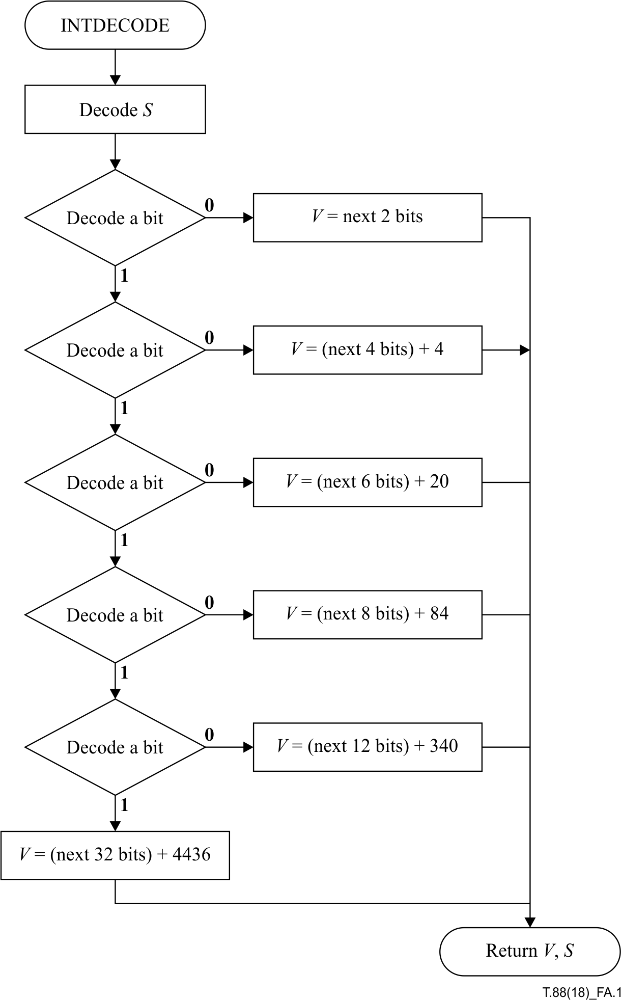

Figure A.1 – Flowchart for the integer arithmetic decoding procedures (except IAID)

3\) After each bit is decoded: If PREV \< 256 set:

PREV = (PREV \<\< 1) OR D

Otherwise set:

PREV = (((PREV \<\< 1) OR D) AND 511) OR 256

where D represents the value of the just-decoded bit.

Thus, PREV always contains the values of the eight most-recently-decoded bits, plus a leading **1** bit, which is used to indicate the number of bits decoded so far.

4\) The sequence of bits decoded, interpreted according to Table A.1, gives the value that is the result of this invocation of the integer arithmetic decoding procedure.

Note that each type of data, and each integer arithmetic decoding procedure, uses a separate set of contexts: the contexts used for IAFS are separate from the contexts used for IADW, for example.

Table A.1 – Arithmetic integer decoding procedure table

|                  |                                               |
|------------------|-----------------------------------------------|
| VAL              | Encoding                                      |
| 0 . . . 3        | **00** + VAL encoded as 2 bits                |
| –1               | **1001**                                      |
| –3 . . . –2      | **101** + (–VAL – 2) encoded as 1 bit         |
| 4 . . . 19       | **010** + (VAL – 4) encoded as 4 bits         |
| –19 . . . –4     | **110** + (–VAL – 4) encoded as 4 bits        |
| 20 . . . 83      | **0110** + (VAL – 20) encoded as 6 bits       |
| –83 . . . –20    | **1110** + (–VAL – 20) encoded as 6 bits      |
| 84 . . . 339     | **01110** + (VAL – 84) encoded as 8 bits      |
| –339 . . . –84   | **11110** + (–VAL – 84) encoded as 8 bits     |
| 340 . . . 4435   | **011110** + (VAL – 340) encoded as 12 bits   |
| –4435 . . . –340 | **111110** + (–VAL – 340) encoded as 12 bits  |
| 4436 . . . ∞     | **011111** + (VAL – 4436) encoded as 32 bits  |
| –∞ . . . –4436   | **111111** + (–VAL – 4436) encoded as 32 bits |
| OOB              | **1000**                                      |

EXAMPLE – An invocation of IADW might go as follows:

• Set CX to "IADW**000000001**". This identifies a particular adaptive probability estimate identified. Decode a bit. Suppose the value decoded (D) is **0**.

• Using CX = IADW**000000010**, decode a bit; suppose the value decoded is **1**.

• Using CX = IADW**000000101**, decode a bit; suppose the value decoded is **0**.

• Using CX = IADW**000001010**, decode a bit; suppose the value decoded is **1**.

• Using CX = IADW**000010101**, decode a bit; suppose the value decoded is **0**.

• Using CX = IADW**000101010**, decode a bit; suppose the value decoded is **0**.

• Using CX = IADW**001010100**, decode a bit; suppose the value decoded is **0**.

• The sequence of bits decoded so far is **0101000**. According to Table A.1 and Figure A.1, this corresponds to the value 12 (*S* = 0, *V* = 12), which is the result of this invocation of IADW.

A context is identified by an arithmetic integer decoding procedure name and a sequence of nine bits. Thus, each arithmetic integer decoding procedure requires 512 bytes of storage for its context memory.

## A.3 The IAID decoding procedure

This decoding procedure is different from all the other integer arithmetic decoding procedures. It uses fixed-length representations of the values being decoded, and does not limit the number of previously-decoded bits used as part of the context. The length is equal to **SBSYMCODELEN**. This decoding procedure is only invoked from within the text region decoding procedure, so at the time of invocation **SBSYMCODELEN** is known.

The procedure for decoding an integer using the IAID decoding procedure is as follows:

1\) Set:

PREV = 1

2\) Decode **SBSYMCODELEN** bits as follows:

a\) Decode a bit with CX equal to "IAID + PREV" where "+" represents concatenation, and the rightmost **SBSYMCODELEN** + 1 bits of PREV are used.

b\) After each bit is decoded, set:

PREV = (PREV \<\< 1) OR D

where D represents the value of the just-decoded bit.

Thus, PREV always contains the values of all the bits decoded so far, plus a leading **1** bit, which is used to indicate the number of bits decoded so far.

3\) After **SBSYMCODELEN** bits have been decoded, set:

PREV = PREV – 2**SBSYMCODELEN**

This step has the effect of clearing the topmost (leading **1**) bit of PREV before returning it.

4\) The contents of PREV are the result of this invocation of the IAID decoding procedure.

The number of contexts required is 2**SBSYMCODELEN**, which is less than twice the maximum symbol ID. Thus, the amount of memory needed for contexts can be calculated from the number of symbols, and is typically no more than two bytes per symbol.

EXAMPLE – Suppose that **SBSYMCODELEN** = 3. An invocation of IAID might go as follows:

• Using the adaptive probability estimate identified setting CX equal to "IAID**0001**", decode a bit. Suppose the value decoded is **0**.

• Using CX = IAID**0010**, decode a bit; suppose the value decoded is **1**.

• Using CX = IAID**0101**, decode a bit; suppose the value decoded is **0**.

• At this point, PREV = **1010**. Apply Step 3); PREV is now **010**. Thus, the result of this invocation of the IAID decoding procedure is the value **010**, or (in decimal) 2.

The context identification used here depends on the value of **SBSYMCODELEN**. In all cases the arithmetic coder contexts will be reset in between changes of **SBSYMCODELEN**: **SBSYMCODELEN** never changes during the decoding of a single segment (but may change between segments).

Annex B  
  
Huffman table decoding procedure

(This annex forms an integral part of this Recommendation \| International Standard.)

## B.1 General description

Code tables may be used for encoding any type of numerical data in the Huffman variant coders. In many locations where a table is used, the encoder has the option of using one of the standard tables, or sending its own table. A code table segment provides the means to send such a custom table. The code table is a list of code table lines, each describing how to encode a single value, or a value from a specified range. A table may optionally be able to code for an OOB, which is an out-of-band signal to the decoding procedure using the table.

## B.2 Code table structure

Figure B.1 shows the internal structure of an encoded Huffman table. It consists of a set of table lines, each of which describes the encoding for a range of numerical values. There are also, potentially, two special additional table lines that encode "open-ended" ranges. The smallest value that can be encoded in a table described according to this Recommendation \| International Standard is −2147483648 (−231) and the largest value is 2147483647 (231 – 1), so these ranges are not really open-ended. There is also, potentially, an additional special table line that encodes an out-of-band value OOB.

|                          |
|:------------------------:|
|     Code table flags     |
| Code table lowest value  |
| Code table highest value |
|     First table line     |
|    Second table line     |
|          · · ·           |
|     Last table line      |
|  Lower range table line  |
|  Upper range table line  |
|  Out-of-band table line  |

Figure B.1 – Coded structure of a Huffman table

Each table line specifies the length of the prefix that is associated with it and the number of bits that follow that prefix to encode a value.

A decoder decoding an encoded Huffman table shall decode the table that is produced by the following steps:

1\) Decode the code table flags field as described in B.2.1. This sets the values HTOOB, HTPS and HTRS.

2\) Decode the code table lowest value field as described in B.2.2. Let HTLOW be the value decoded.

3\) Decode the code table highest value field as described in B.2.3. Let HTHIGH be the value decoded.

4\) Set:

<table style="width:79%;">
<colgroup>
<col style="width: 37%" />
<col style="width: 3%" />
<col style="width: 37%" />
</colgroup>
<tbody>
<tr>
<td style="text-align: right;">CURRANGELOW 
NTEMP</td>
<td style="text-align: center;">= 
=</td>
<td>HTLOW 
0</td>
</tr>
</tbody>
</table>

5\) Decode each table line as follows:

a\) Read HTPS bits. Set PREFLEN\[NTEMP\] to the value decoded.

b\) Read HTRS bits. Let RANGELEN\[NTEMP\] be the value decoded.

c\) Set:

<table style="width:82%;">
<colgroup>
<col style="width: 37%" />
<col style="width: 3%" />
<col style="width: 40%" />
</colgroup>
<tbody>
<tr>
<td style="text-align: right;">RANGELOW[NTEMP] 
CURRANGELOW 
NTEMP</td>
<td style="text-align: center;">= 
= 
=</td>
<td>CURRANGELOW 
CURRANGELOW  +  2RANGELEN[NTEMP] 
NTEMP  +  1</td>
</tr>
</tbody>
</table>

d\) If CURRANGELOW ≥ HTHIGH then proceed to step 6).

6\) Read HTPS bits. Let LOWPREFLEN be the value read.

7\) Set:

<table style="width:82%;">
<colgroup>
<col style="width: 37%" />
<col style="width: 3%" />
<col style="width: 40%" />
</colgroup>
<tbody>
<tr>
<td style="text-align: right;">
PREFLEN[NTEMP]

RANGELEN[NTEMP]

RANGELOW[NTEMP]

NTEMP
</td>
<td>= 
= 
= 
=</td>
<td>
LOWPREFLEN

32

HTLOW  –  1

NTEMP  +  1
</td>
</tr>
</tbody>
</table>

This is the lower range table line for this table.

8\) Read HTPS bits. Let HIGHPREFLEN be the value read.

9\) Set:

<table style="width:82%;">
<colgroup>
<col style="width: 37%" />
<col style="width: 3%" />
<col style="width: 40%" />
</colgroup>
<tbody>
<tr>
<td style="text-align: right;">
PREFLEN[NTEMP]

RANGELEN[NTEMP]

RANGELOW[NTEMP]

NTEMP
</td>
<td>= 
= 
= 
=</td>
<td>
HIGHPREFLEN

32

HTHIGH

NTEMP  +  1
</td>
</tr>
</tbody>
</table>

This is the upper range table line for this table.

10\) If HTOOB is **1**, then:

a\) Read HTPS bits. Let OOBPREFLEN be the value read.

b\) Set:

<table style="width:82%;">
<colgroup>
<col style="width: 37%" />
<col style="width: 3%" />
<col style="width: 40%" />
</colgroup>
<tbody>
<tr>
<td style="text-align: right;">PREFLEN[NTEMP] 
NTEMP</td>
<td>= 
=</td>
<td>
OOBPREFLEN

NTEMP  +  1
</td>
</tr>
</tbody>
</table>

This is the out-of-band table line for this table. Note that there is no range associated with this value.

11\) Create the prefix codes using the algorithm described in B.3.

### B.2.1 Code table flags

This one-byte field has the following bits defined:

**Bit 0** HTOOB. If this bit is **1**, the table can code for an out-of-band value.

**Bits 1-3** Number of bits used in code table line prefix size fields. The value of HTPS is the value of this field plus one.

**Bits 4-6** Number of bits used in code table line range size fields. The value of HTRS is the value of this field plus one.

**Bit 7** Reserved; must be zero.

### B.2.2 Code table lowest value

This signed four-byte field is the lower bound of the first table line in the encoded table.

### B.2.3 Code table highest value

This signed four-byte field is one larger than the upper bound of the last normal table line in the encoded table.

## B.3 Assigning the prefix codes

Given the table of prefix code lengths, PREFLEN, and the number of codes to be assigned, NTEMP, this algorithm assigns a unique prefix code to each table line, of the length given by PREFLEN for that table line.

Note that the PREFLEN value 0 indicates that the table line is never used.

1\) Build a histogram in the array LENCOUNT counting the number of times each prefix length value occurs in PREFLEN: LENCOUNT\[*I*\] is the number of times that the value *I* occurs in the array PREFLEN.

2\) Let LENMAX be the largest value for which LENCOUNT\[LENMAX\] \> 0. Set:

<table style="width:82%;">
<colgroup>
<col style="width: 37%" />
<col style="width: 3%" />
<col style="width: 40%" />
</colgroup>
<tbody>
<tr>
<td style="text-align: right;">CURLEN 
FIRSTCODE[0] 
LENCOUNT[0]</td>
<td>
= 
=

=
</td>
<td>
1

0 
0
</td>
</tr>
</tbody>
</table>

3\) While CURLEN ≤ LENMAX, perform the following operations:

a\) Set:

<table style="width:95%;">
<colgroup>
<col style="width: 23%" />
<col style="width: 3%" />
<col style="width: 67%" />
</colgroup>
<tbody>
<tr>
<td style="text-align: right;">FIRSTCODE[CURLEN] 
CURCODE 
CURTEMP</td>
<td>
= 
=

=
</td>
<td>
(FIRSTCODE[CURLEN – 1] + LENCOUNT[CURLEN – 1]) × 2

FIRSTCODE[CURLEN] 
0
</td>
</tr>
</tbody>
</table>

b\) While CURTEMP \< NTEMP, perform the following operations:

i\) If PREFLEN\[CURTEMP\] = CURLEN, then set:

<table style="width:82%;">
<colgroup>
<col style="width: 37%" />
<col style="width: 3%" />
<col style="width: 40%" />
</colgroup>
<tbody>
<tr>
<td style="text-align: right;">
CODES[CURTEMP]

CURCODE
</td>
<td>= 
=</td>
<td>CURCODE 
CURCODE + 1</td>
</tr>
</tbody>
</table>

ii\) Set CURTEMP = CURTEMP + 1

c\) Set:

|        |     |            |
|-------:|-----|------------|
| CURLEN | =   | CURLEN + 1 |

After this algorithm has executed, then table line number *I* has been assigned a PREFLEN\[*I*\]-bit long code, whose value is stored in the PREFLEN\[*I*\] low-order bits of CODES\[*I*\], unless PREFLEN\[*I*\] was equal to zero, in which case that table line has not been assigned any code.

## B.4 Using a Huffman table

To decode a value using a Huffman table, perform the following steps:

1\) Read one bit at a time until the bit string read matches the code assigned to one of the table lines. Since no code forms a prefix of any other code, this is possible. Let *I* be the index of the table line whose code was decoded.

2\) Read RANGELEN\[*I*\] bits. Let HTOFFSET be the value read.

3\) If HTOOB is **1** for this table, and table line *I* is the out-of-band table line for this table, then set:

HTVAL = OOB

4\) Otherwise, if table line *I* is the lower range table line for this table, then set:

HTVAL = RANGELOW\[*I*\] – HTOFFSET

5\) Otherwise, set:

HTVAL = RANGELOW\[*I*\] + HTOFFSET

The value of HTVAL is the value decoded using this table. Note that this may be a numerical value or the special value OOB.

EXAMPLE – The encoding for Table B.1 might be the sequence of bytes, in hexadecimal:

|      |      |      |      |      |      |      |
|------|------|------|------|------|------|------|
| 0x42 | 0x00 | 0x00 | 0x00 | 0x00 | 0x00 | 0x01 |
| 0x01 | 0x10 | 0x49 | 0x23 | 0x81 | 0x80 |      |

Decoding this according to the algorithm of B.2 proceeds as follows:

• The code table flags field, 0x42. This field itself breaks down into the fields, in binary, **0 100 001 0**, which decode to produce the assignments:

<table style="width:82%;">
<colgroup>
<col style="width: 37%" />
<col style="width: 3%" />
<col style="width: 40%" />
</colgroup>
<tbody>
<tr>
<td style="text-align: right;">HTOOB 
HTPS 
HTRS</td>
<td>
=

=

=
</td>
<td>
<strong>0</strong>

2

5
</td>
</tr>
</tbody>
</table>

• The code table lowest value field, and the value of HTLOW, 0x00000000.

• The code table highest value field, and the value of HTHIGH, 0x00010110 (which, in decimal, is 65808).

• Three table lines, the lower range table line and the upper range table line. These are encoded as the sequence of bytes 0x49 0x23 0x81 0x80, or in binary, **01001001** **00100011** **10000001** **10000000**. This bitstring is further broken down into the table lines as follows:

**01 00100** The first two (HTPS) bits of this table line indicate a prefix length of 1, and the last five (HTRS) bits of this table line indicate a range length of 4.

**10 01000** This table line has a prefix length of 2 and a range length of 8.

**11 10000** This table line has a prefix length of 3 and a range length of 16.

**00** The lower range table line has a prefix length of 0, indicating that this table line is not used.

**11** The upper range table line has a prefix length of 3.

**0000000** Seven bits of padding, to fill out the last byte.

After decoding these table lines, the value of NTEMP is 5. The arrays PREFLEN, RANGELEN and RANGELOW are:

|          |     |     |     |     |       |
|:---------|----:|----:|----:|----:|------:|
| PREFLEN  |   1 |   2 |   3 |   0 |     3 |
| RANGELEN |   4 |   8 |  16 |  32 |    32 |
| RANGELOW |   0 |  16 | 272 |  –1 | 65808 |

Applying the algorithm of B.3 to this yields the array of codes, in binary,

|       |       |        |         |     |         |
|:-----:|------:|-------:|--------:|----:|--------:|
| CODES | **0** | **10** | **110** |   X | **111** |

where the X indicates that the lower range table line has not been assigned a code. Thus, the prefix code **0** precedes a 4‑bit field encoding a value from 0 to 15; the prefix code **10** precedes an 8-bit field encoding a value from 16 to 271, and so on, as shown in Table B.1.

## B.5 Standard Huffman tables

This subclause presents some standard Huffman tables that may be used in the appropriate contexts without having been previously transmitted.

Each Huffman table is presented in a form that is similar to the table transmission described above. The table parameter HTOOB is given (HTPS, HTRS, HTLOW and HTHIGH can be derived from the values in the table), followed by a list of table lines, giving the range to which that table line applies, the table line prefix length, table line range length, and the actual encoding (prefix and base value) for that table line; these table lines are followed by a lower and upper range table line, and optionally (depending on HTOOB) an out-of-band table line. In some cases the lower or upper range table lines are omitted from the tables as shown, indicating that these table lines are not used in the table (and would be assigned a PREFLEN value of zero).

Table B.1 – Standard Huffman table A

<table>
<colgroup>
<col style="width: 17%" />
<col style="width: 17%" />
<col style="width: 17%" />
<col style="width: 47%" />
</colgroup>
<tbody>
<tr>
<td>HTOOB</td>
<td colspan="3"><strong>0</strong></td>
</tr>
<tr>
<td></td>
<td colspan="3"></td>
</tr>
<tr>
<td>VAL</td>
<td style="text-align: center;">PREFLEN</td>
<td style="text-align: center;">RANGELEN</td>
<td style="text-align: center;">Encoding</td>
</tr>
<tr>
<td>0 . . . 15</td>
<td style="text-align: center;">1</td>
<td style="text-align: center;">4</td>
<td><strong>0</strong> + VAL encoded as 4 bits</td>
</tr>
<tr>
<td>16 . . . 271</td>
<td style="text-align: center;">2</td>
<td style="text-align: center;">8</td>
<td><strong>10</strong> + (VAL – 16) encoded as 8 bits</td>
</tr>
<tr>
<td>272 . . . 65807</td>
<td style="text-align: center;">3</td>
<td style="text-align: center;">16</td>
<td><strong>110</strong> + (VAL – 272) encoded as 16 bits</td>
</tr>
<tr>
<td>65808 . . . ∞</td>
<td style="text-align: center;">3</td>
<td style="text-align: center;">32</td>
<td><strong>111</strong> + (VAL – 65808) encoded as 32 bits</td>
</tr>
</tbody>
</table>

Table B.2 – Standard Huffman table B

<table>
<colgroup>
<col style="width: 17%" />
<col style="width: 17%" />
<col style="width: 17%" />
<col style="width: 47%" />
</colgroup>
<tbody>
<tr>
<td>HTOOB</td>
<td colspan="3"><strong>1</strong></td>
</tr>
<tr>
<td></td>
<td colspan="3"></td>
</tr>
<tr>
<td>VAL</td>
<td style="text-align: center;">PREFLEN</td>
<td style="text-align: center;">RANGELEN</td>
<td style="text-align: center;">Encoding</td>
</tr>
<tr>
<td>0</td>
<td style="text-align: center;">1</td>
<td style="text-align: center;">0</td>
<td><strong>0</strong></td>
</tr>
<tr>
<td>1</td>
<td style="text-align: center;">2</td>
<td style="text-align: center;">0</td>
<td><strong>10</strong></td>
</tr>
<tr>
<td>2</td>
<td style="text-align: center;">3</td>
<td style="text-align: center;">0</td>
<td><strong>110</strong></td>
</tr>
<tr>
<td>3 . . . 10</td>
<td style="text-align: center;">4</td>
<td style="text-align: center;">3</td>
<td><strong>1110</strong> + (VAL – 3) encoded as 3 bits</td>
</tr>
<tr>
<td>11 . . . 74</td>
<td style="text-align: center;">5</td>
<td style="text-align: center;">6</td>
<td><strong>11110</strong> + (VAL – 11) encoded as 6 bits</td>
</tr>
<tr>
<td>75 . . . ∞</td>
<td style="text-align: center;">6</td>
<td style="text-align: center;">32</td>
<td><strong>111110</strong> + (VAL – 75) encoded as 32 bits</td>
</tr>
<tr>
<td>OOB</td>
<td style="text-align: center;">6</td>
<td style="text-align: center;"></td>
<td><strong>111111</strong></td>
</tr>
</tbody>
</table>

Table B.3 – Standard Huffman table C

<table>
<colgroup>
<col style="width: 17%" />
<col style="width: 17%" />
<col style="width: 17%" />
<col style="width: 47%" />
</colgroup>
<tbody>
<tr>
<td>HTOOB</td>
<td colspan="3"><strong>1</strong></td>
</tr>
<tr>
<td></td>
<td colspan="3"></td>
</tr>
<tr>
<td>VAL</td>
<td style="text-align: center;">PREFLEN</td>
<td style="text-align: center;">RANGELEN</td>
<td style="text-align: center;">Encoding</td>
</tr>
<tr>
<td>–256 . . . –1</td>
<td style="text-align: center;">8</td>
<td style="text-align: center;">8</td>
<td><strong>11111110</strong> + (VAL + 256) encoded as 8 bits</td>
</tr>
<tr>
<td>0</td>
<td style="text-align: center;">1</td>
<td style="text-align: center;">0</td>
<td><strong>0</strong></td>
</tr>
<tr>
<td>1</td>
<td style="text-align: center;">2</td>
<td style="text-align: center;">0</td>
<td><strong>10</strong></td>
</tr>
<tr>
<td>2</td>
<td style="text-align: center;">3</td>
<td style="text-align: center;">0</td>
<td><strong>110</strong></td>
</tr>
<tr>
<td>3 . . . 10</td>
<td style="text-align: center;">4</td>
<td style="text-align: center;">3</td>
<td><strong>1110</strong> + (VAL – 3) encoded as 3 bits</td>
</tr>
<tr>
<td>11 . . . 74</td>
<td style="text-align: center;">5</td>
<td style="text-align: center;">6</td>
<td><strong>11110</strong> + (VAL – 11) encoded as 6 bits</td>
</tr>
<tr>
<td>–∞ . . . –257</td>
<td style="text-align: center;">8</td>
<td style="text-align: center;">32</td>
<td><strong>11111111</strong> + (–257 – VAL) encoded as 32 bits</td>
</tr>
<tr>
<td>75 . . . ∞</td>
<td style="text-align: center;">7</td>
<td style="text-align: center;">32</td>
<td><strong>1111110</strong> + (VAL – 75) encoded as 32 bits</td>
</tr>
<tr>
<td>OOB</td>
<td style="text-align: center;">6</td>
<td style="text-align: center;"></td>
<td><strong>111110</strong></td>
</tr>
</tbody>
</table>

Table B.4 – Standard Huffman table D

<table>
<colgroup>
<col style="width: 17%" />
<col style="width: 17%" />
<col style="width: 17%" />
<col style="width: 47%" />
</colgroup>
<tbody>
<tr>
<td>HTOOB</td>
<td colspan="3"><strong>0</strong></td>
</tr>
<tr>
<td></td>
<td colspan="3"></td>
</tr>
<tr>
<td>VAL</td>
<td style="text-align: center;">PREFLEN</td>
<td style="text-align: center;">RANGELEN</td>
<td style="text-align: center;">Encoding</td>
</tr>
<tr>
<td>1</td>
<td style="text-align: center;">1</td>
<td style="text-align: center;">0</td>
<td><strong>0</strong></td>
</tr>
<tr>
<td>2</td>
<td style="text-align: center;">2</td>
<td style="text-align: center;">0</td>
<td><strong>10</strong></td>
</tr>
<tr>
<td>3</td>
<td style="text-align: center;">3</td>
<td style="text-align: center;">0</td>
<td><strong>110</strong></td>
</tr>
<tr>
<td>4 . . . 11</td>
<td style="text-align: center;">4</td>
<td style="text-align: center;">3</td>
<td><strong>1110</strong> + (VAL – 4) encoded as 3 bits</td>
</tr>
<tr>
<td>12 . . . 75</td>
<td style="text-align: center;">5</td>
<td style="text-align: center;">6</td>
<td><strong>11110</strong> + (VAL – 12) encoded as 6 bits</td>
</tr>
<tr>
<td>76 . . . ∞</td>
<td style="text-align: center;">5</td>
<td style="text-align: center;">32</td>
<td><strong>11111</strong> + (VAL – 76) encoded as 32 bits</td>
</tr>
</tbody>
</table>

Table B.5 – Standard Huffman table E

<table>
<colgroup>
<col style="width: 17%" />
<col style="width: 17%" />
<col style="width: 17%" />
<col style="width: 47%" />
</colgroup>
<tbody>
<tr>
<td>HTOOB</td>
<td colspan="3"><strong>0</strong></td>
</tr>
<tr>
<td></td>
<td colspan="3"></td>
</tr>
<tr>
<td>VAL</td>
<td style="text-align: center;">PREFLEN</td>
<td style="text-align: center;">RANGELEN</td>
<td style="text-align: center;">Encoding</td>
</tr>
<tr>
<td>–255 . . . 0</td>
<td style="text-align: center;">7</td>
<td style="text-align: center;">8</td>
<td><strong>1111110</strong> + (VAL + 255) encoded as 8 bits</td>
</tr>
<tr>
<td>1</td>
<td style="text-align: center;">1</td>
<td style="text-align: center;">0</td>
<td><strong>0</strong></td>
</tr>
<tr>
<td>2</td>
<td style="text-align: center;">2</td>
<td style="text-align: center;">0</td>
<td><strong>10</strong></td>
</tr>
<tr>
<td>3</td>
<td style="text-align: center;">3</td>
<td style="text-align: center;">0</td>
<td><strong>110</strong></td>
</tr>
<tr>
<td>4 . . . 11</td>
<td style="text-align: center;">4</td>
<td style="text-align: center;">3</td>
<td><strong>1110</strong> + (VAL – 4) encoded as 3 bits</td>
</tr>
<tr>
<td>12 . . . 75</td>
<td style="text-align: center;">5</td>
<td style="text-align: center;">6</td>
<td><strong>11110</strong> + (VAL – 12) encoded as 6 bits</td>
</tr>
<tr>
<td>–∞ . . . –256</td>
<td style="text-align: center;">7</td>
<td style="text-align: center;">32</td>
<td><strong>1111111</strong> + (–256 – VAL) encoded as 32 bits</td>
</tr>
<tr>
<td>76 . . . ∞</td>
<td style="text-align: center;">6</td>
<td style="text-align: center;">32</td>
<td><strong>111110</strong> + (VAL – 76) encoded as 32 bits</td>
</tr>
</tbody>
</table>

Table B.6 – Standard Huffman table F

<table>
<colgroup>
<col style="width: 17%" />
<col style="width: 17%" />
<col style="width: 17%" />
<col style="width: 47%" />
</colgroup>
<tbody>
<tr>
<td>HTOOB</td>
<td colspan="3"><strong>0</strong></td>
</tr>
<tr>
<td></td>
<td colspan="3"></td>
</tr>
<tr>
<td>VAL</td>
<td style="text-align: center;">PREFLEN</td>
<td style="text-align: center;">RANGELEN</td>
<td style="text-align: center;">Encoding</td>
</tr>
<tr>
<td>–2048 . . . –1025</td>
<td style="text-align: center;">5</td>
<td style="text-align: center;">10</td>
<td><strong>11100</strong> + (VAL + 2048) encoded as 10 bits</td>
</tr>
<tr>
<td>–1024 . . . –513</td>
<td style="text-align: center;">4</td>
<td style="text-align: center;">9</td>
<td><strong>1000</strong> + (VAL + 1024) encoded as 9 bits</td>
</tr>
<tr>
<td>–512 . . . –257</td>
<td style="text-align: center;">4</td>
<td style="text-align: center;">8</td>
<td><strong>1001</strong> + (VAL + 512) encoded as 8 bits</td>
</tr>
<tr>
<td>–256 . . . –129</td>
<td style="text-align: center;">4</td>
<td style="text-align: center;">7</td>
<td><strong>1010</strong> + (VAL + 256) encoded as 7 bits</td>
</tr>
<tr>
<td>–128 . . . –65</td>
<td style="text-align: center;">5</td>
<td style="text-align: center;">6</td>
<td><strong>11101</strong> + (VAL + 128) encoded as 6 bits</td>
</tr>
<tr>
<td>–64 . . . –33</td>
<td style="text-align: center;">5</td>
<td style="text-align: center;">5</td>
<td><strong>11110</strong> + (VAL + 64) encoded as 5 bits</td>
</tr>
<tr>
<td>–32 . . . –1</td>
<td style="text-align: center;">4</td>
<td style="text-align: center;">5</td>
<td><strong>1011</strong> + (VAL + 32) encoded as 5 bits</td>
</tr>
<tr>
<td>0 . . . 127</td>
<td style="text-align: center;">2</td>
<td style="text-align: center;">7</td>
<td><strong>00</strong> + VAL encoded as 7 bits</td>
</tr>
<tr>
<td>128 . . . 255</td>
<td style="text-align: center;">3</td>
<td style="text-align: center;">7</td>
<td><strong>010</strong> + (VAL – 128) encoded as 7 bits</td>
</tr>
<tr>
<td>256 . . . 511</td>
<td style="text-align: center;">3</td>
<td style="text-align: center;">8</td>
<td><strong>011</strong> + (VAL – 256) encoded as 8 bits</td>
</tr>
<tr>
<td>512 . . . 1023</td>
<td style="text-align: center;">4</td>
<td style="text-align: center;">9</td>
<td><strong>1100</strong> + (VAL – 512) encoded as 9 bits</td>
</tr>
<tr>
<td>1024 . . . 2047</td>
<td style="text-align: center;">4</td>
<td style="text-align: center;">10</td>
<td><strong>1101</strong> + (VAL – 1024) encoded as 10 bits</td>
</tr>
<tr>
<td>-∞ . . . –2049</td>
<td style="text-align: center;">6</td>
<td style="text-align: center;">32</td>
<td><strong>111110</strong> + (–2049 – VAL) encoded as 32 bits</td>
</tr>
<tr>
<td>2048 . . . ∞</td>
<td style="text-align: center;">6</td>
<td style="text-align: center;">32</td>
<td><strong>111111</strong> + (VAL – 2048) encoded as 32 bits</td>
</tr>
</tbody>
</table>

Table B.7 – Standard Huffman table G

<table>
<colgroup>
<col style="width: 17%" />
<col style="width: 17%" />
<col style="width: 17%" />
<col style="width: 47%" />
</colgroup>
<tbody>
<tr>
<td>HTOOB</td>
<td colspan="3"><strong>0</strong></td>
</tr>
<tr>
<td></td>
<td colspan="3"></td>
</tr>
<tr>
<td>VAL</td>
<td style="text-align: center;">PREFLEN</td>
<td style="text-align: center;">RANGELEN</td>
<td style="text-align: center;">Encoding</td>
</tr>
<tr>
<td>–1024 . . . –513</td>
<td style="text-align: center;">4</td>
<td style="text-align: center;">9</td>
<td><strong>1000</strong> + (VAL + 1024) encoded as 9 bits</td>
</tr>
<tr>
<td>–512 . . . –257</td>
<td style="text-align: center;">3</td>
<td style="text-align: center;">8</td>
<td><strong>000</strong> + (VAL + 512) encoded as 8 bits</td>
</tr>
<tr>
<td>–256 . . . –129</td>
<td style="text-align: center;">4</td>
<td style="text-align: center;">7</td>
<td><strong>1001</strong> + (VAL + 256) encoded as 7 bits</td>
</tr>
<tr>
<td>–128 . . . –65</td>
<td style="text-align: center;">5</td>
<td style="text-align: center;">6</td>
<td><strong>11010</strong> + (VAL + 128) encoded as 6 bits</td>
</tr>
<tr>
<td>–64 . . . –32</td>
<td style="text-align: center;">5</td>
<td style="text-align: center;">5</td>
<td><strong>11011</strong> + (VAL + 64) encoded as 5 bits</td>
</tr>
<tr>
<td>–32 . . . –1</td>
<td style="text-align: center;">4</td>
<td style="text-align: center;">5</td>
<td><strong>1010</strong> + (VAL + 32) encoded as 5 bits</td>
</tr>
<tr>
<td>0 . . . 31</td>
<td style="text-align: center;">4</td>
<td style="text-align: center;">5</td>
<td><strong>1011</strong> + VAL encoded as 5 bits</td>
</tr>
<tr>
<td>32 . . . 63</td>
<td style="text-align: center;">5</td>
<td style="text-align: center;">5</td>
<td><strong>11100</strong> + (VAL – 32) encoded as 5 bits</td>
</tr>
<tr>
<td>64 . . . 127</td>
<td style="text-align: center;">5</td>
<td style="text-align: center;">6</td>
<td><strong>11101</strong> + (VAL – 64) encoded as 6 bits</td>
</tr>
<tr>
<td>128 . . . 255</td>
<td style="text-align: center;">4</td>
<td style="text-align: center;">7</td>
<td><strong>1100</strong> + (VAL – 128) encoded as 7 bits</td>
</tr>
<tr>
<td>256 . . . 511</td>
<td style="text-align: center;">3</td>
<td style="text-align: center;">8</td>
<td><strong>001</strong> + (VAL – 256) encoded as 8 bits</td>
</tr>
<tr>
<td>512 . . . 1023</td>
<td style="text-align: center;">3</td>
<td style="text-align: center;">9</td>
<td><strong>010</strong> + (VAL – 512) encoded as 9 bits</td>
</tr>
<tr>
<td>1024 . . . 2047</td>
<td style="text-align: center;">3</td>
<td style="text-align: center;">10</td>
<td><strong>011</strong> + (VAL – 1024) encoded as 10 bits</td>
</tr>
<tr>
<td>–∞ . . . –1025</td>
<td style="text-align: center;">5</td>
<td style="text-align: center;">32</td>
<td><strong>11110</strong> + (–1025 – VAL) encoded as 32 bits</td>
</tr>
<tr>
<td>2048 . . . ∞</td>
<td style="text-align: center;">5</td>
<td style="text-align: center;">32</td>
<td><strong>11111</strong> + (VAL – 2048) encoded as 32 bits</td>
</tr>
</tbody>
</table>

Table B.8 – Standard Huffman table H

<table>
<colgroup>
<col style="width: 17%" />
<col style="width: 17%" />
<col style="width: 17%" />
<col style="width: 47%" />
</colgroup>
<tbody>
<tr>
<td>HTOOB</td>
<td colspan="3"><strong>1</strong></td>
</tr>
<tr>
<td></td>
<td colspan="3"></td>
</tr>
<tr>
<td>VAL</td>
<td style="text-align: center;">PREFLEN</td>
<td style="text-align: center;">RANGELEN</td>
<td style="text-align: center;">Encoding</td>
</tr>
<tr>
<td>–15 . . . –8</td>
<td style="text-align: center;">8</td>
<td style="text-align: center;">3</td>
<td><strong>11111100</strong> + (VAL + 15) encoded as 3 bits</td>
</tr>
<tr>
<td>–7 . . . –6</td>
<td style="text-align: center;">9</td>
<td style="text-align: center;">1</td>
<td><strong>111111100</strong> + (VAL + 7) encoded as 1 bit</td>
</tr>
<tr>
<td>–5 . . . –4</td>
<td style="text-align: center;">8</td>
<td style="text-align: center;">1</td>
<td><strong>11111101</strong> + (VAL + 5) encoded as 1 bit</td>
</tr>
<tr>
<td>–3</td>
<td style="text-align: center;">9</td>
<td style="text-align: center;">0</td>
<td><strong>111111101</strong></td>
</tr>
<tr>
<td>–2</td>
<td style="text-align: center;">7</td>
<td style="text-align: center;">0</td>
<td><strong>1111100</strong></td>
</tr>
<tr>
<td>–1</td>
<td style="text-align: center;">4</td>
<td style="text-align: center;">0</td>
<td><strong>1010</strong></td>
</tr>
<tr>
<td>0 . . . 1</td>
<td style="text-align: center;">2</td>
<td style="text-align: center;">1</td>
<td><strong>00</strong> + VAL encoded as 1 bit</td>
</tr>
<tr>
<td>2</td>
<td style="text-align: center;">5</td>
<td style="text-align: center;">0</td>
<td><strong>11010</strong></td>
</tr>
<tr>
<td>3</td>
<td style="text-align: center;">6</td>
<td style="text-align: center;">0</td>
<td><strong>111010</strong></td>
</tr>
<tr>
<td>4 . . . 19</td>
<td style="text-align: center;">3</td>
<td style="text-align: center;">4</td>
<td><strong>100</strong> + (VAL – 4) encoded as 4 bits</td>
</tr>
<tr>
<td>20 . . . 21</td>
<td style="text-align: center;">6</td>
<td style="text-align: center;">1</td>
<td><strong>111011</strong> + (VAL – 20) encoded as 1 bit</td>
</tr>
<tr>
<td>22 . . . 37</td>
<td style="text-align: center;">4</td>
<td style="text-align: center;">4</td>
<td><strong>1011</strong> + (VAL – 22) encoded as 4 bits</td>
</tr>
<tr>
<td>38 . . . 69</td>
<td style="text-align: center;">4</td>
<td style="text-align: center;">5</td>
<td><strong>1100</strong> + (VAL – 38) encoded as 5 bits</td>
</tr>
<tr>
<td>70 . . . 133</td>
<td style="text-align: center;">5</td>
<td style="text-align: center;">6</td>
<td><strong>11011</strong> + (VAL – 70) encoded as 6 bits</td>
</tr>
<tr>
<td>134 . . . 261</td>
<td style="text-align: center;">5</td>
<td style="text-align: center;">7</td>
<td><strong>11100</strong> + (VAL – 134) encoded as 7 bits</td>
</tr>
<tr>
<td>262 . . . 389</td>
<td style="text-align: center;">6</td>
<td style="text-align: center;">7</td>
<td><strong>111100</strong> + (VAL – 262) encoded as 7 bits</td>
</tr>
<tr>
<td>390 . . . 645</td>
<td style="text-align: center;">7</td>
<td style="text-align: center;">8</td>
<td><strong>1111101</strong> + (VAL – 390) encoded as 8 bits</td>
</tr>
<tr>
<td>646 . . . 1669</td>
<td style="text-align: center;">6</td>
<td style="text-align: center;">10</td>
<td><strong>111101</strong> + (VAL – 646) encoded as 10 bits</td>
</tr>
<tr>
<td>–∞ . . . –16</td>
<td style="text-align: center;">9</td>
<td style="text-align: center;">32</td>
<td><strong>111111110</strong> + (–16 – VAL) encoded as 32 bits</td>
</tr>
<tr>
<td>1670 . . . ∞</td>
<td style="text-align: center;">9</td>
<td style="text-align: center;">32</td>
<td><strong>111111111</strong> + (VAL – 1670) encoded as 32 bits</td>
</tr>
<tr>
<td>OOB</td>
<td style="text-align: center;">2</td>
<td style="text-align: center;"></td>
<td><strong>01</strong></td>
</tr>
</tbody>
</table>

Table B.9 – Standard Huffman table I

<table>
<colgroup>
<col style="width: 17%" />
<col style="width: 17%" />
<col style="width: 17%" />
<col style="width: 47%" />
</colgroup>
<tbody>
<tr>
<td>HTOOB</td>
<td colspan="3"><strong>1</strong></td>
</tr>
<tr>
<td></td>
<td colspan="3"></td>
</tr>
<tr>
<td>VAL</td>
<td style="text-align: center;">PREFLEN</td>
<td style="text-align: center;">RANGELEN</td>
<td style="text-align: center;">Encoding</td>
</tr>
<tr>
<td>–31 . . . –16</td>
<td style="text-align: center;">8</td>
<td style="text-align: center;">4</td>
<td><strong>11111100</strong> + (VAL + 31) encoded as 4 bits</td>
</tr>
<tr>
<td>–15 . . . –12</td>
<td style="text-align: center;">9</td>
<td style="text-align: center;">2</td>
<td><strong>111111100</strong> + (VAL + 15) encoded as 2 bits</td>
</tr>
<tr>
<td>–11 . . . –8</td>
<td style="text-align: center;">8</td>
<td style="text-align: center;">2</td>
<td><strong>11111101</strong> + (VAL + 11) encoded as 2 bits</td>
</tr>
<tr>
<td>–7 . . . –6</td>
<td style="text-align: center;">9</td>
<td style="text-align: center;">1</td>
<td><strong>111111101</strong> + (VAL + 7) encoded as 1 bit</td>
</tr>
<tr>
<td>–5 . . . –4</td>
<td style="text-align: center;">7</td>
<td style="text-align: center;">1</td>
<td><strong>1111100</strong> + (VAL + 5) encoded as 1 bit</td>
</tr>
<tr>
<td>–3 . . . –2</td>
<td style="text-align: center;">4</td>
<td style="text-align: center;">1</td>
<td><strong>1010</strong> + (VAL + 3) encoded as 1 bit</td>
</tr>
<tr>
<td>–1 . . . 0</td>
<td style="text-align: center;">3</td>
<td style="text-align: center;">1</td>
<td><strong>010</strong> + (VAL + 1) encoded as 1 bit</td>
</tr>
<tr>
<td>1 . . . 2</td>
<td style="text-align: center;">3</td>
<td style="text-align: center;">1</td>
<td><strong>011</strong> + (VAL – 1) encoded as 1 bit</td>
</tr>
<tr>
<td>3 . . . 4</td>
<td style="text-align: center;">5</td>
<td style="text-align: center;">1</td>
<td><strong>11010</strong> + (VAL – 3) encoded as 1 bit</td>
</tr>
<tr>
<td>5 . . . 6</td>
<td style="text-align: center;">6</td>
<td style="text-align: center;">1</td>
<td><strong>111010</strong> + (VAL – 5) encoded as 1 bit</td>
</tr>
<tr>
<td>7 . . . 38</td>
<td style="text-align: center;">3</td>
<td style="text-align: center;">5</td>
<td><strong>100</strong> + (VAL – 7) encoded as 5 bits</td>
</tr>
<tr>
<td>39 . . . 42</td>
<td style="text-align: center;">6</td>
<td style="text-align: center;">2</td>
<td><strong>111011</strong> + (VAL – 39) encoded as 2 bits</td>
</tr>
<tr>
<td>43 . . . 74</td>
<td style="text-align: center;">4</td>
<td style="text-align: center;">5</td>
<td><strong>1011</strong> + (VAL – 43) encoded as 5 bits</td>
</tr>
<tr>
<td>75 . . . 138</td>
<td style="text-align: center;">4</td>
<td style="text-align: center;">6</td>
<td><strong>1100</strong> + (VAL – 75) encoded as 6 bits</td>
</tr>
<tr>
<td>139 . . . 266</td>
<td style="text-align: center;">5</td>
<td style="text-align: center;">7</td>
<td><strong>11011</strong> + (VAL – 139) encoded as 7 bits</td>
</tr>
<tr>
<td>267 . . . 522</td>
<td style="text-align: center;">5</td>
<td style="text-align: center;">8</td>
<td><strong>11100</strong> + (VAL – 267) encoded as 8 bits</td>
</tr>
<tr>
<td>523 . . . 778</td>
<td style="text-align: center;">6</td>
<td style="text-align: center;">8</td>
<td><strong>111100</strong> + (VAL – 523) encoded as 8 bits</td>
</tr>
<tr>
<td>779 . . . 1290</td>
<td style="text-align: center;">7</td>
<td style="text-align: center;">9</td>
<td><strong>1111101</strong> + (VAL – 779) encoded as 9 bits</td>
</tr>
<tr>
<td>1291 . . . 3338</td>
<td style="text-align: center;">6</td>
<td style="text-align: center;">11</td>
<td><strong>111101</strong> + (VAL – 1291) encoded as 11 bits</td>
</tr>
<tr>
<td>–∞ . . . –32</td>
<td style="text-align: center;">9</td>
<td style="text-align: center;">32</td>
<td><strong>111111110</strong> + (–32 – VAL) encoded as 32 bits</td>
</tr>
<tr>
<td>3339 . . . ∞</td>
<td style="text-align: center;">9</td>
<td style="text-align: center;">32</td>
<td><strong>111111111</strong> + (VAL – 3339) encoded as 32 bits</td>
</tr>
<tr>
<td>OOB</td>
<td style="text-align: center;">2</td>
<td style="text-align: center;"></td>
<td><strong>00</strong></td>
</tr>
</tbody>
</table>

Table B.10 – Standard Huffman table J

<table>
<colgroup>
<col style="width: 17%" />
<col style="width: 17%" />
<col style="width: 17%" />
<col style="width: 47%" />
</colgroup>
<tbody>
<tr>
<td>HTOOB</td>
<td colspan="3"><strong>1</strong></td>
</tr>
<tr>
<td></td>
<td colspan="3"></td>
</tr>
<tr>
<td>VAL</td>
<td style="text-align: center;">PREFLEN</td>
<td style="text-align: center;">RANGELEN</td>
<td style="text-align: center;">Encoding</td>
</tr>
<tr>
<td>–21 . . . –6</td>
<td style="text-align: center;">7</td>
<td style="text-align: center;">4</td>
<td><strong>1111010</strong> + (VAL + 21) encoded as 4 bits</td>
</tr>
<tr>
<td>–5</td>
<td style="text-align: center;">8</td>
<td style="text-align: center;">0</td>
<td><strong>11111100</strong></td>
</tr>
<tr>
<td>–4</td>
<td style="text-align: center;">7</td>
<td style="text-align: center;">0</td>
<td><strong>1111011</strong></td>
</tr>
<tr>
<td>–3</td>
<td style="text-align: center;">5</td>
<td style="text-align: center;">0</td>
<td><strong>11000</strong></td>
</tr>
<tr>
<td>–2 . . . 1</td>
<td style="text-align: center;">2</td>
<td style="text-align: center;">2</td>
<td><strong>00</strong> + (VAL + 2) encoded as 2 bits</td>
</tr>
<tr>
<td>2</td>
<td style="text-align: center;">5</td>
<td style="text-align: center;">0</td>
<td><strong>11001</strong></td>
</tr>
<tr>
<td>3</td>
<td style="text-align: center;">6</td>
<td style="text-align: center;">0</td>
<td><strong>110110</strong></td>
</tr>
<tr>
<td>4</td>
<td style="text-align: center;">7</td>
<td style="text-align: center;">0</td>
<td><strong>1111100</strong></td>
</tr>
<tr>
<td>5</td>
<td style="text-align: center;">8</td>
<td style="text-align: center;">0</td>
<td><strong>11111101</strong></td>
</tr>
<tr>
<td>6 . . . 69</td>
<td style="text-align: center;">2</td>
<td style="text-align: center;">6</td>
<td><strong>01</strong> + (VAL – 6) encoded as 6 bits</td>
</tr>
<tr>
<td>70 . . . 101</td>
<td style="text-align: center;">5</td>
<td style="text-align: center;">5</td>
<td><strong>11010</strong> + (VAL – 70) encoded as 5 bits</td>
</tr>
<tr>
<td>102 . . . 133</td>
<td style="text-align: center;">6</td>
<td style="text-align: center;">5</td>
<td><strong>110111</strong> + (VAL – 102) encoded as 5 bits</td>
</tr>
<tr>
<td>134 . . . 197</td>
<td style="text-align: center;">6</td>
<td style="text-align: center;">6</td>
<td><strong>111000</strong> + (VAL – 134) encoded as 6 bits</td>
</tr>
<tr>
<td>198 . . . 325</td>
<td style="text-align: center;">6</td>
<td style="text-align: center;">7</td>
<td><strong>111001</strong> + (VAL – 198) encoded as 7 bits</td>
</tr>
<tr>
<td>326 . . . 581</td>
<td style="text-align: center;">6</td>
<td style="text-align: center;">8</td>
<td><strong>111010</strong> + (VAL – 326) encoded as 8 bits</td>
</tr>
<tr>
<td>582 . . . 1093</td>
<td style="text-align: center;">6</td>
<td style="text-align: center;">9</td>
<td><strong>111011</strong> + (VAL – 582) encoded as 9 bits</td>
</tr>
<tr>
<td>1094 . . . 2117</td>
<td style="text-align: center;">6</td>
<td style="text-align: center;">10</td>
<td><strong>111100</strong> + (VAL – 1094) encoded as 10 bits</td>
</tr>
<tr>
<td>2118 . . . 4165</td>
<td style="text-align: center;">7</td>
<td style="text-align: center;">11</td>
<td><strong>1111101</strong> + (VAL – 2118) encoded as 11 bits</td>
</tr>
<tr>
<td>–∞ . . . –22</td>
<td style="text-align: center;">8</td>
<td style="text-align: center;">32</td>
<td><strong>11111110</strong> + (–22 – VAL) encoded as 32 bits</td>
</tr>
<tr>
<td>4166 . . . ∞</td>
<td style="text-align: center;">8</td>
<td style="text-align: center;">32</td>
<td><strong>11111111</strong> + (VAL – 4166) encoded as 32 bits</td>
</tr>
<tr>
<td>OOB</td>
<td style="text-align: center;">2</td>
<td style="text-align: center;"></td>
<td><strong>10</strong></td>
</tr>
</tbody>
</table>

Table B.11 – Standard Huffman table K

<table>
<colgroup>
<col style="width: 17%" />
<col style="width: 17%" />
<col style="width: 17%" />
<col style="width: 47%" />
</colgroup>
<tbody>
<tr>
<td>HTOOB</td>
<td colspan="3"><strong>0</strong></td>
</tr>
<tr>
<td></td>
<td colspan="3"></td>
</tr>
<tr>
<td>VAL</td>
<td style="text-align: center;">PREFLEN</td>
<td style="text-align: center;">RANGELEN</td>
<td style="text-align: center;">Encoding</td>
</tr>
<tr>
<td>1</td>
<td style="text-align: center;">1</td>
<td style="text-align: center;">0</td>
<td><strong>0</strong></td>
</tr>
<tr>
<td>2 . . . 3</td>
<td style="text-align: center;">2</td>
<td style="text-align: center;">1</td>
<td><strong>10</strong> + (VAL – 2) encoded as 1 bit</td>
</tr>
<tr>
<td>4</td>
<td style="text-align: center;">4</td>
<td style="text-align: center;">0</td>
<td><strong>1100</strong></td>
</tr>
<tr>
<td>5 . . . 6</td>
<td style="text-align: center;">4</td>
<td style="text-align: center;">1</td>
<td><strong>1101</strong> + (VAL – 5) encoded as 1 bit</td>
</tr>
<tr>
<td>7 . . . 8</td>
<td style="text-align: center;">5</td>
<td style="text-align: center;">1</td>
<td><strong>11100</strong> + (VAL – 7) encoded as 1 bit</td>
</tr>
<tr>
<td>9 . . . 12</td>
<td style="text-align: center;">5</td>
<td style="text-align: center;">2</td>
<td><strong>11101</strong> + (VAL – 9) encoded as 2 bits</td>
</tr>
<tr>
<td>13 . . . 16</td>
<td style="text-align: center;">6</td>
<td style="text-align: center;">2</td>
<td><strong>111100</strong> + (VAL – 13) encoded as 2 bits</td>
</tr>
<tr>
<td>17 . . . 20</td>
<td style="text-align: center;">7</td>
<td style="text-align: center;">2</td>
<td><strong>1111010</strong> + (VAL – 17) encoded as 2 bits</td>
</tr>
<tr>
<td>21 . . . 28</td>
<td style="text-align: center;">7</td>
<td style="text-align: center;">3</td>
<td><strong>1111011</strong> + (VAL – 21) encoded as 3 bits</td>
</tr>
<tr>
<td>29 . . . 44</td>
<td style="text-align: center;">7</td>
<td style="text-align: center;">4</td>
<td><strong>1111100</strong> + (VAL – 29) encoded as 4 bits</td>
</tr>
<tr>
<td>45 . . . 76</td>
<td style="text-align: center;">7</td>
<td style="text-align: center;">5</td>
<td><strong>1111101</strong> + (VAL – 45) encoded as 5 bits</td>
</tr>
<tr>
<td>77 . . . 140</td>
<td style="text-align: center;">7</td>
<td style="text-align: center;">6</td>
<td><strong>1111110</strong> + (VAL – 77) encoded as 6 bits</td>
</tr>
<tr>
<td>141 . . . ∞</td>
<td style="text-align: center;">7</td>
<td style="text-align: center;">32</td>
<td><strong>1111111</strong> + (VAL – 141) encoded as 32 bits</td>
</tr>
</tbody>
</table>

Table B.12 – Standard Huffman table L

<table>
<colgroup>
<col style="width: 17%" />
<col style="width: 17%" />
<col style="width: 17%" />
<col style="width: 47%" />
</colgroup>
<tbody>
<tr>
<td>HTOOB</td>
<td colspan="3"><strong>0</strong></td>
</tr>
<tr>
<td></td>
<td colspan="3"></td>
</tr>
<tr>
<td>VAL</td>
<td style="text-align: center;">PREFLEN</td>
<td style="text-align: center;">RANGELEN</td>
<td style="text-align: center;">Encoding</td>
</tr>
<tr>
<td>1</td>
<td style="text-align: center;">1</td>
<td style="text-align: center;">0</td>
<td><strong>0</strong></td>
</tr>
<tr>
<td>2</td>
<td style="text-align: center;">2</td>
<td style="text-align: center;">0</td>
<td><strong>10</strong></td>
</tr>
<tr>
<td>3 . . . 4</td>
<td style="text-align: center;">3</td>
<td style="text-align: center;">1</td>
<td><strong>110</strong> + (VAL – 3) encoded as 1 bit</td>
</tr>
<tr>
<td>5</td>
<td style="text-align: center;">5</td>
<td style="text-align: center;">0</td>
<td><strong>11100</strong></td>
</tr>
<tr>
<td>6 . . . 7</td>
<td style="text-align: center;">5</td>
<td style="text-align: center;">1</td>
<td><strong>11101</strong> + (VAL – 6) encoded as 1 bit</td>
</tr>
<tr>
<td>8 . . . 9</td>
<td style="text-align: center;">6</td>
<td style="text-align: center;">1</td>
<td><strong>111100</strong> + (VAL – 8) encoded as 1 bit</td>
</tr>
<tr>
<td>10</td>
<td style="text-align: center;">7</td>
<td style="text-align: center;">0</td>
<td><strong>1111010</strong></td>
</tr>
<tr>
<td>11 . . . 12</td>
<td style="text-align: center;">7</td>
<td style="text-align: center;">1</td>
<td><strong>1111011</strong> + (VAL – 11) encoded as 1 bit</td>
</tr>
<tr>
<td>13 . . . 16</td>
<td style="text-align: center;">7</td>
<td style="text-align: center;">2</td>
<td><strong>1111100</strong> + (VAL – 13) encoded as 2 bits</td>
</tr>
<tr>
<td>17 . . . 24</td>
<td style="text-align: center;">7</td>
<td style="text-align: center;">3</td>
<td><strong>1111101</strong> + (VAL – 17) encoded as 3 bits</td>
</tr>
<tr>
<td>25 . . . 40</td>
<td style="text-align: center;">7</td>
<td style="text-align: center;">4</td>
<td><strong>1111110</strong> + (VAL – 25) encoded as 4 bits</td>
</tr>
<tr>
<td>41 . . . 72</td>
<td style="text-align: center;">8</td>
<td style="text-align: center;">5</td>
<td><strong>11111110</strong> + (VAL – 41) encoded as 5 bits</td>
</tr>
<tr>
<td>73 . . . ∞</td>
<td style="text-align: center;">8</td>
<td style="text-align: center;">32</td>
<td><strong>11111111</strong> + (VAL – 73) encoded as 32 bits</td>
</tr>
</tbody>
</table>

Table B.13 – Standard Huffman table M

<table>
<colgroup>
<col style="width: 17%" />
<col style="width: 17%" />
<col style="width: 17%" />
<col style="width: 47%" />
</colgroup>
<tbody>
<tr>
<td>HTOOB</td>
<td colspan="3"><strong>0</strong></td>
</tr>
<tr>
<td></td>
<td colspan="3"></td>
</tr>
<tr>
<td>VAL</td>
<td style="text-align: center;">PREFLEN</td>
<td style="text-align: center;">RANGELEN</td>
<td style="text-align: center;">Encoding</td>
</tr>
<tr>
<td>1</td>
<td style="text-align: center;">1</td>
<td style="text-align: center;">0</td>
<td><strong>0</strong></td>
</tr>
<tr>
<td>2</td>
<td style="text-align: center;">3</td>
<td style="text-align: center;">0</td>
<td><strong>100</strong></td>
</tr>
<tr>
<td>3</td>
<td style="text-align: center;">4</td>
<td style="text-align: center;">0</td>
<td><strong>1100</strong></td>
</tr>
<tr>
<td>4</td>
<td style="text-align: center;">5</td>
<td style="text-align: center;">0</td>
<td><strong>11100</strong></td>
</tr>
<tr>
<td>5 . . . 6</td>
<td style="text-align: center;">4</td>
<td style="text-align: center;">1</td>
<td><strong>1101</strong> + (VAL – 5) encoded as 1 bit</td>
</tr>
<tr>
<td>7 . . . 14</td>
<td style="text-align: center;">3</td>
<td style="text-align: center;">3</td>
<td><strong>101</strong> + (VAL – 7) encoded as 3 bits</td>
</tr>
<tr>
<td>15 . . . 16</td>
<td style="text-align: center;">6</td>
<td style="text-align: center;">1</td>
<td><strong>111010</strong> + (VAL – 15) encoded as 1 bit</td>
</tr>
<tr>
<td>17 . . . 20</td>
<td style="text-align: center;">6</td>
<td style="text-align: center;">2</td>
<td><strong>111011</strong> + (VAL – 17) encoded as 2 bits</td>
</tr>
<tr>
<td>21 . . . 28</td>
<td style="text-align: center;">6</td>
<td style="text-align: center;">3</td>
<td><strong>111100</strong> + (VAL – 21) encoded as 3 bits</td>
</tr>
<tr>
<td>29 . . . 44</td>
<td style="text-align: center;">6</td>
<td style="text-align: center;">4</td>
<td><strong>111101</strong> + (VAL – 29) encoded as 4 bits</td>
</tr>
<tr>
<td>45 . . . 76</td>
<td style="text-align: center;">6</td>
<td style="text-align: center;">5</td>
<td><strong>111110</strong> + (VAL – 45) encoded as 5 bits</td>
</tr>
<tr>
<td>77 . . . 140</td>
<td style="text-align: center;">7</td>
<td style="text-align: center;">6</td>
<td><strong>1111110</strong> + (VAL – 77) encoded as 6 bits</td>
</tr>
<tr>
<td>141 . . . ∞</td>
<td style="text-align: center;">7</td>
<td style="text-align: center;">32</td>
<td><strong>1111111</strong> + (VAL – 141) encoded as 32 bits</td>
</tr>
</tbody>
</table>

Table B.14 – Standard Huffman table N

<table>
<colgroup>
<col style="width: 17%" />
<col style="width: 17%" />
<col style="width: 17%" />
<col style="width: 47%" />
</colgroup>
<tbody>
<tr>
<td>HTOOB</td>
<td colspan="3"><strong>0</strong></td>
</tr>
<tr>
<td></td>
<td colspan="3"></td>
</tr>
<tr>
<td>VAL</td>
<td style="text-align: center;">PREFLEN</td>
<td style="text-align: center;">RANGELEN</td>
<td style="text-align: center;">Encoding</td>
</tr>
<tr>
<td>–2</td>
<td style="text-align: center;">3</td>
<td style="text-align: center;">0</td>
<td><strong>100</strong></td>
</tr>
<tr>
<td>–1</td>
<td style="text-align: center;">3</td>
<td style="text-align: center;">0</td>
<td><strong>101</strong></td>
</tr>
<tr>
<td>0</td>
<td style="text-align: center;">1</td>
<td style="text-align: center;">0</td>
<td><strong>0</strong></td>
</tr>
<tr>
<td>1</td>
<td style="text-align: center;">3</td>
<td style="text-align: center;">0</td>
<td><strong>110</strong></td>
</tr>
<tr>
<td>2</td>
<td style="text-align: center;">3</td>
<td style="text-align: center;">0</td>
<td><strong>111</strong></td>
</tr>
</tbody>
</table>

Table B.15 – Standard Huffman table O

<table>
<colgroup>
<col style="width: 17%" />
<col style="width: 17%" />
<col style="width: 17%" />
<col style="width: 47%" />
</colgroup>
<tbody>
<tr>
<td>HTOOB</td>
<td colspan="3"><strong>0</strong></td>
</tr>
<tr>
<td></td>
<td colspan="3"></td>
</tr>
<tr>
<td>VAL</td>
<td style="text-align: center;">PREFLEN</td>
<td style="text-align: center;">RANGELEN</td>
<td style="text-align: center;">Encoding</td>
</tr>
<tr>
<td>–24 . . . –9</td>
<td style="text-align: center;">7</td>
<td style="text-align: center;">4</td>
<td><strong>1111100</strong> + (VAL + 24) encoded as 4 bits</td>
</tr>
<tr>
<td>–8 . . . –5</td>
<td style="text-align: center;">6</td>
<td style="text-align: center;">2</td>
<td><strong>111100</strong> + (VAL + 8) encoded as 2 bits</td>
</tr>
<tr>
<td>–4 . . . –3</td>
<td style="text-align: center;">5</td>
<td style="text-align: center;">1</td>
<td><strong>11100</strong> + (VAL + 4) encoded as 1 bit</td>
</tr>
<tr>
<td>–2</td>
<td style="text-align: center;">4</td>
<td style="text-align: center;">0</td>
<td><strong>1100</strong></td>
</tr>
<tr>
<td>–1</td>
<td style="text-align: center;">3</td>
<td style="text-align: center;">0</td>
<td><strong>100</strong></td>
</tr>
<tr>
<td>0</td>
<td style="text-align: center;">1</td>
<td style="text-align: center;">0</td>
<td><strong>0</strong></td>
</tr>
<tr>
<td>1</td>
<td style="text-align: center;">3</td>
<td style="text-align: center;">0</td>
<td><strong>101</strong></td>
</tr>
<tr>
<td>2</td>
<td style="text-align: center;">4</td>
<td style="text-align: center;">0</td>
<td><strong>1101</strong></td>
</tr>
<tr>
<td>3 . . . 4</td>
<td style="text-align: center;">5</td>
<td style="text-align: center;">1</td>
<td><strong>11101</strong> + (VAL – 3) encoded as 1 bit</td>
</tr>
<tr>
<td>5 . . . 8</td>
<td style="text-align: center;">6</td>
<td style="text-align: center;">2</td>
<td><strong>111101</strong> + (VAL – 5) encoded as 2 bits</td>
</tr>
<tr>
<td>9 . . . 24</td>
<td style="text-align: center;">7</td>
<td style="text-align: center;">4</td>
<td><strong>1111101</strong> + (VAL – 9) encoded as 4 bits</td>
</tr>
<tr>
<td>–∞ . . . –25</td>
<td style="text-align: center;">7</td>
<td style="text-align: center;">32</td>
<td><strong>1111110</strong> + (–25 – VAL) encoded as 32 bits</td>
</tr>
<tr>
<td>25 . . . ∞</td>
<td style="text-align: center;">7</td>
<td style="text-align: center;">32</td>
<td><strong>1111111</strong> + (VAL – 25) encoded as 32 bits</td>
</tr>
</tbody>
</table>

Annex C  
  
Gray-scale image decoding procedure

(This annex forms an integral part of this Recommendation \| International Standard.)

## C.1 General description

This decoding procedure is used by the halftone region decoding procedure to produce an array of gray-scale values, which are then used as indexes into a dictionary of patterns.

## C.2 Input parameters

The parameters to this decoding procedure are shown in Table C.1.

Table C.1 – Parameters for the gray-scale image decoding procedure

<table style="width:99%;">
<colgroup>
<col style="width: 21%" />
<col style="width: 10%" />
<col style="width: 6%" />
<col style="width: 10%" />
<col style="width: 50%" />
</colgroup>
<tbody>
<tr>
<td>Name</td>
<td>Type</td>
<td>Size 
(bits)</td>
<td>Signed?</td>
<td>Description and restrictions</td>
</tr>
<tr>
<td><strong>GSMMR</strong></td>
<td>Integer</td>
<td style="text-align: center;">1</td>
<td style="text-align: center;">N</td>
<td>Specifies whether MMR is used.</td>
</tr>
<tr>
<td><strong>GSUSESKIP</strong></td>
<td>Integer</td>
<td style="text-align: center;">1</td>
<td style="text-align: center;">N</td>
<td>Specifies whether skipping of gray-scale values may occur.</td>
</tr>
<tr>
<td><strong>GSBPP</strong></td>
<td>Integer</td>
<td style="text-align: center;">6</td>
<td style="text-align: center;">N</td>
<td>The number of bits per gray-scale value.</td>
</tr>
<tr>
<td><strong>GSW</strong></td>
<td>Integer</td>
<td style="text-align: center;">32</td>
<td style="text-align: center;">N</td>
<td>The width of the gray-scale image.</td>
</tr>
<tr>
<td><strong>GSH</strong></td>
<td>Integer</td>
<td style="text-align: center;">32</td>
<td style="text-align: center;">N</td>
<td>The height of the gray-scale image.</td>
</tr>
<tr>
<td><strong>GSTEMPLATE</strong></td>
<td>Integer</td>
<td style="text-align: center;">2</td>
<td style="text-align: center;">N</td>
<td>The template used to code the gray-scale bitplanes.b)</td>
</tr>
<tr>
<td><strong>GSKIP</strong></td>
<td colspan="3">Bitmap</td>
<td>A mask indicating which values should be skipped. <strong>GSW</strong> pixels wide, <strong>GSH</strong> pixels high.a)</td>
</tr>
<tr>
<td colspan="5">a) Unused if <strong>GSUSESKIP = 0</strong>. 
b) Unused if <strong>GSMMR = 1</strong>.</td>
</tr>
</tbody>
</table>

## C.3 Return value

The variable whose value is the result of this decoding procedure is shown in Table C.2.

Table C.2 – Return value from the gray-scale image decoding procedure

<table style="width:99%;">
<colgroup>
<col style="width: 21%" />
<col style="width: 10%" />
<col style="width: 6%" />
<col style="width: 10%" />
<col style="width: 50%" />
</colgroup>
<tbody>
<tr>
<td>Name</td>
<td>Type</td>
<td>Size 
(bits)</td>
<td>Signed?</td>
<td>Description and restrictions</td>
</tr>
<tr>
<td>GSVALS</td>
<td colspan="3">Array</td>
<td>The decoded gray-scale image. The array is <strong>GSW</strong> wide, <strong>GSH</strong> high.</td>
</tr>
</tbody>
</table>

## C.4 Variables used in decoding

The variables used by this decoding procedure are shown in Table C.3.

Table C.3 – Variables used in the gray-scale image decoding procedure

<table style="width:99%;">
<colgroup>
<col style="width: 20%" />
<col style="width: 10%" />
<col style="width: 10%" />
<col style="width: 9%" />
<col style="width: 48%" />
</colgroup>
<tbody>
<tr>
<td>Name</td>
<td>Type</td>
<td>Size 
(bits)</td>
<td>Signed?</td>
<td>Description and restrictions</td>
</tr>
<tr>
<td>GSPLANES</td>
<td colspan="3">Array of bitmaps</td>
<td>Bitplanes of the gray-scale image. There are <strong>GSBPP</strong> bitplanes in GSPLANES. Each bitplane is <strong>GSW</strong> pixels wide, <strong>GSH</strong> pixels high.</td>
</tr>
<tr>
<td><em>J</em></td>
<td>Integer</td>
<td>32</td>
<td>Y</td>
<td>Bitplane counter.</td>
</tr>
</tbody>
</table>

## C.5 Decoding the gray-scale image

The gray-scale image is obtained by decoding **GSBPP** bitplanes. These bitplanes are denoted (from least significant to most significant) GSPLANES\[0\], GSPLANES\[1\], . . . , GSPLANES\[**GSBPP** – 1\]. The bitplanes are Gray-coded, so that each bitplane's true value is equal to its coded value XORed with the next-more-significant bitplane.

The gray-scale image is obtained by the following procedure:

1\) Decode GSPLANES\[**GSBPP** – 1\] using the generic region decoding procedure. The parameters to the generic region decoding procedure are as shown in Table C.4.

Table C.4 – Parameters used to decode a bitplane of the gray-scale image

|                |                                                   |
|----------------|---------------------------------------------------|
| Name           | Value                                             |
| **MMR**        | **GSMMR**                                         |
| **GBW**        | **GSW**                                           |
| **GBH**        | **GSH**                                           |
| **GBTEMPLATE** | **GSTEMPLATE**                                    |
| **TPGDON**     | **0**                                             |
| **USESKIP**    | **GSUSESKIP**                                     |
| **SKIP**       | **GSKIP**                                         |
| **GBATX1**     | 3 if **GSTEMPLATE** ≤ 1; 2 if **GSTEMPLATE** ≥ 2. |
| **GBATY1**     | –1                                                |
| **GBATX2**     | –3                                                |
| **GBATY2**     | –1                                                |
| **GBATX3**     | 2                                                 |
| **GBATY3**     | –2                                                |
| **GBATX4**     | –2                                                |
| **GBATY4**     | –2                                                |

2\) Set *J* = **GSBPP** – 2.

3\) While *J* ≥ 0, perform the following steps:

a\) Decode GSPLANES\[*J*\] using the generic region decoding procedure. The parameters to the generic region decoding procedure are as shown in Table C.4.

b\) For each pixel (*x*, *y*) in GSPLANES\[*J*\], set:

GSPLANES\[*J*\]\[*x*, *y*\]  =  GSPLANES\[*J*  +  1\]\[*x*, *y*\] XOR GSPLANES\[*J*\]\[*x*, *y*\]

c\) Set *J* = *J* – 1.

4\) For each (*x*, *y*), set:

Annex D  
  
File formats

(This annex forms an integral part of this Recommendation \| International Standard.)

There are two standalone file organizations possible for a JBIG2 bitstream. There is also a third organization, not intended for standalone usage, but instead to allow JBIG2-encoded data to be embedded in another file format.

NOTE – It is recommended that ".jbig2" is used as the extension for JBIG2 files. In environments where only three characters are allowed, ".jb2" is recommended. It is also recommended that JBIG2 decoders recognize both extensions.

## D.1 Sequential organization

This is a standalone file organization. This organization is intended for streaming applications, where the decoder is guaranteed to begin at the start of the bitstream and decode everything up to the end of the bitstream.

In this organization, the file structure looks like Figure D.1. A file header is followed by a sequence of segments. The two parts of each segment are stored together: first the segment header then the segment data.

The segments must appear in increasing order of their segment numbers: no segment may precede a segment having a lower number than it.

|                          |
|:------------------------:|
|       File header        |
| Segment 1 segment header |
|      Segment 1 data      |
| Segment 2 segment header |
|      Segment 2 data      |
|          . . .           |
| Segment N segment header |
|      Segment N data      |

Figure D.1 – Sequential organization

## D.2 Random-access organization

This is a standalone file organization. This organization is intended for random-access applications, where the decoder might want to process parts of the file in an arbitrary order, such as decoding all the odd-numbered pages before any even-numbered page, or decode pages individually in response to some user input. The ability to perform random access is therefore important.

In this organization, the file structure looks like Figure D.2. A file header is followed by a sequence of segments headers; the last segment header is followed by the data for the first segment, then the data for the second segment, and so on. The last segment must be an end of file segment; otherwise, it is impossible for the decoder to determine when it has read the last segment header.

The segments must appear in increasing order of their segment numbers: no segment may precede a segment having a lower number than it.

|                          |
|:------------------------:|
|       File header        |
| Segment 1 segment header |
| Segment 2 segment header |
|          . . .           |
| Segment N segment header |
|      Segment 1 data      |
|      Segment 2 data      |
|          . . .           |
|      Segment N data      |

Figure D.2 – Random-access organization

## D.3 Embedded organization

This is not a standalone file organization, but relies on some other file format to carry the JBIG2 segments. Each segment is stored by concatenating its segment header and segment data parts, but there is no defined storage order for these segments. The embedding file format is allowed to store those segments in any order, and may separate them by arbitrary data.

Applications may wish to precede and follow JBIG2 data with a unique two-byte combination (marker) so that the JBIG2 data can be detected within other data streams. It is suggested to use 0xFF 0xAA for the starting marker and 0xFF 0xAB for the ending marker. These markers are not considered to be part of the JBIG2 data. It should be noted that the first byte of a segment header is unlikely to take on the value 0xFF. Note that the two-byte sequences 0xFF 0xAA and 0xFF 0xAB may occur by chance within JBIG2 segments.

NOTE – The intent of the embedded organization is that many current systems can benefit from incorporating improved bi-level image compression. However, the best way to do this is not always to incorporate an entire JBIG2 bitstream as a monolithic entity, as this can conflict with other constraints. For example, the system might have its own ideas of how pages must be divided up, which might not agree with JBIG2's ideas. Thus, JBIG2 is flexible in allowing the embedding system to store JBIG2 data in whatever way is most convenient.

## D.4 File header syntax

A file header contains the following fields, in order:

**ID string** – see D.4.1.

**File header flags** – see D.4.2.

**Number of pages** – see D.4.3.

### D.4.1 ID string

This is an 8-byte sequence containing 0x97 0x4A 0x42 0x32 0x0D 0x0A 0x1A 0x0A.

NOTE – This is similar to the PNG ID string. The first character is non-printable, so that the file cannot be mistaken for ASCII. The first character's high bit is set, to detect passing through a 7-bit channel. The next three bytes are JB2, and are intended to allow a human looking at the header to guess the file type. The following bytes are CR LF CONTROL-Z LF; any corruption by CR/LF translation and DOS file truncation can be detected immediately.

### D.4.2 File header flags

This is a 1-byte field. The bits that are defined are:

**Bit 0** File organization type. If this bit is **0**, the file uses the random-access organization. If this bit is **1**, the file uses the sequential organization.

NOTE – Note that there is no way to indicate the embedded organization, as that organization does not include a JBIG2 file header.

**Bit 1** Unknown number of pages. If this bit is **0**, then the number of pages contained in the file is known. If this bit is **1**, then the number of pages contained in the file was not known at the time that the file header was coded.

**Bit 2** If this bit is **0**, no generic region segments uses the templates with 12 AT pixels. If the file contains one or more generic region segments using such templates, this bit must be **1**.

**Bit 3** If this bit is 0, no region segment is extended to be coloured. If the file contains one or more coloured region segments, this bit must be 1.

**Bits 4-7** Reserved; must be **0**.

### D.4.3 Number of pages

This is a 4-byte field, and is not present if the "unknown number of pages" bit was **1**. If present, it must equal the number of pages contained in the file.

Annex E  
  
Arithmetic coding

(This annex forms an integral part of this Recommendation \| International Standard.)

An adaptive binary arithmetic coder may be used as the entropy coder when allowed by the models. The models used with adaptive binary arithmetic coding are defined in 6.2, 6.3 and Annex A. In this annex the basic arithmetic coding procedures are defined.

In this annex and all of its subclauses, the flow charts and tables are normative only in the sense that they are defining an output that alternative implementations shall duplicate. In H.2 a simple test example is given which should be helpful in determining if a given implementation is correct.

## E.1 Binary encoding

Figure E.1 shows a simple block diagram of the binary adaptive arithmetic encoder. The decision (D) and context (CX) pairs are processed together to produce compressed data (CD) output. Both D and CX are provided by the model unit (not shown). CX selects the probability estimate to use during the coding of D. In this Recommendation \| International Standard, CX is a label for a context, formed by some character string followed by a string of bits.

EXAMPLE – Two possible values of CX are "IADW**001010100**" and "GB**1110110010000000**".

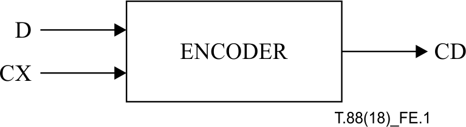

Figure E.1 – Arithmetic encoder inputs and outputs

### E.1.1 Recursive interval subdivision

The recursive probability interval subdivision of Elias coding is the basis for the binary arithmetic coding process. With each binary decision the current probability interval is subdivided into two sub-intervals, and the code string is modified (if necessary) so that it points to the base (the lower bound) of the probability sub-interval assigned to the symbol which occurred.

In the partitioning of the current interval into two sub-intervals, the sub-interval for the more probable symbol (MPS) is ordered above the sub-interval for the less probable symbol (LPS). Therefore, when the MPS is coded, the LPS sub-interval is added to the code string. This coding convention requires that symbols be recognized as either MPS or LPS, rather than 0 or 1. Consequently, the size of the LPS interval and the sense of the MPS for each decision must be known in order to code that decision.

Since the code string always points to the base of the current interval, the decoding process is a matter of determining, for each decision, which sub-interval is pointed to by the code string. This is also done recursively, using the same interval sub-division process as in the encoder. Each time a decision is decoded, the decoder subtracts any interval the encoder added to the code string. Therefore, the code string in the decoder is a pointer into the current interval relative to the base of the current interval. Since the coding process involves addition of binary fractions rather than concatenation of integer code words, the more probable binary decisions can often be coded at a cost of much less than one bit per decision.

### E.1.2 Coding conventions and approximations

The coding operations are done using fixed precision integer arithmetic and using an integer representation of fractional values in which 0x8000 is equivalent to decimal 0.75. The interval A is kept in the range 0.75 ≤ A \< 1.5 by doubling it whenever the integer value falls below 0x8000.

The code register C is also doubled each time A is doubled. Periodically, to keep C from overflowing, a byte of data is removed from the high order bits of the C-register and placed in an external compressed data buffer. Carry-over into the external buffer is resolved by a bit-stuffing procedure.

Keeping A in the range 0.75 ≤ A \< 1.5 allows a simple arithmetic approximation to be used in the interval subdivision. If the interval is A and the current estimate of the LPS probability is Qe, a precise calculation of the sub-intervals would require:

<table style="width:79%;">
<colgroup>
<col style="width: 37%" />
<col style="width: 3%" />
<col style="width: 37%" />
</colgroup>
<tbody>
<tr>
<td style="text-align: right;">A  –  (Qe  ×  A) 
Qe  ×  A</td>
<td style="text-align: center;">= 
=</td>
<td>sub-interval for the MPS 
sub-interval for the LPS</td>
</tr>
</tbody>
</table>

Because the value of A is of order unity, these are approximated by:

<table style="width:79%;">
<colgroup>
<col style="width: 37%" />
<col style="width: 3%" />
<col style="width: 37%" />
</colgroup>
<tbody>
<tr>
<td style="text-align: right;">A  –  Qe 
Qe</td>
<td style="text-align: center;">= 
=</td>
<td>sub-interval for the MPS 
sub-interval for the LPS</td>
</tr>
</tbody>
</table>

Whenever the MPS is coded, the value of Qe is added to the code register and the interval is reduced to A – Qe. Whenever the LPS is coded, the code register is left unchanged and the interval is reduced to Qe. The precision range required for A is then restored, if necessary, by renormalization of both A and C.

With the process illustrated above, the approximations in the interval subdivision process can sometimes make the LPS sub-interval larger than the MPS sub-interval. If, for example, the value of Qe is 0.5 and A is at the minimum allowed value of 0.75, the approximate scaling gives 1/3 of the interval to the MPS and 2/3 to the LPS. To avoid this size inversion, the MPS and LPS intervals are exchanged whenever the LPS interval is larger than the MPS interval. This MPS/LPS conditional exchange can only occur when a renormalization is needed.

Whenever a renormalization occurs, a probability estimation process is invoked which determines a new probability estimate for the context currently being coded. No explicit symbol counts are needed for the estimation. The relative probabilities of renormalization after coding an LPS and MPS provide an approximate symbol counting mechanism which is used to directly estimate the probabilities.

## E.2 Description of the arithmetic encoder

The ENCODER (Figure E.2) initializes the encoder through the INITENC procedure. CX and D pairs are read and passed on to ENCODE until all pairs have been read. The probability estimation procedures which provide adaptive estimates of the probability for each context are embedded in ENCODE. Bytes of compressed data are output when no longer modifiable. When all of the CX and D pairs have been read (Finished?), FLUSH sets the contents of the C‑register to as many 1-bits as possible and then outputs the final bytes. FLUSH also terminates the encoding operations and generates the required terminating marker.

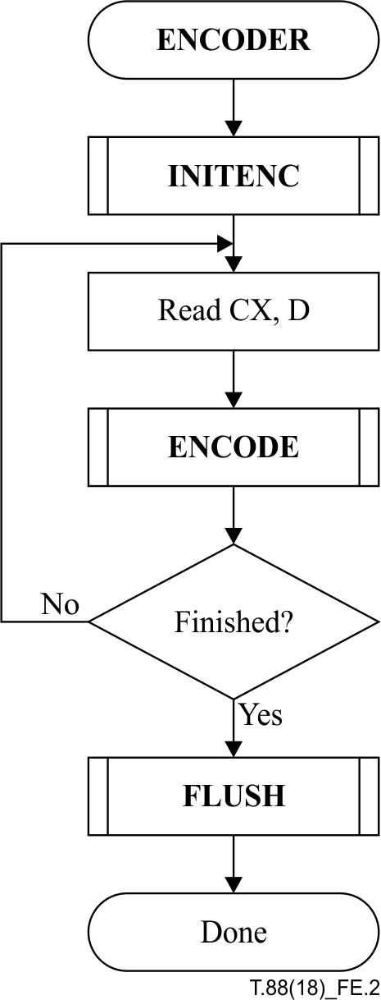

Figure E.2 – Encoder for the MQ-coder

### E.2.1 Encoder code register conventions

The flow charts given in this annex assume the following register structures for the encoder:

|            |          |          |          |          |
|:-----------|----------|:---------|----------|:--------:|
|            | MSB      |          |          |   LSB    |
| C-register | 0000cbbb | bbbbbsss | xxxxxxxx | xxxxxxxx |
| A-register | 00000000 | 00000000 | aaaaaaaa | aaaaaaaa |

The "a" bits are the fractional bits in the A-register (the current interval value) and the "x" bits are the fractional bits in the code register. The "s" bits are spacer bits which provide useful constraints on carry-over, and the "b" bits indicate the bit positions from which the completed bytes of the data are removed from the C-register. The "c" bit is a carry bit.

The detailed description of bit stuffing and the handling of carry-over will be given in a later part of this annex.

### E.2.2 Encoding a decision (ENCODE)

The ENCODE procedure determines whether the decision D is a 0 or not. Then a CODE0 or a CODE1 procedure is called appropriately. Often embodiments will not have an ENCODE procedure, but will call the CODE0 or CODE1 procedures directly to code a 0-decision or a 1-decision.

### E.2.3 Encoding a 1 or 0 (CODE1 and CODE0)

When a given binary decision is coded, one of two possibilities occurs: the symbol is either the more probable symbol, or it is the less probable symbol. CODE1 and CODE0 are illustrated in Figures E.4 and E.5. In these figures, CX is the context. For each context, the index of the probability estimate which is to be used in the coding operations and the MPS value are stored. MPS(CX) is the sense (**0** or **1**) of the MPS for context CX.

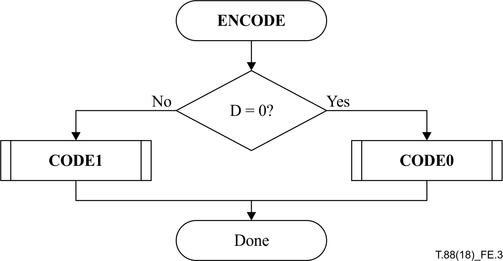

Figure E.3 – ENCODE procedure

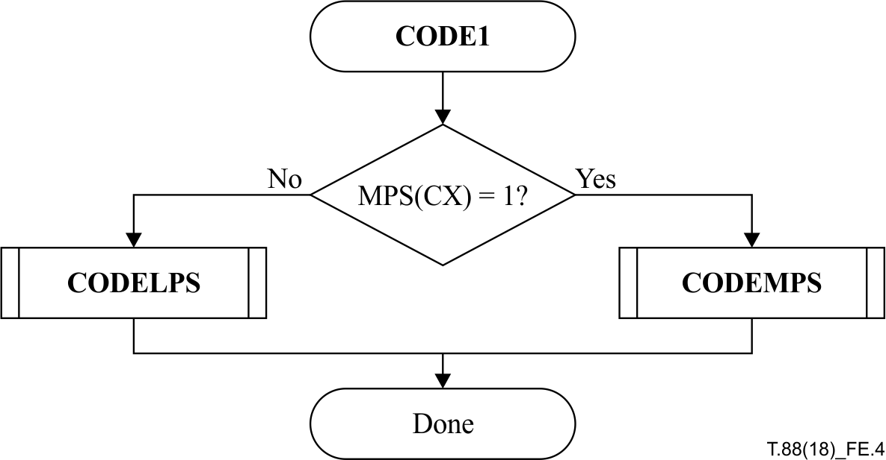

Figure E.4 – CODE1 procedure

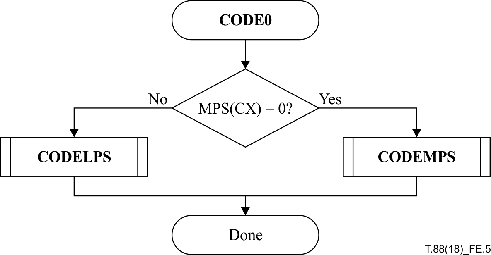

Figure E.5 – CODE0 procedure

### E.2.4 Encoding an MPS or LPS (CODEMPS and CODELPS)

The CODELPS (Figure E.6) procedure usually consists of a scaling of the interval to Qe(I(CX)), the probability estimate of the LPS determined from the index I stored for context CX. The upper interval is first calculated so it can be compared to the lower interval to confirm that Qe has the smaller size. It is always followed by a renormalization (RENORME). In the event that the interval sizes are inverted, however, the conditional MPS/LPS exchange occurs and the upper interval is coded. In either case, the probability estimate is updated. If the SWITCH flag for the index I(CX) is set, then the MPS(CX) is inverted. A new index I is saved at CX as determined from the next LPS index (NLPS) column in Table E.1.

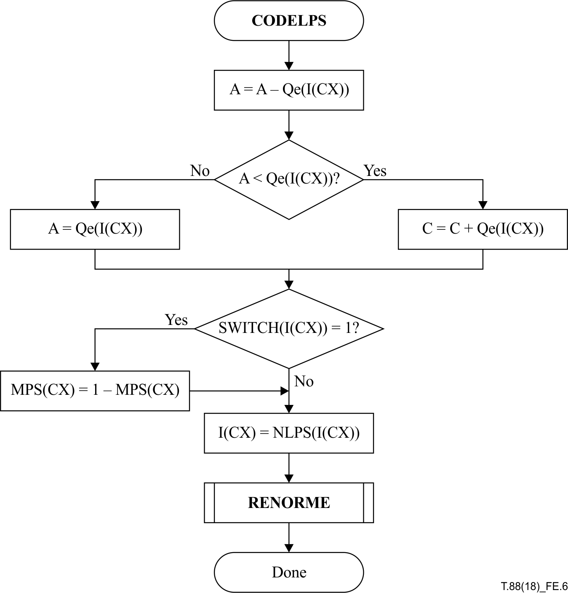

Figure E.6 – CODELPS procedure with conditional MPS/LPS exchange

The CODEMPS (Figure E.7) procedure usually reduces the size of the interval to the MPS sub-interval and adjusts the code register so that it points to the base of the MPS sub-interval. However, if the interval sizes are inverted, the LPS sub-interval is coded instead. Note that the size inversion cannot occur unless a renormalization (RENORME) is required after the coding of the symbol. The probability estimate update changes the index I(CX) according to the next MPS index (NMPS) column in Table E.1.

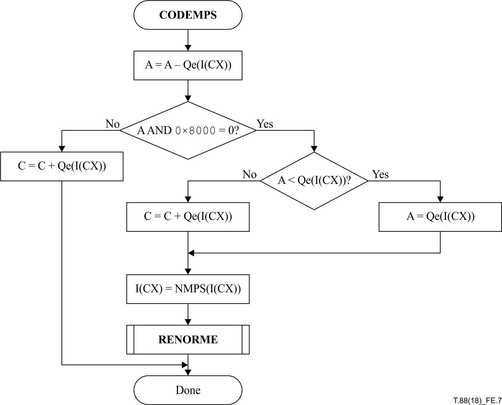

Figure E.7 – CODEMPS procedure with conditional MPS/LPS exchange

### E.2.5 Probability estimation

Table E.1 shows the Qe value associated with each Qe index. The Qe values are expressed as hexadecimal integers, as binary integers, and as decimal fractions. To convert the 15-bit integer representation of Qe to the decimal probability, the Qe values are divided by (4/3) × (0x8000).

The estimator can be defined as a finite-state machine – a table of Qe indexes and associated next states for each type of renormalization (i.e., new table positions) – as shown in Table E.1. The change in state occurs only when the arithmetic coder interval register is renormalized. This is always done after coding the LPS, and whenever the interval register is less than 0x8000 (0.75 in decimal notation) after coding the MPS.

After an LPS renormalization, NLPS gives the new index for the LPS probability estimate; also, if Switch is **1**, the MPS symbol sense is reversed. After an MPS renormalization, NMPS gives the new index for the LPS probability estimate.

The index to the current estimate is part of the information stored for context CX. This index is used as the index to the table of values in NMPS, which gives the next index for an MPS renormalization. This index is saved in the context storage at CX. MPS(CX) does not change.

The procedure for estimating the probability on the LPS renormalization path is similar to that of an MPS renormalization, except that when Switch(I(CX)) is 1, the sense of MPS(CX) is inverted.

The final index state 46 can be used to establish a fixed 0.5 probability estimate.

### E.2.6 Renormalization in the encoder (RENORME)

Renormalization is very similar in both encoder and decoder, except that in the encoder it generates compressed bits and in the decoder it consumes compressed bits.

The RENORME procedure for the encoder renormalization is illustrated in Figure E.8. Both the interval register A and the code register C are shifted, one bit at a time. The number of shifts is counted in the counter CT, and when CT is counted down to zero, a byte of compressed data is removed from C by the procedure BYTEOUT. Renormalization continues until A is no longer less than 0x8000.

Table E.1 – Qe values and probability estimation process

<table style="width:100%;">
<colgroup>
<col style="width: 17%" />
<col style="width: 14%" />
<col style="width: 21%" />
<col style="width: 14%" />
<col style="width: 10%" />
<col style="width: 10%" />
<col style="width: 10%" />
</colgroup>
<tbody>
<tr>
<td rowspan="2">Index</td>
<td></td>
<td>Qe_Value</td>
<td></td>
<td rowspan="2">NMPS</td>
<td rowspan="2">NLPS</td>
<td rowspan="2">SWITCH</td>
</tr>
<tr>
<td>(hexadecimal)</td>
<td>(binary)</td>
<td>(decimal)</td>
</tr>
<tr>
<td style="text-align: center;">0</td>
<td style="text-align: center;">0x5601</td>
<td style="text-align: center;"><strong>0101011000000001</strong></td>
<td style="text-align: center;">0.503937</td>
<td style="text-align: center;">1</td>
<td style="text-align: center;">1</td>
<td style="text-align: center;">1</td>
</tr>
<tr>
<td style="text-align: center;">1</td>
<td style="text-align: center;">0x3401</td>
<td style="text-align: center;"><strong>0011010000000001</strong></td>
<td style="text-align: center;">0.304715</td>
<td style="text-align: center;">2</td>
<td style="text-align: center;">6</td>
<td style="text-align: center;">0</td>
</tr>
<tr>
<td style="text-align: center;">2</td>
<td style="text-align: center;">0x1801</td>
<td style="text-align: center;"><strong>0001100000000001</strong></td>
<td style="text-align: center;">0.140650</td>
<td style="text-align: center;">3</td>
<td style="text-align: center;">9</td>
<td style="text-align: center;">0</td>
</tr>
<tr>
<td style="text-align: center;">3</td>
<td style="text-align: center;">0x0AC1</td>
<td style="text-align: center;"><strong>0000101011000001</strong></td>
<td style="text-align: center;">0.063012</td>
<td style="text-align: center;">4</td>
<td style="text-align: center;">12</td>
<td style="text-align: center;">0</td>
</tr>
<tr>
<td style="text-align: center;">4</td>
<td style="text-align: center;">0x0521</td>
<td style="text-align: center;"><strong>0000010100100001</strong></td>
<td style="text-align: center;">0.030053</td>
<td style="text-align: center;">5</td>
<td style="text-align: center;">29</td>
<td style="text-align: center;">0</td>
</tr>
<tr>
<td style="text-align: center;">5</td>
<td style="text-align: center;">0x0221</td>
<td style="text-align: center;"><strong>0000001000100001</strong></td>
<td style="text-align: center;">0.012474</td>
<td style="text-align: center;">38</td>
<td style="text-align: center;">33</td>
<td style="text-align: center;">0</td>
</tr>
<tr>
<td style="text-align: center;">6</td>
<td style="text-align: center;">0x5601</td>
<td style="text-align: center;"><strong>0101011000000001</strong></td>
<td style="text-align: center;">0.503937</td>
<td style="text-align: center;">7</td>
<td style="text-align: center;">6</td>
<td style="text-align: center;">1</td>
</tr>
<tr>
<td style="text-align: center;">7</td>
<td style="text-align: center;">0x5401</td>
<td style="text-align: center;"><strong>0101010000000001</strong></td>
<td style="text-align: center;">0.492218</td>
<td style="text-align: center;">8</td>
<td style="text-align: center;">14</td>
<td style="text-align: center;">0</td>
</tr>
<tr>
<td style="text-align: center;">8</td>
<td style="text-align: center;">0x4801</td>
<td style="text-align: center;"><strong>0100100000000001</strong></td>
<td style="text-align: center;">0.421904</td>
<td style="text-align: center;">9</td>
<td style="text-align: center;">14</td>
<td style="text-align: center;">0</td>
</tr>
<tr>
<td style="text-align: center;">9</td>
<td style="text-align: center;">0x3801</td>
<td style="text-align: center;"><strong>0011100000000001</strong></td>
<td style="text-align: center;">0.328153</td>
<td style="text-align: center;">10</td>
<td style="text-align: center;">14</td>
<td style="text-align: center;">0</td>
</tr>
<tr>
<td style="text-align: center;">10</td>
<td style="text-align: center;">0x3001</td>
<td style="text-align: center;"><strong>0011000000000001</strong></td>
<td style="text-align: center;">0.281277</td>
<td style="text-align: center;">11</td>
<td style="text-align: center;">17</td>
<td style="text-align: center;">0</td>
</tr>
<tr>
<td style="text-align: center;">11</td>
<td style="text-align: center;">0x2401</td>
<td style="text-align: center;"><strong>0010010000000001</strong></td>
<td style="text-align: center;">0.210964</td>
<td style="text-align: center;">12</td>
<td style="text-align: center;">18</td>
<td style="text-align: center;">0</td>
</tr>
<tr>
<td style="text-align: center;">12</td>
<td style="text-align: center;">0x1C01</td>
<td style="text-align: center;"><strong>0001110000000001</strong></td>
<td style="text-align: center;">0.164088</td>
<td style="text-align: center;">13</td>
<td style="text-align: center;">20</td>
<td style="text-align: center;">0</td>
</tr>
<tr>
<td style="text-align: center;">13</td>
<td style="text-align: center;">0x1601</td>
<td style="text-align: center;"><strong>0001011000000001</strong></td>
<td style="text-align: center;">0.128931</td>
<td style="text-align: center;">29</td>
<td style="text-align: center;">21</td>
<td style="text-align: center;">0</td>
</tr>
<tr>
<td style="text-align: center;">14</td>
<td style="text-align: center;">0x5601</td>
<td style="text-align: center;"><strong>0101011000000001</strong></td>
<td style="text-align: center;">0.503937</td>
<td style="text-align: center;">15</td>
<td style="text-align: center;">14</td>
<td style="text-align: center;">1</td>
</tr>
<tr>
<td style="text-align: center;">15</td>
<td style="text-align: center;">0x5401</td>
<td style="text-align: center;"><strong>0101010000000001</strong></td>
<td style="text-align: center;">0.492218</td>
<td style="text-align: center;">16</td>
<td style="text-align: center;">14</td>
<td style="text-align: center;">0</td>
</tr>
<tr>
<td style="text-align: center;">16</td>
<td style="text-align: center;">0x5101</td>
<td style="text-align: center;"><strong>0101000100000001</strong></td>
<td style="text-align: center;">0.474640</td>
<td style="text-align: center;">17</td>
<td style="text-align: center;">15</td>
<td style="text-align: center;">0</td>
</tr>
<tr>
<td style="text-align: center;">17</td>
<td style="text-align: center;">0x4801</td>
<td style="text-align: center;"><strong>0100100000000001</strong></td>
<td style="text-align: center;">0.421904</td>
<td style="text-align: center;">18</td>
<td style="text-align: center;">16</td>
<td style="text-align: center;">0</td>
</tr>
<tr>
<td style="text-align: center;">18</td>
<td style="text-align: center;">0x3801</td>
<td style="text-align: center;"><strong>0011100000000001</strong></td>
<td style="text-align: center;">0.328153</td>
<td style="text-align: center;">19</td>
<td style="text-align: center;">17</td>
<td style="text-align: center;">0</td>
</tr>
<tr>
<td style="text-align: center;">19</td>
<td style="text-align: center;">0x3401</td>
<td style="text-align: center;"><strong>0011010000000001</strong></td>
<td style="text-align: center;">0.304715</td>
<td style="text-align: center;">20</td>
<td style="text-align: center;">18</td>
<td style="text-align: center;">0</td>
</tr>
<tr>
<td style="text-align: center;">20</td>
<td style="text-align: center;">0x3001</td>
<td style="text-align: center;"><strong>0011000000000001</strong></td>
<td style="text-align: center;">0.281277</td>
<td style="text-align: center;">21</td>
<td style="text-align: center;">19</td>
<td style="text-align: center;">0</td>
</tr>
<tr>
<td style="text-align: center;">21</td>
<td style="text-align: center;">0x2801</td>
<td style="text-align: center;"><strong>0010100000000001</strong></td>
<td style="text-align: center;">0.234401</td>
<td style="text-align: center;">22</td>
<td style="text-align: center;">19</td>
<td style="text-align: center;">0</td>
</tr>
<tr>
<td style="text-align: center;">22</td>
<td style="text-align: center;">0x2401</td>
<td style="text-align: center;"><strong>0010010000000001</strong></td>
<td style="text-align: center;">0.210964</td>
<td style="text-align: center;">23</td>
<td style="text-align: center;">20</td>
<td style="text-align: center;">0</td>
</tr>
<tr>
<td style="text-align: center;">23</td>
<td style="text-align: center;">0x2201</td>
<td style="text-align: center;"><strong>0010001000000001</strong></td>
<td style="text-align: center;">0.199245</td>
<td style="text-align: center;">24</td>
<td style="text-align: center;">21</td>
<td style="text-align: center;">0</td>
</tr>
<tr>
<td style="text-align: center;">24</td>
<td style="text-align: center;">0x1C01</td>
<td style="text-align: center;"><strong>0001110000000001</strong></td>
<td style="text-align: center;">0.164088</td>
<td style="text-align: center;">25</td>
<td style="text-align: center;">22</td>
<td style="text-align: center;">0</td>
</tr>
<tr>
<td style="text-align: center;">25</td>
<td style="text-align: center;">0x1801</td>
<td style="text-align: center;"><strong>0001100000000001</strong></td>
<td style="text-align: center;">0.140650</td>
<td style="text-align: center;">26</td>
<td style="text-align: center;">23</td>
<td style="text-align: center;">0</td>
</tr>
<tr>
<td style="text-align: center;">26</td>
<td style="text-align: center;">0x1601</td>
<td style="text-align: center;"><strong>0001011000000001</strong></td>
<td style="text-align: center;">0.128931</td>
<td style="text-align: center;">27</td>
<td style="text-align: center;">24</td>
<td style="text-align: center;">0</td>
</tr>
<tr>
<td style="text-align: center;">27</td>
<td style="text-align: center;">0x1401</td>
<td style="text-align: center;"><strong>0001010000000001</strong></td>
<td style="text-align: center;">0.117212</td>
<td style="text-align: center;">28</td>
<td style="text-align: center;">25</td>
<td style="text-align: center;">0</td>
</tr>
<tr>
<td style="text-align: center;">28</td>
<td style="text-align: center;">0x1201</td>
<td style="text-align: center;"><strong>0001001000000001</strong></td>
<td style="text-align: center;">0.105493</td>
<td style="text-align: center;">29</td>
<td style="text-align: center;">26</td>
<td style="text-align: center;">0</td>
</tr>
<tr>
<td style="text-align: center;">29</td>
<td style="text-align: center;">0x1101</td>
<td style="text-align: center;"><strong>0001000100000001</strong></td>
<td style="text-align: center;">0.099634</td>
<td style="text-align: center;">30</td>
<td style="text-align: center;">27</td>
<td style="text-align: center;">0</td>
</tr>
<tr>
<td style="text-align: center;">30</td>
<td style="text-align: center;">0x0AC1</td>
<td style="text-align: center;"><strong>0000101011000001</strong></td>
<td style="text-align: center;">0.063012</td>
<td style="text-align: center;">31</td>
<td style="text-align: center;">28</td>
<td style="text-align: center;">0</td>
</tr>
<tr>
<td style="text-align: center;">31</td>
<td style="text-align: center;">0x09C1</td>
<td style="text-align: center;"><strong>0000100111000001</strong></td>
<td style="text-align: center;">0.057153</td>
<td style="text-align: center;">32</td>
<td style="text-align: center;">29</td>
<td style="text-align: center;">0</td>
</tr>
<tr>
<td style="text-align: center;">32</td>
<td style="text-align: center;">0x08A1</td>
<td style="text-align: center;"><strong>0000100010100001</strong></td>
<td style="text-align: center;">0.050561</td>
<td style="text-align: center;">33</td>
<td style="text-align: center;">30</td>
<td style="text-align: center;">0</td>
</tr>
<tr>
<td style="text-align: center;">33</td>
<td style="text-align: center;">0x0521</td>
<td style="text-align: center;"><strong>0000010100100001</strong></td>
<td style="text-align: center;">0.030053</td>
<td style="text-align: center;">34</td>
<td style="text-align: center;">31</td>
<td style="text-align: center;">0</td>
</tr>
<tr>
<td style="text-align: center;">34</td>
<td style="text-align: center;">0x0441</td>
<td style="text-align: center;"><strong>0000010001000001</strong></td>
<td style="text-align: center;">0.024926</td>
<td style="text-align: center;">35</td>
<td style="text-align: center;">32</td>
<td style="text-align: center;">0</td>
</tr>
<tr>
<td style="text-align: center;">35</td>
<td style="text-align: center;">0x02A1</td>
<td style="text-align: center;"><strong>0000001010100001</strong></td>
<td style="text-align: center;">0.015404</td>
<td style="text-align: center;">36</td>
<td style="text-align: center;">33</td>
<td style="text-align: center;">0</td>
</tr>
<tr>
<td style="text-align: center;">36</td>
<td style="text-align: center;">0x0221</td>
<td style="text-align: center;"><strong>0000001000100001</strong></td>
<td style="text-align: center;">0.012474</td>
<td style="text-align: center;">37</td>
<td style="text-align: center;">34</td>
<td style="text-align: center;">0</td>
</tr>
<tr>
<td style="text-align: center;">37</td>
<td style="text-align: center;">0x0141</td>
<td style="text-align: center;"><strong>0000000101000001</strong></td>
<td style="text-align: center;">0.007347</td>
<td style="text-align: center;">38</td>
<td style="text-align: center;">35</td>
<td style="text-align: center;">0</td>
</tr>
<tr>
<td style="text-align: center;">38</td>
<td style="text-align: center;">0x0111</td>
<td style="text-align: center;"><strong>0000000100010001</strong></td>
<td style="text-align: center;">0.006249</td>
<td style="text-align: center;">39</td>
<td style="text-align: center;">36</td>
<td style="text-align: center;">0</td>
</tr>
<tr>
<td style="text-align: center;">39</td>
<td style="text-align: center;">0x0085</td>
<td style="text-align: center;"><strong>0000000010000101</strong></td>
<td style="text-align: center;">0.003044</td>
<td style="text-align: center;">40</td>
<td style="text-align: center;">37</td>
<td style="text-align: center;">0</td>
</tr>
<tr>
<td style="text-align: center;">40</td>
<td style="text-align: center;">0x0049</td>
<td style="text-align: center;"><strong>0000000001001001</strong></td>
<td style="text-align: center;">0.001671</td>
<td style="text-align: center;">41</td>
<td style="text-align: center;">38</td>
<td style="text-align: center;">0</td>
</tr>
<tr>
<td style="text-align: center;">41</td>
<td style="text-align: center;">0x0025</td>
<td style="text-align: center;"><strong>0000000000100101</strong></td>
<td style="text-align: center;">0.000847</td>
<td style="text-align: center;">42</td>
<td style="text-align: center;">39</td>
<td style="text-align: center;">0</td>
</tr>
<tr>
<td style="text-align: center;">42</td>
<td style="text-align: center;">0x0015</td>
<td style="text-align: center;"><strong>0000000000010101</strong></td>
<td style="text-align: center;">0.000481</td>
<td style="text-align: center;">43</td>
<td style="text-align: center;">40</td>
<td style="text-align: center;">0</td>
</tr>
<tr>
<td style="text-align: center;">43</td>
<td style="text-align: center;">0x0009</td>
<td style="text-align: center;"><strong>0000000000001001</strong></td>
<td style="text-align: center;">0.000206</td>
<td style="text-align: center;">44</td>
<td style="text-align: center;">41</td>
<td style="text-align: center;">0</td>
</tr>
<tr>
<td style="text-align: center;">44</td>
<td style="text-align: center;">0x0005</td>
<td style="text-align: center;"><strong>0000000000000101</strong></td>
<td style="text-align: center;">0.000114</td>
<td style="text-align: center;">45</td>
<td style="text-align: center;">42</td>
<td style="text-align: center;">0</td>
</tr>
<tr>
<td style="text-align: center;">45</td>
<td style="text-align: center;">0x0001</td>
<td style="text-align: center;"><strong>0000000000000001</strong></td>
<td style="text-align: center;">0.000023</td>
<td style="text-align: center;">45</td>
<td style="text-align: center;">43</td>
<td style="text-align: center;">0</td>
</tr>
<tr>
<td style="text-align: center;">46</td>
<td style="text-align: center;">0x5601</td>
<td style="text-align: center;"><strong>0101011000000001</strong></td>
<td style="text-align: center;">0.503937</td>
<td style="text-align: center;">46</td>
<td style="text-align: center;">46</td>
<td style="text-align: center;">0</td>
</tr>
</tbody>
</table>

### E.2.7 Compressed data output (BYTEOUT)

The BYTEOUT routine called from RENORME is illustrated in Figure E.9. This routine contains the bit-stuffing procedures which are needed to limit carry propagation into the completed bytes of compressed data. The conventions used make it impossible for a carry to propagate through more than the byte most recently written to the compressed data buffer.

The procedure in the block in the lower right section does bit stuffing after a 0xFF byte; the similar procedure on the left is for the case where bit stuffing is not needed.

B is the byte pointed to by the compressed data buffer pointer BP. If B is not a 0xFF byte, the carry bit is checked. If the carry bit is set, it is added to B and B is again checked to see if a bit needs to be stuffed in the next byte. After the need for bit stuffing has been determined, the appropriate path is chosen, BP is incremented and the new value of B is removed from the code register "b" bits.

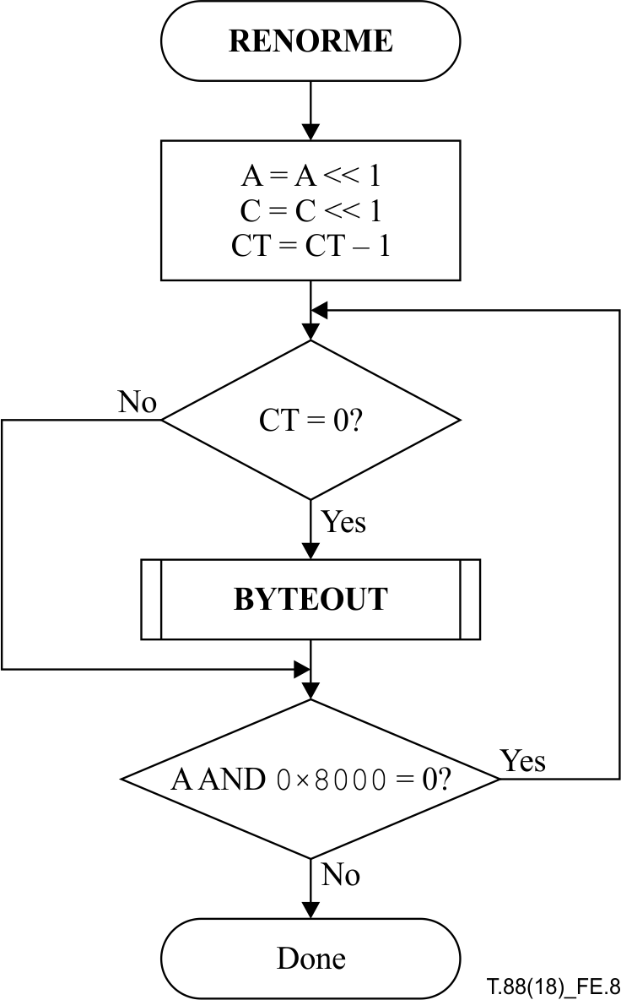

Figure E.8 – Encoder renormalization procedure

### E.2.8 Initialization of the encoder (INITENC)

The INITENC procedure is used to start the arithmetic coder. The basic steps are shown in Figure E.10.

The interval register and code register are set to their initial values, and the bit counter is set. Setting CT = 12 reflects the fact that there are three spacer bits in the register which need to be filled before the field from which the bytes are removed is reached. Note that BP always points to the byte preceding the position BPST where the first byte is placed. Therefore, if the preceding byte is a 0xFF byte, a spurious bit stuff will occur, but can be compensated for by increasing CT. Note that the default initialization of the statistics bins is MPS = 0 and I = 0 (i.e., Qe = 0x5601 or decimal 0.503937).

### E.2.9 Termination of encoding (FLUSH)

The FLUSH procedure shown in Figure E.11 is used to terminate the encoding operations and generate the required terminating marker. The procedure guarantees that the 0xFF prefix to the marker code overlaps the final bits of the compressed data. This guarantees that any marker code at the end of the compressed data will be recognized and interpreted before decoding is complete.

The first part of the FLUSH procedure sets as many bits in the C-register to 1 as possible as shown in Figure E.12. The exclusive upper bound for the C-register is the sum of the C-register and the interval register. The low order 16 bits of C are forced to 1, and the result is compared to the upper bound. If C is too big, the leading 1-bit is removed, reducing C to a value which is within the interval.

The byte in the C-register is then completed by shifting C, and two bytes are then removed. If the second byte is not 0xFF, another byte is added to the compressed data which is guaranteed to be 0xFF.

### E.2.10  Minimization of the compressed data

If desired, the compressed data can be truncated after the FLUSH procedure is complete. If a sequence of 1-bits is generated by the arithmetic coder, bit stuffing will produce pairs of 0xFF, 0x7F bytes. These byte pairs can be trimmed from the compressed data, provided that the earliest 0xFF byte in the sequence is not removed. This remaining 0xFF byte then becomes the prefix to the marker code which terminates the compressed data.

Decoding is not affected by this trimming process because the convention is used in the decoder that when a marker code is encountered, 1-bits (without bit stuffing) are supplied to the decoder until the coding interval is complete.

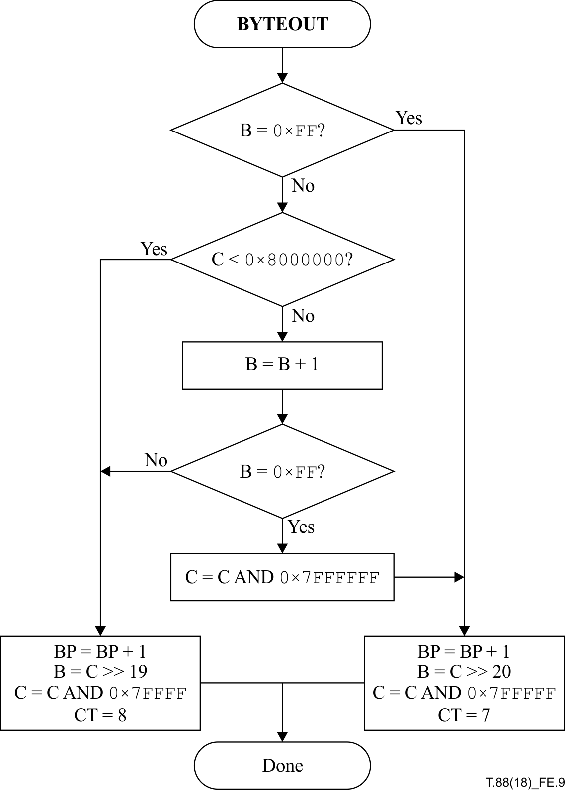

Figure E.9 – BYTEOUT procedure for encoder

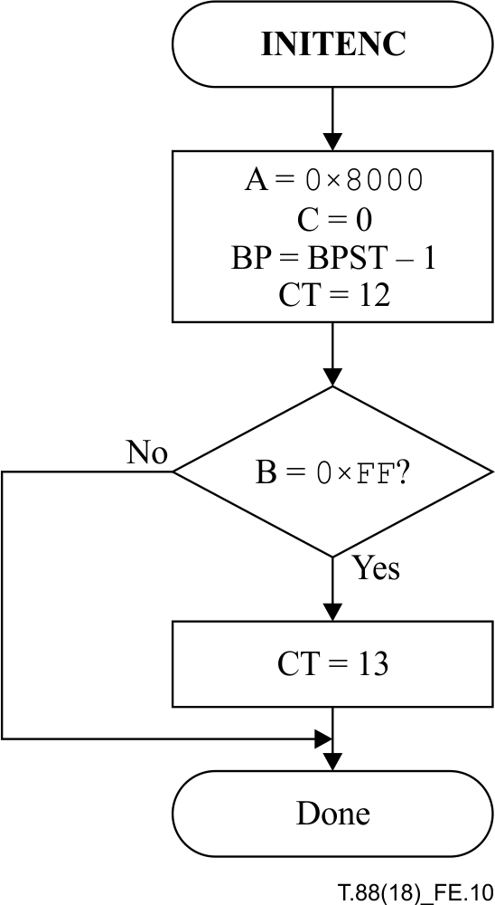

Figure E.10 – Initialization of the encoder

## E.3 Arithmetic decoding procedure

Figure E.13 shows a simple block diagram of a binary adaptive arithmetic decoder. The compressed data CD and a context CX from the decoder's model unit (not shown) are input to the arithmetic decoder. The decoder's output is the decision D. The encoder and decoder model units need to supply exactly the same context CX for each given decision.

The DECODER (Figure E.14) initializes the decoder through INITDEC. Contexts, CX, and bytes of compressed data (as needed) are read and passed on to DECODE until all contexts have been read. The DECODE routine decodes the binary decision D and returns a value of either 0 or 1. The probability estimation procedures which provide adaptive estimates of the probability for each context are embedded in DECODE. When all contexts have been read (Finished?), the compressed data has been decompressed.

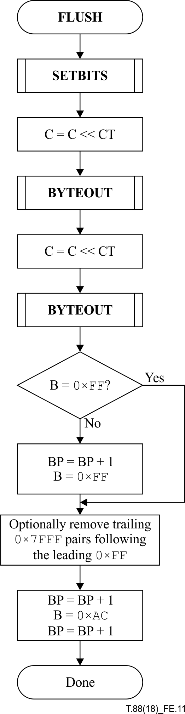

Figure E.11 – FLUSH procedure

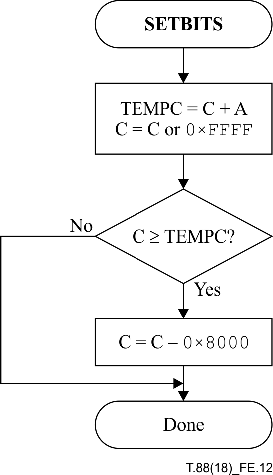

**Figure E.12 – Setting the final bits in the C register**

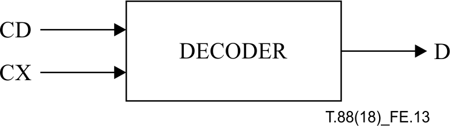

Figure E.13 – Arithmetic decoder inputs and outputs

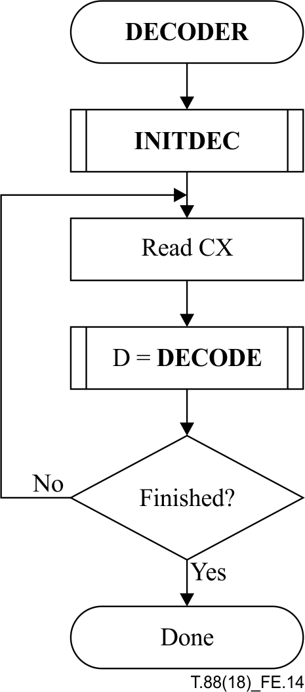

Figure E.14 – Decoder for the MQ-coder

### E.3.1 Decoder code register conventions

The flow charts given in this annex assume the following register structures for the decoder:

|                 |          |          |
|:----------------|----------|:--------:|
|                 | 15       |    0     |
| Chigh register  | xxxxxxxx | xxxxxxxx |
| Clow register   | bbbbbbbb | 00000000 |
| A-register      | aaaaaaaa | aaaaaaaa |

Chigh and Clow can be thought of as one 32-bit C-register in that renormalization of C shifts a bit of new data from bit 15 of Clow to bit 0 of Chigh. However, the decoding comparisons use Chigh alone. New data is inserted into the "b" bits of Clow one byte at a time.

The detailed description of the handling of data with stuff-bits will be given later in this subclause.

Note that the comparisons shown in the various procedures in this subclause assume precisions greater than 16 bits. Logical comparisons can be used with 16-bit precision.

### E.3.2 Decoding a decision (DECODE)

The decoder decodes one binary decision at a time. After decoding the decision, the decoder subtracts any amount from the code string that the encoder added. The amount left in the code string is the offset from the base of the current interval to the sub-interval allocated to all binary decisions not yet decoded. In the first test in the DECODE procedure illustrated in Figure E.15 the Chigh register is compared to the size of the LPS sub-interval. Unless a conditional exchange is needed, this test determines whether a MPS or LPS is decoded. If Chigh is logically greater than or equal to the LPS probability estimate Qe for the current index I stored at CX, then Chigh is decremented by that amount. If A is not less than 0x8000, then the MPS sense stored at CX is used to set the decoded decision D.

When a renormalization is needed, the MPS/LPS conditional exchange may have occurred. For the MPS path the conditional exchange procedure is shown in Figure E.16. As long as the MPS sub-interval size A calculated as the first step in Figure E.16 is not logically less than the LPS probability estimate Qe(I(CX)), an MPS did occur and the decision can be set from MPS(CX). Then the index I(CX) is updated from the next MPS index (NMPS) column in Table E.1. If, however, the LPS sub-interval is larger, the conditional exchange occurred and an LPS occurred. The probability update switches the MPS sense if the SWITCH column has a "1" and updates the index I(CX) from the next LPS index (NLPS) column in Table E.1. Note that the probability estimation in the decoder needs to be identical to the probability estimation in the encoder.

For the LPS path of the decoder the conditional exchange procedure is given the LPS_EXCHANGE procedure shown in Figure E.17. The same logical comparison between the MPS sub-interval A and the LPS sub-interval Qe(I(CX)) determines if a conditional exchange occurred. On both paths the new sub-interval A is set to Qe(I(CX)). On the left path the conditional exchange occurred so the decision and update are for the MPS case. On the right path, the LPS decision and update are followed.

### E.3.3 Renormalization in the decoder (RENORMD)

The RENORMD procedure for the decoder renormalization is illustrated in Figure E.18. A counter keeps track of the number of compressed bits in the Clow section of the C-register. When CT is zero, a new byte is inserted into Clow in the BYTEIN procedure.

Both the interval register A and the code register C are shifted, one bit at a time, until A is no longer less than 0x8000.

### E.3.4 Compressed data input (BYTEIN)

The BYTEIN procedure called from RENORMD is illustrated in Figure E.19. This procedure reads in one byte of data, compensating for any stuff bits following the 0xFF byte in the process. It also detects the marker codes which must occur at the end of a scan or resynchronization interval. The C-register in this procedure is the concatenation of the Chigh and Clow registers.

B is the byte pointed to by the compressed data buffer pointer BP. If B is not a 0xFF byte, BP is incremented and the new value of B is inserted into the high order 8 bits of Clow.

If B is a 0xFF byte, then B1 (the byte pointed to by BP+1) is tested. If B1 exceeds 0x8F, then B1 must be one of the marker codes. The marker code is interpreted as required, and the buffer pointer remains pointed to the 0xFF prefix of the marker code which terminates the arithmetically compressed data. 1-bits are then fed to the decoder until the decoding is complete. This is shown by adding 0xFF00 to the C-register and setting the bit counter CT to 8.

If B1 is not a marker code, then BP is incremented to point to the next byte which contains a stuffed bit. The B is added to the C-register with an alignment such that the stuff bit (which contains any carry) is added to the low order bit of Chigh.

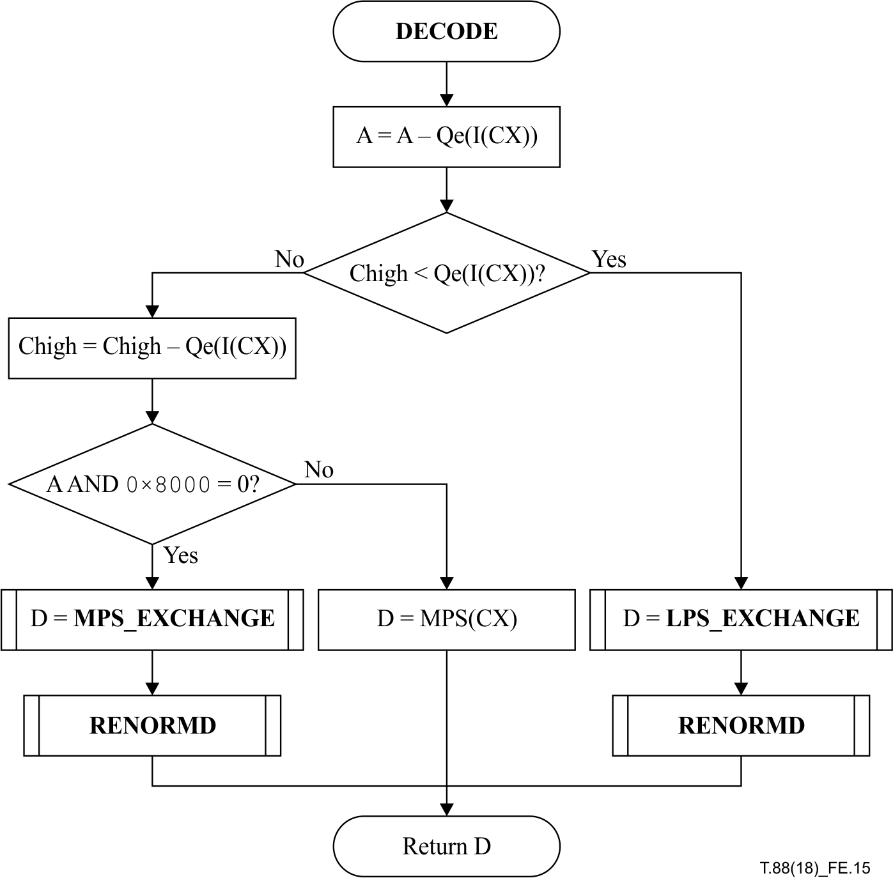

Figure E.15 – Decoding an MPS or an LPS

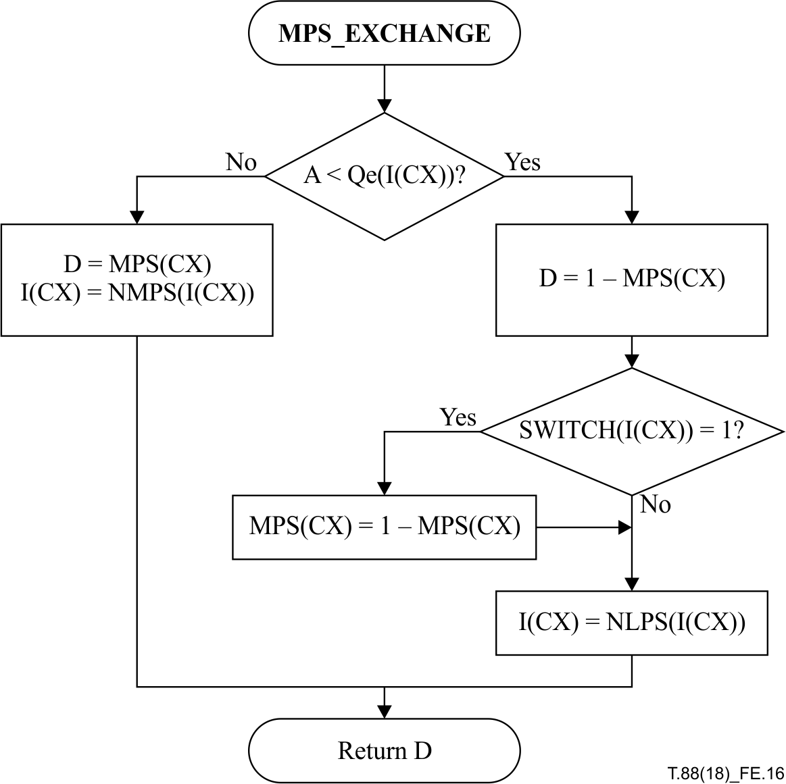

Figure E.16 – Decoder MPS path conditional exchange procedure

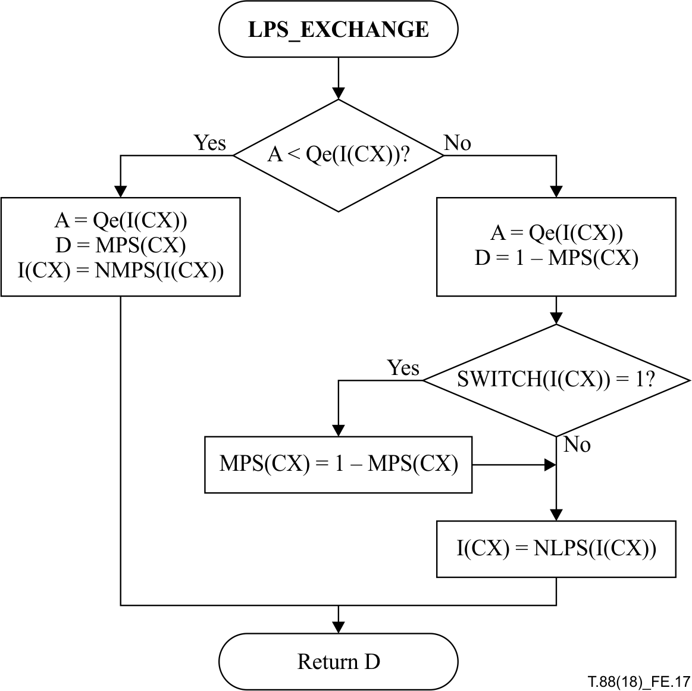

Figure E.17 – Decoder LPS path conditional exchange procedure

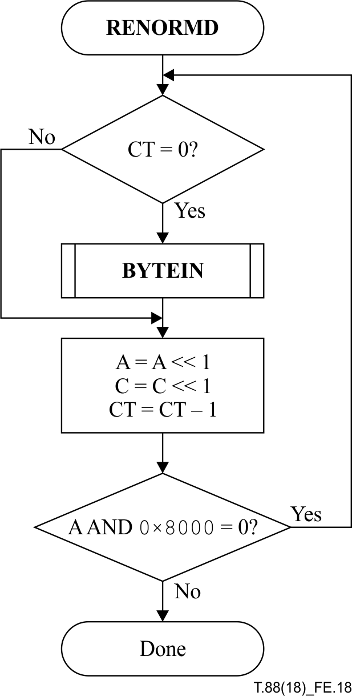

Figure E.18 – Decoder renormalization procedure

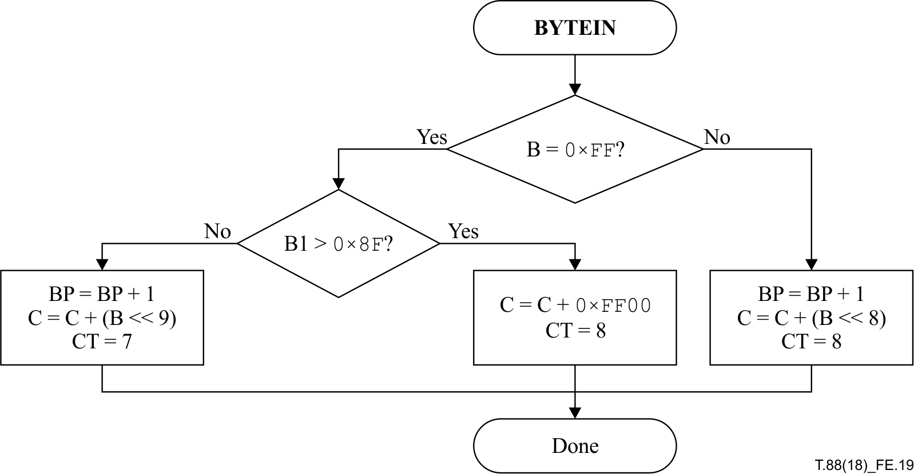

Figure E.19 – BYTEIN procedure for decoder

### E.3.5 Initialization of the decoder (INITDEC)

The INITDEC procedure is used to start the arithmetic decoder. The basic steps are shown in Figure E.20.

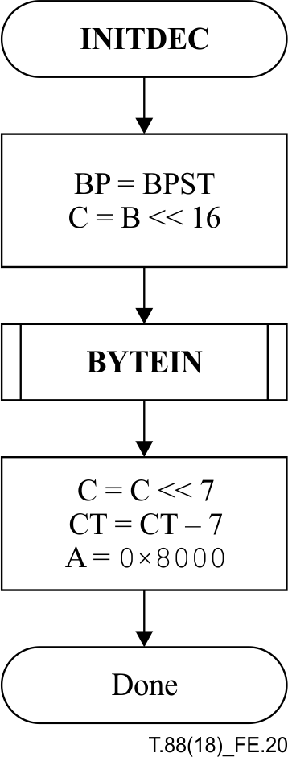

Figure E.20 – Initialization of the decoder

BP, the pointer to the compressed data, is initialized to BPST (pointing to the first compressed byte). The first byte of the compressed data is shifted into the low order byte of Chigh, and a new byte is then read in. The C-register is then shifted by 7 bits and CT is decremented by 7, bringing the C-register into alignment with the starting value of A. The interval register A is set to match the starting value in the encoder.

### E.3.6 Resynchronization of the decoder

Usually, when the end of the arithmetically compressed data is reached, the compressed data buffer pointer BP points to the 0xFF byte of the terminating marker code. If for any reason the compressed data buffer pointer is not at the 0xFF byte of the marker, a resynchronization procedure needs to scan the compressed data until it finds the terminating marker code prefix. If a search of this type is needed, it is indicative of an error condition. This error recovery procedure is not standardized.

### E.3.7 Resetting arithmetic coding statistics

At certain points during the decoding, some or all of the arithmetic coding statistics are reset. This process involves setting I(CX) and MPS(CX) equal to zero for some or all values of CX.

EXAMPLE – At the start of decoding a text region segment, all the arithmetic coding statistics are reset.

### E.3.8 Saving arithmetic coding statistics

In some cases, the decoder needs to save or restore some values of I(CX) and MPS(CX). This is done as part of decoding a symbol dictionary segment. In this case, the values that are saved and/or restored are all the values indexed by CX values whose initial label is "GB" or "GR" (i.e., all those CX values used by the generic region decoding procedure or the generic refinement region decoding procedure).

Annex F  
  
Profiles

(This annex forms an integral part of this Recommendation \| International Standard.)

It is recommended that a JBIG2 decoder implement one of the profiles described in Tables F.1 through F.7. Note that profile 0x00000001 (Table F.1) includes all the capabilities of this entire Recommendation \| International Standard, and is the profile assumed when none is explicitly specified.

See 7.4.12 for information on how the profile identification numbers are used.

Profile identification numbers 0x00000000 through 0x00FFFFFF are reserved for ISO/IEC and ITU-T applications. Of this range, profile identification numbers 0x00000100 through 0x00000FFF are reserved for ITU-T facsimile applications. Entities other than ISO/IEC and ITU-T wishing to use an unassigned profile identification number should choose one in the range 0x01000000 through 0xFFFFFFFF that is not likely to conflict with any other entity's choice. It is recommended that the first three bytes of the profile identification number be chosen to match the first three letters of the name of the entity, or be a suitable abbreviation of that name.

Table F.1 – Profile description for profile 0x00000001

|                            |                                             |
|----------------------------|---------------------------------------------|
| **Profile identification** | 0x00000001                                  |
| Requirements               | All JBIG2 capabilities                      |
| Generic region coding      | No restriction                              |
| Refinement region coding   | No restriction                              |
| Halftone region coding     | No restriction                              |
| Numerical data             | No restriction                              |
| Resources required         | High-speed processor                        |
| Application examples       | General-purpose printing; Format conversion |

Table F.2 – Profile description for profile 0x00000002

|                            |                                    |
|----------------------------|------------------------------------|
| **Profile identification** | 0x00000002                         |
| Requirements               | Maximum compression                |
| Generic region coding      | Arithmetic only; any template used |
| Refinement region coding   | No restriction                     |
| Halftone region coding     | No restriction                     |
| Numerical data             | Arithmetic only                    |
| Resources required         | High-speed processor               |
| Application examples       | Archiving; Wireless WWW            |

Table F.3 – Profile description for profile 0x00000003

<table style="width:70%;">
<colgroup>
<col style="width: 29%" />
<col style="width: 40%" />
</colgroup>
<tbody>
<tr>
<td colspan="2">NOTE 1 – This profile is a subset of profile 0x00000002.</td>
</tr>
<tr>
<td><strong>Profile identification</strong></td>
<td>0x00000003</td>
</tr>
<tr>
<td>Requirements</td>
<td>Medium complexity and medium compression</td>
</tr>
<tr>
<td>Generic region coding</td>
<td>Arithmetic only; only 10-pixel and 13-pixel templates</td>
</tr>
<tr>
<td>Refinement region coding</td>
<td>10-pixel template only (arithmetic)</td>
</tr>
<tr>
<td>Halftone region coding</td>
<td>No skip mask used</td>
</tr>
<tr>
<td>Numerical data</td>
<td>Arithmetic only</td>
</tr>
<tr>
<td>Resources required</td>
<td>Medium-speed processor</td>
</tr>
<tr>
<td>Application examples</td>
<td>WWW; High-end fax</td>
</tr>
</tbody>
</table>

Table F.4 – Profile description for profile 0x00000004

|  |  |
|----|----|
| **Profile identification** | 0x00000004 |
| Requirements | Low complexity with progressive lossless capability |
| Generic region coding | MMR only |
| Refinement region coding | 10-pixel template only (arithmetic) |
| Halftone region coding | No skip mask used |
| Numerical data | Huffman only |
| Resources required | Medium-speed processor |
| Application examples | WWW |

Table F.5 – Profile description for profile 0x00000005

<table style="width:70%;">
<colgroup>
<col style="width: 29%" />
<col style="width: 40%" />
</colgroup>
<tbody>
<tr>
<td colspan="2">NOTE 2 – This profile is a subset of profile 0x00000004.</td>
</tr>
<tr>
<td><strong>Profile identification</strong></td>
<td>0x00000005</td>
</tr>
<tr>
<td>Requirements</td>
<td>Low complexity</td>
</tr>
<tr>
<td>Generic region coding</td>
<td>MMR only</td>
</tr>
<tr>
<td>Refinement region coding</td>
<td>Not available</td>
</tr>
<tr>
<td>Halftone region coding</td>
<td>No skip mask used</td>
</tr>
<tr>
<td>Numerical data</td>
<td>Huffman only</td>
</tr>
<tr>
<td>Resources required</td>
<td>Low-speed processor</td>
</tr>
<tr>
<td>Application examples</td>
<td>Low-end fax; High-speed printing; Embedded processors</td>
</tr>
</tbody>
</table>

Table F.6 – Profile description for profile 0x00000006

<table style="width:70%;">
<colgroup>
<col style="width: 29%" />
<col style="width: 40%" />
</colgroup>
<tbody>
<tr>
<td colspan="2">NOTE 3 – This profile is a subset of profile 0x00000003.</td>
</tr>
<tr>
<td><strong>Profile identification</strong></td>
<td>0x00000006</td>
</tr>
<tr>
<td>Requirements</td>
<td>Low memory with more compression</td>
</tr>
<tr>
<td>Generic region coding</td>
<td>Arithmetic only; only 10-pixel and 13-pixel templates</td>
</tr>
<tr>
<td>Refinement region coding</td>
<td>10-pixel template only (arithmetic)</td>
</tr>
<tr>
<td>Halftone region coding</td>
<td>No skip mask used</td>
</tr>
<tr>
<td>Numerical data</td>
<td>Arithmetic only</td>
</tr>
<tr>
<td>Resources required</td>
<td>Medium-speed processor with little memory</td>
</tr>
<tr>
<td>Application examples</td>
<td>Multi-function devices</td>
</tr>
<tr>
<td>Additional constraints</td>
<td>
• Every page must have at least two stripes.

• A stripe that contains a text region segment may not contain any halftone or generic region segments.

• All region segments must be immediate region segments (no auxiliary buffers).

• In any symbol dictionary segment with <strong>SDREFAGG</strong> equal to <strong>1</strong>, REFAGGNINST must be equal to 1 for all symbols.
</td>
</tr>
</tbody>
</table>

Table F.7 – Profile description for profile 0x00000007

<table style="width:70%;">
<colgroup>
<col style="width: 29%" />
<col style="width: 40%" />
</colgroup>
<tbody>
<tr>
<td colspan="2">NOTE 4 – This profile is a subset of profile 0x00000005.</td>
</tr>
<tr>
<td><strong>Profile identification</strong></td>
<td>0x00000007</td>
</tr>
<tr>
<td>Requirements</td>
<td>Low memory with more speed</td>
</tr>
<tr>
<td>Generic region coding</td>
<td>MMR only</td>
</tr>
<tr>
<td>Refinement region coding</td>
<td>Not available</td>
</tr>
<tr>
<td>Halftone region coding</td>
<td>No skip mask used</td>
</tr>
<tr>
<td>Numerical data</td>
<td>Huffman only</td>
</tr>
<tr>
<td>Resources required</td>
<td>Low-speed processor with little memory</td>
</tr>
<tr>
<td>Application examples</td>
<td>Multi-function devices</td>
</tr>
<tr>
<td>Additional constraints</td>
<td>
• Every page must have at least two stripes.

• Α stripe that contains a text region segment may not contain any halftone or generic region segments.

• All region segments must be immediate region segments (no auxiliary buffers).

• In any symbol dictionary segment with <strong>SDREFAGG</strong> equal to <strong>1</strong>, REFAGGNINST must be equal to 1 for all symbols.
</td>
</tr>
</tbody>
</table>

<table style="width:85%;">
<colgroup>
<col style="width: 22%" />
<col style="width: 62%" />
</colgroup>
<tbody>
<tr>
<td colspan="2">Table F.8 – Profile description for profile 0x00000008</td>
</tr>
<tr>
<td>Profile identification</td>
<td>0x00000008</td>
</tr>
<tr>
<td>Requirements</td>
<td>Maximum compression for graphic arts</td>
</tr>
<tr>
<td>Generic region coding</td>
<td>Arithmetic only; only 16-pixel template</td>
</tr>
<tr>
<td>Refinement region coding</td>
<td>Not available</td>
</tr>
<tr>
<td>Halftone region coding</td>
<td>No skip mask used</td>
</tr>
<tr>
<td>Numerical data</td>
<td>Arithmetic only</td>
</tr>
<tr>
<td>Resources required</td>
<td>Very high-speed processor</td>
</tr>
<tr>
<td>Application examples</td>
<td>Pre-press in printing</td>
</tr>
<tr>
<td>Additional constraints</td>
<td>
• Every page must have at least two stripes.

• Set GBTEMPLATE = 0 and EXTTEMPLATE = 1.

• Restrict AT pixel locations to immediately preceding 32 lines (from 0 to –31 in the vertical coordinate) in Figure 7.

• Use only generic coding.
</td>
</tr>
<tr>
<td colspan="2">NOTE – The profiles in Tables F.1 and F.2 are unchanged (e.g., any 16-pel template used is limited to 4 adaptive pixels; see Figure 3).</td>
</tr>
</tbody>
</table>

Annex G  
  
Arithmetic decoding procedure (software conventions)

(This annex does not form an integral part of this Recommendation \| International Standard.)

This annex provides some alternative flowcharts for a version of the adaptive entropy decoder. This alternative version may be more efficient when implemented in software, as it has fewer operations along the fast path.

The alternative version is obtained by making the following substitutions:

• Replace the flowchart in Figure E.20 with the flowchart in Figure G.1.

• Replace the flowchart in Figure E.15 with the flowchart in Figure G.2.

• Replace the flowchart in Figure E.19 with the flowchart in Figure G.3.

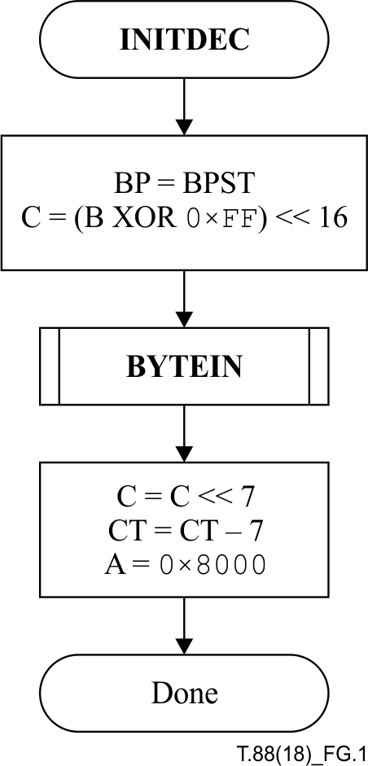

Figure G.1 – Initialization of the software conventions decoder

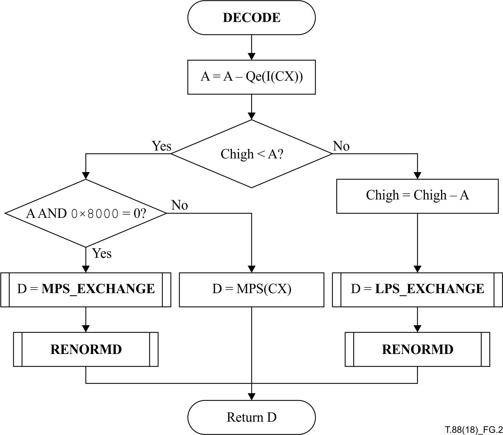

Figure G.2 – Decoding an MPS or an LPS in the software-conventions decoder

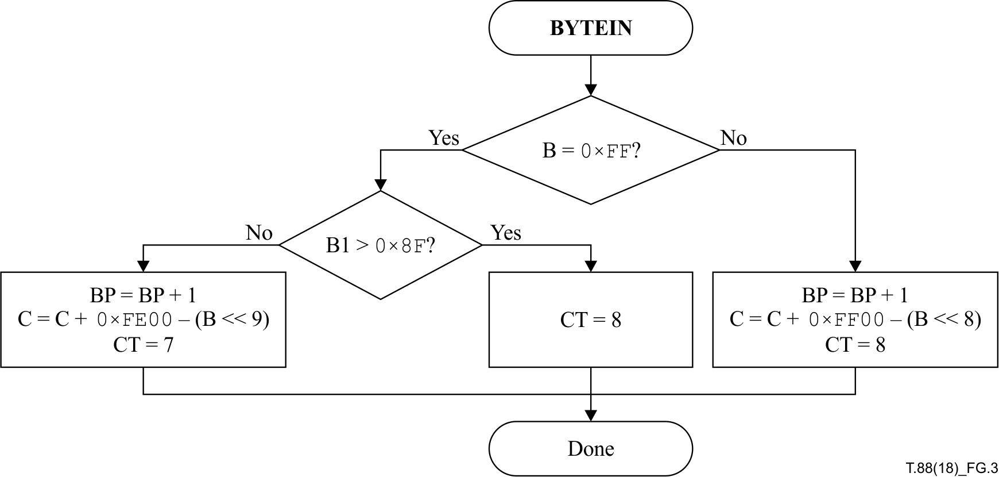

Figure G.3 – Inserting a new byte into the C register in the software-conventions decoder

Annex H  
  
Datastream example and test sequence

(This annex does not form an integral part of this Recommendation \| International Standard.)

## H.1 Datastream example

This subclause gives a small datastream that exercises a large number of the features of JBIG2.

The raw data here is shown in the following format:

0023: 01 23 45 67 89 AB CD EF

where the first field (before the colon) is the byte offset into the datastream of the data being displayed, and the remainder of the line is a sequence of bytes starting at that offset. All these values are in hexadecimal.

In general, the decoding of the first occurrence of any type of data is explained in detail; further occurrences of the same type of data are not explained in as much detail.

This datastream encodes:

• one symbol dictionary that is not associated with any page; and

• three pages,

i.e., the entities encoded in this datastream are three pages, plus one object that is not associated with any page.

The first two pages each contain a page information segment, a symbol dictionary segment, a text region segment, a generic region segment, a pattern dictionary segment, a halftone region segment, and an end of page segment. The bitmaps encoded by these two pages are identical, and are shown in Figure H.1. The data encoded by the corresponding segments in the two pages are also identical (e.g., the text region segment for page 1 contains the same data, in the same order, as the text region segment for page 2). However, the segments are encoded differently in the two pages: in page 1, all the segments use some form of Huffman or MMR coding; in page 2, all the segments use some form of arithmetic coding. Thus, implementors can cross-check against their own implementations to ensure that they are decoding correctly.

The third page contains two symbol dictionaries, one of which defines symbols by refinement and aggregation from the other one, and one text region, which uses the symbols from the dictionary including refining one of them.

Throughout this subclause, pixels having the value **1** are shown as black pixels, while pixels having the value **0** are shown as white pixels. This is a typical interpretation of **0** and **1**, as might be made by an application using this Recommendation \| International Standard.

The datastream is:

> 0000: 97 4A 42 32 0D 0A 1A 0A 01 00 00 00 03 00 00 00
>
> 0010: 00 00 01 00 00 00 00 18 00 01 00 00 00 01 00 00
>
> 0020: 00 01 E9 CB F4 00 26 AF 04 BF F0 78 2F E0 00 40
>
> 0030: 00 00 00 01 30 00 01 00 00 00 13 00 00 00 40 00
>
> 0040: 00 00 38 00 00 00 00 00 00 00 00 01 00 00 00 00
>
> 0050: 00 02 00 01 01 00 00 00 1C 00 01 00 00 00 02 00
>
> 0060: 00 00 02 E5 CD F8 00 79 E0 84 10 81 F0 82 10 86
>
> 0070: 10 79 F0 00 80 00 00 00 03 07 42 00 02 01 00 00
>
> 0080: 00 31 00 00 00 25 00 00 00 08 00 00 00 04 00 00
>
> 0090: 00 01 00 0C 09 00 10 00 00 00 05 01 10 00 00 00
>
> 00A0: 00 00 00 00 00 00 00 00 00 00 00 00 0C 40 07 08
>
> 00B0: 70 41 D0 00 00 00 04 27 00 01 00 00 00 2C 00 00
>
> 00C0: 00 36 00 00 00 2C 00 00 00 04 00 00 00 0B 00 01
>
> 00D0: 26 A0 71 CE A7 FF FF FF FF FF FF FF FF FF FF FF
>
> 00E0: FF FF FF FF FF FF FF FF F8 F0 00 00 00 05 10 01
>
> 00F0: 01 00 00 00 2D 01 04 04 00 00 00 0F 20 D1 84 61
>
> 0100: 18 45 F2 F9 7C 8F 11 C3 9E 45 F2 F9 7D 42 85 0A
>
> 0110: AA 84 62 2F EE EC 44 62 22 35 2A 0A 83 B9 DC EE
>
> 0120: 77 80 00 00 00 06 17 20 05 01 00 00 00 57 00 00
>
> 0130: 00 20 00 00 00 24 00 00 00 10 00 00 00 0F 00 01
>
> 0140: 00 00 00 08 00 00 00 09 00 00 00 00 00 00 00 00
>
> 0150: 04 00 00 00 AA AA AA AA 80 08 00 80 36 D5 55 6B
>
> 0160: 5A D4 00 40 04 2E E9 52 D2 D2 D2 8A A5 4A 00 20
>
> 0170: 02 23 E0 95 24 B4 92 8A 4A 92 54 92 D2 4A 29 2A
>
> 0180: 49 40 04 00 40 00 00 00 07 31 00 01 00 00 00 00
>
> 0190: 00 00 00 08 30 00 02 00 00 00 13 00 00 00 40 00
>
> 01A0: 00 00 38 00 00 00 00 00 00 00 00 01 00 00 00 00
>
> 01B0: 00 09 00 01 02 00 00 00 1B 08 00 02 FF 00 00 00
>
> 01C0: 02 00 00 00 02 4F E7 8C 20 0E 1D C7 CF 01 11 C4
>
> 01D0: B2 6F FF AC 00 00 00 0A 07 40 00 09 02 00 00 00
>
> 01E0: 1F 00 00 00 25 00 00 00 08 00 00 00 04 00 00 00
>
> 01F0: 01 00 0C 08 00 00 00 05 8D 6E 5A 12 40 85 FF AC
>
> 0200: 00 00 00 0B 27 00 02 00 00 00 23 00 00 00 36 00
>
> 0210: 00 00 2C 00 00 00 04 00 00 00 0B 00 08 03 FF FD
>
> 0220: FF 02 FE FE FE 04 EE ED 87 FB CB 2B FF AC 00 00
>
> 0230: 00 0C 10 01 02 00 00 00 1C 06 04 04 00 00 00 0F
>
> 0240: 90 71 6B 6D 99 A7 AA 49 7D F2 E5 48 1F DC 68 BC
>
> 0250: 6E 40 BB FF AC 00 00 00 0D 17 20 0C 02 00 00 00
>
> 0260: 3E 00 00 00 20 00 00 00 24 00 00 00 10 00 00 00
>
> 0270: 0F 00 02 00 00 00 08 00 00 00 09 00 00 00 00 00
>
> 0280: 00 00 00 04 00 00 00 87 CB 82 1E 66 A4 14 EB 3C
>
> 0290: 4A 15 FA CC D6 F3 B1 6F 4C ED BF A7 BF FF AC 00
>
> 02A0: 00 00 0E 31 00 02 00 00 00 00 00 00 00 0F 30 00
>
> 02B0: 03 00 00 00 13 00 00 00 25 00 00 00 08 00 00 00
>
> 02C0: 00 00 00 00 00 01 00 00 00 00 00 10 00 01 00 00
>
> 02D0: 00 00 16 08 00 02 FF 00 00 00 01 00 00 00 01 4F
>
> 02E0: E7 8D 68 1B 14 2F 3F FF AC 00 00 00 11 00 21 10
>
> 02F0: 03 00 00 00 20 08 02 02 FF FF FF FF FF 00 00 00
>
> 0300: 03 00 00 00 02 4F E9 D7 D5 90 C3 B5 26 A7 FB 6D
>
> 0310: 14 98 3F FF AC 00 00 00 12 07 20 11 03 00 00 00
>
> 0320: 25 00 00 00 25 00 00 00 08 00 00 00 00 00 00 00
>
> 0330: 00 00 8C 12 00 00 00 04 A9 5C 8B F4 C3 7D 96 6A
>
> 0340: 28 E5 76 8F FF AC 00 00 00 13 31 00 03 00 00 00
>
> 0350: 00 00 00 00 14 33 00 00 00 00 00 00

The datastream is decoded as follows:

1\) The file header:

0000: 97 4A 42 32 0D 0A 1A 0A 01 00 00 00 03

a\) The eight-byte ID string:

0000: 97 4A 42 32 0D 0A 1A 0A

b\) The one-byte file header flags field:

0008: 01

This field indicates that the file uses the sequential organization, and that the number of pages is known.

c\) The four-byte number of pages field:

0009: 00 00 00 03

This field indicates that the file has three pages.

2\) The first segment header:

000D: 00 00 00 00 00 01 00 00 00 00 18

a\) The four-byte segment number field:

000D: 00 00 00 00

This field indicates that the segment is segment number 0.

b\) The one-byte segment header flags field:

0011: 00

This field indicates that the segment has type "Symbol dictionary" (type 0), has a short page association field, and does not have the deferred non-retain bit set.

c\) The one-byte referred-to segment count and retention flags field:

0012: 01

This field indicates that the segment refers to no other segment, and that it should be retained.

d\) The one-byte (short-form) segment page association field:

0013: 00

This field indicates that this segment is not associated with any page.

e\) The four-byte segment data length field:

0014: 00 00 00 18

This field indicates that the segment's data part is 24 bytes long.

Figure H.1 – Test datastream page bitmap

3\) The first segment data part:

0018: 00 01 00 00 00 01 00 00 00 01 E9 CB F4 00 26 AF

0028: 04 BF F0 78 2F E0 00 40

a\) The two-byte symbol dictionary flags field:

0018: 00 01

This field indicates that the segment is encoded using the Huffman coding variant, does not use refinement/aggregate coding, uses Table B.4 for **SDHUFFDH**, and uses Table B.2 for **SDHUFFDW**.

b\) The four-byte **SDNUMEXSYMS** field:

001A: 00 00 00 01

This field indicates that **SDNUMEXSYMS** is 1: one symbol is exported by this symbol dictionary.

c\) The four-byte **SDNUMNEWSYMS** field:

001E: 00 00 00 01

This field indicates that **SDNUMNEWSYMS** is 1: one symbol is defined by this symbol dictionary.

d\) The encoded symbol dictionary data:

0022: E9 CB F4 00 26 AF 04 BF F0 78 2F E0 00 40

This is decoded as follows:

i\) Using Table B.4, decode a height class delta height value. This consumes the bits **1110 100**, indicating a height class delta height of 8. The first height class thus has a height of 8 pixels.

ii\) Using Table B.2, decode a delta width value. This consumes the bits **1110 010**, indicating a delta width of 5. The first symbol thus has a width of 5 pixels.

iii\) Using Table B.2, decode a delta width value. This consumes the bits **111111**, indicating a delta width of OOB. This ends the height class; the height class contains one symbol whose width is 5 pixels and whose height is 8 pixels.

iv\) Using Table B.1, decode the size in bytes of the height class collective bitmap. This consumes the bits **01000**, indicating a size of eight bytes.

v\) Skip the remaining bits in the last byte read. This consumes the bits **0000000**.

vi\) Decode the next eight bytes:

0026: 26 AF 04 BF F0 78 2F E0

using MMR. This produces the height class collective bitmap, which is also the bitmap for the single symbol in the height class, shown in Figure H.2.

Figure H.2 – The first symbol in the first symbol dictionary

vii\) Since **SDNUMNEWSYMS** is 1, the last symbol has now been decoded.

viii\) Using Table B.1, decode an export run length. This consumes the bits **00000**, indicating that the first 0 symbols are not exported.

ix\) Using Table B.1, decode an export run length. This consumes the bits **00001**, indicating that the next 1 symbols are exported. Thus, this symbol dictionary defines one symbol, which is exported.

x\) Skip the remaining bits in the last byte. This consumes the bits **000000**.

4\) The second segment header:

0030: 00 00 00 01 30 00 01 00 00 00 13

This segment has a segment number of 1, a type of "Page information" (type 48), a short page association field, and does not have the deferred non-retain bit set. It refers to no other segments, and is not retained. It is associated with page 1, and has a data length of 19 bytes.

5\) The second segment data part:

003B: 00 00 00 40 00 00 00 38 00 00 00 00 00 00 00 00

004B: 01 00 00

a\) The page bitmap width field:

003B: 00 00 00 40

This indicates that the page is 64 pixels wide.

b\) The page bitmap height field:

003F: 00 00 00 38

This indicates that the page is 56 pixels high.

c\) The page X resolution field:

0043: 00 00 00 00

This indicates that the page's X resolution is unknown.

d\) The page Y resolution field:

0047: 00 00 00 00

This indicates that the page's Y resolution is unknown.

e\) The page segment flags field:

004B: 01

This indicates that the page is eventually lossless, the page does not contain any refinements, the page default pixel value is **0**, the page default combination operator is OR, the page does not require any auxiliary buffers, and the page default combination operator is used by every region segment on the page.

f\) The page striping information field:

004C: 00 00

This indicates that the page is not striped.

6\) The third segment header:

004E: 00 00 00 02 00 01 01 00 00 00 1C

This segment has a segment number of 2, a type of "Symbol dictionary" (type 0), a short page association field, and does not have the deferred non-retain bit set. It refers to no other segments, and is retained. It is associated with page 1, and has a data length of 28 bytes.

7\) The third segment data part:

0059: 00 01 00 00 00 02 00 00 00 02 E5 CD F8 00 79 E0

0069: 84 10 81 F0 82 10 86 10 79 F0 00 80

a\) The two-byte symbol dictionary flags field:

0059: 00 01

This field indicates that the segment is encoded using the Huffman coding variant, does not use refinement/aggregate coding, uses Table B.4 for **SDHUFFDH**, and uses Table B.2 for **SDHUFFDW**.

b\) The four-byte **SDNUMEXSYMS** field:

005B: 00 00 00 02

This field indicates that **SDNUMEXSYMS** is 2: two symbols are exported by this symbol dictionary.

c\) The four-byte **SDNUMNEWSYMS** field:

005F: 00 00 00 02

This field indicates that **SDNUMNEWSYMS** is 2: two symbols are defined by this symbol dictionary.

d\) The encoded symbol dictionary data:

0063: E5 CD F8 00 79 E0 84 10 81 F0 82 10 86 10 79 F0

0073: 00 80

This is decoded as follows:

i\) Using Table B.4, decode a height class delta height value. This consumes the bits **1110 010**, indicating a height class delta height of 6. The first height class thus has a height of 6 pixels.

ii\) Using Table B.2, decode a delta width value. This consumes the bits **1110 011**, indicating a delta width of 6. The first symbol thus has a width of 6 pixels.

iii\) Using Table B.2, decode a delta width value. This consumes the bit **0**, indicating a delta width of 0. The second symbol thus has a width of 6 pixels.

iv\) Using Table B.2, decode a delta width value. This consumes the bits **111111**, indicating a delta width of OOB. This ends the height class; the height class contains two symbols, both of which are 6 pixels wide and 6 pixels high.

v\) Using Table B.1, decode the size in bytes of the height class collective bitmap. This consumes the bits **00000**, indicating a size of zero bytes. This indicates that the height class collective bitmap is stored uncompressed. Since the total width of the symbols in the height class is 12, each row of the height class is padded to be 16 bits (2 bytes) wide.

vi\) Skip the remaining bits in the last byte read. This consumes the bits **000000**.

vii\) Read the next 12 bytes (6 rows of 2 bytes each), and use the leftmost 12 bits of each row as the height class collective bitmap. These 12 bytes are:

0067: 79 E0 84 10 81 F0 82 10 86 10 79 F0

or, in binary:

|              |              |
|--------------|--------------|
| **01111001** | **11100000** |
| **10000100** | **00010000** |
| **10000001** | **11110000** |
| **10000010** | **00010000** |
| **10000110** | **00010000** |
| **01111001** | **11110000** |

The height class collective bitmap is therefore as shown in Figure H.3, and the two symbols are as shown in Figure H.4 a) and b).

Figure H.3 – The height class collective bitmap in the second symbol dictionary

viii\) Since **SDNUMNEWSYMS** is 2, the last symbol has now been decoded.

ix\) Using Table B.1, decode an export run length. This consumes the bits **00000**, indicating that the first 0 symbols are not exported.

Figure H.4 – The symbols in the second symbol dictionary

x\) Using Table B.1, decode an export run length. This consumes the bits **00010**, indicating that the next 2 symbols are exported. Thus, this symbol dictionary defines two symbols, which are both exported.

xi\) Skip the remaining bits in the last byte. This consumes the bits **000000**.

8\) The fourth segment header:

0075: 00 00 00 03 07 42 00 02 01 00 00 00 31

This segment has a segment number of 3, a type of "Immediate lossless text region" (type 7), a short page association field, and does not have the deferred non-retain bit set. It refers to two other segments, segments number 0 and 2; segment 0 should be retained, but segment 2 and this segment should not be retained. It is associated with page 1, and has a data length of 49 bytes.

9\) The fourth segment data part:

0082: 00 00 00 25 00 00 00 08 00 00 00 04 00 00 00 01

0092: 00 0C 09 00 10 00 00 00 05 01 10 00 00 00 00 00

00A2: 00 00 00 00 00 00 00 00 00 00 0C 40 07 08 70 41

00B2: D0

a\) The region segment bitmap width field:

0082: 00 00 00 25

This field indicates that the region bitmap is 37 pixels wide.

b\) The region segment bitmap height field:

0086: 00 00 00 08

This field indicates that the region bitmap is 8 pixels high.

c\) The region segment bitmap X location field:

008A: 00 00 00 04

This field indicates that the region bitmap's left edge is 4 pixels right of the page's left edge.

d\) The region segment bitmap Y location field:

008E: 00 00 00 01

This field indicates that the region bitmap's top edge is 1 pixel down from the page's top edge.

e\) The region segment flags field:

0092: 00

This field indicates that the region should be drawn into the page using the combination operator OR.

f\) The two-byte text region segment flags field:

0093: 0C 09

This field indicates that the segment is encoded using the Huffman coding variant, does not contain any refinements, has a **SBSTRIPS** value of 4, has a reference corner of BOTTOMLEFT, is not transposed, combines its symbols using OR, has a default pixel value of **0**, and has a **SBDSOFFSET** value of 3.

g\) The two-byte text region segment Huffman flags field:

0095: 00 10

This field indicates that the segment uses Table B.6 for **SBHUFFFS**, Table B.8 for **SBHUFFDS**, and Table B.12 for **SBHUFFDT**.

h\) The four-byte **SBNUMINSTANCES** field:

0097: 00 00 00 05

This field indicates that **SBNUMINSTANCES** is 5: five symbol instances are encoded in this text region.

i\) The text region segment symbol ID Huffman decoding table:

009B: 01 10 00 00 00 00 00 00 00 00 00 00 00 00 00 00

00AB: 00 0C

The two symbol dictionaries referred to by this segment have a total of 3 symbols in them. Decoding the RUNCODE Huffman table, consuming all of the data but the last four bits, gives the following assignment of code lengths to the RUNCODEs:

|          |     |          |     |
|:--------:|:---:|:--------:|:---:|
| RUNCODE1 |  1  | RUNCODE2 |  1  |

and therefore the following Huffman table for the RUNCODEs:

|          |       |          |       |
|:--------:|:-----:|:--------:|:-----:|
| RUNCODE1 | **0** | RUNCODE2 | **1** |

Decoding using this table produces the sequence RUNCODE2, RUNCODE2, RUNCODE1 (consuming the bits **110**). Thus, the first symbol (the "p" from the first symbol dictionary) has a Huffman code length of 2; the second symbol (the "c" from the second symbol dictionary) has a Huffman code length of 2, and the third symbol (the "a" from the second symbol dictionary) has a code length of 1. Applying the Huffman code assignment algorithm gives the table:

<table style="width:12%;">
<colgroup>
<col style="width: 5%" />
<col style="width: 5%" />
</colgroup>
<tbody>
<tr>
<td style="text-align: center;">p</td>
<td><blockquote>

<strong>10</strong>

</blockquote></td>
</tr>
<tr>
<td style="text-align: center;">c</td>
<td><blockquote>

<strong>11</strong>

</blockquote></td>
</tr>
<tr>
<td style="text-align: center;">a</td>
<td><blockquote>

<strong>0</strong>

</blockquote></td>
</tr>
</tbody>
</table>

At this point, there is one bit (**0**) remaining in the last of data; this is now skipped.

j\) The encoded text region data:

00AD: 40 07 08 70 41 D0

This is decoded as follows:

i\) Using Table B.12, decode a delta T value. This consumes the bit **0**, indicating a delta T value of 4 (the table's decoded value of 1, multiplied by **SBSTRIPS**). The initial STRIPT value is –4.

ii\) Using Table B.12, decode a delta T value. This consumes the bits **10**, indicating a delta T value of 8 (2 times **SBSTRIPS**). STRIPT is therefore now 4.

iii\) Using Table B.6, decode a first S value. This consumes the bits **00 0000000**, indicating a first S value of 0.

iv\) Reading two bits (since **SBSTRIPS**) consumes the bits **01**. The first symbol instance T coordinate is therefore 5 (STRIPT plus the decoded value of 1).

v\) Using the symbol ID Huffman table, decode a symbol ID value. This consumes the bits **11**, indicating the symbol "c". Thus, the symbol "c" should be drawn with its lower left corner at (0, 5).

vi\) At this point, CURS is 8 (0 plus **SBDSOFFSET** plus the previous symbol's width of 6 minus 1).

vii\) Using Table B.8, decode a delta S value. This consumes the bits **00 0**, indicating a delta S value of 0.

viii\) Reading two bits consumes the bits **01**. The second symbol instance T coordinate is therefore 5.

ix\) Using the symbol ID Huffman table, decode a symbol ID value. This consumes the bit **0**, indicating the symbol "a". Thus, the symbol "a" should be drawn with its lower left corner at (8, 5).

x\) At this point, CURS is 16 (8 plus **SBDSOFFSET** plus the previous symbol's width of 6 minus 1).

xi\) Using Table B.8, decode a delta S value. This consumes the bits **00 0**, indicating a delta S value of 0.

xii\) Reading two bits consumes the bits **11**. The third symbol instance T coordinate is therefore 7.

xiii\) Using the symbol ID Huffman table, decode a symbol ID value. This consumes the bits **10**, indicating the symbol "p". Thus, the symbol "p" should be drawn with its lower left corner at (16, 7).

xiv\) At this point, CURS is 23 (16 plus **SBDSOFFSET** plus the previous symbol's width of 5 minus 1).

xv\) Using Table B.8, decode a delta S value. This consumes the bits **00 0**, indicating a delta S value of 0.

xvi\) Reading two bits consumes the bits **01**. The fourth symbol instance T coordinate is therefore 5.

xvii\) Using the symbol ID Huffman table, decode a symbol ID value. This consumes the bit **0**, indicating the symbol "a". Thus, the symbol "a" should be drawn with its lower left corner at (8, 5).

xviii)At this point, CURS is 31 (23 plus **SBDSOFFSET** plus the previous symbol's width of 6 minus 1).

xix\) Using Table B.8, decode a delta S value. This consumes the bits **00 0**, indicating a delta S value of 0.

xx\) Reading two bits consumes the bits **01**. The fifth symbol instance T coordinate is therefore 5.

xxi\) Using the symbol ID Huffman table, decode a symbol ID value. This consumes the bits **11**, indicating the symbol "c". Thus, the symbol "c" should be drawn with its lower left corner at (31, 5).

xxii\) Using Table B.8, decode a delta S value. This consumes the bits **01**, indicating a delta S value of OOB, indicating the end of this strip. Since **SBNUMINSTANCES** is 5, and five symbol instances have been decoded, there are no more strips.

xxiii\) Skip the remaining bits in the last byte read. This consumes the bits **0000**.

k\) Decoding the data produced the following list of symbol instances and locations (the locations are where the symbol's lower left corner should be placed):

|        |          |
|--------|----------|
| Symbol | Location |
| c      | (0, 5)   |
| a      | (8, 5)   |
| p      | (16, 7)  |
| a      | (23, 5)  |
| c      | (31, 5)  |

Drawing these symbol instances produces the 37-by-8 pixel region bitmap shown in Figure H.5.

Figure H.5 – The text region bitmap

10\) The fifth segment header:

00B3: 00 00 00 04 27 00 01 00 00 00 2C

This segment has a segment number of 4, a type of "Immediate lossless generic region" (type 39), a short page association field, and does not have the deferred non-retain bit set. It refers to no other segments, and is not retained. It is associated with page 1, and has a data length of 44 bytes.

11\) The fifth segment data part:

00BE: 00 00 00 36 00 00 00 2C 00 00 00 04 00 00 00 0B

00CE: 00 01 26 A0 71 CE A7 FF FF FF FF FF FF FF FF FF

00DE: FF FF FF FF FF FF FF FF FF FF F8 F0

a\) The region segment information field:

00BE: 00 00 00 36 00 00 00 2C 00 00 00 04 00 00 00 0B

00CE: 00

This indicates that the region bitmap encoded by this segment is 54 pixels wide, 44 pixels high, and its top left corner is 4 pixels right of the page's left edge and 11 pixels down from the page's top edge. It should be drawn into the page using OR.

b\) The region data:

00CF: 01 26 A0 71 CE A7 FF FF FF FF FF FF FF FF FF FF

00DF: FF FF FF FF FF FF FF FF FF F8 F0

The first byte (01) is the generic region segment flags byte, and indicates that the region is encoded using MMR. The remaining bytes are the MMR-encoded data for the region bitmap. These bytes MMR-decompress to the 54-by-44 region bitmap shown in Figure H.6.

12\) The sixth segment header:

00EA: 00 00 00 05 10 01 01 00 00 00 2D

This segment has a segment number of 5, a type of "Pattern dictionary" (type 16), a short page association field, and does not have the deferred non-retain bit set. It refers to no other segments, and is retained. It is associated with page 1, and has a data length of 45 bytes.

13\) The sixth segment data part:

00F5: 01 04 04 00 00 00 0F 20 D1 84 61 18 45 F2 F9 7C

0105: 8F 11 C3 9E 45 F2 F9 7D 42 85 0A AA 84 62 2F EE

0115: EC 44 62 22 35 2A 0A 83 B9 DC EE 77 80

a\) The one-byte pattern dictionary flags field:

00F5: 01

This field indicates that the segment is encoded using the MMR coding variant.

b\) The one-byte **HDPW** field:

00F6: 04

This field indicates that **HDPW**, the width of the patterns defined in this dictionary, is 4.

c\) The one-byte **HDPH** field:

00F7: 04

This field indicates that **HDPH**, the height of the patterns defined in this dictionary, is 4.

Figure H.6 – The generic region bitmap

d\) The four-byte **GRAYMAX** field:

00F8: 00 00 00 0F

This field indicates that **GRAYMAX** is 15, and thus there are 16 patterns in this pattern dictionary (numbered 0 through 15).

e\) The remaining 38 bytes in the segment:

00FC: 20 D1 84 61 18 45 F2 F9 7C 8F 11 C3 9E 45 F2 F9

010C: 7D 42 85 0A AA 84 62 2F EE EC 44 62 22 35 2A 0A

011C: 83 B9 DC EE 77 80

These bytes MMR-decompress to the pattern dictionary's collective bitmap. The width of the bitmap is (**GRAYMAX** + 1) × **HDPW**, and the height is **HDPH** pixels. The 64-by-4 bitmap that is the result of this MMR decompression is shown in Figure H.7.

Figure H.7 – The pattern dictionary collective bitmap

The 16 individual patterns are obtained from the collective bitmap by breaking it into 4-pixel-wide pieces. They are shown in Figure H.8, where pattern number 0 is the top left pattern, pattern number 1 is to its right, and so on.

14\) The seventh segment header:

0122: 00 00 00 06 17 20 05 01 00 00 00 57

This segment has a segment number of 6, a type of "Immediate lossless halftone region" (type 23), a short page association field, and does not have the deferred non-retain bit set. It refers to one other segment, segment number 5; neither segment 5 nor this segment should be retained. It is associated with page 1, and has a data length of 87 bytes.

15\) The seventh segment data part:

012E: 00 00 00 20 00 00 00 24 00 00 00 10 00 00 00 0F

013E: 00 01 00 00 00 08 00 00 00 09 00 00 00 00 00 00

014E: 00 00 04 00 00 00 AA AA AA AA 80 08 00 80 36 D5

015E: 55 6B 5A D4 00 40 04 2E E9 52 D2 D2 D2 8A A5 4A

016E: 00 20 02 23 E0 95 24 B4 92 8A 4A 92 54 92 D2 4A

017E: 29 2A 49 40 04 00 40

a\) The region segment information field :

012E: 00 00 00 20 00 00 00 24 00 00 00 10 00 00 00 0F

013E: 00

This indicates that the region bitmap encoded by this segment is 32 pixels wide, 36 pixels high, and its top left corner is 16 pixels right of the page's left edge and 15 pixels down from the page's top edge. It should be drawn into the page using OR.

b\) The halftone region segment flags field:

013F: 01

This field indicates that the halftone region is encoded using the MMR coding variant. The patterns should be combined using OR. The default pixel value is **0**.

c\) The **HGW** field:

0140: 00 00 00 08

This field indicates that the array of gray-scale values is 8 wide.

d\) The **HGH** field:

0144: 00 00 00 09

This field indicates that the array of gray-scale values is 9 high.

e\) The **HGX** field:

0148: 00 00 00 00

This field indicates that the horizontal offset of the halftone grid is 0 pixels.

f\) The **HGY** field:

014C: 00 00 00 00

This field indicates that the vertical offset of the halftone grid is 0 pixels.

g\) The **HRX** field:

0150: 04 00

This field indicates that the **HRX** is 1024, and thus the horizontal coordinate of the grid vector is 1024/256 pixels, or 4 pixels.

h\) The **HRY** field:

0152: 00 00

This field indicates that the vertical coordinate of the grid vector is 0 pixels.

i\) The first bitplane:

0154: AA AA AA AA 80 08 00 80

Decompressing this with MMR yields the bitmap shown in Figure H.9 a). Note that the last 7 bits in the last byte are skipped over after all the MMR-encoded data has been decoded (i.e., decoding the bitplane is forced to consume an integral number of bytes).

j\) The second bitplane:

015C: 36 D5 55 6B 5A D4 00 40 04

Decompressing this with MMR yields the bitmap shown in Figure H.9 b).

k\) The third bitplane:

0165: 2E E9 52 D2 D2 D2 8A A5 4A 00 20 02

Decompressing this with MMR yields the bitmap shown in Figure H.9 c).

l\) The fourth bitplane:

0171: 23 E0 95 24 B4 92 8A 4A 92 54 92 D2 4A 29 2A 49

0181: 40 04 00 40

Decompressing this with MMR yields the bitmap shown in Figure H.9 d).

Figure H.9 – The raw bitplanes for the halftone region

m\) These bitplanes are then Gray-decoded as described in C.5, by XORing the first into the second, then the resulting bitplane into the third, and so on. The resulting bitplanes are shown in Figure H.10.

Figure H.10 – The bitplanes for the halftone region

n\) Stacking up these bitplanes, with the first being the most significant, results in the array of values:

|     |     |     |     |     |     |     |     |
|-----|-----|-----|-----|-----|-----|-----|-----|
| 0   | 1   | 2   | 3   | 4   | 5   | 6   | 7   |
| 1   | 2   | 3   | 4   | 5   | 6   | 7   | 8   |
| 2   | 3   | 4   | 5   | 6   | 7   | 8   | 9   |
| 3   | 4   | 5   | 6   | 7   | 8   | 9   | 10  |
| 4   | 5   | 6   | 7   | 8   | 9   | 10  | 11  |
| 5   | 6   | 7   | 8   | 9   | 10  | 11  | 12  |
| 6   | 7   | 8   | 9   | 10  | 11  | 12  | 13  |
| 7   | 8   | 9   | 10  | 11  | 12  | 13  | 14  |
| 8   | 9   | 10  | 11  | 12  | 13  | 14  | 15  |

o\) The halftone grid vector and offset produces the following array of locations. Combining this with the array of values results in a list of drawing operations, indicating that the pattern whose index in the pattern dictionary in segment number 5 is that value should be drawn with its upper left pixel at the given location.

|         |         |         |          |          |          |          |          |
|---------|---------|---------|----------|----------|----------|----------|----------|
| (0, 0)  | (4, 0)  | (8, 0)  | (12, 0)  | (16, 0)  | (20, 0)  | (24, 0)  | (28, 0)  |
| (0, 4)  | (4, 4)  | (8, 4)  | (12, 4)  | (16, 4)  | (20, 4)  | (24, 4)  | (28, 4)  |
| (0, 8)  | (4, 8)  | (8, 8)  | (12, 8)  | (16, 8)  | (20, 8)  | (24, 8)  | (28, 8)  |
| (0, 12) | (4, 12) | (8, 12) | (12, 12) | (16, 12) | (20, 12) | (24, 12) | (28, 12) |
| (0, 16) | (4, 16) | (8, 16) | (12, 16) | (16, 16) | (20, 16) | (24, 16) | (28, 16) |
| (0, 20) | (4, 20) | (8, 20) | (12, 20) | (16, 20) | (20, 20) | (24, 20) | (28, 20) |
| (0, 24) | (4, 24) | (8, 24) | (12, 24) | (16, 24) | (20, 24) | (24, 24) | (28, 24) |
| (0, 28) | (4, 28) | (8, 28) | (12, 28) | (16, 28) | (20, 28) | (24, 28) | (28, 28) |
| (0, 32) | (4, 32) | (8, 32) | (12, 32) | (16, 32) | (20, 32) | (24, 32) | (28, 32) |

p\) Performing those drawing operations produces the 32-by-36 region bitmap shown in Figure H.11

16\) The eighth segment header:

0185: 00 00 00 07 31 00 01 00 00 00 00

This segment has a segment number of 7, a type of "End of page" (type 49), a short page association field, and does not have the deferred non-retain bit set. It refers to no other segments, and is not retained. It is associated with page 1, and has a data length of zero bytes.

17\) The region segment bitmaps are combined as follows, taking into account the page default pixel value and each region segment's combination operator. First, the page bitmap (64 pixels wide and 56 pixels high) is filled with **0**, the page default pixel value. Next, the bitmap shown in Figure H.5 is drawn using OR into the page bitmap with its top left pixel at location (4, 1). Next, the bitmap shown in Figure H.6 is drawn using OR into the page bitmap with its top left pixel at location (4, 11). Finally, the bitmap shown in Figure H.11 is drawn using OR into the page bitmap with its top left pixel at location (16, 15). After all this has been done, the resulting bitmap is the one shown in Figure H.1.

18\) The ninth segment header:

0190: 00 00 00 08 30 00 02 00 00 00 13

This segment has a segment number of 8, a type of "Page information" (type 48), a short page association field, and does not have the deferred non-retain bit set. It refers to no other segments, and is not retained. It is associated with page 2, and has a data length of 19 bytes.

19\) The ninth segment data part:

019B: 00 00 00 40 00 00 00 38 00 00 00 00 00 00 00 00

01AB: 01 00 00

This contains the same information as does segment number 1.

Figure H.11 – The halftone region bitmap

20\) The tenth segment header:

01AE: 00 00 00 09 00 01 02 00 00 00 1B

This segment has a segment number of 9, a type of "Symbol dictionary" (type 0), a short page association field, and does not have the deferred non-retain bit set. It refers to no other segments, and is retained. It is associated with page 2, and has a data length of 27 bytes.

21\) The tenth segment data part:

01B9: 08 00 02 FF 00 00 00 02 00 00 00 02 4F E7 8C 20

01C9: 0E 1D C7 CF 01 11 C4 B2 6F FF AC

a\) The two-byte symbol dictionary flags field:

01B9: 08 00

This field indicates that the segment is encoded using the arithmetic coding variant and does not use refinement/aggregate coding. **SDTEMPLATE** has the value 2. The "bitmap coding context used" and "bitmap coding context retained" bits are both **0**.

b\) The symbol dictionary AT flags field:

01BB: 02 FF

This field indicates that **SDATX1** is 2 and **SDATY1** is –1; thus, AT pixel A1 is at location (2, –1), which is the nominal value for template 2.

c\) The four-byte **SDNUMEXSYMS** field:

01BD: 00 00 00 02

This field indicates that **SDNUMEXSYMS** is 2: two symbols are exported by this symbol dictionary.

d\) The four-byte **SDNUMNEWSYMS** field:

01C1: 00 00 00 02

This field indicates that **SDNUMNEWSYMS** is 2: two symbols are defined by this symbol dictionary.

e\) The encoded symbol dictionary data:

01C5: 4F E7 8C 20 0E 1D C7 CF 01 11 C4 B2 6F FF AC

Decoding this gives the same two symbols shown in Figure H.4 a) and b).

22\) The eleventh segment header:

01D4: 00 00 00 0A 07 40 00 09 02 00 00 00 1F

This segment has a segment number of 10, a type of "Immediate lossless text region" (type 7), a short page association field, and does not have the deferred non-retain bit set. It refers to two other segments, segments number 0 and 9; segment 0, segment 9, and this segment should not be retained. It is associated with page 2, and has a data length of 31 bytes.

23\) The eleventh segment data part:

01E1: 00 00 00 25 00 00 00 08 00 00 00 04 00 00 00 01

01F1: 00 0C 08 00 00 00 05 8D 6E 5A 12 40 85 FF AC

a\) The region segment information field:

01E1: 00 00 00 25 00 00 00 08 00 00 00 04 00 00 00 01

01F1: 00

This indicates that the region bitmap encoded by this segment is 37 pixels wide, 8 pixels high, and its top left corner is 4 pixels right of the page's left edge and 1 pixel down from the page's top edge. It should be drawn into the page using OR.

b\) The two-byte text region segment flags field:

01F2: 0C 08

This field indicates that the segment is encoded using the arithmetic coding variant, does not contain any refinements, has a **SBSTRIPS** value of 4, has a reference corner of BOTTOMLEFT, is not transposed, combines its symbols using OR, has a default pixel value of **0**, and has a **SBDSOFFSET** value of 3.

c\) The four-byte **SBNUMINSTANCES** field:

01F4: 00 00 00 05

This field indicates that **SBNUMINSTANCES** is 5: five symbol instances are encoded in this text region.

d\) The encoded text region data:

01F8: 8D 6E 5A 12 40 85 FF AC

Decoding this follows the exact same sequence that was seen in decoding segment number 3 (page 1's text region segment), and results in the region bitmap shown in Figure H.5.

24\) The twelfth segment header:

0200: 00 00 00 0B 27 00 02 00 00 00 23

This segment has a segment number of 11, a type of "Immediate lossless generic region" (type 39), a short page association field, and does not have the deferred non-retain bit set. It refers to no other segments, and is not retained. It is associated with page 2, and has a data length of 35 bytes.

25\) The twelfth segment data part:

020B: 00 00 00 36 00 00 00 2C 00 00 00 04 00 00 00 0B

021B: 00 08 03 FF FD FF 02 FE FE FE 04 EE ED 87 FB CB

022B: 2B FF AC

a\) The region segment information field:

020B: 00 00 00 36 00 00 00 2C 00 00 00 04 00 00 00 0B

021B: 00

This indicates that the region bitmap encoded by this segment is 54 pixels wide, 44 pixels high, and its top left corner is 4 pixels right of the page's left edge and 11 pixels down from the page's top edge. It should be drawn into the page using OR.

b\) The one-byte generic region flags field:

021C: 08

This indicates that the region is encoded using arithmetic coding, that **GBTEMPLATE** is 0, and **TPGDON** is **1**.

c\) The generic region segment AT flags field:

021D: 03 FF FD FF 02 FE FE FE

This field is eight bytes long because **GBTEMPLATE** is 0, and there are thus four AT pixels whose positions must be determined. The AT pixels are located with A1 at (3, –1); A2 at (–3, –1); A3 at (2, –2); and A4 at (–2, –2). These are the nominal positions of those pixels for this template.

d\) The region data:

0225: 04 EE ED 87 FB CB 2B FF AC

Decoding this using the decoded values of **GBTEMPLATE**, **TPGDON**, and the AT pixel locations produces the 54-by-44 region bitmap shown in Figure H.6.

26\) The thirteenth segment header:

022E: 00 00 00 0C 10 01 02 00 00 00 1C

This segment has a segment number of 12, a type of "Pattern dictionary" (type 16), a short page association field, and does not have the deferred non-retain bit set. It refers to no other segments, and is retained. It is associated with page 2, and has a data length of 28 bytes.

27\) The thirteenth segment data part:

0239: 06 04 04 00 00 00 0F 90 71 6B 6D 99 A7 AA 49 7D

0249: F2 E5 48 1F DC 68 BC 6E 40 BB FF AC

a\) The one-byte pattern dictionary flags field:

0239: 06

This field indicates that the segment is encoded using the arithmetic coding variant, and that **HDTEMPLATE** is 3.

b\) The one-byte **HDPW** field:

023A: 04

This field indicates that **HDPW** is 4.

c\) The one-byte **HDPH** field:

023B: 04

This field indicates that **HDPH** is 4.

d\) The four-byte **GRAYMAX** field:

023C: 00 00 00 0F

This field indicates that **GRAYMAX** is 15, and thus there are 16 patterns in this pattern dictionary.

e\) The remaining 21 bytes in the segment:

0240: 90 71 6B 6D 99 A7 AA 49 7D F2 E5 48 1F DC 68 BC

0250: 6E 40 BB FF AC

These bytes decompress, using the pattern dictionary decoding procedure, to the collective bitmap shown in Figure H.7, and thus the 16 patterns defined by this pattern dictionary are as shown in Figure H.8.

28\) The fourteenth segment header:

0255: 00 00 00 0D 17 20 0C 02 00 00 00 3E

This segment has a segment number of 13, a type of "Immediate lossless halftone region" (type 23), a short page association field, and does not have the deferred non-retain bit set. It refers to one other segment, segment number 12; neither segment 12 nor this segment should be retained. It is associated with page 2, and has a data length of 62 bytes.

29\) The fourteenth segment data part:

0261: 00 00 00 20 00 00 00 24 00 00 00 10 00 00 00 0F

0271: 00 02 00 00 00 08 00 00 00 09 00 00 00 00 00 00

0281: 00 00 04 00 00 00 87 CB 82 1E 66 A4 14 EB 3C 4A

0291: 15 FA CC D6 F3 B1 6F 4C ED BF A7 BF FF AC

a\) The region segment information field:

0261: 00 00 00 20 00 00 00 24 00 00 00 10 00 00 00 0F

0271: 00

This indicates that the region bitmap encoded by this segment is 32 pixels wide, 36 pixels high, and its top left corner is 16 pixels right of the page's left edge and 15 pixels down from the page's top edge. It should be drawn into the page using OR.

b\) The halftone region segment flags field:

0272: 02

This field indicates that the halftone region is encoded using the arithmetic coding variant, and that **HTEMPLATE** is 1. The patterns should be combined using OR. The default pixel value is **0**.

c\) The other parameters:

0273: 00 00 00 08 00 00 00 09 00 00 00 00 00 00 00 00

0283: 04 00 00 00

The following fields indicate that **HGW** is 8, **HGH** is 9, **HGX** is 0, **HGY** is 0, **HRX** is 1024, and **HRY** is 0.

d\) The four bitplanes:

0287: 87 CB 82 1E 66 A4 14 EB 3C 4A 15 FA CC D6 F3 B1

0297: 6F 4C ED BF A7 BF FF AC

Decoding four 8-by-9 bitplanes from this data results in the four bitplanes shown in Figure H.9. As in segment number 6, *G*r*ay*-decoding these bitplanes, combining them into an array of values, and drawing the patterns from the pattern dictionary according to that array and the halftone grid parameters results in the region bitmap shown in Figure H.11.

30\) The fifteenth segment header:

029F: 00 00 00 0E 31 00 02 00 00 00 00

This segment has a segment number of 14, a type of "End of page" (type 49), a short page association field, and does not have the deferred non-retain bit set. It refers to no other segments, and is not retained. It is associated with page 2, and has a data length of zero bytes.

31\) The page bitmap is made by combining the three region bitmaps in the identical way that they were combined in page 1, resulting in the same page bitmap.

32\) The sixteenth segment header:

02AA: 00 00 00 0F 30 00 03 00 00 00 13

This segment has a segment number of 15, a type of "Page information" (type 48), a short page association field, and does not have the deferred non-retain bit set. It refers to no other segments, and is not retained. It is associated with page 3, and has a data length of 19 bytes.

33\) The sixteenth segment data part:

02B5: 00 00 00 25 00 00 00 08 00 00 00 00 00 00 00 00

02C5: 01 00 00

This indicates that the page is 37 pixels wide, is 8 pixels high, has unknown X and Y resolution, is eventually lossless, does not contain any refinements, has a default pixel value of **0**, a default combination operator of OR, does not require any auxiliary buffers, and uses the page default combination operator in every region on the page.

34\) The seventeenth segment header:

02C8: 00 00 00 10 00 01 00 00 00 00 16

This segment has a segment number of 16, a type of "Symbol dictionary" (type 0), a short page association field, and does not have the deferred non-retain bit set. It refers to no other segments, and is retained. It is associated with no page, and has a data length of 22 bytes.

35\) The seventeenth segment data part:

02D3: 08 00 02 FF 00 00 00 01 00 00 00 01 4F E7 8D 68

02E3: 1B 14 2F 3F FF AC

a\) The two-byte symbol dictionary flags field:

02D3: 08 00

This field indicates that the segment is encoded using the arithmetic coding variant and does not use refinement/aggregate coding. **SDTEMPLATE** has the value 2. The "bitmap coding context used" and "bitmap coding context retained" bits are both **0**.

b\) The symbol dictionary AT flags field:

02D5: 02 FF

This field indicates that **SDATX1** is 2 and **SDATY1** is –1; thus, AT pixel A1 is at location (2, –1), which is the nominal value for template 2.

c\) The four-byte **SDNUMEXSYMS** field:

02D7: 00 00 00 01

This field indicates that **SDNUMEXSYMS** is 1: one symbol is exported by this symbol dictionary.

d\) The four-byte **SDNUMNEWSYMS** field:

02DB: 00 00 00 01

This field indicates that **SDNUMNEWSYMS** is 1: one symbol is defined by this symbol dictionary.

e\) The encoded symbol dictionary data:

02DF: 4F E7 8D 68 1B 14 2F 3F FF AC

This is decoded as follows:

i\) Reset all the arithmetic coding statistics to zero.

ii\) Using the IADH arithmetic integer decoding procedure, decode a height class delta height value. The value decoded is 6, indicating that the first height class is 6 pixels high.

iii\) Using the IADW arithmetic integer decoding procedure, decode a delta width value. The value decoded is 6. The first symbol thus has a width of 6 pixels.

iv\) Using the generic region decoding procedure, with **GBTEMPLATE** and the AT pixel A1 set as described in the symbol dictionary data header, decode a 6 × 6 bitmap. This produces the bitmap shown in Figure H.12 a).

v\) Using the IADW arithmetic integer decoding procedure, decode a delta width value. The value decoded is OOB, indicating the end of the height class.

vi\) Since **SDNUMNEWSYMS** is 1, the last symbol has now been decoded.

vii\) Using the IAEX arithmetic integer decoding procedure, decode an export run length. The value decoded is 0, indicating that the first 0 symbols are not exported.

viii\) Using the IAEX arithmetic integer decoding procedure, decode an export run length. The value decoded is 1, indicating that the next 1 symbols are exported. Thus, this symbol dictionary defines one symbol, which is exported.

Figure H.12 – The symbols in the symbol dictionary on the third page

36\) The eighteenth segment header:

02E9: 00 00 00 11 00 21 10 03 00 00 00 20

This segment has a segment number of 17, a type of "Symbol dictionary" (type 0), a short page association field, and does not have the deferred non-retain bit set. It refers to one other segment, segment 16. Segment 16 is not retained, but this segment is retained. It is associated with page 3, and has a data length of 32 bytes.

37\) The eighteenth segment data part:

02F5: 08 02 02 FF FF FF FF FF 00 00 00 03 00 00 00 02

0305: 4F E9 D7 D5 90 C3 B5 26 A7 FB 6D 14 98 3F FF AC

a\) The two-byte symbol dictionary flags field:

02F5: 08 02

This field indicates that the segment is encoded using the arithmetic coding variant and uses refinement/aggregate coding. **SDTEMPLATE** has the value 2. **SDRTEMPLATE** has the value 0. The "bitmap coding context used" and "bitmap coding context retained" bits are both **0**.

b\) The symbol dictionary AT flags field:

02F7: 02 FF

This field indicates that **SDATX1** is 2 and **SDATY1** is –1; thus, AT pixel A1 is at location (2, –1), which is the nominal value for template 2.

c\) The symbol dictionary refinement AT flags:

02F9: FF FF FF FF

This field indicates that **SDRATX1** is –1, **SDRATY1** is –1, **SDRATX2** is –1, and **SDRATY2** is –1. Thus, AT pixel RA1 is at location (–1, –1) and AT pixel RA2 is at location (–1, –1), which are the nominal locations for refinement template 0.

d\) The four-byte **SDNUMEXSYMS** field:

02FD: 00 00 00 03

This field indicates that **SDNUMEXSYMS** is 3: three symbols are exported by this symbol dictionary.

e\) The four-byte **SDNUMNEWSYMS** field:

0301: 00 00 00 02

This field indicates that **SDNUMNEWSYMS** is 2: two symbols are defined by this symbol dictionary.

f\) The encoded symbol dictionary data:

0305: 4F E9 D7 D5 90 C3 B5 26 A7 FB 6D 14 98 3F FF AC

This is decoded as follows:

i\) Reset all the arithmetic coding statistics to zero.

ii\) Using the IADH arithmetic integer decoding procedure, decode a height class delta height value. The value decoded is 6, indicating that the first height class is 6 pixels high.

iii\) Using the IADW arithmetic integer decoding procedure, decode a delta width value. The value decoded is 6. The first symbol thus has a width of 6 pixels.

iv\) Using the IAAI arithmetic integer decoding procedure, decode a count of symbol instances in the aggregation that forms the first symbol. The value decoded is 1.

v\) Using the IAID arithmetic integer decoding procedure, decode a symbol ID. The value decoded is 0. The first symbol is thus the one identified by symbol ID 0, which is the first (and only) symbol in the dictionary (segment 16) referenced by this segment.

vi\) Using the IARDX arithmetic integer decoding procedure, decode a symbol instance refinement delta X value. The value decoded is 0.

vii\) Using the IARDY arithmetic integer decoding procedure, decode a symbol instance refinement delta Y value. The value decoded is 0. The refinement is thus done with the refined symbol aligned with the reference symbol (i.e., **GRREFERENCEDX** and **GRREFERENCEDY** are both 0).

viii\) Using the generic refinement region decoding procedure, decode the refined symbol instance bitmap. The reference bitmap is the bitmap shown in Figure H.12 a) and the refined bitmap, which is the bitmap of the first symbol defined in this symbol dictionary, is the bitmap shown in Figure H.12 b).

ix\) Using the IADW arithmetic integer decoding procedure, decode a delta width value. The value decoded is 8. The second symbol thus has a width of 14 pixels.

x\) Using the IAAI arithmetic integer decoding procedure, decode a count of symbol instances in the aggregation that forms the second symbol. The value decoded is 2.

xi\) Using the text region decoding procedure, with parameters set as described in 6.5.8.2, decode a 14 × 6 pixel text region:

• Using the IADT arithmetic integer decoding procedure, decode the initial STRIPT value. The value decoded is 0.

• Using the IADT arithmetic integer decoding procedure, decode a delta T value. The value decoded is 0.

• Using the IAFS arithmetic integer decoding procedure, decode a first S value. The value decoded is 0. The reference corner (top left corner in this case) of the first symbol instance in the aggregation is thus at (0, 0).

• Using the IAID arithmetic integer decoding procedure, decode a symbol ID. The value decoded is 0. The first symbol is thus the one identified by symbol ID 0, which is the first (and only) symbol in the dictionary (segment 16) referenced by this segment.

• Using the IARI arithmetic integer decoding procedure, decode a refinement flag. The value decoded is 0, indicating that the first symbol instance is not refined.

• At this point CURS is 5. Using the IADS arithmetic integer decoding procedure, decode a delta S value. The value decoded is 3. The reference corner of the second symbol instance in the aggregation is thus at (8, 0).

• Using the IAID arithmetic integer decoding procedure, decode a symbol ID. The value decoded is 1. The second symbol is thus the one identified by symbol ID 1, which is the first (and, thus far only) symbol defined in this symbol dictionary.

• Using the IARI arithmetic integer decoding procedure, decode a refinement flag. The value decoded is 0, indicating that the first symbol instance is not refined.

• Using the IADS arithmetic integer decoding procedure, decode a delta S value. The value decoded is OOB, indicating the end of the strip.

• Decoding of the text region is now complete. The text region bitmap, which is the bitmap of the second symbol defined in the symbol dictionary, is shown in Figure H.12 c). This is obtained by drawing Figure H.12 a) at (0, 0) and Figure H.12 b) at (8, 0).

xii\) Using the IADW arithmetic integer decoding procedure, decode a delta width value. The value decoded is OOB, indicating the end of the height class.

xiii\) Since **SDNUMNEWSYMS** is 2, the last symbol has now been decoded.

xiv\) Using the IAEX arithmetic integer decoding procedure, decode an export run length. The value decoded is 0, indicating that the first 0 symbols are not exported.

xv\) Using the IAEX arithmetic integer decoding procedure, decode an export run length. The value decoded is 3, indicating that the next 3 symbols are exported. Thus, this symbol dictionary imports one symbol and defines two symbols, and all three are exported.

Note that the symbol from segment 16 is re-exported by this dictionary. The three symbols exported by this dictionary are therefore the three symbols shown in Figure H.12. Thus, a text region may use the symbol shown in Figure H.12 a) (originally defined in segment 16) by referring to segment 17, even though segment 16 is not retained past the end of segment 17.

38\) The nineteenth segment header:

0315: 00 00 00 12 07 20 11 03 00 00 00 25

This segment has a segment number of 18, a type of "Immediate lossless text region" (type 7), a short page association field, and does not have the deferred non-retain bit set. It refers to one other segment, segment 17. Segment 17 and this segment should not be retained. It is associated with page 3, and has a data length of 37 bytes.

39\) The nineteenth segment data part:

0321: 00 00 00 25 00 00 00 08 00 00 00 00 00 00 00 00

0331: 00 8C 12 00 00 00 04 A9 5C 8B F4 C3 7D 96 6A 28

0341: E5 76 8F FF AC

a\) The region segment information field:

0321: 00 00 00 25 00 00 00 08 00 00 00 00 00 00 00 00

0331: 00

This indicates that the region bitmap encoded by this segment is 37 pixels wide, 8 pixels high, and its top left corner is 0 pixels right of the page's left edge and 0 pixel down from the page's top edge. It should be drawn into the page using OR.

b\) The two-byte text region segment flags field:

0332: 8C 12

This field indicates that the segment is encoded using the arithmetic coding variant, contains refinements, has a **SBSTRIPS** value of 1, has a reference corner of TOPLEFT, is not transposed, combines its symbols using OR, has a default pixel value of **0**, has a **SBDSOFFSET** value of 3, and has a **SBRTEMPLATE** value of 1.

c\) The four-byte **SBNUMINSTANCES** field:

0334: 00 00 00 04

This field indicates that **SBNUMINSTANCES** is 4: four-symbol instances are encoded in this text region.

d\) The encoded text region data:

0338: A9 5C 8B F4 C3 7D 96 6A 28 E5 76 8F FF AC

This is decoded as follows:

i\) Reset all the arithmetic coding statistics to zero.

ii\) Using the IADT arithmetic integer decoding procedure, decode the initial STRIPT value. The value decoded is 0.

iii\) Using the IADT arithmetic integer decoding procedure, decode a delta T value. The value decoded is 0.

iv\) Using the IAFS arithmetic integer decoding procedure, decode a first S value. The value decoded is 0. The reference corner (top left corner in this case) of the first symbol instance in the text region is thus at (0, 0).

v\) Using the IAID arithmetic integer decoding procedure, decode a symbol ID. The value decoded is 1. The first symbol instance thus uses the symbol shown in Figure H.12 b).

vi\) Using the IARI arithmetic integer decoding procedure, decode a refinement flag. The value decoded is **0**, indicating that the first symbol instance is not refined.

vii\) At this point CURS is 5. Using the IADS arithmetic integer decoding procedure, decode a delta S value. The value decoded is 0. After adding in **SBDSOFFSET**, the reference corner of the second symbol instance in the aggregation is thus at (8, 0).

viii\) Using the IAID arithmetic integer decoding procedure, decode a symbol ID. The value decoded is 0. The second symbol instance thus uses the symbol shown in Figure H.12 a).

ix\) Using the IARI arithmetic integer decoding procedure, decode a refinement flag. The value decoded is **0**, indicating that the first symbol instance is not refined.

x\) At this point CURS is 13. Using the IADS arithmetic integer decoding procedure, decode a delta S value. The value decoded is 0. After adding in **SBDSOFFSET**, the reference corner of the third symbol instance in the aggregation is thus at (16, 0).

xi\) Using the IAID arithmetic integer decoding procedure, decode a symbol ID. The value decoded is 1. The third symbol instance thus uses the symbol shown in Figure H.12 b).

xii\) Using the IARI arithmetic integer decoding procedure, decode a refinement flag. The value decoded is **1**, indicating that the third symbol instance is refined.

xiii\) Using the IARDW arithmetic integer decoding procedure, decode a symbol instance refinement delta width value. The value decoded is –1.

xiv\) Using the IARDH arithmetic integer decoding procedure, decode a symbol instance refinement delta height value. The value decoded is 2. Since the reference symbol is 6 × 6 pixels, the refined symbol instance is therefore 5 × 8 pixels.

xv\) Using the IARDX arithmetic integer decoding procedure, decode a symbol instance refinement delta X value. The value decoded is 1.

xvi\) Using the IARDY arithmetic integer decoding procedure, decode a symbol instance refinement delta Y value. The value decoded is –2. **GRREFERENCEDX** and **GRREFERENCEDY** are therefore set as:

|                                             |
|:-------------------------------------------:|
| **GRREFERENCEDX** = –1/2 + 1 = –1 + 1 = 0 |
|  **GRREFERENCEDY** = 2/2 –2 = 1 – 2 = –1  |

so the refinement is done with the refined symbol placed so that the top left pixel of the refined symbol is aligned with pixel (0, 1) of the reference symbol.

xvii\) Using the generic refinement region decoding procedure, decode the refined symbol instance bitmap. The reference bitmap is the bitmap shown in Figure H.12 b) and the refined bitmap, which is the bitmap for the third symbol instance, is the bitmap shown in Figure H.2.

xviii\) At this point CURS is 18. Using the IADS arithmetic integer decoding procedure, decode a delta S value. The value decoded is 0. After adding in **SBDSOFFSET**, the reference corner of the third symbol instance in the aggregation is thus at (23, 0).

xix\) Using the IAID arithmetic integer decoding procedure, decode a symbol ID. The value decoded is 2. The fourth symbol instance thus uses the symbol shown in Figure H.12 c).

xx\) Using the IADS arithmetic integer decoding procedure, decode a delta S value. The value decoded is OOB, indicating the end of the strip.

xxi\) Decoding of the text region is now complete. The text region bitmap is the bitmap shown in Figure H.5. It is obtained by drawing Figure H.12 b) with its top left corner at (0, 0), Figure H.12 a) with its top left corner at (8, 0), Figure H.2 with its top left corner at (16, 0), and Figure H.12 c) with its top left corner at (23, 0).

40\) The twentieth segment header:

0346: 00 00 00 13 31 00 03 00 00 00 00

This segment has a segment number of 19, a type of "End of page" (type 49), a short page association field, and does not have the deferred non-retain bit set. It refers to no other segments, and is not retained. It is associated with page 3, and has a data length of zero bytes.

41\) The page bitmap is formed from the page's only region segment, segment number 18, and is equal to that region segment's bitmap (Figure H.5).

42\) The twenty-first segment header:

0351: 00 00 00 14 33 00 00 00 00 00 00

This segment has a segment number of 20, a type of "End of file" (type 51), a short page association field, and does not have the deferred non-retain bit set. It refers to no other segments, and is not retained. It is associated with no page, and has a data length of zero bytes.

## H.2 Test sequence for arithmetic coder

In this subclause, a small data set is provided for testing the arithmetic encoder and decoder. The test is structured to test many of the encoder and decoder paths, but it is impossible, in a short test sequence, to check all of them so agreement with the results of this test, unfortunately, does not guarantee a completely correct implementation.

The decisions to be encoded, packed into 32 bytes and shown in hexadecimal, are:

00 02 00 51 00 00 00 C0 03 52 87 2A AA AA AA AA

82 C0 20 00 FC D7 9E F6 BF 7F ED 90 4F 46 A3 BF

The encoded data that should be obtained by encoding that sequence, shown as 30 hexadecimal bytes, are:

84 C7 3B FC E1 A1 43 04 02 20 00 00 41 0D BB 86

F4 31 7F FF 88 FF 37 47 1A DB 6A DF FF AC

Decoding those 30 bytes should produce the 32 original bytes.

Table H.1 provides a bit-by-bit list of the arithmetic encoder and decoder operation. The first line in this table corresponds to the INITENC and INITDEC operations. The value of the byte before the first byte in the output buffer is assumed to be 0x00, making the initial value of B 0x00. The last line in the table corresponds to the FLUSH operation.

For this entire test, a single value of CX is used. I(CX) is initially 0 and MPS(CX) is initially **0**.

The first column is the event counter EC. The second column is the decision D to be encoded. The third and fourth columns give the values of I(CX) and MPS(CX). The fifth column shows an "X" indicating that the conditional exchange will occur when encoding (decoding) the current decision. The sixth column shows the current Qe value corresponding to I(CX) (see Table E.1). The seventh column shows the value of the register A before the decision is encoded (decoded). Note that the A register is always greater than or equal to 0x8000.

The variables up to this point were common for the encoder and decoder. The next four columns (C, CT, B, OUT) are only for the encoder. The next four columns (C, CT, B, IN) are only for the decoder. The final column (C) shows the C register for the software-conventions decoder, as it is the only value that differs for the software-conventions decoder. All the values shown for the C registers are given before the current decision is encoded (decoded).

For the encoder, CT is a counter indicating when a byte is ready for output from register C. The column under B shows the byte in variable B waiting to be sent out. This byte can sometimes change from a carry-over. Finally, for the encoder the compressed bytes are listed under column OUT. A byte is considered to be "output" when the compressed data pointer BP is advanced to point beyond it.

The decoder's counter CT indicates when to input the next byte from the compressed data. The column under B shows the value of the B register, which is used to determine when a bit-stuffing has occurred. The column under IN shows the bytes that are consumed. A byte is considered to be "consumed" when the compressed data pointer BP is advanced to point at it. Note that the final 0xAC byte is never consumed, according to this definition, though it is read as part of BYTEIN.

Table H.1 – Encoder and decoder trace data

<table style="width:100%;">
<colgroup>
<col style="width: 4%" />
<col style="width: 3%" />
<col style="width: 4%" />
<col style="width: 5%" />
<col style="width: 4%" />
<col style="width: 5%" />
<col style="width: 5%" />
<col style="width: 9%" />
<col style="width: 4%" />
<col style="width: 4%" />
<col style="width: 13%" />
<col style="width: 9%" />
<col style="width: 4%" />
<col style="width: 5%" />
<col style="width: 6%" />
<col style="width: 9%" />
</colgroup>
<tbody>
<tr>
<td colspan="7">Common</td>
<td colspan="4">Encoder</td>
<td colspan="4">Decoder</td>
<td>Software 
Conven- 
tions 
Decoder</td>
</tr>
<tr>
<td>EC</td>
<td>D</td>
<td>I</td>
<td>MPS</td>
<td>CE</td>
<td>Qe 
hex</td>
<td>A 
hex</td>
<td>C 
hex</td>
<td>CT</td>
<td>B 
hex</td>
<td>OUT 
hex</td>
<td>C 
hex</td>
<td>CT</td>
<td>B 
hex</td>
<td>IN 
hex</td>
<td>C 
hex</td>
</tr>
<tr>
<td>0</td>
<td></td>
<td></td>
<td></td>
<td></td>
<td></td>
<td></td>
<td></td>
<td></td>
<td>00</td>
<td></td>
<td>00000000</td>
<td></td>
<td></td>
<td>84 C7</td>
<td>00000000</td>
</tr>
<tr>
<td>1</td>
<td>0</td>
<td>0</td>
<td>0</td>
<td>X</td>
<td>5601</td>
<td>8000</td>
<td>00000000</td>
<td>12</td>
<td>00</td>
<td></td>
<td>42638000</td>
<td>1</td>
<td>C7</td>
<td></td>
<td>3D9C0000</td>
</tr>
<tr>
<td>2</td>
<td>0</td>
<td>1</td>
<td>0</td>
<td></td>
<td>3401</td>
<td>AC02</td>
<td>00000000</td>
<td>11</td>
<td>00</td>
<td></td>
<td>84C70000</td>
<td>0</td>
<td>C7</td>
<td>3B</td>
<td>273A0000</td>
</tr>
<tr>
<td>3</td>
<td>0</td>
<td>2</td>
<td>0</td>
<td></td>
<td>1801</td>
<td>F002</td>
<td>00006802</td>
<td>10</td>
<td>00</td>
<td></td>
<td>A18C7600</td>
<td>7</td>
<td>3B</td>
<td></td>
<td>4E758800</td>
</tr>
<tr>
<td>4</td>
<td>0</td>
<td>2</td>
<td>0</td>
<td></td>
<td>1801</td>
<td>D801</td>
<td>00008003</td>
<td>10</td>
<td>00</td>
<td></td>
<td>898B7600</td>
<td>7</td>
<td>3B</td>
<td></td>
<td>4E758800</td>
</tr>
<tr>
<td>5</td>
<td>0</td>
<td>2</td>
<td>0</td>
<td></td>
<td>1801</td>
<td>C000</td>
<td>00009804</td>
<td>10</td>
<td>00</td>
<td></td>
<td>718A7600</td>
<td>7</td>
<td>3B</td>
<td></td>
<td>4E758800</td>
</tr>
<tr>
<td>6</td>
<td>0</td>
<td>2</td>
<td>0</td>
<td></td>
<td>1801</td>
<td>A7FF</td>
<td>0000B005</td>
<td>10</td>
<td>00</td>
<td></td>
<td>59897600</td>
<td>7</td>
<td>3B</td>
<td></td>
<td>4E758800</td>
</tr>
<tr>
<td>7</td>
<td>0</td>
<td>2</td>
<td>0</td>
<td></td>
<td>1801</td>
<td>8FFE</td>
<td>0000C806</td>
<td>10</td>
<td>00</td>
<td></td>
<td>41887600</td>
<td>7</td>
<td>3B</td>
<td></td>
<td>4E758800</td>
</tr>
<tr>
<td>8</td>
<td>0</td>
<td>3</td>
<td>0</td>
<td></td>
<td>0AC1</td>
<td>EFFA</td>
<td>0001C00E</td>
<td>9</td>
<td>00</td>
<td></td>
<td>530EEC00</td>
<td>6</td>
<td>3B</td>
<td></td>
<td>9CEB1000</td>
</tr>
<tr>
<td>9</td>
<td>0</td>
<td>3</td>
<td>0</td>
<td></td>
<td>0AC1</td>
<td>E539</td>
<td>0001CACF</td>
<td>9</td>
<td>00</td>
<td></td>
<td>484DEC00</td>
<td>6</td>
<td>3B</td>
<td></td>
<td>9CEB1000</td>
</tr>
<tr>
<td>10</td>
<td>0</td>
<td>3</td>
<td>0</td>
<td></td>
<td>0AC1</td>
<td>DA78</td>
<td>0001D590</td>
<td>9</td>
<td>00</td>
<td></td>
<td>3D8CEC00</td>
<td>6</td>
<td>3B</td>
<td></td>
<td>9CEB1000</td>
</tr>
<tr>
<td>11</td>
<td>0</td>
<td>3</td>
<td>0</td>
<td></td>
<td>0AC1</td>
<td>CFB7</td>
<td>0001E051</td>
<td>9</td>
<td>00</td>
<td></td>
<td>32CBEC00</td>
<td>6</td>
<td>3B</td>
<td></td>
<td>9CEB1000</td>
</tr>
<tr>
<td>12</td>
<td>0</td>
<td>3</td>
<td>0</td>
<td></td>
<td>0AC1</td>
<td>C4F6</td>
<td>0001EB12</td>
<td>9</td>
<td>00</td>
<td></td>
<td>280AEC00</td>
<td>6</td>
<td>3B</td>
<td></td>
<td>9CEB1000</td>
</tr>
<tr>
<td>13</td>
<td>0</td>
<td>3</td>
<td>0</td>
<td></td>
<td>0AC1</td>
<td>BA35</td>
<td>0001F5D3</td>
<td>9</td>
<td>00</td>
<td></td>
<td>1D49EC00</td>
<td>6</td>
<td>3B</td>
<td></td>
<td>9CEB1000</td>
</tr>
<tr>
<td>14</td>
<td>0</td>
<td>3</td>
<td>0</td>
<td></td>
<td>0AC1</td>
<td>AF74</td>
<td>00020094</td>
<td>9</td>
<td>00</td>
<td></td>
<td>1288EC00</td>
<td>6</td>
<td>3B</td>
<td></td>
<td>9CEB1000</td>
</tr>
<tr>
<td>15</td>
<td>1</td>
<td>3</td>
<td>0</td>
<td></td>
<td>0AC1</td>
<td>A4B3</td>
<td>00020B55</td>
<td>9</td>
<td>00</td>
<td></td>
<td>07C7EC00</td>
<td>6</td>
<td>3B</td>
<td></td>
<td>9CEB1000</td>
</tr>
<tr>
<td>16</td>
<td>0</td>
<td>12</td>
<td>0</td>
<td></td>
<td>1C01</td>
<td>AC10</td>
<td>0020B550</td>
<td>5</td>
<td>00</td>
<td></td>
<td>7C7EC000</td>
<td>2</td>
<td>3B</td>
<td></td>
<td>2F910000</td>
</tr>
<tr>
<td>17</td>
<td>0</td>
<td>12</td>
<td>0</td>
<td></td>
<td>1C01</td>
<td>900F</td>
<td>0020D151</td>
<td>5</td>
<td>00</td>
<td></td>
<td>607DC000</td>
<td>2</td>
<td>3B</td>
<td></td>
<td>2F910000</td>
</tr>
<tr>
<td>18</td>
<td>0</td>
<td>13</td>
<td>0</td>
<td></td>
<td>1601</td>
<td>E81C</td>
<td>0041DAA4</td>
<td>4</td>
<td>00</td>
<td></td>
<td>88F98000</td>
<td>1</td>
<td>3B</td>
<td></td>
<td>5F220000</td>
</tr>
<tr>
<td>19</td>
<td>0</td>
<td>13</td>
<td>0</td>
<td></td>
<td>1601</td>
<td>D21B</td>
<td>0041F0A5</td>
<td>4</td>
<td>00</td>
<td></td>
<td>72F88000</td>
<td>1</td>
<td>3B</td>
<td></td>
<td>5F220000</td>
</tr>
<tr>
<td>20</td>
<td>0</td>
<td>13</td>
<td>0</td>
<td></td>
<td>1601</td>
<td>BC1A</td>
<td>004206A6</td>
<td>4</td>
<td>00</td>
<td></td>
<td>5CF78000</td>
<td>1</td>
<td>3B</td>
<td></td>
<td>5F220000</td>
</tr>
<tr>
<td>21</td>
<td>0</td>
<td>13</td>
<td>0</td>
<td></td>
<td>1601</td>
<td>A619</td>
<td>00421CA7</td>
<td>4</td>
<td>00</td>
<td></td>
<td>46F68000</td>
<td>1</td>
<td>3B</td>
<td></td>
<td>5F220000</td>
</tr>
<tr>
<td>22</td>
<td>0</td>
<td>13</td>
<td>0</td>
<td></td>
<td>1601</td>
<td>9018</td>
<td>004232A8</td>
<td>4</td>
<td>00</td>
<td></td>
<td>30F58000</td>
<td>1</td>
<td>3B</td>
<td></td>
<td>5F220000</td>
</tr>
<tr>
<td>23</td>
<td>0</td>
<td>29</td>
<td>0</td>
<td></td>
<td>1101</td>
<td>F42E</td>
<td>00849152</td>
<td>3</td>
<td>00</td>
<td></td>
<td>35E90000</td>
<td>0</td>
<td>3B</td>
<td></td>
<td>BE440000</td>
</tr>
<tr>
<td>24</td>
<td>0</td>
<td>29</td>
<td>0</td>
<td></td>
<td>1101</td>
<td>E32D</td>
<td>0084A253</td>
<td>3</td>
<td>00</td>
<td></td>
<td>24E80000</td>
<td>0</td>
<td>3B</td>
<td></td>
<td>BE440000</td>
</tr>
<tr>
<td>25</td>
<td>0</td>
<td>29</td>
<td>0</td>
<td></td>
<td>1101</td>
<td>D22C</td>
<td>0084B354</td>
<td>3</td>
<td>00</td>
<td></td>
<td>13E70000</td>
<td>0</td>
<td>3B</td>
<td></td>
<td>BE440000</td>
</tr>
<tr>
<td>26</td>
<td>1</td>
<td>29</td>
<td>0</td>
<td></td>
<td>1101</td>
<td>C12B</td>
<td>0084C455</td>
<td>3</td>
<td>84</td>
<td></td>
<td>02E60000</td>
<td>0</td>
<td>3B</td>
<td>FC</td>
<td>BE440000</td>
</tr>
<tr>
<td>27</td>
<td>0</td>
<td>27</td>
<td>0</td>
<td></td>
<td>1401</td>
<td>8808</td>
<td>000622A8</td>
<td>8</td>
<td>84</td>
<td></td>
<td>1737E000</td>
<td>5</td>
<td>FC</td>
<td></td>
<td>70D01800</td>
</tr>
<tr>
<td>28</td>
<td>1</td>
<td>28</td>
<td>0</td>
<td></td>
<td>1201</td>
<td>E80E</td>
<td>000C6D52</td>
<td>7</td>
<td>84</td>
<td></td>
<td>066DC000</td>
<td>4</td>
<td>FC</td>
<td></td>
<td>E1A03000</td>
</tr>
<tr>
<td>29</td>
<td>0</td>
<td>26</td>
<td>0</td>
<td></td>
<td>1601</td>
<td>9008</td>
<td>00636A90</td>
<td>4</td>
<td>84</td>
<td></td>
<td>336E0000</td>
<td>1</td>
<td>FC</td>
<td></td>
<td>5C998000</td>
</tr>
<tr>
<td>30</td>
<td>0</td>
<td>27</td>
<td>0</td>
<td></td>
<td>1401</td>
<td>F40E</td>
<td>00C70122</td>
<td>3</td>
<td>84</td>
<td></td>
<td>3ADA0000</td>
<td>0</td>
<td>FC</td>
<td></td>
<td>B9330000</td>
</tr>
<tr>
<td>31</td>
<td>0</td>
<td>27</td>
<td>0</td>
<td></td>
<td>1401</td>
<td>E00D</td>
<td>00C71523</td>
<td>3</td>
<td>84</td>
<td></td>
<td>26D90000</td>
<td>0</td>
<td>FC</td>
<td></td>
<td>B9330000</td>
</tr>
<tr>
<td>32</td>
<td>1</td>
<td>27</td>
<td>0</td>
<td></td>
<td>1401</td>
<td>CC0C</td>
<td>00C72924</td>
<td>3</td>
<td>C7</td>
<td>84</td>
<td>12D80000</td>
<td>0</td>
<td>FC</td>
<td>E1</td>
<td>B9330000</td>
</tr>
<tr>
<td>33</td>
<td>0</td>
<td>25</td>
<td>0</td>
<td></td>
<td>1801</td>
<td>A008</td>
<td>00014920</td>
<td>8</td>
<td>C7</td>
<td></td>
<td>96C70800</td>
<td>5</td>
<td>E1</td>
<td></td>
<td>0940F000</td>
</tr>
<tr>
<td>34</td>
<td>0</td>
<td>25</td>
<td>0</td>
<td></td>
<td>1801</td>
<td>8807</td>
<td>00016121</td>
<td>8</td>
<td>C7</td>
<td></td>
<td>7EC60800</td>
<td>5</td>
<td>E1</td>
<td></td>
<td>0940F000</td>
</tr>
<tr>
<td>35</td>
<td>0</td>
<td>26</td>
<td>0</td>
<td></td>
<td>1601</td>
<td>E00C</td>
<td>0002F244</td>
<td>7</td>
<td>C7</td>
<td></td>
<td>CD8A1000</td>
<td>4</td>
<td>E1</td>
<td></td>
<td>1281E000</td>
</tr>
<tr>
<td>36</td>
<td>0</td>
<td>26</td>
<td>0</td>
<td></td>
<td>1601</td>
<td>CA0B</td>
<td>00030845</td>
<td>7</td>
<td>C7</td>
<td></td>
<td>B7891000</td>
<td>4</td>
<td>E1</td>
<td></td>
<td>1281E000</td>
</tr>
<tr>
<td>37</td>
<td>0</td>
<td>26</td>
<td>0</td>
<td></td>
<td>1601</td>
<td>B40A</td>
<td>00031E46</td>
<td>7</td>
<td>C7</td>
<td></td>
<td>A1881000</td>
<td>4</td>
<td>E1</td>
<td></td>
<td>1281E000</td>
</tr>
<tr>
<td>38</td>
<td>0</td>
<td>26</td>
<td>0</td>
<td></td>
<td>1601</td>
<td>9E09</td>
<td>00033447</td>
<td>7</td>
<td>C7</td>
<td></td>
<td>8B871000</td>
<td>4</td>
<td>E1</td>
<td></td>
<td>1281E000</td>
</tr>
<tr>
<td>39</td>
<td>0</td>
<td>26</td>
<td>0</td>
<td></td>
<td>1601</td>
<td>8808</td>
<td>00034A48</td>
<td>7</td>
<td>C7</td>
<td></td>
<td>75861000</td>
<td>4</td>
<td>E1</td>
<td></td>
<td>1281E000</td>
</tr>
<tr>
<td>40</td>
<td>0</td>
<td>27</td>
<td>0</td>
<td></td>
<td>1401</td>
<td>E40E</td>
<td>0006C092</td>
<td>6</td>
<td>C7</td>
<td></td>
<td>BF0A2000</td>
<td>3</td>
<td>E1</td>
<td></td>
<td>2503C000</td>
</tr>
<tr>
<td>41</td>
<td>0</td>
<td>27</td>
<td>0</td>
<td></td>
<td>1401</td>
<td>D00D</td>
<td>0006D493</td>
<td>6</td>
<td>C7</td>
<td></td>
<td>AB092000</td>
<td>3</td>
<td>E1</td>
<td></td>
<td>2503C000</td>
</tr>
<tr>
<td>42</td>
<td>0</td>
<td>27</td>
<td>0</td>
<td></td>
<td>1401</td>
<td>BC0C</td>
<td>0006E894</td>
<td>6</td>
<td>C7</td>
<td></td>
<td>97082000</td>
<td>3</td>
<td>E1</td>
<td></td>
<td>2503C000</td>
</tr>
<tr>
<td>43</td>
<td>0</td>
<td>27</td>
<td>0</td>
<td></td>
<td>1401</td>
<td>A80B</td>
<td>0006FC95</td>
<td>6</td>
<td>C7</td>
<td></td>
<td>83072000</td>
<td>3</td>
<td>E1</td>
<td></td>
<td>2503C000</td>
</tr>
<tr>
<td>44</td>
<td>0</td>
<td>27</td>
<td>0</td>
<td></td>
<td>1401</td>
<td>940A</td>
<td>00071096</td>
<td>6</td>
<td>C7</td>
<td></td>
<td>6F062000</td>
<td>3</td>
<td>E1</td>
<td></td>
<td>2503C000</td>
</tr>
<tr>
<td>45</td>
<td>0</td>
<td>27</td>
<td>0</td>
<td></td>
<td>1401</td>
<td>8009</td>
<td>00072497</td>
<td>6</td>
<td>C7</td>
<td></td>
<td>5B052000</td>
<td>3</td>
<td>E1</td>
<td></td>
<td>2503C000</td>
</tr>
<tr>
<td>46</td>
<td>0</td>
<td>28</td>
<td>0</td>
<td></td>
<td>1201</td>
<td>D810</td>
<td>000E7130</td>
<td>5</td>
<td>C7</td>
<td></td>
<td>8E084000</td>
<td>2</td>
<td>E1</td>
<td></td>
<td>4A078000</td>
</tr>
<tr>
<td>47</td>
<td>0</td>
<td>28</td>
<td>0</td>
<td></td>
<td>1201</td>
<td>C60F</td>
<td>000E8331</td>
<td>5</td>
<td>C7</td>
<td></td>
<td>7C074000</td>
<td>2</td>
<td>E1</td>
<td></td>
<td>4A078000</td>
</tr>
<tr>
<td>48</td>
<td>0</td>
<td>28</td>
<td>0</td>
<td></td>
<td>1201</td>
<td>B40E</td>
<td>000E9532</td>
<td>5</td>
<td>C7</td>
<td></td>
<td>6A064000</td>
<td>2</td>
<td>E1</td>
<td></td>
<td>4A078000</td>
</tr>
<tr>
<td>49</td>
<td>0</td>
<td>28</td>
<td>0</td>
<td></td>
<td>1201</td>
<td>A20D</td>
<td>000EA733</td>
<td>5</td>
<td>C7</td>
<td></td>
<td>58054000</td>
<td>2</td>
<td>E1</td>
<td></td>
<td>4A078000</td>
</tr>
<tr>
<td>50</td>
<td>0</td>
<td>28</td>
<td>0</td>
<td></td>
<td>1201</td>
<td>900C</td>
<td>000EB934</td>
<td>5</td>
<td>C7</td>
<td></td>
<td>46044000</td>
<td>2</td>
<td>E1</td>
<td></td>
<td>4A078000</td>
</tr>
<tr>
<td>51</td>
<td>0</td>
<td>29</td>
<td>0</td>
<td></td>
<td>1101</td>
<td>FC16</td>
<td>001D966A</td>
<td>4</td>
<td>C7</td>
<td></td>
<td>68068000</td>
<td>1</td>
<td>E1</td>
<td></td>
<td>940F0000</td>
</tr>
<tr>
<td>52</td>
<td>0</td>
<td>29</td>
<td>0</td>
<td></td>
<td>1101</td>
<td>EB15</td>
<td>001DA76B</td>
<td>4</td>
<td>C7</td>
<td></td>
<td>57058000</td>
<td>1</td>
<td>E1</td>
<td></td>
<td>940F0000</td>
</tr>
<tr>
<td>53</td>
<td>0</td>
<td>29</td>
<td>0</td>
<td></td>
<td>1101</td>
<td>DA14</td>
<td>001DB86C</td>
<td>4</td>
<td>C7</td>
<td></td>
<td>46048000</td>
<td>1</td>
<td>E1</td>
<td></td>
<td>940F0000</td>
</tr>
<tr>
<td>54</td>
<td>0</td>
<td>29</td>
<td>0</td>
<td></td>
<td>1101</td>
<td>C913</td>
<td>001DC96D</td>
<td>4</td>
<td>C7</td>
<td></td>
<td>35038000</td>
<td>1</td>
<td>E1</td>
<td></td>
<td>940F0000</td>
</tr>
<tr>
<td>55</td>
<td>0</td>
<td>29</td>
<td>0</td>
<td></td>
<td>1101</td>
<td>B812</td>
<td>001DDA6E</td>
<td>4</td>
<td>C7</td>
<td></td>
<td>24028000</td>
<td>1</td>
<td>E1</td>
<td></td>
<td>940F0000</td>
</tr>
<tr>
<td>56</td>
<td>0</td>
<td>29</td>
<td>0</td>
<td></td>
<td>1101</td>
<td>A711</td>
<td>001DEB6F</td>
<td>4</td>
<td>C7</td>
<td></td>
<td>13018000</td>
<td>1</td>
<td>E1</td>
<td></td>
<td>940F0000</td>
</tr>
<tr>
<td>57</td>
<td>1</td>
<td>29</td>
<td>0</td>
<td></td>
<td>1101</td>
<td>9610</td>
<td>001DFC70</td>
<td>4</td>
<td>C7</td>
<td></td>
<td>02008000</td>
<td>1</td>
<td>E1</td>
<td>A1</td>
<td>940F0000</td>
</tr>
<tr>
<td>58</td>
<td>1</td>
<td>27</td>
<td>0</td>
<td></td>
<td>1401</td>
<td>8808</td>
<td>00EFE380</td>
<td>1</td>
<td>3B</td>
<td>C7</td>
<td>10068400</td>
<td>6</td>
<td>A1</td>
<td></td>
<td>78017800</td>
</tr>
<tr>
<td>59</td>
<td>0</td>
<td>25</td>
<td>0</td>
<td></td>
<td>1801</td>
<td>A008</td>
<td>001F1C00</td>
<td>6</td>
<td>3B</td>
<td></td>
<td>80342000</td>
<td>3</td>
<td>A1</td>
<td></td>
<td>1FD3C000</td>
</tr>
<tr>
<td>60</td>
<td>0</td>
<td>25</td>
<td>0</td>
<td></td>
<td>1801</td>
<td>8807</td>
<td>001F3401</td>
<td>6</td>
<td>3B</td>
<td></td>
<td>68332000</td>
<td>3</td>
<td>A1</td>
<td></td>
<td>1FD3C000</td>
</tr>
<tr>
<td>61</td>
<td>0</td>
<td>26</td>
<td>0</td>
<td></td>
<td>1601</td>
<td>E00C</td>
<td>003E9804</td>
<td>5</td>
<td>3B</td>
<td></td>
<td>A0644000</td>
<td>2</td>
<td>A1</td>
<td></td>
<td>3FA78000</td>
</tr>
<tr>
<td>62</td>
<td>0</td>
<td>26</td>
<td>0</td>
<td></td>
<td>1601</td>
<td>CA0B</td>
<td>003EAE05</td>
<td>5</td>
<td>3B</td>
<td></td>
<td>8A634000</td>
<td>2</td>
<td>A1</td>
<td></td>
<td>3FA78000</td>
</tr>
<tr>
<td>63</td>
<td>0</td>
<td>26</td>
<td>0</td>
<td></td>
<td>1601</td>
<td>B40A</td>
<td>003EC406</td>
<td>5</td>
<td>3B</td>
<td></td>
<td>74624000</td>
<td>2</td>
<td>A1</td>
<td></td>
<td>3FA78000</td>
</tr>
<tr>
<td>64</td>
<td>0</td>
<td>26</td>
<td>0</td>
<td></td>
<td>1601</td>
<td>9E09</td>
<td>003EDA07</td>
<td>5</td>
<td>3B</td>
<td></td>
<td>5E614000</td>
<td>2</td>
<td>A1</td>
<td></td>
<td>3FA78000</td>
</tr>
</tbody>
</table>

Table H.1 – Encoder and decoder trace data *(continued)*

<table style="width:100%;">
<colgroup>
<col style="width: 4%" />
<col style="width: 3%" />
<col style="width: 4%" />
<col style="width: 5%" />
<col style="width: 4%" />
<col style="width: 5%" />
<col style="width: 5%" />
<col style="width: 9%" />
<col style="width: 4%" />
<col style="width: 4%" />
<col style="width: 13%" />
<col style="width: 9%" />
<col style="width: 4%" />
<col style="width: 5%" />
<col style="width: 6%" />
<col style="width: 9%" />
</colgroup>
<tbody>
<tr>
<td colspan="7">Common</td>
<td colspan="4">Encoder</td>
<td colspan="4">Decoder</td>
<td>Software 
Conven- 
tions 
Decoder</td>
</tr>
<tr>
<td>EC</td>
<td>D</td>
<td>I</td>
<td>MPS</td>
<td>CE</td>
<td>Qe 
hex</td>
<td>A 
hex</td>
<td>C 
hex</td>
<td>CT</td>
<td>B 
hex</td>
<td>OUT 
hex</td>
<td>C 
hex</td>
<td>CT</td>
<td>B 
hex</td>
<td>IN 
hex</td>
<td>C 
hex</td>
</tr>
<tr>
<td>65</td>
<td>0</td>
<td>26</td>
<td>0</td>
<td></td>
<td>1601</td>
<td>8808</td>
<td>003EF008</td>
<td>5</td>
<td>3B</td>
<td></td>
<td>48604000</td>
<td>2</td>
<td>A1</td>
<td></td>
<td>3FA78000</td>
</tr>
<tr>
<td>66</td>
<td>0</td>
<td>27</td>
<td>0</td>
<td></td>
<td>1401</td>
<td>E40E</td>
<td>007E0C12</td>
<td>4</td>
<td>3B</td>
<td></td>
<td>64BE8000</td>
<td>1</td>
<td>A1</td>
<td></td>
<td>7F4F0000</td>
</tr>
<tr>
<td>67</td>
<td>0</td>
<td>27</td>
<td>0</td>
<td></td>
<td>1401</td>
<td>D00D</td>
<td>007E2013</td>
<td>4</td>
<td>3B</td>
<td></td>
<td>50BD8000</td>
<td>1</td>
<td>A1</td>
<td></td>
<td>7F4F0000</td>
</tr>
<tr>
<td>68</td>
<td>0</td>
<td>27</td>
<td>0</td>
<td></td>
<td>1401</td>
<td>BC0C</td>
<td>007E3414</td>
<td>4</td>
<td>3B</td>
<td></td>
<td>3CBC8000</td>
<td>1</td>
<td>A1</td>
<td></td>
<td>7F4F0000</td>
</tr>
<tr>
<td>69</td>
<td>0</td>
<td>27</td>
<td>0</td>
<td></td>
<td>1401</td>
<td>A80B</td>
<td>007E4815</td>
<td>4</td>
<td>3B</td>
<td></td>
<td>28BB8000</td>
<td>1</td>
<td>A1</td>
<td></td>
<td>7F4F0000</td>
</tr>
<tr>
<td>70</td>
<td>0</td>
<td>27</td>
<td>0</td>
<td></td>
<td>1401</td>
<td>940A</td>
<td>007E5C16</td>
<td>4</td>
<td>3B</td>
<td></td>
<td>14BA8000</td>
<td>1</td>
<td>A1</td>
<td></td>
<td>7F4F0000</td>
</tr>
<tr>
<td>71</td>
<td>1</td>
<td>27</td>
<td>0</td>
<td></td>
<td>1401</td>
<td>8009</td>
<td>007E7017</td>
<td>4</td>
<td>3B</td>
<td></td>
<td>00B98000</td>
<td>1</td>
<td>A1</td>
<td>43</td>
<td>7F4F0000</td>
</tr>
<tr>
<td>72</td>
<td>1</td>
<td>25</td>
<td>0</td>
<td></td>
<td>1801</td>
<td>A008</td>
<td>03F380B8</td>
<td>1</td>
<td>FC</td>
<td>3B</td>
<td>05CD0C00</td>
<td>6</td>
<td>43</td>
<td></td>
<td>9A3AF000</td>
</tr>
<tr>
<td>73</td>
<td>0</td>
<td>23</td>
<td>0</td>
<td></td>
<td>2201</td>
<td>C008</td>
<td>001C05C0</td>
<td>6</td>
<td>FC</td>
<td></td>
<td>2E686000</td>
<td>3</td>
<td>43</td>
<td></td>
<td>919F8000</td>
</tr>
<tr>
<td>74</td>
<td>1</td>
<td>23</td>
<td>0</td>
<td></td>
<td>2201</td>
<td>9E07</td>
<td>001C27C1</td>
<td>6</td>
<td>FC</td>
<td></td>
<td>0C676000</td>
<td>3</td>
<td>43</td>
<td></td>
<td>919F8000</td>
</tr>
<tr>
<td>75</td>
<td>0</td>
<td>21</td>
<td>0</td>
<td></td>
<td>2801</td>
<td>8804</td>
<td>00709F04</td>
<td>4</td>
<td>FC</td>
<td></td>
<td>319D8000</td>
<td>1</td>
<td>43</td>
<td></td>
<td>56660000</td>
</tr>
<tr>
<td>76</td>
<td>1</td>
<td>22</td>
<td>0</td>
<td></td>
<td>2401</td>
<td>C006</td>
<td>00E18E0A</td>
<td>3</td>
<td>FC</td>
<td></td>
<td>13390000</td>
<td>0</td>
<td>43</td>
<td>04</td>
<td>ACCC0000</td>
</tr>
<tr>
<td>77</td>
<td>0</td>
<td>20</td>
<td>0</td>
<td></td>
<td>3001</td>
<td>9004</td>
<td>03863828</td>
<td>1</td>
<td>E1</td>
<td>FC</td>
<td>4CE41000</td>
<td>6</td>
<td>04</td>
<td></td>
<td>431FEC00</td>
</tr>
<tr>
<td>78</td>
<td>0</td>
<td>21</td>
<td>0</td>
<td></td>
<td>2801</td>
<td>C006</td>
<td>0004D052</td>
<td>8</td>
<td>E1</td>
<td></td>
<td>39C62000</td>
<td>5</td>
<td>04</td>
<td></td>
<td>863FD800</td>
</tr>
<tr>
<td>79</td>
<td>1</td>
<td>21</td>
<td>0</td>
<td></td>
<td>2801</td>
<td>9805</td>
<td>0004F853</td>
<td>8</td>
<td>E1</td>
<td></td>
<td>11C52000</td>
<td>5</td>
<td>04</td>
<td></td>
<td>863FD800</td>
</tr>
<tr>
<td>80</td>
<td>0</td>
<td>19</td>
<td>0</td>
<td></td>
<td>3401</td>
<td>A004</td>
<td>0013E14C</td>
<td>6</td>
<td>E1</td>
<td></td>
<td>47148000</td>
<td>3</td>
<td>04</td>
<td></td>
<td>58EF6000</td>
</tr>
<tr>
<td>81</td>
<td>1</td>
<td>20</td>
<td>0</td>
<td></td>
<td>3001</td>
<td>D806</td>
<td>00282A9A</td>
<td>5</td>
<td>E1</td>
<td></td>
<td>26270000</td>
<td>2</td>
<td>04</td>
<td></td>
<td>B1DEC000</td>
</tr>
<tr>
<td>82</td>
<td>0</td>
<td>19</td>
<td>0</td>
<td></td>
<td>3401</td>
<td>C004</td>
<td>00A0AA68</td>
<td>3</td>
<td>E1</td>
<td></td>
<td>989C0000</td>
<td>0</td>
<td>04</td>
<td></td>
<td>27670000</td>
</tr>
<tr>
<td>83</td>
<td>0</td>
<td>19</td>
<td>0</td>
<td></td>
<td>3401</td>
<td>8C03</td>
<td>00A0DE69</td>
<td>3</td>
<td>E1</td>
<td></td>
<td>649B0000</td>
<td>0</td>
<td>04</td>
<td>02</td>
<td>27670000</td>
</tr>
<tr>
<td>84</td>
<td>0</td>
<td>20</td>
<td>0</td>
<td></td>
<td>3001</td>
<td>B004</td>
<td>014224D4</td>
<td>2</td>
<td>E1</td>
<td></td>
<td>61340400</td>
<td>7</td>
<td>02</td>
<td></td>
<td>4ECFFA00</td>
</tr>
<tr>
<td>85</td>
<td>0</td>
<td>20</td>
<td>0</td>
<td></td>
<td>3001</td>
<td>8003</td>
<td>014254D5</td>
<td>2</td>
<td>E1</td>
<td></td>
<td>31330400</td>
<td>7</td>
<td>02</td>
<td></td>
<td>4ECFFA00</td>
</tr>
<tr>
<td>86</td>
<td>1</td>
<td>21</td>
<td>0</td>
<td></td>
<td>2801</td>
<td>A004</td>
<td>028509AC</td>
<td>1</td>
<td>A1</td>
<td>E1</td>
<td>02640800</td>
<td>6</td>
<td>02</td>
<td></td>
<td>9D9FF400</td>
</tr>
<tr>
<td>87</td>
<td>1</td>
<td>19</td>
<td>0</td>
<td></td>
<td>3401</td>
<td>A004</td>
<td>000426B0</td>
<td>7</td>
<td>A1</td>
<td></td>
<td>09902000</td>
<td>4</td>
<td>02</td>
<td></td>
<td>9673D000</td>
</tr>
<tr>
<td>88</td>
<td>1</td>
<td>18</td>
<td>0</td>
<td></td>
<td>3801</td>
<td>D004</td>
<td>00109AC0</td>
<td>5</td>
<td>A1</td>
<td></td>
<td>26408000</td>
<td>2</td>
<td>02</td>
<td></td>
<td>A9C34000</td>
</tr>
<tr>
<td>89</td>
<td>0</td>
<td>17</td>
<td>0</td>
<td></td>
<td>4801</td>
<td>E004</td>
<td>00426B00</td>
<td>3</td>
<td>A1</td>
<td></td>
<td>99020000</td>
<td>0</td>
<td>02</td>
<td></td>
<td>47010000</td>
</tr>
<tr>
<td>90</td>
<td>0</td>
<td>17</td>
<td>0</td>
<td></td>
<td>4801</td>
<td>9803</td>
<td>0042B301</td>
<td>3</td>
<td>A1</td>
<td></td>
<td>51010000</td>
<td>0</td>
<td>02</td>
<td>20</td>
<td>47010000</td>
</tr>
<tr>
<td>91</td>
<td>1</td>
<td>18</td>
<td>0</td>
<td></td>
<td>3801</td>
<td>A004</td>
<td>0085F604</td>
<td>2</td>
<td>42</td>
<td>A1</td>
<td>12004000</td>
<td>7</td>
<td>20</td>
<td></td>
<td>8E03BE00</td>
</tr>
<tr>
<td>92</td>
<td>0</td>
<td>17</td>
<td>0</td>
<td></td>
<td>4801</td>
<td>E004</td>
<td>0007D810</td>
<td>8</td>
<td>42</td>
<td></td>
<td>48010000</td>
<td>5</td>
<td>20</td>
<td></td>
<td>9802F800</td>
</tr>
<tr>
<td>93</td>
<td>1</td>
<td>17</td>
<td>0</td>
<td></td>
<td>4801</td>
<td>9803</td>
<td>00082011</td>
<td>8</td>
<td>42</td>
<td></td>
<td>00000000</td>
<td>5</td>
<td>20</td>
<td></td>
<td>9802F800</td>
</tr>
<tr>
<td>94</td>
<td>0</td>
<td>16</td>
<td>0</td>
<td>X</td>
<td>5101</td>
<td>9002</td>
<td>00104022</td>
<td>7</td>
<td>42</td>
<td></td>
<td>00000000</td>
<td>4</td>
<td>20</td>
<td></td>
<td>9001F000</td>
</tr>
<tr>
<td>95</td>
<td>1</td>
<td>17</td>
<td>0</td>
<td></td>
<td>4801</td>
<td>A202</td>
<td>00208044</td>
<td>6</td>
<td>42</td>
<td></td>
<td>00000000</td>
<td>3</td>
<td>20</td>
<td></td>
<td>A201E000</td>
</tr>
<tr>
<td>96</td>
<td>0</td>
<td>16</td>
<td>0</td>
<td>X</td>
<td>5101</td>
<td>9002</td>
<td>00410088</td>
<td>5</td>
<td>42</td>
<td></td>
<td>00000000</td>
<td>2</td>
<td>20</td>
<td></td>
<td>9001C000</td>
</tr>
<tr>
<td>97</td>
<td>1</td>
<td>17</td>
<td>0</td>
<td></td>
<td>4801</td>
<td>A202</td>
<td>00820110</td>
<td>4</td>
<td>42</td>
<td></td>
<td>00000000</td>
<td>1</td>
<td>20</td>
<td></td>
<td>A2018000</td>
</tr>
<tr>
<td>98</td>
<td>0</td>
<td>16</td>
<td>0</td>
<td>X</td>
<td>5101</td>
<td>9002</td>
<td>01040220</td>
<td>3</td>
<td>42</td>
<td></td>
<td>00000000</td>
<td>0</td>
<td>20</td>
<td>00</td>
<td>90010000</td>
</tr>
<tr>
<td>99</td>
<td>1</td>
<td>17</td>
<td>0</td>
<td></td>
<td>4801</td>
<td>A202</td>
<td>02080440</td>
<td>2</td>
<td>42</td>
<td></td>
<td>00000000</td>
<td>7</td>
<td>00</td>
<td></td>
<td>A201FE00</td>
</tr>
<tr>
<td>100</td>
<td>0</td>
<td>16</td>
<td>0</td>
<td>X</td>
<td>5101</td>
<td>9002</td>
<td>04100880</td>
<td>1</td>
<td>04</td>
<td>43</td>
<td>00000000</td>
<td>6</td>
<td>00</td>
<td></td>
<td>9001FC00</td>
</tr>
<tr>
<td>101</td>
<td>1</td>
<td>17</td>
<td>0</td>
<td></td>
<td>4801</td>
<td>A202</td>
<td>00001100</td>
<td>8</td>
<td>04</td>
<td></td>
<td>00000000</td>
<td>5</td>
<td>00</td>
<td></td>
<td>A201F800</td>
</tr>
<tr>
<td>102</td>
<td>0</td>
<td>16</td>
<td>0</td>
<td>X</td>
<td>5101</td>
<td>9002</td>
<td>00002200</td>
<td>7</td>
<td>04</td>
<td></td>
<td>00000000</td>
<td>4</td>
<td>00</td>
<td></td>
<td>9001F000</td>
</tr>
<tr>
<td>103</td>
<td>1</td>
<td>17</td>
<td>0</td>
<td></td>
<td>4801</td>
<td>A202</td>
<td>00004400</td>
<td>6</td>
<td>04</td>
<td></td>
<td>00000000</td>
<td>3</td>
<td>00</td>
<td></td>
<td>A201E000</td>
</tr>
<tr>
<td>104</td>
<td>0</td>
<td>16</td>
<td>0</td>
<td>X</td>
<td>5101</td>
<td>9002</td>
<td>00008800</td>
<td>5</td>
<td>04</td>
<td></td>
<td>00000000</td>
<td>2</td>
<td>00</td>
<td></td>
<td>9001C000</td>
</tr>
<tr>
<td>105</td>
<td>1</td>
<td>17</td>
<td>0</td>
<td></td>
<td>4801</td>
<td>A202</td>
<td>00011000</td>
<td>4</td>
<td>04</td>
<td></td>
<td>00000000</td>
<td>1</td>
<td>00</td>
<td></td>
<td>A2018000</td>
</tr>
<tr>
<td>106</td>
<td>0</td>
<td>16</td>
<td>0</td>
<td>X</td>
<td>5101</td>
<td>9002</td>
<td>00022000</td>
<td>3</td>
<td>04</td>
<td></td>
<td>00000000</td>
<td>0</td>
<td>00</td>
<td></td>
<td>90010000</td>
</tr>
<tr>
<td>107</td>
<td>1</td>
<td>17</td>
<td>0</td>
<td></td>
<td>4801</td>
<td>A202</td>
<td>00044000</td>
<td>2</td>
<td>04</td>
<td></td>
<td>00000000</td>
<td>7</td>
<td>00</td>
<td></td>
<td>A201FE00</td>
</tr>
<tr>
<td>108</td>
<td>0</td>
<td>16</td>
<td>0</td>
<td>X</td>
<td>5101</td>
<td>9002</td>
<td>00088000</td>
<td>1</td>
<td>02</td>
<td>04</td>
<td>00000000</td>
<td>6</td>
<td>00</td>
<td></td>
<td>9001FC00</td>
</tr>
<tr>
<td>109</td>
<td>1</td>
<td>17</td>
<td>0</td>
<td></td>
<td>4801</td>
<td>A202</td>
<td>00010000</td>
<td>8</td>
<td>02</td>
<td></td>
<td>00000000</td>
<td>5</td>
<td>00</td>
<td></td>
<td>A201F800</td>
</tr>
<tr>
<td>110</td>
<td>0</td>
<td>16</td>
<td>0</td>
<td>X</td>
<td>5101</td>
<td>9002</td>
<td>00020000</td>
<td>7</td>
<td>02</td>
<td></td>
<td>00000000</td>
<td>4</td>
<td>00</td>
<td></td>
<td>9001F000</td>
</tr>
<tr>
<td>111</td>
<td>1</td>
<td>17</td>
<td>0</td>
<td></td>
<td>4801</td>
<td>A202</td>
<td>00040000</td>
<td>6</td>
<td>02</td>
<td></td>
<td>00000000</td>
<td>3</td>
<td>00</td>
<td></td>
<td>A201E000</td>
</tr>
<tr>
<td>112</td>
<td>0</td>
<td>16</td>
<td>0</td>
<td>X</td>
<td>5101</td>
<td>9002</td>
<td>00080000</td>
<td>5</td>
<td>02</td>
<td></td>
<td>00000000</td>
<td>2</td>
<td>00</td>
<td></td>
<td>9001C000</td>
</tr>
<tr>
<td>113</td>
<td>1</td>
<td>17</td>
<td>0</td>
<td></td>
<td>4801</td>
<td>A202</td>
<td>00100000</td>
<td>4</td>
<td>02</td>
<td></td>
<td>00000000</td>
<td>1</td>
<td>00</td>
<td></td>
<td>A2018000</td>
</tr>
<tr>
<td>114</td>
<td>0</td>
<td>16</td>
<td>0</td>
<td>X</td>
<td>5101</td>
<td>9002</td>
<td>00200000</td>
<td>3</td>
<td>02</td>
<td></td>
<td>00000000</td>
<td>0</td>
<td>00</td>
<td>41</td>
<td>90010000</td>
</tr>
<tr>
<td>115</td>
<td>1</td>
<td>17</td>
<td>0</td>
<td></td>
<td>4801</td>
<td>A202</td>
<td>00400000</td>
<td>2</td>
<td>02</td>
<td></td>
<td>00008200</td>
<td>7</td>
<td>41</td>
<td></td>
<td>A2017C00</td>
</tr>
<tr>
<td>116</td>
<td>0</td>
<td>16</td>
<td>0</td>
<td>X</td>
<td>5101</td>
<td>9002</td>
<td>00800000</td>
<td>1</td>
<td>20</td>
<td>02</td>
<td>00010400</td>
<td>6</td>
<td>41</td>
<td></td>
<td>9000F800</td>
</tr>
<tr>
<td>117</td>
<td>1</td>
<td>17</td>
<td>0</td>
<td></td>
<td>4801</td>
<td>A202</td>
<td>00000000</td>
<td>8</td>
<td>20</td>
<td></td>
<td>00020800</td>
<td>5</td>
<td>41</td>
<td></td>
<td>A1FFF000</td>
</tr>
<tr>
<td>118</td>
<td>0</td>
<td>16</td>
<td>0</td>
<td>X</td>
<td>5101</td>
<td>9002</td>
<td>00000000</td>
<td>7</td>
<td>20</td>
<td></td>
<td>00041000</td>
<td>4</td>
<td>41</td>
<td></td>
<td>8FFDE000</td>
</tr>
<tr>
<td>119</td>
<td>1</td>
<td>17</td>
<td>0</td>
<td></td>
<td>4801</td>
<td>A202</td>
<td>00000000</td>
<td>6</td>
<td>20</td>
<td></td>
<td>00082000</td>
<td>3</td>
<td>41</td>
<td></td>
<td>A1F9C000</td>
</tr>
<tr>
<td>120</td>
<td>0</td>
<td>16</td>
<td>0</td>
<td>X</td>
<td>5101</td>
<td>9002</td>
<td>00000000</td>
<td>5</td>
<td>20</td>
<td></td>
<td>00104000</td>
<td>2</td>
<td>41</td>
<td></td>
<td>8FF18000</td>
</tr>
<tr>
<td>121</td>
<td>1</td>
<td>17</td>
<td>0</td>
<td></td>
<td>4801</td>
<td>A202</td>
<td>00000000</td>
<td>4</td>
<td>20</td>
<td></td>
<td>00208000</td>
<td>1</td>
<td>41</td>
<td></td>
<td>A1E10000</td>
</tr>
<tr>
<td>122</td>
<td>0</td>
<td>16</td>
<td>0</td>
<td>X</td>
<td>5101</td>
<td>9002</td>
<td>00000000</td>
<td>3</td>
<td>20</td>
<td></td>
<td>00410000</td>
<td>0</td>
<td>41</td>
<td>0D</td>
<td>8FC00000</td>
</tr>
<tr>
<td>123</td>
<td>1</td>
<td>17</td>
<td>0</td>
<td></td>
<td>4801</td>
<td>A202</td>
<td>00000000</td>
<td>2</td>
<td>20</td>
<td></td>
<td>00821A00</td>
<td>7</td>
<td>0D</td>
<td></td>
<td>A17FE400</td>
</tr>
<tr>
<td>124</td>
<td>0</td>
<td>16</td>
<td>0</td>
<td>X</td>
<td>5101</td>
<td>9002</td>
<td>00000000</td>
<td>1</td>
<td>00</td>
<td>20</td>
<td>01043400</td>
<td>6</td>
<td>0D</td>
<td></td>
<td>8EFDC800</td>
</tr>
<tr>
<td>125</td>
<td>1</td>
<td>17</td>
<td>0</td>
<td></td>
<td>4801</td>
<td>A202</td>
<td>00000000</td>
<td>8</td>
<td>00</td>
<td></td>
<td>02086800</td>
<td>5</td>
<td>0D</td>
<td></td>
<td>9FF99000</td>
</tr>
<tr>
<td>126</td>
<td>0</td>
<td>16</td>
<td>0</td>
<td>X</td>
<td>5101</td>
<td>9002</td>
<td>00000000</td>
<td>7</td>
<td>00</td>
<td></td>
<td>0410D000</td>
<td>4</td>
<td>0D</td>
<td></td>
<td>8BF12000</td>
</tr>
<tr>
<td>127</td>
<td>1</td>
<td>17</td>
<td>0</td>
<td></td>
<td>4801</td>
<td>A202</td>
<td>00000000</td>
<td>6</td>
<td>00</td>
<td></td>
<td>0821A000</td>
<td>3</td>
<td>0D</td>
<td></td>
<td>99E04000</td>
</tr>
<tr>
<td>128</td>
<td>0</td>
<td>16</td>
<td>0</td>
<td>X</td>
<td>5101</td>
<td>9002</td>
<td>00000000</td>
<td>5</td>
<td>00</td>
<td></td>
<td>10434000</td>
<td>2</td>
<td>0D</td>
<td></td>
<td>7FBE8000</td>
</tr>
</tbody>
</table>

Table H.1 – Encoder and decoder trace data *(continued)*

<table style="width:100%;">
<colgroup>
<col style="width: 4%" />
<col style="width: 3%" />
<col style="width: 4%" />
<col style="width: 5%" />
<col style="width: 4%" />
<col style="width: 5%" />
<col style="width: 5%" />
<col style="width: 9%" />
<col style="width: 4%" />
<col style="width: 4%" />
<col style="width: 13%" />
<col style="width: 9%" />
<col style="width: 4%" />
<col style="width: 5%" />
<col style="width: 6%" />
<col style="width: 9%" />
</colgroup>
<tbody>
<tr>
<td colspan="7">Common</td>
<td colspan="4">Encoder</td>
<td colspan="4">Decoder</td>
<td>Software 
Conven- 
tions 
Decoder</td>
</tr>
<tr>
<td>EC</td>
<td>D</td>
<td>I</td>
<td>MPS</td>
<td>CE</td>
<td>Qe 
hex</td>
<td>A 
hex</td>
<td>C 
hex</td>
<td>CT</td>
<td>B 
hex</td>
<td>OUT 
hex</td>
<td>C 
hex</td>
<td>CT</td>
<td>B 
hex</td>
<td>IN 
hex</td>
<td>C 
hex</td>
</tr>
<tr>
<td>129</td>
<td>1</td>
<td>17</td>
<td>0</td>
<td></td>
<td>4801</td>
<td>A202</td>
<td>00000000</td>
<td>4</td>
<td>00</td>
<td></td>
<td>20868000</td>
<td>1</td>
<td>0D</td>
<td></td>
<td>817B0000</td>
</tr>
<tr>
<td>130</td>
<td>0</td>
<td>16</td>
<td>0</td>
<td>X</td>
<td>5101</td>
<td>9002</td>
<td>00000000</td>
<td>3</td>
<td>00</td>
<td></td>
<td>410D0000</td>
<td>0</td>
<td>0D</td>
<td>BB</td>
<td>4EF40000</td>
</tr>
<tr>
<td>131</td>
<td>0</td>
<td>17</td>
<td>0</td>
<td></td>
<td>4801</td>
<td>A202</td>
<td>00000000</td>
<td>2</td>
<td>00</td>
<td></td>
<td>821B7600</td>
<td>7</td>
<td>BB</td>
<td></td>
<td>1FE68800</td>
</tr>
<tr>
<td>132</td>
<td>0</td>
<td>18</td>
<td>0</td>
<td></td>
<td>3801</td>
<td>B402</td>
<td>00009002</td>
<td>1</td>
<td>00</td>
<td>00</td>
<td>7434EC00</td>
<td>6</td>
<td>BB</td>
<td></td>
<td>3FCD1000</td>
</tr>
<tr>
<td>133</td>
<td>0</td>
<td>19</td>
<td>0</td>
<td></td>
<td>3401</td>
<td>F802</td>
<td>00019006</td>
<td>8</td>
<td>00</td>
<td></td>
<td>7867D800</td>
<td>5</td>
<td>BB</td>
<td></td>
<td>7F9A2000</td>
</tr>
<tr>
<td>134</td>
<td>0</td>
<td>19</td>
<td>0</td>
<td></td>
<td>3401</td>
<td>C401</td>
<td>0001C407</td>
<td>8</td>
<td>00</td>
<td></td>
<td>4466D800</td>
<td>5</td>
<td>BB</td>
<td></td>
<td>7F9A2000</td>
</tr>
<tr>
<td>135</td>
<td>1</td>
<td>19</td>
<td>0</td>
<td></td>
<td>3401</td>
<td>9000</td>
<td>0001F808</td>
<td>8</td>
<td>00</td>
<td></td>
<td>1065D800</td>
<td>5</td>
<td>BB</td>
<td></td>
<td>7F9A2000</td>
</tr>
<tr>
<td>136</td>
<td>0</td>
<td>18</td>
<td>0</td>
<td></td>
<td>3801</td>
<td>D004</td>
<td>0007E020</td>
<td>6</td>
<td>00</td>
<td></td>
<td>41976000</td>
<td>3</td>
<td>BB</td>
<td></td>
<td>8E6C8000</td>
</tr>
<tr>
<td>137</td>
<td>1</td>
<td>18</td>
<td>0</td>
<td></td>
<td>3801</td>
<td>9803</td>
<td>00081821</td>
<td>6</td>
<td>00</td>
<td></td>
<td>09966000</td>
<td>3</td>
<td>BB</td>
<td></td>
<td>8E6C8000</td>
</tr>
<tr>
<td>138</td>
<td>1</td>
<td>17</td>
<td>0</td>
<td></td>
<td>4801</td>
<td>E004</td>
<td>00206084</td>
<td>4</td>
<td>00</td>
<td></td>
<td>26598000</td>
<td>1</td>
<td>BB</td>
<td></td>
<td>B9AA0000</td>
</tr>
<tr>
<td>139</td>
<td>0</td>
<td>16</td>
<td>0</td>
<td>X</td>
<td>5101</td>
<td>9002</td>
<td>0040C108</td>
<td>3</td>
<td>00</td>
<td></td>
<td>4CB30000</td>
<td>0</td>
<td>BB</td>
<td>86</td>
<td>434E0000</td>
</tr>
<tr>
<td>140</td>
<td>0</td>
<td>17</td>
<td>0</td>
<td></td>
<td>4801</td>
<td>A202</td>
<td>00818210</td>
<td>2</td>
<td>00</td>
<td></td>
<td>99670C00</td>
<td>7</td>
<td>86</td>
<td></td>
<td>089AF200</td>
</tr>
<tr>
<td>141</td>
<td>0</td>
<td>18</td>
<td>0</td>
<td></td>
<td>3801</td>
<td>B402</td>
<td>01039422</td>
<td>1</td>
<td>40</td>
<td>00</td>
<td>A2CC1800</td>
<td>6</td>
<td>86</td>
<td></td>
<td>1135E400</td>
</tr>
<tr>
<td>142</td>
<td>0</td>
<td>19</td>
<td>0</td>
<td></td>
<td>3401</td>
<td>F802</td>
<td>00079846</td>
<td>8</td>
<td>40</td>
<td></td>
<td>D5963000</td>
<td>5</td>
<td>86</td>
<td></td>
<td>226BC800</td>
</tr>
<tr>
<td>143</td>
<td>0</td>
<td>19</td>
<td>0</td>
<td></td>
<td>3401</td>
<td>C401</td>
<td>0007CC47</td>
<td>8</td>
<td>40</td>
<td></td>
<td>A1953000</td>
<td>5</td>
<td>86</td>
<td></td>
<td>226BC800</td>
</tr>
<tr>
<td>144</td>
<td>0</td>
<td>19</td>
<td>0</td>
<td></td>
<td>3401</td>
<td>9000</td>
<td>00080048</td>
<td>8</td>
<td>40</td>
<td></td>
<td>6D943000</td>
<td>5</td>
<td>86</td>
<td></td>
<td>226BC800</td>
</tr>
<tr>
<td>145</td>
<td>0</td>
<td>20</td>
<td>0</td>
<td></td>
<td>3001</td>
<td>B7FE</td>
<td>00106892</td>
<td>7</td>
<td>40</td>
<td></td>
<td>73266000</td>
<td>4</td>
<td>86</td>
<td></td>
<td>44D79000</td>
</tr>
<tr>
<td>146</td>
<td>0</td>
<td>20</td>
<td>0</td>
<td></td>
<td>3001</td>
<td>87FD</td>
<td>00109893</td>
<td>7</td>
<td>40</td>
<td></td>
<td>43256000</td>
<td>4</td>
<td>86</td>
<td></td>
<td>44D79000</td>
</tr>
<tr>
<td>147</td>
<td>1</td>
<td>21</td>
<td>0</td>
<td></td>
<td>2801</td>
<td>AFF8</td>
<td>00219128</td>
<td>6</td>
<td>40</td>
<td></td>
<td>2648C000</td>
<td>3</td>
<td>86</td>
<td></td>
<td>89AF2000</td>
</tr>
<tr>
<td>148</td>
<td>0</td>
<td>19</td>
<td>0</td>
<td></td>
<td>3401</td>
<td>A004</td>
<td>008644A0</td>
<td>4</td>
<td>40</td>
<td></td>
<td>99230000</td>
<td>1</td>
<td>86</td>
<td></td>
<td>06E08000</td>
</tr>
<tr>
<td>149</td>
<td>0</td>
<td>20</td>
<td>0</td>
<td></td>
<td>3001</td>
<td>D806</td>
<td>010CF142</td>
<td>3</td>
<td>40</td>
<td></td>
<td>CA440000</td>
<td>0</td>
<td>86</td>
<td></td>
<td>0DC10000</td>
</tr>
<tr>
<td>150</td>
<td>0</td>
<td>20</td>
<td>0</td>
<td></td>
<td>3001</td>
<td>A805</td>
<td>010D2143</td>
<td>3</td>
<td>40</td>
<td></td>
<td>9A430000</td>
<td>0</td>
<td>86</td>
<td>F4</td>
<td>0DC10000</td>
</tr>
<tr>
<td>151</td>
<td>0</td>
<td>21</td>
<td>0</td>
<td></td>
<td>2801</td>
<td>F008</td>
<td>021AA288</td>
<td>2</td>
<td>40</td>
<td></td>
<td>D485E800</td>
<td>7</td>
<td>F4</td>
<td></td>
<td>1B821600</td>
</tr>
<tr>
<td>152</td>
<td>0</td>
<td>21</td>
<td>0</td>
<td></td>
<td>2801</td>
<td>C807</td>
<td>021ACA89</td>
<td>2</td>
<td>40</td>
<td></td>
<td>AC84E800</td>
<td>7</td>
<td>F4</td>
<td></td>
<td>1B821600</td>
</tr>
<tr>
<td>153</td>
<td>0</td>
<td>21</td>
<td>0</td>
<td></td>
<td>2801</td>
<td>A006</td>
<td>021AF28A</td>
<td>2</td>
<td>40</td>
<td></td>
<td>8483E800</td>
<td>7</td>
<td>F4</td>
<td></td>
<td>1B821600</td>
</tr>
<tr>
<td>154</td>
<td>0</td>
<td>22</td>
<td>0</td>
<td></td>
<td>2401</td>
<td>F00A</td>
<td>04363516</td>
<td>1</td>
<td>40</td>
<td></td>
<td>B905D000</td>
<td>6</td>
<td>F4</td>
<td></td>
<td>37042C00</td>
</tr>
<tr>
<td>155</td>
<td>0</td>
<td>22</td>
<td>0</td>
<td></td>
<td>2401</td>
<td>CC09</td>
<td>04365917</td>
<td>1</td>
<td>40</td>
<td></td>
<td>9504D000</td>
<td>6</td>
<td>F4</td>
<td></td>
<td>37042C00</td>
</tr>
<tr>
<td>156</td>
<td>0</td>
<td>22</td>
<td>0</td>
<td></td>
<td>2401</td>
<td>A808</td>
<td>04367D18</td>
<td>1</td>
<td>40</td>
<td></td>
<td>7103D000</td>
<td>6</td>
<td>F4</td>
<td></td>
<td>37042C00</td>
</tr>
<tr>
<td>157</td>
<td>0</td>
<td>22</td>
<td>0</td>
<td></td>
<td>2401</td>
<td>8407</td>
<td>0436A119</td>
<td>1</td>
<td>0D</td>
<td>41</td>
<td>4D02D000</td>
<td>6</td>
<td>F4</td>
<td></td>
<td>37042C00</td>
</tr>
<tr>
<td>158</td>
<td>0</td>
<td>23</td>
<td>0</td>
<td></td>
<td>2201</td>
<td>C00C</td>
<td>00058A34</td>
<td>8</td>
<td>0D</td>
<td></td>
<td>5203A000</td>
<td>5</td>
<td>F4</td>
<td></td>
<td>6E085800</td>
</tr>
<tr>
<td>159</td>
<td>0</td>
<td>23</td>
<td>0</td>
<td></td>
<td>2201</td>
<td>9E0B</td>
<td>0005AC35</td>
<td>8</td>
<td>0D</td>
<td></td>
<td>3002A000</td>
<td>5</td>
<td>F4</td>
<td></td>
<td>6E085800</td>
</tr>
<tr>
<td>160</td>
<td>0</td>
<td>24</td>
<td>0</td>
<td></td>
<td>1C01</td>
<td>F814</td>
<td>000B9C6C</td>
<td>7</td>
<td>0D</td>
<td></td>
<td>1C034000</td>
<td>4</td>
<td>F4</td>
<td></td>
<td>DC10B000</td>
</tr>
<tr>
<td>161</td>
<td>1</td>
<td>24</td>
<td>0</td>
<td></td>
<td>1C01</td>
<td>DC13</td>
<td>000BB86D</td>
<td>7</td>
<td>0D</td>
<td></td>
<td>00024000</td>
<td>4</td>
<td>F4</td>
<td></td>
<td>DC10B000</td>
</tr>
<tr>
<td>162</td>
<td>1</td>
<td>22</td>
<td>0</td>
<td></td>
<td>2401</td>
<td>E008</td>
<td>005DC368</td>
<td>4</td>
<td>0D</td>
<td></td>
<td>00120000</td>
<td>1</td>
<td>F4</td>
<td>31</td>
<td>DFF58000</td>
</tr>
<tr>
<td>163</td>
<td>1</td>
<td>20</td>
<td>0</td>
<td></td>
<td>3001</td>
<td>9004</td>
<td>01770DA0</td>
<td>2</td>
<td>BB</td>
<td>0D</td>
<td>00486200</td>
<td>7</td>
<td>31</td>
<td></td>
<td>8FBB9C00</td>
</tr>
<tr>
<td>164</td>
<td>1</td>
<td>19</td>
<td>0</td>
<td></td>
<td>3401</td>
<td>C004</td>
<td>00043680</td>
<td>8</td>
<td>BB</td>
<td></td>
<td>01218800</td>
<td>5</td>
<td>31</td>
<td></td>
<td>BEE27000</td>
</tr>
<tr>
<td>165</td>
<td>1</td>
<td>18</td>
<td>0</td>
<td></td>
<td>3801</td>
<td>D004</td>
<td>0010DA00</td>
<td>6</td>
<td>BB</td>
<td></td>
<td>04862000</td>
<td>3</td>
<td>31</td>
<td></td>
<td>CB7DC000</td>
</tr>
<tr>
<td>166</td>
<td>1</td>
<td>17</td>
<td>0</td>
<td></td>
<td>4801</td>
<td>E004</td>
<td>00436800</td>
<td>4</td>
<td>BB</td>
<td></td>
<td>12188000</td>
<td>1</td>
<td>31</td>
<td></td>
<td>CDEB0000</td>
</tr>
<tr>
<td>167</td>
<td>0</td>
<td>16</td>
<td>0</td>
<td>X</td>
<td>5101</td>
<td>9002</td>
<td>0086D000</td>
<td>3</td>
<td>BB</td>
<td></td>
<td>24310000</td>
<td>0</td>
<td>31</td>
<td>7F</td>
<td>6BD00000</td>
</tr>
<tr>
<td>168</td>
<td>0</td>
<td>17</td>
<td>0</td>
<td></td>
<td>4801</td>
<td>A202</td>
<td>010DA000</td>
<td>2</td>
<td>BB</td>
<td></td>
<td>4862FE00</td>
<td>7</td>
<td>7F</td>
<td></td>
<td>599F0000</td>
</tr>
<tr>
<td>169</td>
<td>1</td>
<td>18</td>
<td>0</td>
<td></td>
<td>3801</td>
<td>B402</td>
<td>021BD002</td>
<td>1</td>
<td>86</td>
<td>BB</td>
<td>00C3FC00</td>
<td>6</td>
<td>7F</td>
<td></td>
<td>B33E0000</td>
</tr>
<tr>
<td>170</td>
<td>1</td>
<td>17</td>
<td>0</td>
<td></td>
<td>4801</td>
<td>E004</td>
<td>000F4008</td>
<td>7</td>
<td>86</td>
<td></td>
<td>030FF000</td>
<td>4</td>
<td>7F</td>
<td></td>
<td>DCF40000</td>
</tr>
<tr>
<td>171</td>
<td>0</td>
<td>16</td>
<td>0</td>
<td>X</td>
<td>5101</td>
<td>9002</td>
<td>001E8010</td>
<td>6</td>
<td>86</td>
<td></td>
<td>061FE000</td>
<td>3</td>
<td>7F</td>
<td></td>
<td>89E20000</td>
</tr>
<tr>
<td>172</td>
<td>1</td>
<td>17</td>
<td>0</td>
<td></td>
<td>4801</td>
<td>A202</td>
<td>003D0020</td>
<td>5</td>
<td>86</td>
<td></td>
<td>0C3FC000</td>
<td>2</td>
<td>7F</td>
<td></td>
<td>95C20000</td>
</tr>
<tr>
<td>173</td>
<td>0</td>
<td>16</td>
<td>0</td>
<td>X</td>
<td>5101</td>
<td>9002</td>
<td>007A0040</td>
<td>4</td>
<td>86</td>
<td></td>
<td>187F8000</td>
<td>1</td>
<td>7F</td>
<td></td>
<td>77820000</td>
</tr>
<tr>
<td>174</td>
<td>1</td>
<td>17</td>
<td>0</td>
<td></td>
<td>4801</td>
<td>A202</td>
<td>00F40080</td>
<td>3</td>
<td>86</td>
<td></td>
<td>30FF0000</td>
<td>0</td>
<td>7F</td>
<td>FF</td>
<td>71020000</td>
</tr>
<tr>
<td>175</td>
<td>1</td>
<td>16</td>
<td>0</td>
<td>X</td>
<td>5101</td>
<td>9002</td>
<td>01E80100</td>
<td>2</td>
<td>F4</td>
<td>86</td>
<td>61FFFE00</td>
<td>7</td>
<td>FF</td>
<td></td>
<td>2E020000</td>
</tr>
<tr>
<td>176</td>
<td>1</td>
<td>15</td>
<td>0</td>
<td></td>
<td>5401</td>
<td>FC04</td>
<td>00014804</td>
<td>8</td>
<td>F4</td>
<td></td>
<td>43FBF800</td>
<td>5</td>
<td>FF</td>
<td></td>
<td>B8080000</td>
</tr>
<tr>
<td>177</td>
<td>1</td>
<td>14</td>
<td>0</td>
<td>X</td>
<td>5601</td>
<td>A802</td>
<td>00029008</td>
<td>7</td>
<td>F4</td>
<td></td>
<td>87F7F000</td>
<td>4</td>
<td>FF</td>
<td></td>
<td>200A0000</td>
</tr>
<tr>
<td>178</td>
<td>0</td>
<td>14</td>
<td>1</td>
<td>X</td>
<td>5601</td>
<td>A402</td>
<td>0005CC12</td>
<td>6</td>
<td>F4</td>
<td></td>
<td>63EDE000</td>
<td>3</td>
<td>FF</td>
<td></td>
<td>40140000</td>
</tr>
<tr>
<td>179</td>
<td>0</td>
<td>14</td>
<td>0</td>
<td>X</td>
<td>5601</td>
<td>9C02</td>
<td>000C4426</td>
<td>5</td>
<td>F4</td>
<td></td>
<td>1BD9C000</td>
<td>2</td>
<td>FF</td>
<td></td>
<td>80280000</td>
</tr>
<tr>
<td>180</td>
<td>1</td>
<td>15</td>
<td>0</td>
<td></td>
<td>5401</td>
<td>AC02</td>
<td>0018884C</td>
<td>4</td>
<td>F4</td>
<td></td>
<td>37B38000</td>
<td>1</td>
<td>FF</td>
<td></td>
<td>744E0000</td>
</tr>
<tr>
<td>181</td>
<td>1</td>
<td>14</td>
<td>0</td>
<td>X</td>
<td>5601</td>
<td>A802</td>
<td>00311098</td>
<td>3</td>
<td>F4</td>
<td></td>
<td>6F670000</td>
<td>0</td>
<td>FF</td>
<td>88</td>
<td>389A0000</td>
</tr>
<tr>
<td>182</td>
<td>1</td>
<td>14</td>
<td>1</td>
<td>X</td>
<td>5601</td>
<td>A402</td>
<td>0062CD32</td>
<td>2</td>
<td>F4</td>
<td></td>
<td>32CE2000</td>
<td>6</td>
<td>88</td>
<td></td>
<td>7133DC00</td>
</tr>
<tr>
<td>183</td>
<td>1</td>
<td>15</td>
<td>1</td>
<td></td>
<td>5401</td>
<td>AC02</td>
<td>00C59A64</td>
<td>1</td>
<td>31</td>
<td>F4</td>
<td>659C4000</td>
<td>5</td>
<td>88</td>
<td></td>
<td>4665B800</td>
</tr>
<tr>
<td>184</td>
<td>0</td>
<td>16</td>
<td>1</td>
<td></td>
<td>5101</td>
<td>B002</td>
<td>0003DCCA</td>
<td>8</td>
<td>31</td>
<td></td>
<td>23368000</td>
<td>4</td>
<td>88</td>
<td></td>
<td>8CCB7000</td>
</tr>
<tr>
<td>185</td>
<td>1</td>
<td>15</td>
<td>1</td>
<td>X</td>
<td>5401</td>
<td>A202</td>
<td>0007B994</td>
<td>7</td>
<td>31</td>
<td></td>
<td>466D0000</td>
<td>3</td>
<td>88</td>
<td></td>
<td>5B94E000</td>
</tr>
<tr>
<td>186</td>
<td>1</td>
<td>16</td>
<td>1</td>
<td></td>
<td>5101</td>
<td>A802</td>
<td>000F7328</td>
<td>6</td>
<td>31</td>
<td></td>
<td>8CDA0000</td>
<td>2</td>
<td>88</td>
<td></td>
<td>1B27C000</td>
</tr>
<tr>
<td>187</td>
<td>1</td>
<td>17</td>
<td>1</td>
<td></td>
<td>4801</td>
<td>AE02</td>
<td>001F8852</td>
<td>5</td>
<td>31</td>
<td></td>
<td>77B20000</td>
<td>1</td>
<td>88</td>
<td></td>
<td>364F8000</td>
</tr>
<tr>
<td>188</td>
<td>1</td>
<td>18</td>
<td>1</td>
<td></td>
<td>3801</td>
<td>CC02</td>
<td>003FA0A6</td>
<td>4</td>
<td>31</td>
<td></td>
<td>5F620000</td>
<td>0</td>
<td>88</td>
<td></td>
<td>6C9F0000</td>
</tr>
<tr>
<td>189</td>
<td>0</td>
<td>18</td>
<td>1</td>
<td></td>
<td>3801</td>
<td>9401</td>
<td>003FD8A7</td>
<td>4</td>
<td>31</td>
<td></td>
<td>27610000</td>
<td>0</td>
<td>88</td>
<td>FF</td>
<td>6C9F0000</td>
</tr>
<tr>
<td>190</td>
<td>1</td>
<td>17</td>
<td>1</td>
<td></td>
<td>4801</td>
<td>E004</td>
<td>00FF629C</td>
<td>2</td>
<td>31</td>
<td></td>
<td>9D87FC00</td>
<td>6</td>
<td>FF</td>
<td></td>
<td>427C0000</td>
</tr>
<tr>
<td>191</td>
<td>1</td>
<td>17</td>
<td>1</td>
<td></td>
<td>4801</td>
<td>9803</td>
<td>00FFAA9D</td>
<td>2</td>
<td>31</td>
<td></td>
<td>5586FC00</td>
<td>6</td>
<td>FF</td>
<td></td>
<td>427C0000</td>
</tr>
<tr>
<td>192</td>
<td>0</td>
<td>18</td>
<td>1</td>
<td></td>
<td>3801</td>
<td>A004</td>
<td>01FFE53C</td>
<td>1</td>
<td>7F</td>
<td>31</td>
<td>1B0BF800</td>
<td>5</td>
<td>FF</td>
<td></td>
<td>84F80000</td>
</tr>
</tbody>
</table>

Table H.1 – Encoder and decoder trace data *(concluded)*

<table>
<colgroup>
<col style="width: 4%" />
<col style="width: 3%" />
<col style="width: 4%" />
<col style="width: 5%" />
<col style="width: 4%" />
<col style="width: 5%" />
<col style="width: 5%" />
<col style="width: 9%" />
<col style="width: 4%" />
<col style="width: 4%" />
<col style="width: 13%" />
<col style="width: 9%" />
<col style="width: 4%" />
<col style="width: 5%" />
<col style="width: 6%" />
<col style="width: 9%" />
</colgroup>
<tbody>
<tr>
<td colspan="7">Common</td>
<td colspan="4">Encoder</td>
<td colspan="4">Decoder</td>
<td>Software 
Conven- 
tions 
Decoder</td>
</tr>
<tr>
<td>EC</td>
<td>D</td>
<td>I</td>
<td>MPS</td>
<td>CE</td>
<td>Qe 
hex</td>
<td>A 
hex</td>
<td>C 
hex</td>
<td>CT</td>
<td>B 
hex</td>
<td>OUT 
hex</td>
<td>C 
hex</td>
<td>CT</td>
<td>B 
hex</td>
<td>IN 
hex</td>
<td>C 
hex</td>
</tr>
<tr>
<td>193</td>
<td>1</td>
<td>17</td>
<td>1</td>
<td></td>
<td>4801</td>
<td>E004</td>
<td>000F94F0</td>
<td>7</td>
<td>7F</td>
<td></td>
<td>6C2FE000</td>
<td>3</td>
<td>FF</td>
<td></td>
<td>73D40000</td>
</tr>
<tr>
<td>194</td>
<td>0</td>
<td>17</td>
<td>1</td>
<td></td>
<td>4801</td>
<td>9803</td>
<td>000FDCF1</td>
<td>7</td>
<td>7F</td>
<td></td>
<td>242EE000</td>
<td>3</td>
<td>FF</td>
<td></td>
<td>73D40000</td>
</tr>
<tr>
<td>195</td>
<td>1</td>
<td>16</td>
<td>1</td>
<td>X</td>
<td>5101</td>
<td>9002</td>
<td>001FB9E2</td>
<td>6</td>
<td>7F</td>
<td></td>
<td>485DC000</td>
<td>2</td>
<td>FF</td>
<td></td>
<td>47A40000</td>
</tr>
<tr>
<td>196</td>
<td>1</td>
<td>17</td>
<td>1</td>
<td></td>
<td>4801</td>
<td>A202</td>
<td>003F73C4</td>
<td>5</td>
<td>7F</td>
<td></td>
<td>90BB8000</td>
<td>1</td>
<td>FF</td>
<td></td>
<td>11460000</td>
</tr>
<tr>
<td>197</td>
<td>1</td>
<td>18</td>
<td>1</td>
<td></td>
<td>3801</td>
<td>B402</td>
<td>007F778A</td>
<td>4</td>
<td>7F</td>
<td></td>
<td>91750000</td>
<td>0</td>
<td>FF</td>
<td>37</td>
<td>228C0000</td>
</tr>
<tr>
<td>198</td>
<td>1</td>
<td>19</td>
<td>1</td>
<td></td>
<td>3401</td>
<td>F802</td>
<td>00FF5F16</td>
<td>3</td>
<td>7F</td>
<td></td>
<td>B2E8DC00</td>
<td>6</td>
<td>37</td>
<td></td>
<td>45192000</td>
</tr>
<tr>
<td>199</td>
<td>1</td>
<td>19</td>
<td>1</td>
<td></td>
<td>3401</td>
<td>C401</td>
<td>00FF9317</td>
<td>3</td>
<td>7F</td>
<td></td>
<td>7EE7DC00</td>
<td>6</td>
<td>37</td>
<td></td>
<td>45192000</td>
</tr>
<tr>
<td>200</td>
<td>1</td>
<td>19</td>
<td>1</td>
<td></td>
<td>3401</td>
<td>9000</td>
<td>00FFC718</td>
<td>3</td>
<td>7F</td>
<td></td>
<td>4AE6DC00</td>
<td>6</td>
<td>37</td>
<td></td>
<td>45192000</td>
</tr>
<tr>
<td>201</td>
<td>0</td>
<td>20</td>
<td>1</td>
<td></td>
<td>3001</td>
<td>B7FE</td>
<td>01FFF632</td>
<td>2</td>
<td>FF</td>
<td>7F</td>
<td>2DCBB800</td>
<td>5</td>
<td>37</td>
<td></td>
<td>8A324000</td>
</tr>
<tr>
<td>202</td>
<td>1</td>
<td>19</td>
<td>1</td>
<td></td>
<td>3401</td>
<td>C004</td>
<td>0007D8C8</td>
<td>8</td>
<td>FF</td>
<td></td>
<td>B72EE000</td>
<td>3</td>
<td>37</td>
<td></td>
<td>08D50000</td>
</tr>
<tr>
<td>203</td>
<td>1</td>
<td>19</td>
<td>1</td>
<td></td>
<td>3401</td>
<td>8C03</td>
<td>00080CC9</td>
<td>8</td>
<td>FF</td>
<td></td>
<td>832DE000</td>
<td>3</td>
<td>37</td>
<td></td>
<td>08D50000</td>
</tr>
<tr>
<td>204</td>
<td>1</td>
<td>20</td>
<td>1</td>
<td></td>
<td>3001</td>
<td>B004</td>
<td>00108194</td>
<td>7</td>
<td>FF</td>
<td></td>
<td>9E59C000</td>
<td>2</td>
<td>37</td>
<td></td>
<td>11AA0000</td>
</tr>
<tr>
<td>205</td>
<td>1</td>
<td>20</td>
<td>1</td>
<td></td>
<td>3001</td>
<td>8003</td>
<td>0010B195</td>
<td>7</td>
<td>FF</td>
<td></td>
<td>6E58C000</td>
<td>2</td>
<td>37</td>
<td></td>
<td>11AA0000</td>
</tr>
<tr>
<td>206</td>
<td>1</td>
<td>21</td>
<td>1</td>
<td></td>
<td>2801</td>
<td>A004</td>
<td>0021C32C</td>
<td>6</td>
<td>FF</td>
<td></td>
<td>7CAF8000</td>
<td>1</td>
<td>37</td>
<td></td>
<td>23540000</td>
</tr>
<tr>
<td>207</td>
<td>1</td>
<td>22</td>
<td>1</td>
<td></td>
<td>2401</td>
<td>F006</td>
<td>0043D65A</td>
<td>5</td>
<td>FF</td>
<td></td>
<td>A95D0000</td>
<td>0</td>
<td>37</td>
<td></td>
<td>46A80000</td>
</tr>
<tr>
<td>208</td>
<td>1</td>
<td>22</td>
<td>1</td>
<td></td>
<td>2401</td>
<td>CC05</td>
<td>0043FA5B</td>
<td>5</td>
<td>FF</td>
<td></td>
<td>855C0000</td>
<td>0</td>
<td>37</td>
<td></td>
<td>46A80000</td>
</tr>
<tr>
<td>209</td>
<td>1</td>
<td>22</td>
<td>1</td>
<td></td>
<td>2401</td>
<td>A804</td>
<td>00441E5C</td>
<td>5</td>
<td>FF</td>
<td></td>
<td>615B0000</td>
<td>0</td>
<td>37</td>
<td></td>
<td>46A80000</td>
</tr>
<tr>
<td>210</td>
<td>1</td>
<td>22</td>
<td>1</td>
<td></td>
<td>2401</td>
<td>8403</td>
<td>0044425D</td>
<td>5</td>
<td>FF</td>
<td></td>
<td>3D5A0000</td>
<td>0</td>
<td>37</td>
<td>47</td>
<td>46A80000</td>
</tr>
<tr>
<td>211</td>
<td>1</td>
<td>23</td>
<td>1</td>
<td></td>
<td>2201</td>
<td>C004</td>
<td>0088CCBC</td>
<td>4</td>
<td>FF</td>
<td></td>
<td>32B28E00</td>
<td>7</td>
<td>47</td>
<td></td>
<td>8D517000</td>
</tr>
<tr>
<td>212</td>
<td>0</td>
<td>23</td>
<td>1</td>
<td></td>
<td>2201</td>
<td>9E03</td>
<td>0088EEBD</td>
<td>4</td>
<td>FF</td>
<td></td>
<td>10B18E00</td>
<td>7</td>
<td>47</td>
<td></td>
<td>8D517000</td>
</tr>
<tr>
<td>213</td>
<td>1</td>
<td>21</td>
<td>1</td>
<td></td>
<td>2801</td>
<td>8804</td>
<td>0223BAF4</td>
<td>2</td>
<td>FF</td>
<td></td>
<td>42C63800</td>
<td>5</td>
<td>47</td>
<td></td>
<td>453DC000</td>
</tr>
<tr>
<td>214</td>
<td>1</td>
<td>22</td>
<td>1</td>
<td></td>
<td>2401</td>
<td>C006</td>
<td>0447C5EA</td>
<td>1</td>
<td>FF</td>
<td></td>
<td>358A7000</td>
<td>4</td>
<td>47</td>
<td></td>
<td>8A7B8000</td>
</tr>
<tr>
<td>215</td>
<td>0</td>
<td>22</td>
<td>1</td>
<td></td>
<td>2401</td>
<td>9C05</td>
<td>0447E9EB</td>
<td>1</td>
<td>88</td>
<td>FF</td>
<td>11897000</td>
<td>4</td>
<td>47</td>
<td></td>
<td>8A7B8000</td>
</tr>
<tr>
<td>216</td>
<td>1</td>
<td>20</td>
<td>1</td>
<td></td>
<td>3001</td>
<td>9004</td>
<td>001FA7AC</td>
<td>6</td>
<td>88</td>
<td></td>
<td>4625C000</td>
<td>2</td>
<td>47</td>
<td></td>
<td>49DE0000</td>
</tr>
<tr>
<td>217</td>
<td>1</td>
<td>21</td>
<td>1</td>
<td></td>
<td>2801</td>
<td>C006</td>
<td>003FAF5A</td>
<td>5</td>
<td>88</td>
<td></td>
<td>2C498000</td>
<td>1</td>
<td>47</td>
<td></td>
<td>93BC0000</td>
</tr>
<tr>
<td>218</td>
<td>0</td>
<td>21</td>
<td>1</td>
<td></td>
<td>2801</td>
<td>9805</td>
<td>003FD75B</td>
<td>5</td>
<td>88</td>
<td></td>
<td>04488000</td>
<td>1</td>
<td>47</td>
<td>1A</td>
<td>93BC0000</td>
</tr>
<tr>
<td>219</td>
<td>0</td>
<td>19</td>
<td>1</td>
<td></td>
<td>3401</td>
<td>A004</td>
<td>00FF5D6C</td>
<td>3</td>
<td>88</td>
<td></td>
<td>11223400</td>
<td>7</td>
<td>1A</td>
<td></td>
<td>8EE1CA00</td>
</tr>
<tr>
<td>220</td>
<td>1</td>
<td>18</td>
<td>1</td>
<td></td>
<td>3801</td>
<td>D004</td>
<td>03FD75B0</td>
<td>1</td>
<td>88</td>
<td></td>
<td>4488D000</td>
<td>5</td>
<td>1A</td>
<td></td>
<td>8B7B2800</td>
</tr>
<tr>
<td>221</td>
<td>0</td>
<td>18</td>
<td>1</td>
<td></td>
<td>3801</td>
<td>9803</td>
<td>03FDADB1</td>
<td>1</td>
<td>FF</td>
<td>88</td>
<td>0C87D000</td>
<td>5</td>
<td>1A</td>
<td></td>
<td>8B7B2800</td>
</tr>
<tr>
<td>222</td>
<td>0</td>
<td>17</td>
<td>1</td>
<td></td>
<td>4801</td>
<td>E004</td>
<td>0006B6C4</td>
<td>7</td>
<td>FF</td>
<td></td>
<td>321F4000</td>
<td>3</td>
<td>1A</td>
<td></td>
<td>ADE4A000</td>
</tr>
<tr>
<td>223</td>
<td>0</td>
<td>16</td>
<td>1</td>
<td>X</td>
<td>5101</td>
<td>9002</td>
<td>000D6D88</td>
<td>6</td>
<td>FF</td>
<td></td>
<td>643E8000</td>
<td>2</td>
<td>1A</td>
<td></td>
<td>2BC34000</td>
</tr>
<tr>
<td>224</td>
<td>0</td>
<td>15</td>
<td>1</td>
<td></td>
<td>5401</td>
<td>FC04</td>
<td>0036FA24</td>
<td>4</td>
<td>FF</td>
<td></td>
<td>4CF60000</td>
<td>0</td>
<td>1A</td>
<td>DB</td>
<td>AF0D0000</td>
</tr>
<tr>
<td>225</td>
<td>0</td>
<td>14</td>
<td>1</td>
<td>X</td>
<td>5601</td>
<td>A802</td>
<td>006DF448</td>
<td>3</td>
<td>FF</td>
<td></td>
<td>99EDB600</td>
<td>7</td>
<td>DB</td>
<td></td>
<td>0E144800</td>
</tr>
<tr>
<td>226</td>
<td>1</td>
<td>14</td>
<td>0</td>
<td>X</td>
<td>5601</td>
<td>A402</td>
<td>00DC9492</td>
<td>2</td>
<td>FF</td>
<td></td>
<td>87D96C00</td>
<td>6</td>
<td>DB</td>
<td></td>
<td>1C289000</td>
</tr>
<tr>
<td>227</td>
<td>0</td>
<td>14</td>
<td>1</td>
<td>X</td>
<td>5601</td>
<td>9C02</td>
<td>01B9D526</td>
<td>1</td>
<td>37</td>
<td>FF</td>
<td>63B0D800</td>
<td>5</td>
<td>DB</td>
<td></td>
<td>38512000</td>
</tr>
<tr>
<td>228</td>
<td>0</td>
<td>14</td>
<td>0</td>
<td>X</td>
<td>5601</td>
<td>8C02</td>
<td>0004564E</td>
<td>7</td>
<td>37</td>
<td></td>
<td>1B5FB000</td>
<td>4</td>
<td>DB</td>
<td></td>
<td>70A24000</td>
</tr>
<tr>
<td>229</td>
<td>1</td>
<td>15</td>
<td>0</td>
<td></td>
<td>5401</td>
<td>AC02</td>
<td>0008AC9C</td>
<td>6</td>
<td>37</td>
<td></td>
<td>36BF6000</td>
<td>3</td>
<td>DB</td>
<td></td>
<td>75428000</td>
</tr>
<tr>
<td>230</td>
<td>1</td>
<td>14</td>
<td>0</td>
<td>X</td>
<td>5601</td>
<td>A802</td>
<td>00115938</td>
<td>5</td>
<td>37</td>
<td></td>
<td>6D7EC000</td>
<td>2</td>
<td>DB</td>
<td></td>
<td>3A830000</td>
</tr>
<tr>
<td>231</td>
<td>1</td>
<td>14</td>
<td>1</td>
<td>X</td>
<td>5601</td>
<td>A402</td>
<td>00235E72</td>
<td>4</td>
<td>37</td>
<td></td>
<td>2EFB8000</td>
<td>1</td>
<td>DB</td>
<td></td>
<td>75060000</td>
</tr>
<tr>
<td>232</td>
<td>1</td>
<td>15</td>
<td>1</td>
<td></td>
<td>5401</td>
<td>AC02</td>
<td>0046BCE4</td>
<td>3</td>
<td>37</td>
<td></td>
<td>5DF70000</td>
<td>0</td>
<td>DB</td>
<td>6A</td>
<td>4E0A0000</td>
</tr>
<tr>
<td>233</td>
<td>0</td>
<td>16</td>
<td>1</td>
<td></td>
<td>5101</td>
<td>B002</td>
<td>008E21CA</td>
<td>2</td>
<td>37</td>
<td></td>
<td>13ECD400</td>
<td>7</td>
<td>6A</td>
<td></td>
<td>9C152A00</td>
</tr>
<tr>
<td>234</td>
<td>1</td>
<td>15</td>
<td>1</td>
<td>X</td>
<td>5401</td>
<td>A202</td>
<td>011C4394</td>
<td>1</td>
<td>47</td>
<td>37</td>
<td>27D9A800</td>
<td>6</td>
<td>6A</td>
<td></td>
<td>7A285400</td>
</tr>
<tr>
<td>235</td>
<td>0</td>
<td>16</td>
<td>1</td>
<td></td>
<td>5101</td>
<td>A802</td>
<td>00008728</td>
<td>8</td>
<td>47</td>
<td></td>
<td>4FB35000</td>
<td>5</td>
<td>6A</td>
<td></td>
<td>584EA800</td>
</tr>
<tr>
<td>236</td>
<td>0</td>
<td>15</td>
<td>1</td>
<td>X</td>
<td>5401</td>
<td>A202</td>
<td>00010E50</td>
<td>7</td>
<td>47</td>
<td></td>
<td>9F66A000</td>
<td>4</td>
<td>6A</td>
<td></td>
<td>029B5000</td>
</tr>
<tr>
<td>237</td>
<td>0</td>
<td>14</td>
<td>1</td>
<td>X</td>
<td>5601</td>
<td>9C02</td>
<td>0002C4A2</td>
<td>6</td>
<td>47</td>
<td></td>
<td>96CB4000</td>
<td>3</td>
<td>6A</td>
<td></td>
<td>0536A000</td>
</tr>
<tr>
<td>238</td>
<td>1</td>
<td>14</td>
<td>0</td>
<td>X</td>
<td>5601</td>
<td>8C02</td>
<td>00063546</td>
<td>5</td>
<td>47</td>
<td></td>
<td>81948000</td>
<td>2</td>
<td>6A</td>
<td></td>
<td>0A6D4000</td>
</tr>
<tr>
<td>239</td>
<td>1</td>
<td>14</td>
<td>1</td>
<td></td>
<td>5601</td>
<td>D804</td>
<td>001A2D1C</td>
<td>3</td>
<td>47</td>
<td></td>
<td>AE4E0000</td>
<td>0</td>
<td>6A</td>
<td></td>
<td>29B50000</td>
</tr>
<tr>
<td>240</td>
<td>0</td>
<td>14</td>
<td>1</td>
<td>X</td>
<td>5601</td>
<td>8203</td>
<td>001A831D</td>
<td>3</td>
<td>47</td>
<td></td>
<td>584D0000</td>
<td>0</td>
<td>6A</td>
<td>DF</td>
<td>29B50000</td>
</tr>
<tr>
<td>241</td>
<td>1</td>
<td>14</td>
<td>0</td>
<td></td>
<td>5601</td>
<td>B008</td>
<td>006B6478</td>
<td>1</td>
<td>1A</td>
<td>47</td>
<td>09337C00</td>
<td>6</td>
<td>DF</td>
<td></td>
<td>A6D48000</td>
</tr>
<tr>
<td>242</td>
<td>0</td>
<td>14</td>
<td>1</td>
<td></td>
<td>5601</td>
<td>AC02</td>
<td>0006C8F0</td>
<td>8</td>
<td>1A</td>
<td></td>
<td>1266F800</td>
<td>5</td>
<td>DF</td>
<td></td>
<td>999B0000</td>
</tr>
<tr>
<td>243</td>
<td>1</td>
<td>14</td>
<td>0</td>
<td></td>
<td>5601</td>
<td>AC02</td>
<td>000D91E0</td>
<td>7</td>
<td>1A</td>
<td></td>
<td>24CDF000</td>
<td>4</td>
<td>DF</td>
<td></td>
<td>87340000</td>
</tr>
<tr>
<td>244</td>
<td>0</td>
<td>14</td>
<td>1</td>
<td></td>
<td>5601</td>
<td>AC02</td>
<td>001B23C0</td>
<td>6</td>
<td>1A</td>
<td></td>
<td>499BE000</td>
<td>3</td>
<td>DF</td>
<td></td>
<td>62660000</td>
</tr>
<tr>
<td>245</td>
<td>0</td>
<td>14</td>
<td>0</td>
<td></td>
<td>5601</td>
<td>AC02</td>
<td>00364780</td>
<td>5</td>
<td>1A</td>
<td></td>
<td>9337C000</td>
<td>2</td>
<td>DF</td>
<td></td>
<td>18CA0000</td>
</tr>
<tr>
<td>246</td>
<td>0</td>
<td>15</td>
<td>0</td>
<td></td>
<td>5401</td>
<td>AC02</td>
<td>006D3B02</td>
<td>4</td>
<td>1A</td>
<td></td>
<td>7A6D8000</td>
<td>1</td>
<td>DF</td>
<td></td>
<td>31940000</td>
</tr>
<tr>
<td>247</td>
<td>1</td>
<td>16</td>
<td>0</td>
<td></td>
<td>5101</td>
<td>B002</td>
<td>00DB1E06</td>
<td>3</td>
<td>1A</td>
<td></td>
<td>4CD90000</td>
<td>0</td>
<td>DF</td>
<td>FF</td>
<td>63280000</td>
</tr>
<tr>
<td>248</td>
<td>1</td>
<td>15</td>
<td>0</td>
<td>X</td>
<td>5401</td>
<td>A202</td>
<td>01B63C0C</td>
<td>2</td>
<td>1A</td>
<td></td>
<td>99B3FE00</td>
<td>7</td>
<td>FF</td>
<td></td>
<td>084E0000</td>
</tr>
<tr>
<td>249</td>
<td>1</td>
<td>14</td>
<td>0</td>
<td>X</td>
<td>5601</td>
<td>9C02</td>
<td>036D201A</td>
<td>1</td>
<td>DB</td>
<td>1A</td>
<td>8B65FC00</td>
<td>6</td>
<td>FF</td>
<td></td>
<td>109C0000</td>
</tr>
<tr>
<td>250</td>
<td>0</td>
<td>14</td>
<td>1</td>
<td>X</td>
<td>5601</td>
<td>8C02</td>
<td>0002EC36</td>
<td>8</td>
<td>DB</td>
<td></td>
<td>6AC9F800</td>
<td>5</td>
<td>FF</td>
<td></td>
<td>21380000</td>
</tr>
<tr>
<td>251</td>
<td>1</td>
<td>14</td>
<td>0</td>
<td></td>
<td>5601</td>
<td>D804</td>
<td>000D08DC</td>
<td>6</td>
<td>DB</td>
<td></td>
<td>5323E000</td>
<td>3</td>
<td>FF</td>
<td></td>
<td>84E00000</td>
</tr>
<tr>
<td>252</td>
<td>1</td>
<td>14</td>
<td>1</td>
<td></td>
<td>5601</td>
<td>AC02</td>
<td>001A11B8</td>
<td>5</td>
<td>DB</td>
<td></td>
<td>A647C000</td>
<td>2</td>
<td>FF</td>
<td></td>
<td>05BA0000</td>
</tr>
<tr>
<td>253</td>
<td>1</td>
<td>15</td>
<td>1</td>
<td></td>
<td>5401</td>
<td>AC02</td>
<td>0034CF72</td>
<td>4</td>
<td>DB</td>
<td></td>
<td>A08D8000</td>
<td>1</td>
<td>FF</td>
<td></td>
<td>0B740000</td>
</tr>
<tr>
<td>254</td>
<td>1</td>
<td>16</td>
<td>1</td>
<td></td>
<td>5101</td>
<td>B002</td>
<td>006A46E6</td>
<td>3</td>
<td>DB</td>
<td></td>
<td>99190000</td>
<td>0</td>
<td>FF</td>
<td></td>
<td>16E80000</td>
</tr>
<tr>
<td>255</td>
<td>1</td>
<td>17</td>
<td>1</td>
<td></td>
<td>4801</td>
<td>BE02</td>
<td>00D52FCE</td>
<td>2</td>
<td>DB</td>
<td></td>
<td>9031FE00</td>
<td>7</td>
<td>FF</td>
<td></td>
<td>2DD00000</td>
</tr>
<tr>
<td>256</td>
<td>1</td>
<td>18</td>
<td>1</td>
<td></td>
<td>3801</td>
<td>EC02</td>
<td>01AAEF9E</td>
<td>1</td>
<td>DB</td>
<td></td>
<td>9061FC00</td>
<td>6</td>
<td>FF</td>
<td></td>
<td>5BA00000</td>
</tr>
<tr>
<td>257</td>
<td></td>
<td></td>
<td></td>
<td></td>
<td></td>
<td></td>
<td></td>
<td></td>
<td></td>
<td>DB 6A DF FF AC</td>
<td></td>
<td></td>
<td></td>
<td></td>
<td></td>
</tr>
</tbody>
</table>

  
Annex I  
  
Patents

(This annex does not form an integral part of this Recommendation \| International Standard.)

(This annex is only applicable to ISO/IEC 14492.)

The International Organization for Standardization (ISO) and the International Electrotechnical Commission (IEC) draw attention to the fact that it is claimed that compliance with this Recommendation \| International Standard may involve the use of patents, as indicated in the following table.

ISO and IEC take no position concerning the evidence, validity and scope of these patent rigths.

The criteria for including patens in annex are:

1.  The patent has been identified by someone who is familiar with the technical fields relevant to this Specification, and who believes use of the invention covered by the patent is required for implementation of one or more the coding processes specified.

2.  When this Recommendation \| International Standard cannot be used without the use of patents held by the patent holder, the patent holder has assured ISO and IEC that he is willing to negotiate licences under reasonable and non-discriminatory terms and conditions with applications throughout the world. In this respect, the statements of the holders of these patents right are registered with ISO and IEC.

Only patents in the home countries of the patent-holding corporations are listed. In many cases foreign filings have been made.

## I.1 List of patents

The following patents meet the two criteria given above.

1.  Korean Patent, 10-97-068093, 1997 (pending), Kwang Woon University, Hyung Hwa Ko et al.:LOSSY/LOSSLESS CODING METHOD FOR BINARY IMAGE BY EFFICIENT UTILIZATION OF PATTERN CORRELATION

2.  US Patent, 5 884 014, Xerox, Fontless structured document image representations for efficient rendering, May 16,1999

3.  US Patent, 6 020 972, Xerox, System for performing collective symbol-based compression of a corpus of documents, Feb 1,2000.

4.  US Patent, 4 410 916, Compression Labs Inc, Dual mode facsimile coding system and method, Oct 18 1983(expired).

5.  US Patent, 4 922 545, KDD, Facsimile image encoding method, May 1 1990.

6.  US patent, 4 901 363, IBM, System for compressing bi-level data, Feb 13 1990.

It is the understanding of ISO/IEC JTC1 SC 29/WG 1 that the holders of the following patents have agreed to allow payment free licensing of those patents for use in connection with this Recommendation \| International Standard, subject to certain conditions which are available on request from the sources listed. Prospective licensees are advised to contact the respective organizations for details.

1.  Japanese Patent, 2128115, Feb 1990, Mitsubishi Electric Corp., Ono(F) et al.:CODING SYSTEM.

2.  Japanese Patent, 2128110, Jan 1989, Mitsubishi Electric Corp., Ono(F) et al.:CODING METHOD OF IMAGE INFORMATION.

3.  US Patent, 4 286 256, IBM, Method and means for arithmetic coding using a reduced number of operations, August 25 1981.

4.  US Patent, 4 295 125, IBM, A method and means for pipeline decoding of the high to low order pairwise combined digits of a decodable set of relatively shifted finite number of strings

5.  US Patent, 4 463 342, IBM, A method and means for carry-over control in a high order to low order combining of digits of a decodable set of relatively shifted finite number strings, July 31, 1984.

6.  US Patent, 4 467 317, IBM, High-speed arithmetic compression using concurrent value updating, August 21, 1984.

7.  US Patent, 4 652 856, IBM, A multiplication-free multi-alphabet arithmetic code, Feb. 4, 1986.

8.  US Patent, 4 633 490, IBM, Symmetrical adaptive data compression/decompression system, Dec. 30, 1986.

9.  US Patent, 4 891 643, IBM, Arithmetic coding data compression/de compression by selectively employed, diverse arithmetic encoders and decoders, January 2, 1990.

10. US Patent, 4 905 297, IBM, Arithmetic coding encoder and decoder system, February 27, 1990.

11. US Patent, 4 935 882, IBM, Probability adaptation for arithmetic coders, June 19, 1990.

12. US Patent, 5 099 440, IBM, Probability adaptation for arithmetic coders, March 24, 1992.

13. US Patent, 4 749 983, IBM, Compression of multilevel signals, June 7, 1988.

14. US Patent, 4 463 386, IBM, Facsimile data reduction, July 31, 1984.

15. US Patent, 5 884 014, Xerox, Fontless structured document image representations for efficient rendering, May 16, 1999; free license is offered only for claims 13 and 14.

## I.2 Contact addresses for patent information

Mitsubishi Electric Corp.

Corporate Licensing Department

2-2-3 Marunouchi, Chiyoda-ku, Tokyo 100-8310, Japan

Tel: +81 3 3218 3465

Fax: +81 3 3218 2474

447-1 Weol-Gye Dong, No-Won Gu,

Seoul, 137-050, Korea

Kwang Woon University

Tel: +82 2 940 5131

Fax: +82 2 942 0107

Program Manager, Licensing

Intellectual Property and Licensing Services

IBM Corporation

208 Harbor Drive

P.O. Box 10501

Stamford, Connecticut 08904-2501

Tel: +1 (203) 973 7935

Fax: +1 (203) 973 7981 or +1 (203) 973 7982

Xerox Intellectual Property Operations (XIPO)

ATTN: JBIG2 License Inquiries

100 Willowbrook Office Park, Bldg. 832-01A

Fairport, New York 14450 U.S.A.

Attention is drawn to the possibility that some of the elements of this Recommendation \| International Standard may be the subject of patent rights other than those identified above. ISO and IEC shall not be held responsible for identifying any or all such patent rights.

Annex J  
  
Compliant example encoding methods

(This annex does not form an integral part of this Recommendation \| International Standard.)

A normative JBIG2 encoder should perform the following:

– lossy encoding mode is mandatory – lossless is optional;

– minimum resolution of 300 dpi (to reduce matching error and accommodate a number of encoder system simplifications, which would otherwise be required for 200-dpi images);

– two or more stripes;

– scanned or generated image source.

The following table contains compliant example references to a range of 'algorithms' useable to implement each of the optional components of a compliant JBIG2 encoding architecture as described in clause 11. These example encoding methods target expired (or expiring) patents, openly published methods and royalty-free patents. For detailed descriptions of each technique, refer to the appropriate document, patent or book. This is not an exhaustive list of algorithms and/or component methods. Selecting one of each method should result in reasonable encoder performance.

## J.1 List of JBIG2 encoding components and corresponding algorithms

<table style="width:99%;">
<colgroup>
<col style="width: 13%" />
<col style="width: 25%" />
<col style="width: 38%" />
<col style="width: 22%" />
</colgroup>
<thead>
<tr>
<th colspan="4">Table J.1 – List of JBIG2 encoding components and corresponding algorithms</th>
</tr>
<tr>
<th colspan="2">Architectural component</th>
<th>Component method</th>
<th>Method reference (Found in clause J.2)</th>
</tr>
</thead>
<tbody>
<tr>
<td rowspan="8">Scanned</td>
<td>
Capture (rasterize)

– Resolution

– Striping
</td>
<td>
Digitize from sensor to bi-tonal bitmap

– 300 dpi

– 2 or more
</td>
<td>
– None

– None
</td>
</tr>
<tr>
<td>
Filter

– Fly-speck remove

– Quantization error remove
</td>
<td>
– Isolated mismatched pixels method

– Single protruding pixel method
</td>
<td>
– Figure 3 of [J1]

– Page 217 of [J1]
</td>
</tr>
<tr>
<td>Orient (de-skew)</td>
<td>Adjacent mark-based slope detection, Hough transform</td>
<td>– Pages 357-372 of [J2]</td>
</tr>
<tr>
<td>
Identify (Region)

– Segment

– Classify
</td>
<td>
– Recursive x-y cut

– Texture analyser
</td>
<td>
– Pages 372-384 of [J2]

– Pages 385-388 of [J2]
</td>
</tr>
<tr>
<td>
Extract

– Isolate (black shapes)

– Truncate (by size)

– Force (to avoid generic region encoding)
</td>
<td>
– 8 connected boundary trace/rubout-based region-fill approach

– Min/max of shape w &amp; h

– Not required (default)
</td>
<td>
– Pages 320-325 of [J2], [J3]

– [J3]

– None
</td>
</tr>
<tr>
<td>Screen (means of speeding up match)</td>
<td>Comparison of height, width and/or distribution of black pixels</td>
<td>– Pages 332-333 of [J2]</td>
</tr>
<tr>
<td>Align (register)</td>
<td>Alignment of symbols using centroid</td>
<td>– Pages 332-333 of [J2]</td>
</tr>
<tr>
<td>
Match

– Lossy/Lossless

– Lossless
</td>
<td>
– Weighted XOR (WXOR) plus CSIS (combined size-independent strategy)b) /CTM (compression-based template matching)c)

– XOR (Hamming distance = 0)
</td>
<td>
– Pages 325-332 of [J2], [J3] and [J4]

– None
</td>
</tr>
<tr>
<td rowspan="4"></td>
<td>
Post-match

– Symbol optimize

– Symbol encoding

– Symbol placement optimization
</td>
<td>
– 'Best' dictionary symbol shape (not just simple average of the marks)

– Direct encoding (no refinement)

– Align symbol bottoms
</td>
<td>
– None

– None

– None
</td>
</tr>
<tr>
<td>
Dictionary

– Singletons

– Page spanning
</td>
<td>
– In dictionaryd) (default)

– Sequentially incrementale) (default)
</td>
<td>
– None

– None
</td>
</tr>
<tr>
<td>Refine</td>
<td>Arithmetic (inverse of JBIG2 decoder process)</td>
<td>– [J4], Rec. ITU-T T.88 | ISO/IEC 14492</td>
</tr>
<tr>
<td>Encode (bitstream generation)</td>
<td>Arithmetic or Huffman (inverse of JBIG2 decoder process)</td>
<td>– Rec. ITU-T T.88 | ISO/IEC 14492</td>
</tr>
<tr>
<td rowspan="12">Generated</td>
<td>
Capture (rasterize) – at page or character level

– Resolution

– Striping
</td>
<td>
Rasterize from generated to bi-tonal bitmap – at page or character level

– 300 dpi

– 2 or more
</td>
<td>
– None

– None
</td>
</tr>
<tr>
<td>Filter</td>
<td>N/A</td>
<td>N/A</td>
</tr>
<tr>
<td>Orient (de-skew)</td>
<td>N/A</td>
<td>N/A</td>
</tr>
<tr>
<td>
Identify (Region)

– Segment

– Classify
</td>
<td>
– Recursive x-y cut

– Texture analyser
</td>
<td>
– Pages 372-384 of [J2]

– Pages 385-388 of [J2]
</td>
</tr>
<tr>
<td>
Extract

– Isolate (black shapes)

– Truncate (by size)

– Force (to avoid generic region encoding)
</td>
<td>
– 8 connected boundary trace/rub-based region-fill approach

– Min/max of shape w &amp; h

– Not required (default)
</td>
<td>
– Pages 320-325 of [J2], [J3]

– [J3]

– None
</td>
</tr>
<tr>
<td>Screen (means of speeding up match)</td>
<td>Comparison of height, width and/or distribution of black pixels</td>
<td>Pages 332-333 of [J2]</td>
</tr>
<tr>
<td>Align (register)</td>
<td>Identical (Bounding box is identical)</td>
<td>None</td>
</tr>
<tr>
<td>Matcha)</td>
<td>XOR (Hamming distance = 0)</td>
<td>None</td>
</tr>
<tr>
<td>
Post-match

– Symbol optimize

– Symbol encoding

– Symbol placement optimization
</td>
<td>
– N/A

– Direct encoding (no refinement)

– N/A
</td>
<td>
– N/A

– None

– N/A
</td>
</tr>
<tr>
<td>
Dictionary

– Singletons

– Page spanning
</td>
<td>
– In dictionaryd) (default)

– Sequentially incrementale) (default)
</td>
<td>
– None

– None
</td>
</tr>
<tr>
<td>Refine</td>
<td>N/A</td>
<td>N/A</td>
</tr>
<tr>
<td>Encode (bitstream generation)</td>
<td>Arithmetic or Huffman (inverse of JBIG2 decoder process)</td>
<td>– Rec. ITU-T T.88 | ISO/IEC 14492</td>
</tr>
<tr>
<td colspan="4">
a) For some cases of JBIG2 encoding from Generated data, it may be practical to also eliminate the Extract, Screen and Align components by implementing the Match component before the Capture (rasterize) component.

b) Add CSIS to reduce substitution errors of WXOR.

c) Select WXOR+CSIS for less computation than CTM.

d) Minimizing number of Singletons in the dictionary will reduce dictionary memory requirements, and optimizing the sizes (h, w) of Singletons in the dictionary may increase the compression.

e) Random page access is enabled if, for example, one uses a single multi-page-spanning 'common' dictionary, plus multiple 'page unique' dictionaries.
</td>
</tr>
</tbody>
</table>

## J.2 Method references

\[J1\] HOWARD (P.): Lossless and Lossy Compression of Text Images by Soft Pattern Matching, *Proc. 1996 IEEE Data Compression Conf. (DCC)*, pages 210-219, Snowbird, Utah, March 1996.

\[J2\] WITTEN (I.H.), MOFFAT (A.), BELL (T.C.): Managing Gigabytes, *Morgan Kaufmann Publishers*, Second Edition, 1999.

\[J3\] US Patent, 4410916, Compression Labs, Inc., *Dual mode facsimile coding system and method*, October 1983.

\[J4\] MOHIUDDIN (K.), RISSANEN (J.), ARPS (R.): Lossless binary image compression based on pattern matching, *Proc. Int. Conf. on Computers, Systems, and Signal Processing*, pages 447-451, 1984.

Annex K  
  
Electronic conformance data and sample software

(This annex does not form an integral part of this Recommendation \| International Standard.)

## K.1 Attached electronic data (informative)

### K.1.1 General

This annex provides conformance data and sample software in electronic files.

If this Specification is downloaded from the ITU website, the sample software will be bundled with the text of the Specification in file "JBIG2_SampleSoftware-A20180829.zip", and the conformance data in "JBIG2_ConformanceData-A20180829.zip"

If the Specification is downloaded from the ISO website, the electronic files can be found at <https://standards.iso.org/iso-iec/14492/ed-2/en/JBIG2_ConformanceData.zip> and <https://standards.iso.org/iso-iec/14492/ed-2/en/JBIG2_SampleSoftware.zip>, respectively.

### K.1.2 Contents of sample software

This zip file contains three application programs:

1\) jbig2.exe: A JBIG2 encoder and decoder program.

2\) Z1.exe: A program for testing the various types of arithmetic coding that are supported in JBIG2.

3\) imgcomp.exe: An image comparison program for comparing original and reconstructed images.

Directory structure of this archive file:

…/JBIG2_SampleSoftware/Debug: Executable directory.

…/JBIG2_SampleSoftware/source: All source files and header files.

…/JBIG2_SampleSoftware/imagecomp: Compile instruction directory for imgcomp.

…/JBIG2_SampleSoftware/JBIG2: Compile instruction directory for jbig2.

…/JBIG2_SampleSoftware/Z1: Compile instruction directory for Z1.

…/JBIG2_SampleSoftware/test: Conformance data directory

### K.1.3 Conformance test data

Ten JBIG2 codestreams and corresponding uncompressed images are provided, as show in Table K.1.

<table style="width:100%;">
<colgroup>
<col style="width: 4%" />
<col style="width: 22%" />
<col style="width: 22%" />
<col style="width: 18%" />
<col style="width: 14%" />
<col style="width: 17%" />
</colgroup>
<thead>
<tr>
<th colspan="6">Table K.1 – List of conformance data provided</th>
</tr>
<tr>
<th></th>
<th>Codestream</th>
<th>Reconstructed image</th>
<th>Original image</th>
<th>Examination item</th>
<th>Distortion between original and reconstructed image</th>
</tr>
</thead>
<tbody>
<tr>
<td>1</td>
<td>CodeStreamTest1_TT1.jb2</td>
<td>
codeStreamTest1_TT1_TT00.bmp

codeStreamTest1_TT1_TT01.bmp

codeStreamTest1_TT1_TT02.bmp
</td>
<td>
codeStreamTest1.bmp

codeStreamTest1.bmp

codeStreamTest2.bmp
</td>
<td>Multi Page &amp; Huffman coding</td>
<td>mse=0</td>
</tr>
<tr>
<td>2</td>
<td>codeStreamTest1_TT2.jb2</td>
<td>codeStreamTest1_TT2_TT00.bmp</td>
<td>codeStreamTest1.bmp</td>
<td>Huffman coding</td>
<td>mse=0</td>
</tr>
<tr>
<td>3</td>
<td>codeStreamTest1_TT3.jb2</td>
<td>codeStreamTest1_TT3_TT00.bmp</td>
<td>codeStreamTest1.bmp</td>
<td>Arithmetic coding</td>
<td>mse=0</td>
</tr>
<tr>
<td>4</td>
<td>codeStreamTest1_TT4.jb2</td>
<td>codeStreamTest1_TT4_TT00.bmp</td>
<td>codeStreamTest1.bmp</td>
<td>Generic Region Template=1</td>
<td>mse=0</td>
</tr>
<tr>
<td>5</td>
<td>codeStreamTest1_TT5.jb2</td>
<td>codeStreamTest1_TT5_TT00.bmp</td>
<td>codeStreamTest1.bmp</td>
<td>Symbol Dictionary Segment refinement</td>
<td>mse=0</td>
</tr>
<tr>
<td>6</td>
<td>codeStreamTest2_TT6.jb2</td>
<td>codeStreamTest2_TT6_TT00.bmp</td>
<td>codeStreamTest2.bmp</td>
<td>Text Region Segment refinement</td>
<td>mse=0</td>
</tr>
<tr>
<td>7</td>
<td>codeStreamTest1_TT7.jb2</td>
<td>codeStreamTest1_TT7_TT00.bmp</td>
<td>codeStreamTest1.bmp</td>
<td>Generic Region using expand context</td>
<td>mse=0</td>
</tr>
<tr>
<td>8</td>
<td>codeStreamTest3_TT8.jb2</td>
<td>codeStreamTest3_TT8_TT00.bmp</td>
<td>codeStreamTest3.bmp</td>
<td>Text Region using pallet colour</td>
<td>mse=0</td>
</tr>
<tr>
<td>9</td>
<td>F01_200_TT9.jb2</td>
<td>F01_200_TT9_TT00.bmp</td>
<td>F01_200.bmp</td>
<td>All generic region using Huffman</td>
<td>mse=0</td>
</tr>
<tr>
<td>10</td>
<td>F01_200_TT10.jb2</td>
<td>F01_200_TT10_TT00.bmp</td>
<td>F01_200.bmp</td>
<td>All generic region using Arithmetic</td>
<td>mse=0</td>
</tr>
</tbody>
</table>

## K.2 Working environments of the released sample software (informative)

The released sample software will work on Microsoft VisualStudio6 including its newest version.

## K.3 How to use the sample software (informative)

### K.3.1 jbig2

#### K.3.1.1 General

Arguments of jbig2.exe are given as below:

> -i Input file name without extension
>
> -o Output file name without extension
>
> -f Input file extension. "jb2", "bmp" and "tiff" file formats are available
>
> -F Output file extension. "jb2", "bmp" and "tiff" file formats are available
>
> -ini Parameter file

Encoding example is given as below:

> Input file: codeStreamTest1.bmp
>
> Output file: codeStreamTest1_TT1.jb2
>
> jbig2 -i codeStreamTest1 -f bmp -o codeStreamTest1_TT1 -F jb2 -ini jbig2_Param1.ini

Decoding example is given as below:

> Input file: codeStreamTest1_TT1.jb2
>
> Output file: codeStreamTest1_TT1_TT.bmp
>
> jbig2 -i codeStreamTest1_TT1 -f jb2 -o codeStreamTest1_TT1_TT -F bmp

#### K.3.1.2 Ini file format example

Following are examples of the content of initialization files for use with the "-ini" parameter:

a\) -sym -Seg 1

b\) -sym -file -numClass -HeightClass 2 -WidthClass 2

c\) -sym -file -numSymbol 3

d\) -sym -file -Height 8

e\) -sym -file -Width 5 -Simple 0 Sym000.bmp

f\) -sym -file -EndOfHeightClass

g\) -sym -file -Height 6

h\) -sym -file -Width 6 -Simple 1 Sym001.bmp

-sym -file -Width 6 -Simple 2 Sym002.bmp

-sym -file -EndOfHeightClass

i\) -sym -Param -Huff 1

j\) -sym -Param -Huff_DH 1

k\) -sym -Param -Huff_DW 1

l\) -sym -Param -Huff_BM 0

m\) -sym -Param -Huff_BMSize 1

n\) - sym -Param -RefAGG 0

o\) -txt -Seg 2

p\) -txt -Param -numInst 5 -ID 1 5 0 -ID 2 5 8 -ID 0 7 16 -ID 2 5 23 -ID 1 5 31

q\) -txt -Param -RefCorner 0

r\) -txt -Param -Xlocation 4

s\) -txt -Param -Ylocation 1

t\) -txt -Param -W 37

u\) -txt -Param -H 8

Explanation of the above examples are shown below.

1\) "-sym" used in from a) to n) means parameter of "Symbol dictionary Segment".

2\) "-Seg 1" means that number of this segment is 1. In this sample software, "PageInformationSegment" is fixed to be first segment (segment number is "0"), so in ini file first segment number is "1".

3\) "-file" means input dictionary data.

4\) "-numClass -HeightClass 2 -WidthClass 2" means that "Heightclass" is 2, and also "WidthClass" is 2.

5\) "-numSymbol 3" means that symbol defined in this segment are three. Number of "-numSymbol" should be equal or less than multiple "HeightClass" and "WidthClass".

6\) "-Param" means each parameter value set.

7\) "-txt" means parameter of "text Region Segment".

8\) "-numInst 5" of p) means that 5 symbol is set in this "Text Region Segment".

9\) "-ID 1 5 0" of p) means that symbol of ID number 1 is set to text image height position 5 width position 0.

10\) "-txt -Param -Xlocation 4" means that text image is set to page image width position 4.

11\) "-txt -Param -W 37" of f) means that text image width is 37 pixel.

#### K.3.1.3 Symbol dictionary file

Three symbol dictionary files are included:

• Sym000.bmp : for character "p"

• Sym001.bmp : for character "c"

• Sym002.bmp : for character "a"

### K.3.2 Z1

There is no argument in Z1.

### K.3.3 imgcomp

Arguments of imgcomp.exe are shown below:

> -t Input file1 name without extension
>
> -T Input file2 name without extension
>
> -f Input file1 extension. "bmp" and "tiff" file formats are available
>
> -F Input file2 extension. "bmp" and "tiff" file formats are available
>
> -m measurement of difference of input file1 between input file2. Only "mse" are available for bi-level

Usage example is shown below:

> imgcomp -t codeStreamTest1 -f bmp -T codeStreamTest1_TT1_TT00 -F bmp -m mse

### K.3.4 JBIG22.bat in test directory (only when using Windows)

This batch file produces conformance data listed in K.1.2.

This batch file is stored in the directory " ../JBIG2_SampleSoftware/test".

### K.3.5 makefile in root directory (only when gcc)

This "makefile" produces sample software applications (jbig2/imgcomp) and conformance data at the same time.

This "makefile" is stored in the root directory, " ../JBIG2_SampleSoftware".

### K.3.6 makefile in test directory (only when gcc)

This "makefile" produces conformance data in the directory "../JBIG2_SampleSoftware/test".

This "makefile" is stored in the test directory " ../JBIG2_SampleSoftware/test".

Bibliography

\[1\] Ascher, R.N., and Nagy, G. (1974), *A means for achieving a high degree of compaction on scan-digitized printed text*, IEEE Transactions on Computers, C-23, November, pp. 1174-1179.

\[2\] Bilgin, A., Sementilli, P., and Marcellin, M. (1997),* Progressive image coding using trellis coded quantization*, IEEE Transactions on Image Processing, November.

\[3\] Constantinescu, C., and Arps, R. (1997), *Fast residue coding for lossless textual image compression*, Proceedings of Data Compression Conference, Snowbird, Utah, USA, pp. 397-406.

\[4\] Forchhammer, S., and Jensen, K.S. (1994), *Data compression of scanned halftone images*, IEEE Transactions on Communications, Vol. 42, Feb.-April, pp. 1881-1893.

\[5\] Howard, P.G. (1996), *Lossless and lossy compression of text images by soft pattern matching*, Proceedings of Data Compression Conference, pp. 210-219.

\[6\] Howard, P.G. (1997), *Text image compression using soft pattern matching*, Computer Journal, Vol. 40, pp. 2-3.

\[7\] Howard, P.G., Kossentini, F., Martins, B., Forchhammer, S., and Rucklidge, W.J. (1998), *The emerging JBIG2 standard*, IEEE Transactions on Circuits and Systems for Video Technology, Vol. 8(7), November, pp. 838-848.

\[8\] Hunter, R., and Robinson, A.H. (1980), *International digital facsimile coding standards*, Proceedings of IEEE, Vol. 68, July, pp. 854-867.

\[9\] Inglis, S., and Witten, I.H. (1994), *Compression-based template matching*, Proceedings IEEE Data Compression Conference.

\[10\] Kossentini, F., and Ward, R. (1996), *An analysis-compression technique for black and white documents*, IEEE Southwest Symposium on Image Analysis and Interpretation, San Antonio, TX, USA, April, pp. 141-144.

\[11\] Martins, B., and Forchhammer, S. (1997), *Lossless/lossy compression of bi-level images*, Proceedings of IS&T/SPIE Symposium on Electronic Imaging Science and Technology, Vol. 3018, pp. 38-49.

\[12\] Martins, B., and Forchhammer, S. (1998), *Halftone Coding with JBIG2*, Journal of Electronic Imaging, September.

\[13\] Martins, B., and Forchhammer, S. (1998), *Tree Coding of Bi-level Images*, IEEE Transactions on Image Procrocessing, Vol. 7(4), pp. 517-528.

\[14\] Martins, B., and Forchhammer, S. (1999), *Lossless, near-lossless, and refinement coding of bi-level images*, IEEE Transactions on Image Procrocessing, Vol. 8(5), pp. 601-613.

\[15\] Mohiuddin, K., Rissanen, J.J., and Arps, R. (1984), *Lossless binary image compression based on pattern matching*, Proceedings of International Conference on Computers, Systems, and Signal Processing, Bangalore, India, pp. 447-451.

\[16\] Pratt, W.K., Capitant, P.J., Chen, W.H., Hamilton, E.R., and Walls, R.H. (1980), *Combined symbol matching facsimile data compression system*, Proceedings of the IEEE, Vol. 68, July, pp. 786-796.

\[17\] Said, (A.), and Pearlman, W.A (1996), *A new fast and efficient image codec based on set partitioning in hierarchical trees*, IEEE Transactions on Circuits and Systems for Video Technology, Vol. 6, June, pp. 243-250.

\[18\] Sayood, K. (1996), *Introduction to Data Compression*, Morgan Kaufmann Publishers, San Francisco, CA.

\[19\] Tou, J.T., and Gonzalez, R.C. (1974), *Pattern Recognition Principles*, Addison-Wesley Publishing Company, Reading, MA.

\[20\] Witten, I.H., Moffat, A., and Bell, T.C. (1994), *Managing Gigabytes*, Van Nostrand Reinhold, New York.

\[21\] World Wide Web Consortium, *Cascading Style Sheets Level 2 Revision 1 (CSS 2.1) Specification*. \<<http://www.w3.org/TR/CSS2/>\>.

\[22\] Recommendation ITU-T T.4 (2003), *Standardization of Group 3 facsimile terminals for document transmission*.

\[23\] Recommendation ITU-T T.44 (2005) \| ISO/IEC 16485:2000, *Information technology -- Mixed Raster Content (MRC)*.

\[24\] Recommendation ITU-T T.82 (1993) \| ISO/IEC 11544:1993, Information technology – Coded representation of picture and audio information – Progressive bi-level image compression.

\[25\] Recommendation ITU-T T.85 (1995), *Application profile for Recommendation T.82 – Progressive bi-level image compression (JBIG coding scheme) for facsimile apparatus*.

<table>
<colgroup>
<col style="width: 12%" />
<col style="width: 87%" />
</colgroup>
<thead>
<tr>
<th colspan="2" style="text-align: center;"><strong>SERIES OF ITU-T RECOMMENDATIONS</strong></th>
</tr>
</thead>
<tbody>
<tr>
<td style="text-align: left;"><blockquote>

Series A

</blockquote></td>
<td style="text-align: left;">Organization of the work of ITU-T</td>
</tr>
<tr>
<td style="text-align: left;"><blockquote>

Series D

</blockquote></td>
<td style="text-align: left;">Tariff and accounting principles and international telecommunication/ICT economic and policy issues</td>
</tr>
<tr>
<td style="text-align: left;"><blockquote>

Series E

</blockquote></td>
<td style="text-align: left;">Overall network operation, telephone service, service operation and human factors</td>
</tr>
<tr>
<td style="text-align: left;"><blockquote>

Series F

</blockquote></td>
<td style="text-align: left;">Non-telephone telecommunication services</td>
</tr>
<tr>
<td style="text-align: left;"><blockquote>

Series G

</blockquote></td>
<td style="text-align: left;">Transmission systems and media, digital systems and networks</td>
</tr>
<tr>
<td style="text-align: left;"><blockquote>

Series H

</blockquote></td>
<td style="text-align: left;">Audiovisual and multimedia systems</td>
</tr>
<tr>
<td style="text-align: left;"><blockquote>

Series I

</blockquote></td>
<td style="text-align: left;">Integrated services digital network</td>
</tr>
<tr>
<td style="text-align: left;"><blockquote>

Series J

</blockquote></td>
<td style="text-align: left;">Cable networks and transmission of television, sound programme and other multimedia signals</td>
</tr>
<tr>
<td style="text-align: left;"><blockquote>

Series K

</blockquote></td>
<td style="text-align: left;">Protection against interference</td>
</tr>
<tr>
<td style="text-align: left;"><blockquote>

Series L

</blockquote></td>
<td style="text-align: left;">Environment and ICTs, climate change, e-waste, energy efficiency; construction, installation and protection of cables and other elements of outside plant</td>
</tr>
<tr>
<td style="text-align: left;"><blockquote>

Series M

</blockquote></td>
<td style="text-align: left;">Telecommunication management, including TMN and network maintenance</td>
</tr>
<tr>
<td style="text-align: left;"><blockquote>

Series N

</blockquote></td>
<td style="text-align: left;">Maintenance: international sound programme and television transmission circuits</td>
</tr>
<tr>
<td style="text-align: left;"><blockquote>

Series O

</blockquote></td>
<td style="text-align: left;">Specifications of measuring equipment</td>
</tr>
<tr>
<td style="text-align: left;"><blockquote>

Series P

</blockquote></td>
<td style="text-align: left;">Telephone transmission quality, telephone installations, local line networks</td>
</tr>
<tr>
<td style="text-align: left;"><blockquote>

Series Q

</blockquote></td>
<td style="text-align: left;">Switching and signalling, and associated measurements and tests</td>
</tr>
<tr>
<td style="text-align: left;"><blockquote>

Series R

</blockquote></td>
<td style="text-align: left;">Telegraph transmission</td>
</tr>
<tr>
<td style="text-align: left;"><blockquote>

Series S

</blockquote></td>
<td style="text-align: left;">Telegraph services terminal equipment</td>
</tr>
<tr>
<td style="text-align: left;"><blockquote>

<strong>Series T</strong>

</blockquote></td>
<td style="text-align: left;"><strong>Terminals for telematic services</strong></td>
</tr>
<tr>
<td style="text-align: left;"><blockquote>

Series U

</blockquote></td>
<td style="text-align: left;">Telegraph switching</td>
</tr>
<tr>
<td style="text-align: left;"><blockquote>

Series V

</blockquote></td>
<td style="text-align: left;">Data communication over the telephone network</td>
</tr>
<tr>
<td style="text-align: left;"><blockquote>

Series X

</blockquote></td>
<td style="text-align: left;">Data networks, open system communications and security</td>
</tr>
<tr>
<td style="text-align: left;"><blockquote>

Series Y

</blockquote></td>
<td style="text-align: left;">Global information infrastructure, Internet protocol aspects, next-generation networks, Internet of Things and smart cities</td>
</tr>
<tr>
<td style="text-align: left;"><blockquote>

Series Z

</blockquote></td>
<td style="text-align: left;">Languages and general software aspects for telecommunication systems</td>
</tr>
<tr>
<td style="text-align: left;"></td>
<td style="text-align: left;"></td>
</tr>
</tbody>
</table>

[^1]: This Recommendation \| International Standard includes an electronic attachment with a reference source code implementation and test bitstreams.
